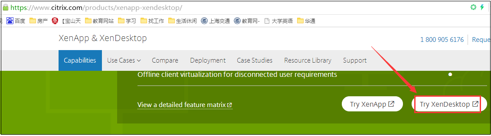
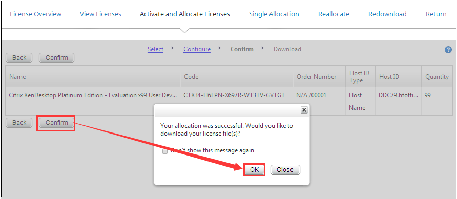
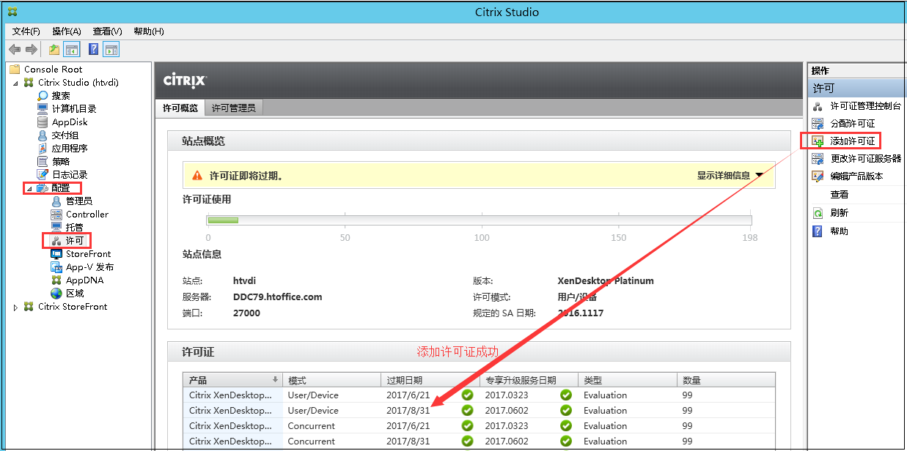

# Citrix 许可证申请试用

# 1.查看许可证有效期 

vsphere登录192.168.30.192服务器

-->键盘win键

-->在弹出的开始页面中点击Citrix Studio

-->配置-->许可

# 2. 申请Citrix许可证试用

## 2.1  登录官网注册申请

我们可以登录https://www.citrix.com 官网，填写邮箱等信息申请试用即可，试用期一般是90天，

填写注册信息，如果要多次申请则只要邮箱不同即可，

## 2.2 查看试用码

申请成功后，Citrix会发一个试用码到你申请注册的邮箱，

用上面注册的账户登录citrix官网查看 https://www.citrix.com/account/#/manage-licenses/allocate.html

有一个很大的坑，激活试用码时要输入Host ID，

错误的做法是ipconfig -all查询hostID也就是主机名或者MAC地址为00-50-56-93-61-E2，

正确的做法是键盘win键--》打开Citrix Studio--》配置--》许可--》服务器，

输入Host ID，Host ID是DDC79.htoffice.com，而不是DDC79，也不是MAC地址00-50-56-93-61-E2，否则在添加许可证时会报错无法添加许可证，

把下载好的许可证文件 FID__3bf0b423_15c59a96aea__5e5f.lic   拷贝到192.168.30.192 Citrix服务器上面，

配置--》许可--》添加许可证--》成功添加。

