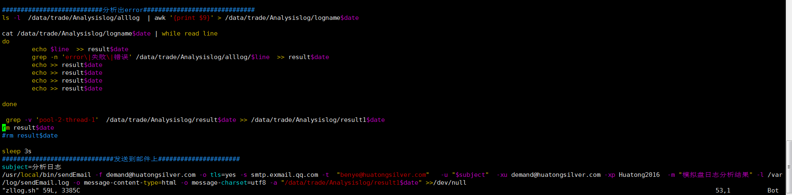

# JAVA MQ-模拟盘交易端的异常问题分析

# 1. 报错信息

- **状况：** **模拟盘交易客户端的买卖信息没有动态跳出，**


- **在启动activeMQ时，无法在命令行执行任何命令，报下错误：**

```shell
[trade@strade01 apache-activemq-5.6.0]$ jps
#
# There is insufficient memory for the Java Runtime Environment to continue.
# Cannot create GC thread. Out of system resources.
# An error report file with more information is saved as:
# /data/trade/apache-activemq-5.6.0/bhs_err_pid24279.log
```


```shell
[trade@strade01 apache-activemq-5.6.0]$ cat bhs_err_pid24279.log

#
# There is insufficient memory for the Java Runtime Environment to continue.
# Cannot create GC thread. Out of system resources.
# Possible reasons:
#   The system is out of physical RAM or swap space
#   In 32 bit mode, the process size limit was hit
# Possible solutions:
#   Reduce memory load on the system
#   Increase physical memory or swap space
#   Check if swap backing store is full
#   Use 64 bit Java on a 64 bit OS
#   Decrease Java heap size (-Xmx/-Xms)
#   Decrease number of Java threads
#   Decrease Java thread stack sizes (-Xss)
#   Set larger code cache with -XX:ReservedCodeCacheSize=
# This output file may be truncated or incomplete.
#
#  Out of Memory Error (gcTaskThread.cpp:46), pid=29712, tid=140335021184768
#
# JRE version: 7.0_17-b02
# Java VM: Java HotSpot(TM) 64-Bit Server VM (23.7-b01 mixed mode linux-amd64 compressed oops)
# Failed to write core dump. Core dumps have been disabled. To enable core dumping, try "ulimit -c unlimited" before starting Java again
#

---------------  T H R E A D  ---------------

Current thread (0x00007fa244007800):  JavaThread "Unknown thread" [_thread_in_vm, id=29713, stack(0x00007fa24b065000,0x00007fa24b166000)]

Stack: [0x00007fa24b065000,0x00007fa24b166000],  sp=0x00007fa24b1645c0,  free space=1021k
Native frames: (J=compiled Java code, j=interpreted, Vv=VM code, C=native code)
V  [libjvm.so+0x8a540a]  VMError::report_and_die()+0x2ea
V  [libjvm.so+0x40abfb]  report_vm_out_of_memory(char const*, int, unsigned long, char const*)+0x9b
V  [libjvm.so+0x4b78fa]  GCTaskThread::GCTaskThread(GCTaskManager*, unsigned int, unsigned int)+0xfa
V  [libjvm.so+0x4b62f6]  GCTaskManager::initialize()+0x206
V  [libjvm.so+0x76075f]  ParallelScavengeHeap::initialize()+0x6cf
V  [libjvm.so+0x87d7f8]  Universe::initialize_heap()+0xb8
V  [libjvm.so+0x87fecd]  universe_init()+0x7d
V  [libjvm.so+0x503d25]  init_globals()+0x65
V  [libjvm.so+0x867052]  Threads::create_vm(JavaVMInitArgs*, bool*)+0x1e2
V  [libjvm.so+0x563c34]  JNI_CreateJavaVM+0x74
C  [libjli.so+0x2f8e]  JavaMain+0x9e


---------------  P R O C E S S  ---------------

Java Threads: ( => current thread )

Other Threads:

=>0x00007fa244007800 (exited) JavaThread "Unknown thread" [_thread_in_vm, id=29713, stack(0x00007fa24b065000,0x00007fa24b166000)]

VM state:not at safepoint (not fully initialized)

VM Mutex/Monitor currently owned by a thread: None

GC Heap History (0 events):
No events

Deoptimization events (0 events):
No events

Internal exceptions (0 events):
No events

Events (0 events):
No events


Dynamic libraries:
00400000-00401000 r-xp 00000000 fd:00 1181081                            /usr/java/bin/jps
00600000-00601000 rw-p 00000000 fd:00 1181081                            /usr/java/bin/jps
016b8000-016d9000 rw-p 00000000 00:00 0                                  [heap]
............................省略............................................................
7fff700ff000-7fff70114000 rw-p 00000000 00:00 0                          [stack]
7fff701ff000-7fff70200000 r-xp 00000000 00:00 0                          [vdso]
ffffffffff600000-ffffffffff601000 r-xp 00000000 00:00 0                  [vsyscall]

VM Arguments:
jvm_args: -Denv.class.path=:/usr/java/lib:/usr/java/jre/lib -Dapplication.home=/usr/java -Xms8m 
java_command: sun.tools.jps.Jps
Launcher Type: SUN_STANDARD

Environment Variables:
JAVA_HOME=/usr/java
JRE_HOME=/usr/java/jre
CLASSPATH=:/usr/java/lib:/usr/java/jre/lib
PATH=/usr/java/bin:/usr/java/jre/bin:/usr/local/bin:/bin:/usr/bin:/usr/local/sbin:/usr/sbin:/sbin:/home/trade/bin
SHELL=/bin/bash

Signal Handlers:
SIGSEGV: [libjvm.so+0x8a5d70], sa_mask[0]=0x7ffbfeff, sa_flags=0x10000004
SIGBUS: [libjvm.so+0x8a5d70], sa_mask[0]=0x7ffbfeff, sa_flags=0x10000004
SIGFPE: [libjvm.so+0x741e50], sa_mask[0]=0x7ffbfeff, sa_flags=0x10000004
SIGPIPE: [libjvm.so+0x741e50], sa_mask[0]=0x7ffbfeff, sa_flags=0x10000004
SIGXFSZ: [libjvm.so+0x741e50], sa_mask[0]=0x7ffbfeff, sa_flags=0x10000004
SIGILL: [libjvm.so+0x741e50], sa_mask[0]=0x7ffbfeff, sa_flags=0x10000004
SIGUSR1: SIG_DFL, sa_mask[0]=0x00000000, sa_flags=0x00000000
SIGUSR2: [libjvm.so+0x7417a0], sa_mask[0]=0x00000000, sa_flags=0x10000004
SIGHUP: SIG_DFL, sa_mask[0]=0x00000000, sa_flags=0x00000000
SIGINT: SIG_DFL, sa_mask[0]=0x00000000, sa_flags=0x00000000
SIGTERM: SIG_DFL, sa_mask[0]=0x00000000, sa_flags=0x00000000
SIGQUIT: SIG_DFL, sa_mask[0]=0x00000000, sa_flags=0x00000000


---------------  S Y S T E M  ---------------

OS:CentOS release 6.4 (Final)

uname:Linux 2.6.32-358.el6.x86_64 #1 SMP Fri Feb 22 00:31:26 UTC 2013 x86_64
libc:glibc 2.12 NPTL 2.12 
rlimit: STACK 10240k, CORE 0k, NPROC 10240, NOFILE 65536, AS infinity
load average:0.02 0.06 0.01


/proc/meminfo:
MemTotal:       32554592 kB
MemFree:         7742504 kB
Buffers:          297220 kB
Cached:         16349200 kB
SwapCached:         3180 kB
Active:         11382396 kB
Inactive:       12056708 kB
Active(anon):    6003784 kB
Inactive(anon):   790664 kB
Active(file):    5378612 kB
Inactive(file): 11266044 kB
Unevictable:           0 kB
Mlocked:               0 kB
SwapTotal:      16351224 kB
SwapFree:       16342896 kB
Dirty:             64188 kB
Writeback:             0 kB
AnonPages:       6788944 kB
Mapped:            48524 kB
Shmem:              1524 kB
Slab:             975448 kB
SReclaimable:     873124 kB
SUnreclaim:       102324 kB
KernelStack:       85672 kB
PageTables:        72528 kB
NFS_Unstable:          0 kB
Bounce:                0 kB
WritebackTmp:          0 kB
CommitLimit:    32628520 kB
Committed_AS:   11270276 kB
VmallocTotal:   34359738367 kB
VmallocUsed:      610808 kB
VmallocChunk:   34340675296 kB
HardwareCorrupted:     0 kB
AnonHugePages:   5212160 kB
HugePages_Total:       0
HugePages_Free:        0
HugePages_Rsvd:        0
HugePages_Surp:        0
Hugepagesize:       2048 kB
DirectMap4k:       12296 kB
DirectMap2M:     2064384 kB
DirectMap1G:    31457280 kB


CPU:total 24 (6 cores per cpu, 2 threads per core) family 6 model 62 stepping 4, cmov, cx8, fxsr, mmx, sse, sse2, sse3, ssse3, sse4.1, sse4.2, popcnt, avx, ht, tsc, tscinvbit

/proc/cpuinfo:
processor	: 0
vendor_id	: GenuineIntel
cpu family	: 6
model		: 62
model name	: Intel(R) Xeon(R) CPU E5-2620 v2 @ 2.10GHz
stepping	: 4
cpu MHz		: 2100.097
cache size	: 15360 KB
physical id	: 0
siblings	: 12
core id		: 0
cpu cores	: 6
apicid		: 0
initial apicid	: 0
fpu		: yes
fpu_exception	: yes
cpuid level	: 13
wp		: yes
flags		: fpu vme de pse tsc msr pae mce cx8 apic sep mtrr pge mca cmov pat pse36 clflush dts acpi mmx fxsr sse sse2 ss ht tm pbe syscall nx pdpe1gb rdtscp lm constant_tsc arch_perfmon pebs bts rep_good xtopology nonstop_tsc aperfmperf pni pclmulqdq dtes64 monitor ds_cpl vmx smx est tm2 ssse3 cx16 xtpr pdcm pcid dca sse4_1 sse4_2 x2apic popcnt tsc_deadline_timer aes xsave avx f16c rdrand lahf_lm ida arat epb xsaveopt pln pts dts tpr_shadow vnmi flexpriority ept vpid fsgsbase smep erms
bogomips	: 4200.19
clflush size	: 64
cache_alignment	: 64
address sizes	: 46 bits physical, 48 bits virtual
power management:

...............CPU信息省略...................
Memory: 4k page, physical 32554592k(7742132k free), swap 16351224k(16342896k free)

vm_info: Java HotSpot(TM) 64-Bit Server VM (23.7-b01) for linux-amd64 JRE (1.7.0_17-b02), built on Mar  1 2013 02:59:06 by "java_re" with gcc 4.3.0 20080428 (Red Hat 4.3.0-8)

time: Thu Jun  1 21:29:57 2017
elapsed time: 0 seconds
```


# 2. 原因：用户创建的进程数过多

看报错日志，CPU和内存使用量是没有问题的。

## 2.1 nproc进程数限制说明

nproc是[操作系统](http://lib.csdn.net/base/operatingsystem)级别对每个用户创建的进程数的限制,在[Linux](http://lib.csdn.net/base/linux)下运行多线程时,每个线程的实现其实是一个轻量级的进程,对应的术语是:light weight process(LWP)。怎么知道一个用户创建了多少个进程呢，默认的ps是不显示全部进程的，需要‘-L' 才能看到所有的进程。

通过 ps h -Led -o user | sort | uniq -c | sort -n 命令可以查看用户创建的进程数，

```shell
[trade@strade01 apache-activemq-5.6.0]$ ps h -Led -o user | sort | uniq -c | sort -n
      5 zabbix
    440 root
   4712 trade
[trade@strade01 apache-activemq-5.6.0]$ ps -eLf
ps -efL | wc -l
ps -efL | awk '{print $2}' | uniq -c | sort -rn

cat /proc/$PID/status   #查看线程进程状态，其中的Threads 对应的就是某个进程打开了多少的线程。

http://blog.csdn.net/Rookie_CEO/article/details/45033681
```

何时需要修改这个nproc呢，当日志出现以下情况中的一种时，需要考虑这个nproc：
--》1.  Cannot create GC thread. Out of system resources  

--》2.  Java.lang.OutOfMemoryError: unable to create new native thread

```shell
如何修改nproc限制：

--》1.需要先看linux操作系统内核版本，通过uname -a查看内核版本，因为2.6版本的内核默认是在/etc/security/limits.d/90-nproc.conf里的配置会覆盖/etc/security/limits.conf的配置
[root@hadoop219 ~]# uname -a
Linux hadoop219 2.6.32-431.el6.x8664 #1 SMP Fri Nov 22 03:15:09 UTC 2013 x8664 x8664 x8664 GNU/Linux

--》2. vi /etc/security/limits.d/90-nproc.conf 
注释掉 * soft nproc 1024

--》3. vi /etc/security/limits.conf
添加 
* soft  nproc  65535

--》4. 在控制台执行(修改这个不需要重启)
   ulimit -u 65535

--》5.检查下是否生效，在控制台切到该用户下
   ulimit -u
```

## 2.2 实际创建的进程数达到限制

- 查看打开文件数过多：

  我们用 lsof | wc -l 命令发现，strade01打开的文件数14207，比正常的实盘的3倍还要多，

```shell
打开的文件数
strade01 是 14207
strade02 是 2556
rtrade01 是 4197

[trade@strade01 apache-activemq-5.6.0]$  lsof | wc -l 
14207
```

- 打开文件数最多的进程，

  查看打开最多文件数的进程，

  通过 lsof | awk '{print $1}' | uniq -c | sort -rn | head -n 5，可以看到POSIX messages打开的文件数最多，

```shell
[trade@strade01 apache-activemq-5.6.0]$  lsof | awk '{print $1}' | uniq -c | sort -rn | head -n 5
```

由于我们对进程数的限制是10240，

**而实际打开的文件数过多，造成实际创建的进程数过多，由于nproc的限制，造成无法创建新的轻量线程，这样就出现了最初的报错信息，**

```shell
[trade@strade01 apache-activemq-5.6.0]$ ulimit -u
10240
[trade@strade01 apache-activemq-5.6.0]$ ulimit -a
core file size          (blocks, -c) 0
data seg size           (kbytes, -d) unlimited
scheduling priority             (-e) 0
file size               (blocks, -f) unlimited
pending signals                 (-i) 254187
max locked memory       (kbytes, -l) 64
max memory size         (kbytes, -m) unlimited
open files                      (-n) 65536
pipe size            (512 bytes, -p) 8
POSIX message queues     (bytes, -q) 819200
real-time priority              (-r) 0
stack size              (kbytes, -s) 10240
cpu time               (seconds, -t) unlimited
max user processes              (-u) 10240
virtual memory          (kbytes, -v) unlimited
file locks                      (-x) unlimited
```

- 更具体的原因是：

  进一步定位是因为有一个周期性计划任务，会每天执行我们之前的一个脚本如下，搜集交易系统的日志进行分析并向指定的邮箱发送邮件，后来此邮箱服务已停用，导致报错，每天会产生一个或多个报错，造成打开文件数和进程过多，

```shell
[trade@trade01 Analysislog]$ pwd
/data/trade/Analysislog
[trade@trade01 Analysislog]$ ls
alllog  alllog.2016-10-19.tar  backupAPP.sh  backuplogs.sh  copylog.sh  data  sendemail.sh  zllog.sh
```




# 3. 测试环境还原

在测试环境将下我们把nproc设定为小的值200，

root用户下，先把注释掉 *          soft    nproc     1024

```shell
[root@server ~]# vi /etc/security/limits.d/90-nproc.conf
[root@server ~]# cat /etc/security/limits.d/90-nproc.conf
# Default limit for number of user's processes to prevent
# accidental fork bombs.
# See rhbz #432903 for reasoning.

#*          soft    nproc     1024
root       soft    nproc     unlimited
```

root用户下，接着添加以下4行带*的行，

```shell
[root@server ~]# vi /etc/security/limits.conf
[root@server ~]# grep -C 10 16384 /etc/security/limits.conf
#
#<domain>      <type>  <item>         <value>
#

#*               soft    core            0
#*               hard    rss             10000
#@student        hard    nproc           20
#@faculty        hard    nproc           50
#ftp             hard    nproc           0
#@student        -       maxlogins       4
root             soft    nproc           16384
root             hard    nproc           16384
*           soft   nofile       65536
*           hard   nofile       65536
*           soft   nproc        200
*           hard   nproc        10000

# End of file
```

切换到trade用户，执行ulimit -u 即可，

```shell
[trade@server bin]$ ulimit -u
200
```

启动一些核心应用，可以看到trade创建的进程为154个，然后再后top &创建一个后台进程，使进程数达到200个，


```shell
[trade@server manageserver]$ ps h -Led -o user | sort | uniq -c | sort -n
      1 dbus
      1 gdm
      1 rpc
      1 rpcuser
      1 www
      2 postfix
      3 haldaemon
      3 rtkit
      5 zabbix
    154 trade
    240 root

[13]+  Stopped                 top
[trade@server manageserver]$ top &
[14] 16590
[trade@server manageserver]$ top &
```

```shell
[trade@server manageserver]$ top &
[59] 16635

[58]+  Stopped                 top
[trade@server manageserver]$ top &
[60] 16636

[59]+  Stopped                 top
[trade@server manageserver]$ ps h -Led -o user | sort | uniq -c | sort -n
-bash: fork: retry: Resource temporarily unavailable
-bash: fork: retry: Resource temporarily unavailable
-bash: fork: retry: Resource temporarily unavailable
-bash: fork: retry: Resource temporarily unavailable
^Z^C-bash: fork: Resource temporarily unavailable


[60]+  Stopped                 top
[trade@server manageserver]$ exit
logout
There are stopped jobs.
[trade@server manageserver]$ jps
#
# There is insufficient memory for the Java Runtime Environment to continue.
# Cannot create GC thread. Out of system resources.
# An error report file with more information is saved as:
# /data/trade/app/manageserver/hs_err_pid16664.log
[trade@server manageserver]$ jps
#
# There is insufficient memory for the Java Runtime Environment to continue.
# Cannot create GC thread. Out of system resources.
# An error report file with more information is saved as:
# /data/trade/app/manageserver/hs_err_pid16670.log
[trade@server manageserver]$ ll
total 108
-rw-rw-r-- 1 trade trade  1133 Apr 18 10:04 appConfig.properties
-rw-rw-r-- 1 trade trade   967 Apr 17 15:53 dubbo-provider.xml
-rw-rw-r-- 1 trade trade 16337 Jun  6 19:00 hs_err_pid16664.log
-rw-rw-r-- 1 trade trade 16337 Jun  6 19:00 hs_err_pid16670.log
-rw-rw-r-- 1 trade trade  1276 Apr 17 15:53 jms.xml
drwxrwxr-x 2 trade trade  4096 Apr 17 15:53 libs
-rw-rw-r-- 1 trade trade  3287 Apr 17 15:53 logback.xml
drwxrwxr-x 3 trade trade  4096 Jun  6 17:25 logs
-rw-rw-r-- 1 trade trade 38919 Jun  6 18:56 manageservice.dubbo.register.local
-rw-rw-r-- 1 trade trade     0 Apr 17 15:53 manageservice.dubbo.register.local.lock
-rw-rw-r-- 1 trade trade   186 Apr 17 15:53 start.bat
-rwxrwxr-x 1 trade trade   203 Apr 17 15:53 start.sh
-rwxrwxr-x 1 trade trade   330 Apr 17 15:53 stop.sh
```

# 4. 采取措施

## 4.1 改变线程数为20480 

root用户下，先把注释掉 *   soft    nproc     1024  《--（/etc/security/limits.d/90-nproc.conf）

```shell
[root@server ~]# vi /etc/security/limits.d/90-nproc.conf
[root@server ~]# cat /etc/security/limits.d/90-nproc.conf
# Default limit for number of user's processes to prevent
# accidental fork bombs.
# See rhbz #432903 for reasoning.

#*          soft    nproc     1024
root       soft    nproc     unlimited
```

root用户下，把/etc/security/limits.conf中hard soft的nproc改为20480和20480，

```shell
[root@server ~]# vi /etc/security/limits.conf
[root@server ~]# grep -C 10 16384 /etc/security/limits.conf
#
#<domain>      <type>  <item>         <value>
#

#*               soft    core            0
#*               hard    rss             10000
#@student        hard    nproc           20
#@faculty        hard    nproc           50
#ftp             hard    nproc           0
#@student        -       maxlogins       4
root             soft    nproc           16384
root             hard    nproc           16384
*           soft   nofile       65536
*           hard   nofile       65536
*           soft   nproc        20480
*           hard   nproc        20480

# End of file
```


## 4.2 Zabbix加监控创建进程数