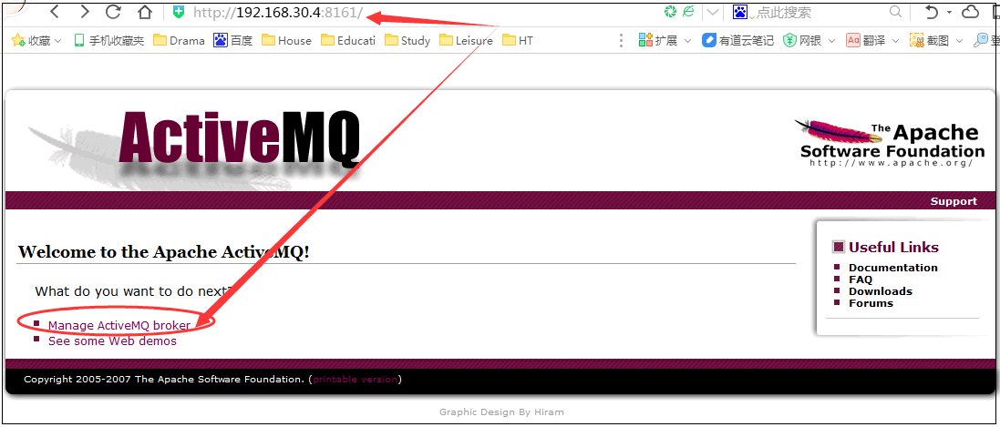
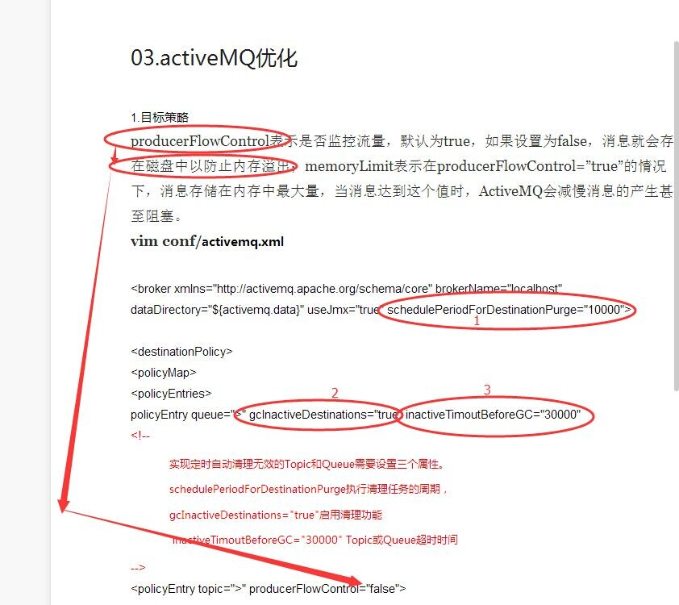
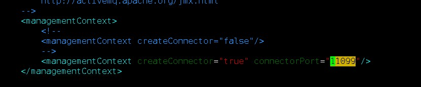
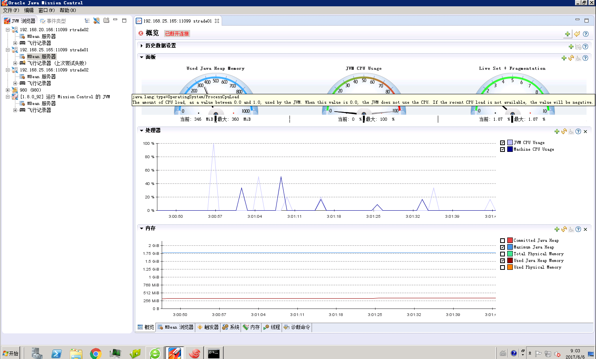

# Apache-activeMQ

# 1. MQ介绍

## 1.1 MQ概念

**MQ全称为Message Queue, 消息队列（MQ）是一种应用程序对应用程序的通信方法。应用程序通过读写出入队列的消息（针对应用程序的数据）来通信，而无需专用连接来链接它们。消息传递指的是程序之间通过在消息中发送数据进行通信，而不是通过直接调用彼此来通信，直接调用通常是用于诸如远程过程调用的技术。排队指的是应用程序通过 队列来通信。队列的使用除去了接收和发送应用程序同时执行的要求。其中较为成熟的MQ产品有IBM WEBSPHERE MQ等等。**

## 1.2 特性及优势

ActiveMQ 是Apache出品，最流行的，能力强劲的开源消息总线。ActiveMQ 是一个完全支持JMS1.1和J2EE 1.4规范的 JMS Provider实现，尽管JMS规范出台已经是很久的事情了，但是JMS在当今的J2EE应用中间仍然扮演着特殊的地位。

1、实现JMS1.1规范，支持J2EE1.4以上
2、可运行于任何jvm和大部分web容器（ActiveMQ works great in any JVM）
3、支持多种语言客户端（java, C, C++, AJAX, ACTIONSCRIPT等等）
4、支持多种协议（stomp，openwire，REST）
5、良好的spring支持（ActiveMQ has great Spring Support）
6、速度很快，JBossMQ的十倍（ActiveMQ is very fast; often 10x faster than JBossMQ.）
7、与OpenJMS、JbossMQ等开源jms provider相比，ActiveMQ有Apache的支持，持续发展的优势明显。

## 1.3 下载部署

- 1、下载,

```
http://activemq.apache.org/activemq-5145-release.html，下载Linux版本

+bin (windows下面的bat和unix/linux下面的sh)

+conf (activeMQ配置目录，包含最基本的activeMQ配置文件）

+data （默认是空的）：存放日志

+docs (index,replease版本里面没有文档，-.-b不知道为啥不带）

+example （几个例子

+lib (activemMQ使用到的lib)

-apache-activemq-4.1-incubator.jar (ActiveMQ的binary)

运行信息

-NOTICE.txt

-README.txt

-user-guide.html
```

- 2、安装: 直接解压至任意目录即可（如：/data/trade/apache-activemq-5.6.0）
- 3、启动ActiveMQ服务器

直接在bin目录运行./activeMQ start

**几个小提示**

⒈ 这个仅仅是最基础的ActiveMQ的配置，很多地方都没有配置因此不要直接使用这个配置用于生产系统

⒉ 有的时候由于端口被占用，导致ActiveMQ错误，ActiveMQ可能需要以下端口1099(JMX),61616（默认的TransportConnector)

⒊ 如果没有物理网卡，或者MS的LoopBackAdpater Multicast会报一个错误

4、ActiveMQ消息管理后台系统IP+端口直接访问：http://localhost:8161/admin



## 1.4 实际运用

简单的使用是apache-activemq-5.6.0，没有做任何的配置，直接解压到任意目录

--》然后直接启动./activemq start 就行了。

```shell
[trade@trade01 apache-activemq-5.6.0]$ pwd
/data/trade/apache-activemq-5.6.0
[trade@trade01 apache-activemq-5.6.0]$ ls
activemq-all-5.6.0.jar  bin  conf  data  docs  example  lib  LICENSE  NOTICE  README.txt  tmp  user-guide.html  webapps  WebConsole-README.txt
[trade@trade01 apache-activemq-5.6.0]$ cd bin/
[trade@trade01 bin]$ ls
activemq  activemq-admin  linux-x86-32  linux-x86-64  macosx  run.jar  wrapper.jar
[trade@trade01 bin]$ pwd
/data/trade/apache-activemq-5.6.0/bin
[trade@trade01 bin]$ ./activemq start
[trade@trade01 bin]$ ./activemq status
```

在tomcat的/WEB-INF/classes/appConfig.properties 配置文件中直接加入failover:(tcp://trade01:61616)，

```shell
[trade@web01 classes]$ pwd
/data/trade/www/tomcat_accountweb/webapps/accountweb/WEB-INF/classes
[trade@web01 classes]$ ls
appConfig.properties  com  dubbo-consumer.xml  jms.xml  logback.xml  serverConfig  springConfig  template.xml
[trade@web01 classes]$ cat appConfig.properties 
##########zookeeper #################
registry.protocol=zookeeper
zookeeper.register.address=trade01:2181

########## ActiveMQ config ###########
activemq.brokerURL=failover:(tcp://trade01:61616)?randomize=true&timeout=10000
activemq.username=
activemq.password=
#### email ######
mail.smtp.host=smtp.163.com
mail.smtp.port=25
mail.smtp.auth=true
mail.sender.username=hezhitao2302002@163.com
mail.sender.password=bandit2302002

#all /web/idcard/recognize calls will be forwarded to env.idcard.url
env.idcard.wsdl=http://175.102.9.179:8888/cxfServerX/ImgReconCard?wsdl

publicK=MIGfMA0GCSqGSIb3DQEBAQUAA4GNADCBiQKBgQCA551nHQxLdgL+x15sd6jef16yfHKuaGFhwm/zeHQY+eLchvwMXGNcVlfdH2u5Yyl6om3+Fg+7Jq6Fq3AhgTh1w3+LFRD3yLaSkTrKV1tX5VUyTf0f8NMZqMLkoaINPP9be1YxWKp662lHUPGhxOgpfkv8vvWxG49Xgo/aTO2ZhQIDAQAB
privateK=MIICdQIBADANBgkqhkiG9w0BAQEFAASCAl8wggJbAgEAAoGBAIDnnWcdDEt2Av7HXmx3qN5/XrJ8cq5oYWHCb/N4dBj54tyG/AxcY1xWV90fa7ljKXqibf4WD7smroWrcCGBOHXDf4sVEPfItpKROspXW1flVTJN/R/w0xmowuShog08/1t7VjFYqnrraUdQ8aHE6Cl+S/y+9bEbj1eCj9pM7ZmFAgMBAAECgYBOq4xvytWfFEXdslVZQ2onaHql2bev43pTTHRAlincuF0RE7yt2pC1YOi8xhlbij5dXtZcNKCjKodmguurNw76ScaBmHT3PO5F2BhH5tLkQdiYMr2krVb3aSRnCo6WBHkIOXaQlVXaOIpofihDx4EhBG/W2/fTZEWFD1tqHJ7s3QJBAMS9m89PVNldGm8dj6g11v4hK04soxuUGhUU2DpPnhv8F50PoiBUfoJ/FM49WaaH5QUP4/zJ+amAxQ8/wWLtX78CQQCnu0aZ0rcDkLnex8N+ZtoWz5qAqdoGKtAVqXoynCucI3Lbf8ktUwM5TDHhM9S06NZri4f7GUFbJnGY+gbtsZe7AkB/9ltbMVwcrKO+1dlULQCS9fv2sq28CE4WnCIvew15YjPxofNvV8WZFxLvOZQP7p+U9UryZmQOTYTecDdWItJ9AkARXNFyGt3XAKQ863DRJNRuiA72Qp7PBJ+FnoWHt6LMBt9c2V15054B0GFZboQWNgP8HfV1iKe7R796lmchM8EBAkANI6XJaJ8pn7mgsVqDu+5PtnNFgdTW+yyBUsPgmkobgvphUY7JV/ZNF7gQNPih7BHVPON0cccp4KPjux8bX3m4
```

## 1.5 运行附带的示例程序

1、Queue消息示例：
\* 启动Queue消息消费者

| `12` | `cd exampleant consumer` |
| ---- | ------------------------ |
|      |                          |

\* 启动Queue消息生产者

| `12` | `cd exampleant producer` |
| ---- | ------------------------ |
|      |                          |

简要说明：生产者（producer）发消息，消费者（consumer）接消息，发送/接收2000个消息后自动关闭

2、Topic消息示例：
\* 启动Topic消息消费者

| `12` | `cd exampleant topic-listener` |
| ---- | ------------------------------ |
|      |                                |

\* 启动Topic消息生产者

| `12` | `cd exampleant topic-publisher` |
| ---- | ------------------------------- |
|      |                                 |

简要说明：重复10轮，publisher每轮发送2000个消息，并等待获取listener的处理结果报告，然后进入下一轮发送，最后统计全局发送时间。

## 1.6 MQ优化

### 1.6.1 bin下的activemq优化

总内存 优化，

-Xms  

设置Java堆初始化时的大小，默认情况是机器物理内存的1/64。这个主要是根据应用启动时消耗的资源决定，分配少了申请起来会降低运行速度，分配多了也浪费。 

-Xmx   

设置java heap的最大值，默认是机器物理内存的1/4。这个值决定了最多可用的Java堆内存：分配过少就会在应用中需要大量内存作缓存或者临时对象时出现OOM（Out Of Memory）的问题；如果分配过大，那么就会因PermSize过小而引起的另外一种Out Of Memory。所以如何配置还是根据运行过程中的分析和计算来确定，如果不能确定还是采用默认的配置。


```xml
# Set jvm memory configuration
if [ -z "$ACTIVEMQ_OPTS_MEMORY" ] ; then
    ACTIVEMQ_OPTS_MEMORY="-Xms1G -Xmx1G"
fi
```

### 1.6.2 conf下的activemq.xml优化

broker持久化 优化，vim conf/activemq.xml



```xml
1.目标策略
producerFlowControl表示是否监控流量，默认为true，如果设置为false，消息就会存在磁盘中以防止内存溢出；memoryLimit表示在producerFlowControl=”true”的情况下，消息存储在内存中最大量，当消息达到这个值时，ActiveMQ会减慢消息的产生甚至阻塞。
vim conf/activemq.xml

<broker xmlns="http://activemq.apache.org/schema/core" brokerName="localhost" dataDirectory="${activemq.data}" useJmx="true" schedulePeriodForDestinationPurge="10000">

<destinationPolicy>
<policyMap>
<policyEntries>
policyEntry queue=">" gcInactiveDestinations="true" inactiveTimoutBeforeGC="30000"
<!--
            实现定时自动清理无效的Topic和Queue需要设置三个属性。
            schedulePeriodForDestinationPurge执行清理任务的周期，
            gcInactiveDestinations="true"启用清理功能
             inactiveTimoutBeforeGC="30000" Topic或Queue超时时间
-->
<policyEntry topic=">" producerFlowControl="false">
<!-- <policyEntry queue=">"producerFlowControl="true"memoryLimit="1mb">
The constantPendingMessageLimitStrategy is used to prevent
slow topic consumers to block producers and affect other consumers
by limiting the number of messages that are retained
For more information, see:
http://activemq.apache.org/slow-consumer-handling.html
-->
<pendingMessageLimitStrategy>
<constantPendingMessageLimitStrategy limit="1000"/>
</pendingMessageLimitStrategy>
</policyEntry>
<policyEntry queue=">" producerFlowControl="false">

<!-- Use VM cursor for better latency
For more information, see:
http://activemq.apache.org/message-cursors.html
<pendingQueuePolicy>
<vmQueueCursor/>
</pendingQueuePolicy>
-->
</policyEntry>
</policyEntries>
</policyMap>
</destinationPolicy>


2.存储设置
memoryUsage表示ActiveMQ使用的内存，这个值要大于等于destinationPolicy中设置的所有队列的内存之和。
storeUsage表示持久化存储文件的大小。
tempUsage表示非持久化消息存储的临时内存大小。

<!--
            The systemUsage controls the maximum amount of space the broker will
            use before slowing down producers. For more information, see:
            http://activemq.apache.org/producer-flow-control.html
            If using ActiveMQ embedded - the following limits could safely be used:

        <systemUsage>
            <systemUsage>
                <memoryUsage>
                    <memoryUsage limit="20 mb"/>
                </memoryUsage>
                <storeUsage>
                    <storeUsage limit="1 gb"/>
                </storeUsage>
                <tempUsage>
                    <tempUsage limit="100 mb"/>
                </tempUsage>
            </systemUsage>
        </systemUsage>
        -->
<systemUsage>
            <systemUsage>
                <memoryUsage>
                    <memoryUsage limit="64 mb"/>
                </memoryUsage>
                <storeUsage>
                    <storeUsage limit="100 gb"/>
                </storeUsage>
                <tempUsage>
                    <tempUsage limit="50 gb"/>
                </tempUsage>
            </systemUsage>
        </systemUsage>
```


# 2. Java 优化

## 2.1  MQ之java监控

```xml
    <managementContext>
        <managementContext createConnector="false"/>
    </managementContext>
    
    改为：
    
     <managementContext>
     <!--
   	 	 <managementContext createConnector="false"/>
   	 	 -->
   		 <managementContext createConnector="true" connectorPort="11099"/>
    </managementContext>
    
```






### 2.1.2 JMC-Java Mission Control

- Classloading

  被加载的类的数量和未被加载的类的数量

  加载类的类加载器（classloader），加载一个类需要的时间

- Thread statistics

  创建线程的数量、销毁线程的数量、线程快照（dump）

  阻塞指定线程的锁以及被指定锁阻塞的线程

- Throwables

  应用程序实用的异常类

  应用程序抛出的异常和错误的数量以及创建异常和错误的栈记录

- TLAB allocation

  内存堆中已分配的数量、TLAB（Thread-Local Allocation Buffers）的大小

  在内存对中指定对象的内存分配以及为这些对象分配内存的栈记录

- File and socket I/O

  进行 I/O 消耗的时间

  每一次读写调用的时间消耗，读写操作消耗时间过长的文件或套接字

- Monitor blocked

  等待监控器的线程

  阻塞某个线程的监控器、线程被阻塞的时间

- Code cache

  代码缓存的大小以及内容

  从代码缓存中移除的方法、代码缓存的配置

- Code compilation

  哪些方法被编译，OSR 编译，编译耗时

  JFR 中没有额外的信息，但 JFR 总结了多个源文件的信息

- Garbage collection

  GC 的次数，包括每一个阶段的次数、每个代的大小

  JFR 中没有额外的信息，但 JFR 总结了来自多个工具的信息

- Profiling

  检测分析和采样分析

##2.2 zabbix监控前置tomcat

```shell
/data/trade/realweb/tomcat_tradeweb/bin/catalina.sh
JAVA_OPTS="-Duser.timezone=GMT+08 -Xms1024m -Xmx8192m -Xss256k"
JAVA_OPTS="$JAVA_OPTS -server -XX:PermSize=64M -XX:MaxPermSize=256m"
CATALINA_OPTS="$CATALINA_OPTS
-Dcom.sun.management.jmxremote
-Djava.rmi.server.hostname=172.20.10.12
-Dcom.sun.management.jmxremote.port=10014
-Dcom.sun.management.jmxremote.ssl=false
-Dcom.sun.management.jmxremote.authenticate=false"
```


# 2. 配置Java远程监控授权（Java Mission Control）

最近公司做的项目有比较严重的内存溢出问题，也不知道是荣幸还是郁闷，经理将该问题交给我去自处理，经过一系列的Google，最终决定用[Java](http://lib.csdn.net/base/java)Mission Control（JMC）来查找项目的内存溢出问题出在哪。

[Java](http://lib.csdn.net/base/java) Mission Control（JMC）最先是由BEA公司开发的JRockit（后被[Oracle](http://lib.csdn.net/base/oracle)收购）所附带的一个用于查找Java内存溢出问题的利器，在最近的Java8中，默认已经带上了此组件，掌握好JMC的使用能让你在处理内存溢出问题是如鱼得水。

JMC的使用以后再说，现在先配置服务器端（也就是说你要监控的对象），配置JMC主要就是在启动Java程序的时候加上一系列参数（以Tomcat为例，在catalina.bat 或catalina.sh中增加如下配置）：

```
CATALINA_OPTS="-Dcom.sun.management.jmxremote.port=8901

-Dcom.sun.management.jmxremote.ssl=false

-Dcom.sun.management.jmxremote.authenticate=true

-Dcom.sun.management.jmxremote.password.file=jmxremote.password

-Dcom.sun.management.jmxremote.access.file=jmxremote.access

-Djava.rmi.server.hostname=172.16.41.89"
```

需要注意几点：

1. 如果要允许其它机器监控该程序，必须指定-Djava.rmi.server.hostname=，如果不指定该配置，那么就只能在本机监控该程序。
2. 如果要控制监控的授权（让特定的用户才能连接JMX服务），需要设置-Dcom.sun.management.jmxremote.authenticate=true，如果设置为false则不需要授权。
3. 如果要授权，需要指定两个文件：jmxremote.password和jmxremote.access，password文件主要是配置用户名和密码，access主要是配置权限（可读或者读写）。

在Tomcat的bin目录下增加下面两个文件：jmxremote.password和jmxremote.access，格式如下：

```
jmxremote.access：

admin readwrite

monitor readonly
```

 

表示admin有操作权限（比如调用GC等操作），monitor只有查看权限，不能进行任何操作。

```
jmxremote.password：

admin test

monitor test
```

 

表示有两个用户，admin和monitor，密码分别是test和test。

配置好这些参数后，执行sudo ./startup.sh就可以启动Tomcat了，启动Tomcat后，在客户机上启动JMC客户端，然后创建一个新的连接：

## 2.2  [Java GC堆和jvm参数设置](http://blog.csdn.net/ls5718/article/details/51777195)

### 2.2.1 堆内存

[Java](http://lib.csdn.net/base/java) 中的堆是 JVM 所管理的最大的一块内存空间，主要用于存放各种类的实例对象。 
在 Java 中，堆被划分成两个不同的区域：新生代 ( Young )、老年代 ( Old )。新生代 ( Young ) 又被划分为三个区域：Eden、From Survivor、To Survivor。 
这样划分的目的是为了使 JVM 能够更好的管理堆内存中的对象，包括内存的分配以及回收。 
堆的内存模型大致为： 
 
从图中可以看出： 堆大小 = 新生代 + 老年代。其中，堆的大小可以通过参数 –Xms、-Xmx 来指定。 
（本人使用的是 JDK1.6，以下涉及的 JVM 默认值均以该版本为准。） 
默认的，新生代 ( Young ) 与老年代 ( Old ) 的比例的值为 1:2 ( 该值可以通过参数 –XX:NewRatio 来指定 )，即：新生代 ( Young ) = 1/3 的堆空间大小。老年代 ( Old ) = 2/3 的堆空间大小。其中，新生代 ( Young ) 被细分为 Eden 和 两个 Survivor 区域，这两个 Survivor 区域分别被命名为 from 和 to，以示区分。 
默认的，Edem : from : to = 8 : 1 : 1 ( 可以通过参数 –XX:SurvivorRatio 来设定 )，即： Eden = 8/10 的新生代空间大小，from = to = 1/10 的新生代空间大小。 
JVM 每次只会使用 Eden 和其中的一块 Survivor 区域来为对象服务，所以无论什么时候，总是有一块 Survivor 区域是空闲着的。因此，新生代实际可用的内存空间为 9/10 ( 即90% )的新生代空间。

注：Heap memory堆内存，non_heap memory非堆内存，常驻内存就是非堆内存（如Perm，它是保存class信息，常量池之类），否则就是堆内存用于存放各种类的实例对象。

### 2.2.1 GC堆

Java 中的堆也是 GC 收集垃圾的主要区域。GC 分为两种：Minor GC、Full GC ( 或称为 Major GC )。 
Minor GC 是发生在新生代中的垃圾收集动作，所采用的是复制[算法](http://lib.csdn.net/base/datastructure)。 
新生代几乎是所有 Java 对象出生的地方，即 Java 对象申请的内存以及存放都是在这个地方。Java 中的大部分对象通常不需长久存活，具有朝生夕灭的性质。当一个对象被判定为 “死亡” 的时候，GC 就有责任来回收掉这部分对象的内存空间。新生代是 GC 收集垃圾的频繁区域。当对象在 Eden ( 包括一个 Survivor 区域，这里假设是 from 区域 ) 出生后，在经过一次 Minor GC 后，如果对象还存活，并且能够被另外一块 Survivor 区域所容纳( 上面已经假设为 from 区域，这里应为 to 区域，即 to 区域有足够的内存空间来存储 Eden 和 from 区域中存活的对象 )，则使用复制算法将这些仍然还存活的对象复制到另外一块 Survivor 区域 ( 即 to 区域 ) 中，然后清理所使用过的 Eden 以及 Survivor 区域 ( 即 from 区域 )，并且将这些对象的年龄设置为1，以后对象在 Survivor 区每熬过一次 Minor GC，就将对象的年龄 + 1，当对象的年龄达到某个值时 ( 默认是 15 岁，可以通过参数 -XX:MaxTenuringThreshold 来设定 )，这些对象就会成为老年代。但这也不是一定的，对于一些较大的对象 ( 即需要分配一块较大的连续内存空间 ) 则是直接进入到老年代。Full GC 是发生在老年代的垃圾收集动作，所采用的是标记-清除算法。现实的生活中，老年代的人通常会比新生代的人 “早死”。堆内存中的老年代(Old)不同于个，老年代里面的对象几乎个个都是在 Survivor 区域中熬过来的，它们是不会那么容易就 “死掉” 了的。因此，Full GC 发生的次数不会有 Minor GC 那么频繁，并且做一次 Full GC 要比进行一次 Minor GC 的时间更长。另外，标记-清除算法收集垃圾的时候会产生许多的内存碎片 ( 即不连续的内存空间 )，此后需要为较大的对象分配内存空间时，若无法找到足够的连续的内存空间，就会提前触发一次 GC 的收集动作。

### 2.2.3 GC日志

设置 JVM 参数为 -XX:+PrintGCDetails，使得控制台能够显示 GC 相关的日志信息，执行上面代码，下面是其中一次执行的结果。 


Full GC 信息与 Minor GC 的信息是相似的，这里就不一个一个的画出来了。从 Full GC 信息可知，新生代可用的内存大小约为 18M，则新生代实际分配得到的内存空间约为 20M(为什么是 20M? 请继续看下面…)。老年代分得的内存大小约为 42M，堆的可用内存的大小约为 60M。可以计算出： 18432K ( 新生代可用空间 ) + 42112K ( 老年代空间 ) = 60544K ( 堆的可用空间 )新生代约占堆大小的 1/3，老年代约占堆大小的 2/3。也可以看出，GC 对新生代的回收比较乐观，而对老年代以及方法区的回收并不明显或者说不及新生代。并且在这里 Full GC 耗时是 Minor GC 的 22.89 倍。

### 2.2.4 JVM参数选项

jvm 可配置的参数选项可以参考 [Oracle](http://lib.csdn.net/base/oracle) 官方网站给出的相关信息：[http://www.oracle.com/technetwork/java/javase/tech/vmoptions-jsp-140102.html](http://www.oracle.com/technetwork/java/javase/tech/vmoptions-jsp-140102.html) 
下面只列举其中的几个常用和容易掌握的配置选项

| 配置参数                            | 功能                                       |
| ------------------------------- | ---------------------------------------- |
| -Xms                            | 初始堆大小。如：-Xms256m                         |
| -Xmx                            | 最大堆大小。如：-Xmx512m                         |
| -Xmn                            | 新生代大小。通常为 Xmx 的 1/3 或 1/4。新生代 = Eden + 2 个 Survivor 空间。实际可用空间为 = Eden + 1 个 Survivor，即 90% |
| -Xss                            | JDK1.5+ 每个线程堆栈大小为 1M，一般来说如果栈不是很深的话， 1M 是绝对够用了的。 |
| -XX:NewRatio                    | 新生代与老年代的比例，如 –XX:NewRatio=2，则新生代占整个堆空间的1/3，老年代占2/3 |
| -XX:SurvivorRatio               | 新生代中 Eden 与 Survivor 的比值。默认值为 8。即 Eden 占新生代空间的 8/10，另外两个 Survivor 各占 1/10 |
| -XX:PermSize                    | 永久代(方法区)的初始大小                            |
| -XX:MaxPermSize                 | 永久代(方法区)的最大值                             |
| -XX:+PrintGCDetails             | 打印 GC 信息                                 |
| -XX:+HeapDumpOnOutOfMemoryError | 让虚拟机在发生内存溢出时 Dump 出当前的内存堆转储快照，以便分析用      |

注意：PermSize永久代的概念在jdk1.8中已经不存在了，取而代之的是metaspace元空间，当认为执行永久代的初始大小以及最大值是jvm会给出如此下提示： 
[Java ](http://lib.csdn.net/base/java)HotSpot(TM) 64-Bit Server VM warning: ignoring option PermSize=30m; support was removed in 8.0 
Java HotSpot(TM) 64-Bit Server VM warning: ignoring option MaxPermSize=30m; support was removed in 8.0

### 2.2.5 实例分析

从打结果可以看出，堆中新生代的内存空间为 18432K ( 约 18M )，eden 的内存空间为 16384K ( 约 16M)，from / to survivor 的内存空间为 2048K ( 约 2M)。

这里所配置的 Xmn 为 20M，也就是指定了新生代的内存空间为 20M，可是从打印的堆信息来看，新生代怎么就只有 18M 呢? 另外的 2M 哪里去了? 别急，是这样的。新生代 = eden + from + to = 16 + 2 + 2 = 20M，可见新生代的内存空间确实是按 Xmn 参数分配得到的。而且这里指定了 SurvivorRatio = 8，因此，eden = 8/10 的新生代空间 = 8/10 * 20 = 16M。from = to = 1/10 的新生代空间 = 1/10 * 20 = 2M。堆信息中新生代的 total 18432K 是这样来的： eden + 1 个 survivor = 16384K + 2048K = 18432K，即约为 18M。因为 jvm 每次只是用新生代中的 eden 和 一个 survivor，因此新生代实际的可用内存空间大小为所指定的 90%。因此可以知道，这里新生代的内存空间指的是新生代可用的总的内存空间，而不是指整个新生代的空间大小。另外，可以看出老年代的内存空间为 40960K ( 约 40M )，堆大小 = 新生代 + 老年代。因此在这里，老年代 = 堆大小 - 新生代 = 60 - 20 = 40M。 
最后，这里还指定了 PermSize = 30m，PermGen 即永久代 ( 方法区 )，它还有一个名字，叫非堆，主要用来存储由 jvm 加载的类文件信息、常量、静态变量等。

回到 doTest() 方法中，可以看到代码在第 14、18、19 这三行中分别申请了一块 1M 大小的内存空间，并在 16 和 20 这两行中分别显式的调用了 System.gc()。从控制台打印的信息来看，每次调 System.gc()，是先进行 Minor GC，然后再进行 Full GC。 
第 16 行触发的 Minor GC 收集分析： 
从信息 PSYoungGen : 1351K -> 288K，可以知道，在第 14 行为 bytes 分配的内存空间已经被回收完成。引起 GC 回收这 1M 内存空间的因素是第 15 行的 bytes = null; bytes 为 null 表明之前申请的那 1M 大小的内存空间现在已经没有任何引用变量在使用它了，并且在内存中它处于一种不可到达状态 ( 即没有任何引用链与 GC Roots 相连 )。那么，当 Minor GC 发生的时候，GC 就会来回收掉这部分的内存空间。 
第 16行触发的 Full GC 收集分析： 
在 Minor GC 的时候，信息显示 PSYoungGen : 1351K -> 288K，再看看 Full GC 中显示的 PSYoungGen : 288K -> 0K，可以看出，Full GC 后，新生代的内存使用变成0K 了，那么这 288K 到底哪去了 ? 难道都被 GC 当成垃圾回收掉了 ? 当然不是了。我还特意在 main 方法中 new 了一个 Test 类的实例，这里的 Test 类的实例属于小对象，它应该被分配到新生代内存当中，现在还在调用这个实例的 doTest 方法呢，GC 不可能在这个时候来回收它的。

接着往下看 Full GC 的信息，会发现一个很有趣的现象，PSOldGen: 0K -> 160K，可以看到，Full GC 后，老年代的内存使用从 0K 变成了 160K，想必你已经猜到大概是怎么回事了。当 Full GC 进行的时候，默认的方式是尽量清空新生代 ( YoungGen )，因此在调 System.gc() 时，新生代 ( YoungGen ) 中存活的对象会提前进入老年代。

第 20行触发的 Minor GC 收集分析： 
从信息 PSYoungGen : 2703K -> 1056K，可以知道，在第 18行创建的，大小为 1M 的数组被 GC 回收了。在第 19 行创建的，大小也为 1M 的数组由于 bytes 引用变量还在引用它，因此，它暂时未被 GC 回收。

第 20 行触发的 Full GC 收集分析： 
在 Minor GC 的时候，信息显示 PSYoungGen : 2703K -> 1056K，Full GC 中显示的 PSYoungGen : 1056K -> 0K，以及 PSOldGen: 160K -> 1184K，可以知道，新生代 ( YoungGen ) 中存活的对象又提前进入老年代了。