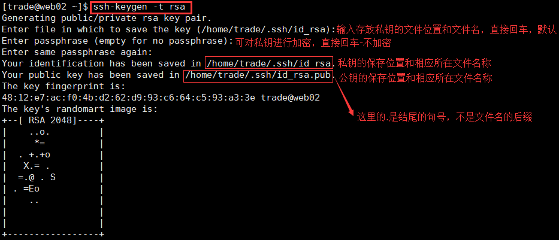

## Linux下ssh高级使用–免密登录

## **1.Linux下生成密钥**

ssh-keygen的命令手册，可通过”man ssh-keygen“命令：

```shell
[trade@web02 ~]$ man ssh-keygen
```

通过命令”ssh-keygen -t rsa“			#这里的-t 是type的意思，-t rsa加不加都行，不加自动默认

```shell
[trade@web02 ~]$ ssh-keygen -t rsa
或者
[trade@web02 ~]$ ssh-keygen
```



生成之后会在用户的根目录生成一个 “.ssh”的目录

```shell
[trade@web02 ~]$ ll -d .ssh
drwx------ 2 trade trade 4096 Jun  3 00:08 .ssh
[trade@web02 ~]$ ll .ssh
total 12
-rw------- 1 trade trade 1675 Jun  3 00:08 id_rsa
-rw-r--r-- 1 trade trade  393 Jun  3 00:08 id_rsa.pub
-rw-r--r-- 1 trade trade 2356 May 24 23:27 known_hosts
[trade@web02 ~]$ pwd
/home/trade
```


进入“.ssh”目录，新建一个文件authorized_keys，

```shell
[trade@web02 .ssh]$ ll
total 12
-rw------- 1 trade trade 1675 Jun  3 00:08 id_rsa
-rw-r--r-- 1 trade trade  393 Jun  3 00:08 id_rsa.pub
-rw-r--r-- 1 trade trade 2356 May 24 23:27 known_hosts
[trade@web02 .ssh]$ touch authorized_keys
[trade@web02 .ssh]$ ll
total 12
-rw-rw-r-- 1 trade trade    0 Jun  3 00:32 authorized_keys
-rw------- 1 trade trade 1675 Jun  3 00:08 id_rsa
-rw-r--r-- 1 trade trade  393 Jun  3 00:08 id_rsa.pub
-rw-r--r-- 1 trade trade 2356 May 24 23:27 known_hosts
[trade@web02 .ssh]$ chmod 600 authorized_keys 
[trade@web02 .ssh]$ ll
total 12
-rw------- 1 trade trade    0 Jun  3 00:32 authorized_keys	#authorized_keys权限600
-rw------- 1 trade trade 1675 Jun  3 00:08 id_rsa
-rw-r--r-- 1 trade trade  393 Jun  3 00:08 id_rsa.pub
-rw-r--r-- 1 trade trade 2356 May 24 23:27 known_hosts
[trade@web02 .ssh]$ pwd
/home/trade/.ssh
[trade@web02 .ssh]$ ll -d ../.ssh
drwx------ 2 trade trade 4096 Jun  3 00:32 ../.ssh		#.ssh目录权限700
```


```
authorized_keys:存放远程免密登录的公钥,主要通过这个文件记录多台机器的公钥

id_rsa : 生成的私钥文件

id_rsa.pub ： 生成的公钥文件

know_hosts : 已知的主机公钥清单

如果希望ssh公钥生效需满足至少下面两个条件：
```

> 1) .ssh目录的权限必须是700             2) .ssh/authorized_keys文件权限必须是600

## **2.远程免密登录**

原理图：


远程免密登录 相当于 把你的公钥 给对方，私钥在你这里， 则你就可以免密钥登录到对方，

常用以下几种方法：

**2.1 通过ssh-copy-id的方式**

> 命令： ssh-copy-id -i ~/.ssh/id_rsa.pub			#-i 即identity_file ，这里加不加都行

举例：

```shell
[trade@web02 .ssh]$ pwd
/home/trade/.ssh
[trade@web02 .ssh]$ ls
authorized_keys  id_rsa  id_rsa.pub  known_hosts
[trade@web02 .ssh]$ ssh-copy-id -i id_rsa.pub trade@192.168.30.4
trade@192.168.30.4's password: 
Now try logging into the machine, with "ssh 'trade@192.168.30.4'", and check in:

  .ssh/authorized_keys

to make sure we haven't added extra keys that you weren't expecting.

[trade@web02 .ssh]$ ssh trade@192.168.30.4			#不用输入密码，直接登录到对方
Last login: Fri Jun  2 23:59:07 2017 from 192.168.40.3
```


```
[root@test .ssh]# ssh-copy-id -i ~/.ssh/id_rsa.pub 192.168.91.135
```

常见错误：

```
[root@test ~]# ssh-copy-id -i ~/.ssh/id_rsa.pub 192.168.91.135
-bash: ssh-copy-id: command not found //提示命令不存在
```

解决办法：yum -y install openssh-clients

**2.2　通过scp将内容写到对方的文件中**

> 命令：scp -p ~/.ssh/id_rsa.pub root@:/root/.ssh/authorized_keys

举例：

```
[root@test .ssh]# scp -p ~/.ssh/id_rsa.pub root@192.168.91.135:/root/.ssh/authorized_keys
 root@192.168.91.135's password:  
id_rsa.pub 100% 408 0.4KB/s 00:00
  
[root@test .ssh]#   
[root@test .ssh]# ssh root@192.168.91.135
Last login: Mon Oct 10 01:27:02 2016 from 192.168.91.133 
[root@localhost ~]# 


```

**2.3 通过Ansible实现批量免密**

2.3.1 将需要做免密操作的机器hosts添加到/etc/ansible/hosts下：

```
[Avoid close]
192.168.91.132
192.168.91.133
192.168.91.134

```

2.3.2 执行命令进行免密操作

> ansible -m authorized_key -a "user=root key='{{ lookup('file','/root/.ssh/id_rsa.pub') }}'" -k

示例：

```
[root@test sshpass-1.05]# ansible test -m authorized_key -a "user=root key='{{ lookup('file','/root/.ssh/id_rsa.pub') }}'" -k 　　
SSH password: ----->输入密码 　　192.168.91.135 | success >>{ 　　
"changed": true,  　　
"key": "ssh-rsa AAAAB3NzaC1yc2EAAAABIwAAAQEArZI4kxlYuw7j1nt5ueIpTPWfGBJoZ8Mb02OJHR8yGW7A3izwT3/uhkK7RkaGavBbAlprp5bxp3i0TyNxa/apBQG5NiqhYO8YCuiGYGsQAGwZCBlNLF3gq1/18B6FV5moE/8yTbFA4dBQahdtVP PejLlSAbb5ZoGK8AtLlcRq49IENoXB99tnFVn3gMM0aX24ido1ZF9RfRWzfYF7bVsLsrIiMPmVNe5KaGL9kZ0svzoZ708yjWQQCEYWp0m+sODbtGPC34HMGAHjFlsC/SJffLuT/ug/hhCJUYeExHIkJF8OyvfC6DeF7ArI6zdKER7D8M0SM　　WQmpKUltj2nltuv3w== root@localhost.localdomain",  
"key_options": null,  　　
"keyfile": "/root/.ssh/authorized_keys",  　　
"manage_dir": true,  　　
"path": null,  　　
"state": "present",  　　
"unique": false,  　　
"user": "root"　　
} 　　
[root@test sshpass-1.05]# 

```

**2.4 手工复制粘贴的方式**

将本地id_rsa.pub文件的内容拷贝至远程服务器的~/.ssh/authorized_keys文件中