# 中安识别

# 1. 身份信息无法识别

原因：Licence  到期

方案：联系北京中安未来科技有限公司的技术支持，电话：010－62800056 转 157，让他们发一下文件LicenceFile，

```shell
把/home/zhongan/Shibie-Linux/目录的LicenceFile文件备份，然后root用户上传到tmp目录再传到这个目录替换掉，
chmod 777 /home/zhongan/Shibie-Linux/LicenceFile
chown zhongan.zhongan /home/zhongan/Shibie-Linux/LicenceFile
./ShutdownReconSys.sh
./StartReconSys.sh
```

# 2. 环境布置

现有的部署-->> 测试环境：192.168.30.126       生产环境：strade02

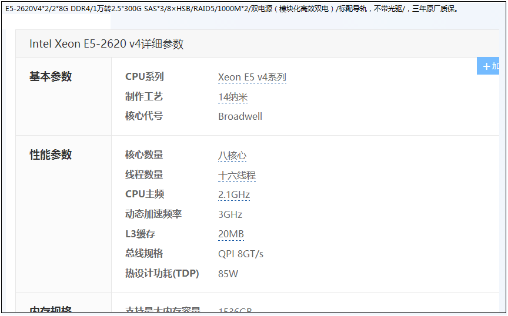

## 2.1 配置要求

```shell
RHEL 6.5 64 位/CentOS 6.5 64 位
2CPU 各 8 核
8G 内存
磁盘大小问题：最少分配50G硬盘吧 如果不存储图像的情况下，如果需要存储上传的图像那就需要根据实际的调用量来分配硬盘空间。
```

## 2.2 创建zhongan用户

特别说明：除了赋777权限和修改/etc/ld.so.conf用到root用户外，下面只是为了测试方便都用了root用户，

但正常生产操作配置部署的话其所有的操作及启动都建议用zhongan用户，

```shell
[root@redhat6 ~]# useradd -d /home/zhongan -m zhongan  #-d：指定用户登入时的主目录,-m：自动建立用户登入目录.
[root@redhat6 ~]# cd /home/zhongan
[root@redhat6 ~]# mkdir /home/zhongan/applog

#/home/zhongan： 用户 zhongan 家目录, 其中包括.bash_profile 文件
#/home/zhongan/applog：存放程序日志
```

## 2.3 安装包 Linux-64 目录说明 

```shell
linux-64/docs： 文档
linux-64/Web Service interface： 服务接口调用示例
linux-64/ zhongan /data/website： 图像数据文件夹
linux-64/zhongan/IDCard： 证件识别核心库文件
linux-64/zhongan/ bankcardLibrary： 银行卡识别核心库文件
linux-64/zhongan/ plateLibrary： 车牌识别核心库文件
linux-64/zhongan/docLibrary 文档识别核心库文件
linux-64/zhongan/ businesscard： 名片识别核心库文件
linux-64/zhongan/Shibie-Linux： 调度与识别程序
linux-64/zhongan/apache-tomcat-7.0.39： tomcat 安装包
linux-64/zhongan/jdk-7u75-linux-x64.tar.gz： 64 位 jdk 安装包
linux-64/zhongan/Uncompress.sh 解压 tomcat 与 jdk 的脚本
```

**(*核心库中文件必须执行 chmod 777 *授予最高权限) **

解压和拷贝 Linux-64/zhongan 文件夹中所有文件至Linux系统 zhongan 用户主目录/home/zhongan中，

注意是Linux-64/zhongan内的所有，不包括docs, WebServiceInterface两个文件夹，也不包括/zhongan文件夹本身，

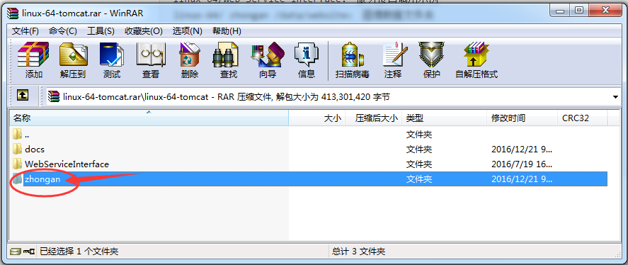


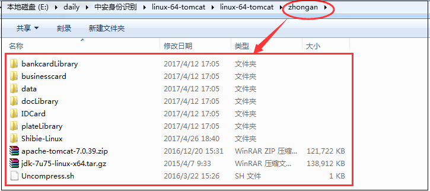

## 2.4 配置部署

### 2.4.1 解压jdk和tomcat

```shell
[root@redhat6 zhongan]# pwd
/home/zhongan
直接执行脚本, 解压以后成jdk1.7.0_75和apache-tomcat-7.0.39两个目录：
[root@redhat6 zhongan]# cat Uncompress.sh
unzip apache-tomcat-7.0.39.zip
tar -zxvf jdk-7u75-linux-x64.tar.gz
[root@redhat6 zhongan]# sh Uncompress.sh
```

### 2.4.2 配置 jdk 环境变量 

```shell
编辑 zhongan 目录下的.bash_profile 文件，在最后一行注释：
#export PATH
并在后面添加如下配置并保存(路径以解压后的实际路径为准)：
export JAVA_HOME=/home/zhongan/jdk1.7.0_75
export JRE_HOME=${JAVA_HOME}/jre
export CLASSPATH=.:${JAVA_HOME}/lib:${JRE_HOME}/lib
export PATH=${JAVA_HOME}/bin:$PATH
export LANG=zh_CN.GBK

[root@redhat6 zhongan]# cat .bash_profile
# .bash_profile

# Get the aliases and functions
if [ -f ~/.bashrc ]; then
	. ~/.bashrc
fi

# User specific environment and startup programs

PATH=$PATH:$HOME/bin
export JAVA_HOME=/home/zhongan/jdk1.7.0_75
export JRE_HOME=${JAVA_HOME}/jre
export CLASSPATH=.:${JAVA_HOME}/lib:${JRE_HOME}/lib
export PATH=${JAVA_HOME}/bin:$PATH
export LANG=zh_CN.GBK
#export PATH
```

验证安装,

```shell
[root@redhat6 zhongan]# source .bash_profile

如输出版本信息则表示正常安装, 如下图所示:

[root@redhat6 zhongan]# java -version
java version "1.7.0_75"
Java(TM) SE Runtime Environment (build 1.7.0_75-b13)
Java HotSpot(TM) 64-Bit Server VM (build 24.75-b04, mixed mode)
```

### 2.4.3 配置tomcat

#### 2.4.3.1 修改端口

```shell


[root@redhat6 conf]# pwd
/home/zhongan/apache-tomcat-7.0.39/conf
[root@redhat6 conf]# ls
Catalina  catalina.policy  catalina.properties  context.xml  logging.properties  server.xml  tomcat-users.xml  web.xml
[root@redhat6 conf]# vim server.xml 
......................省略...........................
 <Connector port="8888" protocol="HTTP/1.1"
               connectionTimeout="20000"
               redirectPort="8443" />
    <!-- A "Connector" using the shared thread pool-->
    <!--
    <Connector executor="tomcatThreadPool"
               port="8080" protocol="HTTP/1.1"
               connectionTimeout="20000"
               redirectPort="8443" />
    -->
    <!-- Define a SSL HTTP/1.1 Connector on port 8443
         This connector uses the JSSE configuration, when using APR, the
         connector should be using the OpenSSL style configuration
         described in the APR documentation -->
    <!--
    <Connector port="8443" protocol="HTTP/1.1" SSLEnabled="true"
               maxThreads="150" scheme="https" secure="true"
               clientAuth="false" sslProtocol="TLS" />
    -->

    <!-- Define an AJP 1.3 Connector on port 8009 -->
    <Connector port="8009" protocol="AJP/1.3" redirectPort="8443" />
    .............................省略.........................
```

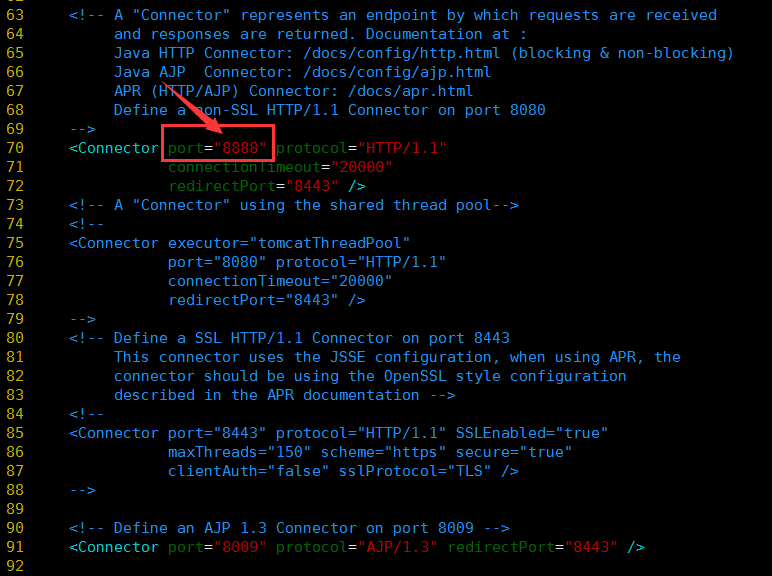

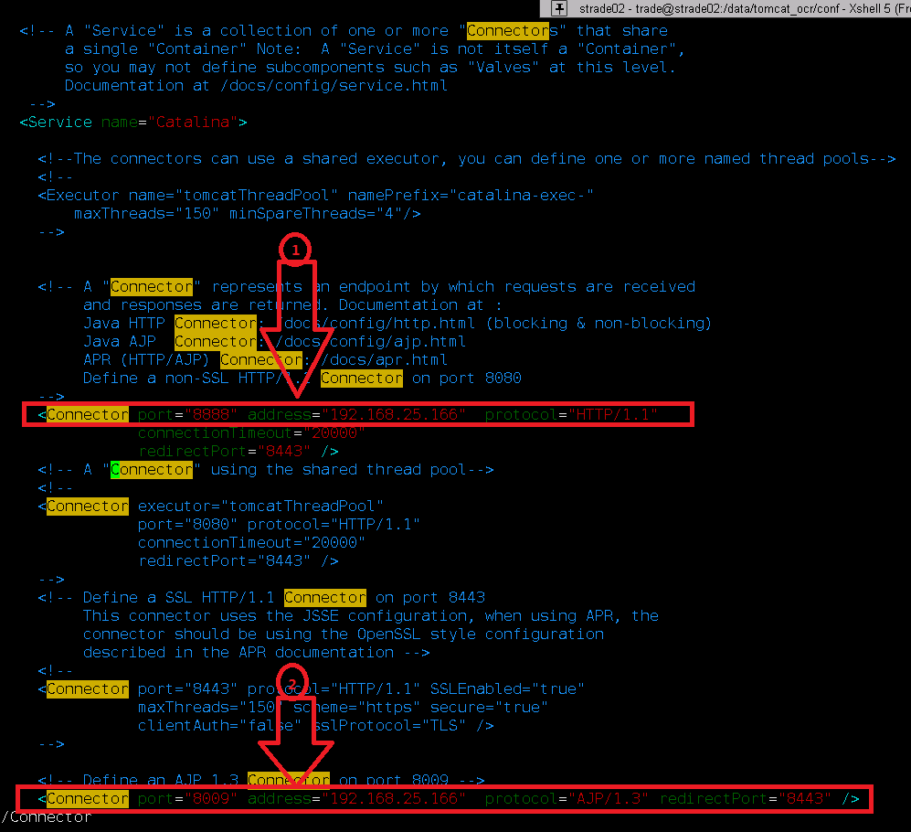

#### 2.4.3.2 配置 beans.xml  

编辑/home/zhongan/Shibie-Linux/beans.xml，将红线部分改为所需要的 IP 及端口（IP 要与服务器 IP 一致，端口要与 tomcat 中所设置的端口一致。） 如下是http://192.168.30.126:8888，注:这个地址即为 webservice 接口的调用地址，

```shell
[root@redhat6 Shibie-Linux]# pwd
/home/zhongan/Shibie-Linux
[root@redhat6 Shibie-Linux]# ls
beans.xml  Diaodu.jar  DiaoDu.sh  libcrypto.so.6  libssl.so.6  LicenceFile  LicenceFile.17042602bak  port.properties  Shibie.jar  shibienumber.sh  ShutdownReconSys.sh  StartReconSys.sh  tomcat.sh  tools_x64
[root@redhat6 Shibie-Linux]# cat beans.xml 
<?xml version="1.0" encoding="UTF-8"?>
<beans xmlns="http://www.springframework.org/schema/beans"
	xmlns:xsi="http://www.w3.org/2001/XMLSchema-instance" xmlns:jaxws="http://cxf.apache.org/jaxws"
	xsi:schemaLocation="
		http://www.springframework.org/schema/beans 
		http://www.springframework.org/schema/beans/spring-beans-3.0.xsd
		http://cxf.apache.org/jaxws 
		http://cxf.apache.org/schemas/jaxws.xsd">


	<jaxws:client id="cardImgreconClient"
		address="http://192.168.30.126:8888/cxfServerX/ImgReconCard"
		serviceClass="com.zhongan.webservice.CardImgrecon" />

</beans>
```

#### 2.4.3.3 部署 peizhi.properties 和 clientpeizhi.properties 

- peizhi.properties

```shell
[root@redhat6 classes]# pwd
/home/zhongan/apache-tomcat-7.0.39/webapps/cxfServerX/WEB-INF/classes
[root@redhat6 classes]# ls
cn  com  log4j.properties  META-INF  peizhi.properties  servlet  zhongan 
[root@redhat6 classes]# cat peizhi.properties
#服务器调度程序启动的IP地址
ipaddress=localhost
#服务器调度程序启动端口号
port=7654
#PC文件图片上传路径
imageUpDir=/home/zhongan/data/website/upimage/
#log输出地址
printPath=/home/zhongan/applog/
#服务器是否保存识别结果的XML文件(1是0否)
isSaveXML=0
#服务器是否删除保存的图片(1是0否)
isDeleteFile=1
#设置用户上传图片base64后的最大长度(3M图片大小为4200000；5M图片大小为7250000；8M图片大小为11500000；10M图片大小为14500000;)
maxlength=4200000
#返回数据格式(xml或json)
format=xml
```

其中，maxlength 为限制上传的图片的最大长度 

[root@mweb06 classes]# echo $LANG
en_US.UTF-8

- log4j.properties

  打开如下路径修改日志输出路径:

/home/zhongan/apache-tomcat-7.0.39/webapps/cxfServerX/WEB-INF/classes/log4j.properties ，修改其中的倒数第4行

log4j.appender.A1.file=/home/zhongan/applog/test.log，

```shell
[root@redhat6 classes]# pwd
/home/zhongan/apache-tomcat-7.0.39/webapps/cxfServerX/WEB-INF/classes
[root@redhat6 classes]# ls
cn  com  log4j.properties  META-INF  peizhi.properties  servlet  zhongan
[root@redhat6 classes]# vim log4j.properties 
[root@redhat6 classes]# cat log4j.properties
log4j.rootLogger=INFO,stdout,A1

log4j.appender.stdout=org.apache.log4j.ConsoleAppender
log4j.appender.stdout.layout=org.apache.log4j.PatternLayout
log4j.appender.stdout.layout.ConversionPattern=%d{yyyy MMM dd HH:mm:ss} %5p (%F:%L) - %m%n

log4j.appender.A1=org.apache.log4j.DailyRollingFileAppender 
log4j.appender.A1.encoding=GBK
log4j.appender.A1.file=/home/zhongan/applog/test.log
log4j.appender.A1.DatePattern='.'yyyy-MM-dd
log4j.appender.A1.layout=org.apache.log4j.PatternLayout 
log4j.appender.A1.layout.ConversionPattern=%d{yyyy MMM dd HH:mm:ss} %-5p %c - %m%n
```

修改客户端配置文件指向，

```shell
[root@redhat6 classes]# pwd
/home/zhongan/apache-tomcat-7.0.39/webapps/newRecon/WEB-INF/classes
[root@redhat6 classes]# ls
action  applicationContext.xml  beans.xml  clientpeizhi.properties  com  struts.xml  util
[root@redhat6 classes]# vim clientpeizhi.properties
[root@redhat6 classes]# cat clientpeizhi.properties
#PC文件图片上传路径
imageUpDir=/home/zhongan/data/website/upimage/
#用户名
username=test
#用户密码
mykey=testtest
#beans.xml路径,linux系统使用绝对路径，注意开头使用双斜线
xmlpath=//home/zhongan/Shibie-Linux/beans.xml
```

修改 tomcat 日志输出路径，

进入/home/zhongan/apache-tomcat-7.0.39/conf 目录，修改 logging.properties: 

将 tomcat 的 catalina.out 日志的输出路径修改到合适位置，默认修改为/home/zhongan/applog ，

```shell
[root@redhat6 conf]# pwd
/home/zhongan/apache-tomcat-7.0.39/conf
[root@redhat6 conf]# ls
Catalina  catalina.policy  catalina.properties  context.xml  logging.properties  server.xml  tomcat-users.xml  web.xml
[root@redhat6 conf]# vim logging.properties 
[root@redhat6 conf]# grep applog logging.properties
1catalina.org.apache.juli.FileHandler.directory = /home/zhongan/applog/
```

### 2.4.4 配置启动程序

####  2.4.4.1 修改配置文件 

修改 Shibie-Linux 里的 port.properties 里面的路径，如下图: 

其中的倒数第11行#是否保存识别时(旋转裁切后)的图片;(1保存0不保存) 一般选0不保存即识别后就马上会删除，

```shell
[root@redhat6 Shibie-Linux]# pwd
/home/zhongan/Shibie-Linux
[root@redhat6 Shibie-Linux]# ls
beans.xml  Diaodu.jar  DiaoDu.sh  libcrypto.so.6  libssl.so.6  LicenceFile  LicenceFile.17042602bak  port.properties  Shibie.jar  shibienumber.sh  ShutdownReconSys.sh  StartReconSys.sh  tomcat.sh  tools_x64
[root@redhat6 Shibie-Linux]# vim port.properties 
[root@redhat6 Shibie-Linux]# cat port.properties 
#服务器调度程序启动的IP地址
ipaddress=localhost
#服务器调度程序启动的端口号
port=7654
#识别库地址
dllpath=/home/zhongan/IDCard
bankdllpath=/home/zhongan/bankcardLibrary
platedllpath=/home/zhongan/plateLibrary
businesscardpath=/home/zhongan/businesscard
docLibrarypath=/home/zhongan/docLibrary
#识别程序暂存图片地址
temppath=/home/zhongan/data/website/reconimage
#监听日志输出地址
printPath=/home/zhongan/applog/
#是否保存头像(1保存0不保存)
isSaveImage=1
#是否保存识别时(旋转裁切后)的图片;(1保存0不保存)
isSaveRecogImage=0
timeout=900000000
#测试状态返回识别时间 1返回 0 不返回
isRecogtime=0
#0所有证件类型都不开启拒识功能 2二代证 6行驶证等 2;6(即二代证正面及行驶证都开启拒识功能)，只限证件类型
jushi=0
#是否开启地址分割 1开启 0不开启(只限二代证正面)
SplitChineseAddress=0
#1证件 1+2证件+银行卡 1+2+3证件+银行卡+车牌 1+2+3+4+6证件+银行卡+车牌+名片+文档
cardtype=1+2+3+4
```

#### 2.4.4.2 修改依赖库文件环境配置

打开 /etc/ld.so.conf 文件，在下面添加(libcrypto.so.6 和 libssl.so.6)所在路径/home/zhongan/Shibie-Linux
如下图: 

```shell
[root@redhat6 ~]# vim  /etc/ld.so.conf 
[root@redhat6 ~]# cat /etc/ld.so.conf
include ld.so.conf.d/*.conf
/home/zhongan/Shibie-Linux 

[root@redhat6 ~]# /sbin/ldconfig	#保存，执行/sbin/ldconfig
```

# 3. 添加授权文件

离线文件授权(根据本地机器码生成，无需联外网)，文件名为: LicenceFile
使用离线授权，首先中安方会给客户一个文件夹(tools_x64)，如图: 

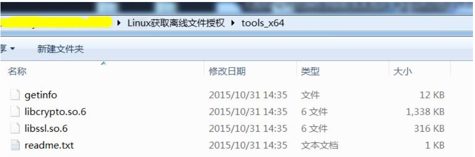

- 获取机器码信息

客户将该文件夹拷贝到 ShiBie-Linux 文件夹中，并将该文件夹及内部文件的权限改为最高，如图: 

```shell
获取机器码程序
首先ldd getinfo，看getinfo所链接的库都链接上，如果出现lib***.so ==>no found, 它所需要链接的库就在
本目录下，执行pwd命令，获取当前文件的绝对路径赋值（复制下来），然后执行命令sudo vi /etc/ld.so.conf 
然后按键o， 然后把刚才复制的路径粘贴上，然后按esc键，然后按键：wq（冒号不能省略），然后执行命令
sudo ldconfig，到这里，环境搭建好了。
执行操作：  执行./getinfo获取机器码文件 

[root@redhat6 tools_x64]# chmod 777 *
[root@redhat6 tools_x64]# pwd
/home/zhongan/Shibie-Linux/tools_x64
[root@redhat6 tools_x64]# ls
getinfo  libcrypto.so.6  libssl.so.6  readme.txt
[root@redhat6 tools_x64]# ll
-rwxrwxrwx 1 root root   12917 5月  22 13:16 getinfo
-rwxrwxrwx 1 root root 1369440 5月  22 13:16 libcrypto.so.6
-rwxrwxrwx 1 root root  323544 5月  22 13:16 libssl.so.6
-rwxrwxrwx 1 root root     396 5月  22 13:16 readme.txt
[root@redhat6 tools_x64]# ldd getinfo
[root@redhat6 Shibie-Linux]# ldconfig
执行./getinfo 获取机器码文件，
[root@redhat6 Shibie-Linux]# ./getinfo
```

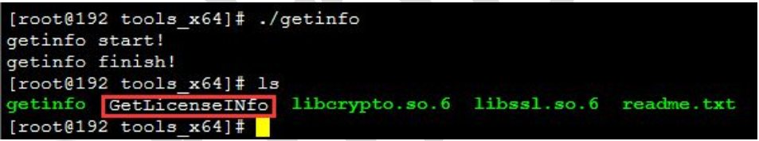

并将该文件 GetLicenseINfo 给中安方，中安方据此出授权文件。 

# 4. 添加运行权限 

```shell

#cd /home/zhongan/Shibie-Linux
#chmod 777 *
#cd /home/zhongan/apache-tomcat-7.0.39/bin/
#chmod 777 *
注意：（IDCard,bankcardLibrary,plateLibrary,businesscard,docLibrary） 核心库中文
件按需求必须执行 chmod 777 *授予最高权限
```

# 5. 修改识别程序的启动个数 

在 shibienumber.sh 中修改启动识别程序的个数，如下图: 

```shell
[root@redhat6 Shibie-Linux]# pwd
/home/zhongan/Shibie-Linux
[root@redhat6 Shibie-Linux]# ls
beans.xml  Diaodu.jar  DiaoDu.sh  libcrypto.so.6  libssl.so.6  LicenceFile  LicenceFile.17042602bak  port.properties  Shibie.jar  shibienumber.sh  ShutdownReconSys.sh  StartReconSys.sh  tomcat.sh  tools_x64
[root@redhat6 Shibie-Linux]# cat shibienumber.sh
#/bin/sh
while true; do   
                count=`ps -fe | grep -v "grep" | grep -c "Shibie.jar"`
                if test ${count} -lt 2;
		then  
    nohup java  -jar  Shibie.jar >>/home/zhongan/applog/shibie.log 2>>/home/zhongan/applog/shibieerr.log &
    else 
       echo ${count} >/home/zhongan/applog/shibienumber.log 2>/home/zhongan/applog/shibienumbererr.log &
       fi
    sleep 15 
done
```

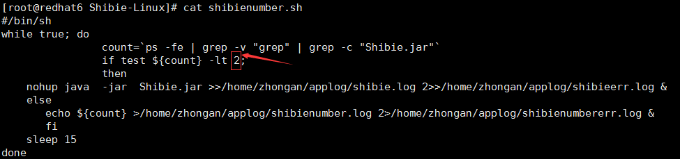

如欲开启两个识别进程，则将红框中的数字改为 2 即可，一般来说1个识别进程占用1G内存+1个CPU，比如16核双线程CPU+16G内存，那边识别进程一般开12~14个。

# 6. tomcat 内存优化参考 

为了防止 tomcat 发生内存异常，可根据服务器物理内存修改 tomcat 相应的 jvm
参数:
请根据服务器机器配置修改如下文件:
zhongan/apache-tomcat-7.0.39/bin/catalina.sh，如下图:

```shell
[root@redhat6 bin]# pwd
/home/zhongan/apache-tomcat-7.0.39/bin
[root@redhat6 bin]# ls
bootstrap.jar  catalina.sh         commons-daemon-native.tar.gz  cpappend.bat  digest.sh         shutdown.bat  startup.sh            tool-wrapper.bat  version.sh
C%3A           catalina-tasks.xml  configtest.bat                daemon.sh     setclasspath.bat  shutdown.sh   tomcat-juli.jar       tool-wrapper.sh
catalina.bat   commons-daemon.jar  configtest.sh                 digest.bat    setclasspath.sh   startup.bat   tomcat-native.tar.gz  version.bat
[root@redhat6 bin]# vim  catalina.sh 
[root@redhat6 bin]# cat catalina.sh
```

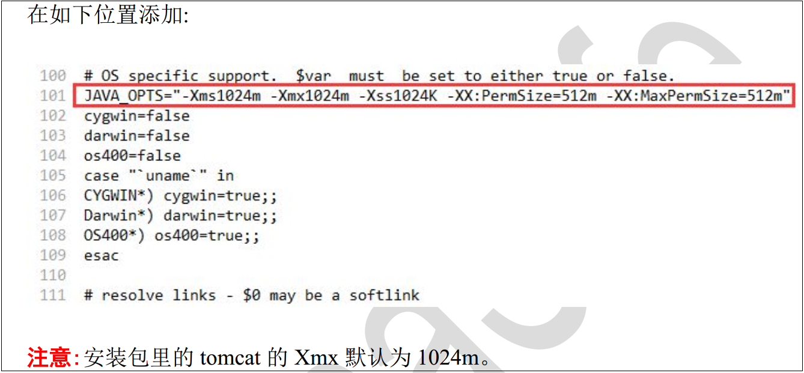


参数说明:
-Xms：设置 jvm 内存的初始大小
-Xmx：设置 jvm 内存的最大值
-Xss：每个线程的堆栈大小
-XX:MaxNewSize ：设置新域的最大值
-XX:MaxPermSize：设置永久域的最大值 

# 7. 检测及验证 

## 7.1 启动识别服务（需root 用户） 

```shell
#cd / home /zhongan/ShiBie-Linux
#sh StartReconSys.sh
```

## 7.2 检查进程 

检查是否有 tomcat 进程： ps -ef | grep tomcat | grep java 

```shell
[root@redhat6 bin]# ps -ef | grep tomcat | grep java
root      48044      1  0 Apr26 ?        00:24:48 /home/zhongan/jdk1.7.0_75/jre/bin/java -Djava.util.logging.config.file=/home/zhongan/apache-tomcat-7.0.39/conf/logging.properties -Djava.util.logging.manager=org.apache.juli.ClassLoaderLogManager -Xms1024m -Xmx1024m -Xss1024K -XX:PermSize=512m -XX:MaxPermSize=512m -Djava.endorsed.dirs=/home/zhongan/apache-tomcat-7.0.39/endorsed -classpath /home/zhongan/apache-tomcat-7.0.39/bin/bootstrap.jar:/home/zhongan/apache-tomcat-7.0.39/bin/tomcat-juli.jar -Dcatalina.base=/home/zhongan/apache-tomcat-7.0.39 -Dcatalina.home=/home/zhongan/apache-tomcat-7.0.39 -Djava.io.tmpdir=/home/zhongan/apache-tomcat-7.0.39/temp org.apache.catalina.startup.Bootstrap start
```

检查是否有调度进程： ps -ef | grep Diaodu.jar | grep java

```shell
[root@redhat6 bin]# ps -ef | grep Diaodu.jar | grep java
root      48030      1  0 Apr26 ?        00:20:18 java -Xms64m -Xmx512m -jar Diaodu.jar
```

检查是否有识别进程： ps -ef | grep Shibie.jar | grep java     开几个识别进程，就有几个java Shibie

```shell
[root@redhat6 bin]# ps -ef | grep Shibie.jar | grep java
root      48075  48070  0 Apr26 ?        00:20:16 java -jar Shibie.jar
root      48146  48070  0 Apr26 ?        00:20:15 java -jar Shibie.jar
```

```shell
[root@mweb06 Shibie-Linux]# ps -ef | grep Shibie.jar | grep java 
root      1554  1549  0 17:53 pts/1    00:00:00 java -jar Shibie.jar
root      1643  1549  0 17:54 pts/1    00:00:00 java -jar Shibie.jar
root      1694  1549  0 17:54 pts/1    00:00:00 java -jar Shibie.jar
root      1745  1549  0 17:54 pts/1    00:00:00 java -jar Shibie.jar
root      1799  1549  0 17:54 pts/1    00:00:00 java -jar Shibie.jar
root      1862  1549  1 17:55 pts/1    00:00:00 java -jar Shibie.jar
```


## 7.3 检查服务是否初始化成功(重要) 

检查识别初始化是否成功:
以开启 2 个进程为例，查看 applog 目录的 shibie.log，如果正常初始化，则各个参数均为 0。如下图所示是正常启动的情况: 

InitIDCard:0代表初始化成功，**如果是InitIDCard:2** 代表授权失败即代表没有识别到加密锁或者LicenceFile到期，

```shell
[root@mweb06 applog]# pwd
/home/zhongan/applog
[root@mweb06 applog]# cat shibie.log
启动识别客户端ReconClientL
InitIDCard:0
LoadBankCard:0
TH_InitPlateIDSDK:101
BusinessCardInit:101
启动识别客户端ReconClientL
InitIDCard:0
LoadBankCard:0
TH_InitPlateIDSDK:101
BusinessCardInit:101
启动识别客户端ReconClientL
InitIDCard:0
LoadBankCard:0
TH_InitPlateIDSDK:101
BusinessCardInit:101
启动识别客户端ReconClientL
InitIDCard:0
LoadBankCard:0
TH_InitPlateIDSDK:101
BusinessCardInit:101
启动识别客户端ReconClientL
InitIDCard:0
LoadBankCard:0
TH_InitPlateIDSDK:101
BusinessCardInit:101
启动识别客户端ReconClientL
InitIDCard:0
LoadBankCard:0
TH_InitPlateIDSDK:101
BusinessCardInit:101

[root@mweb06 applog]# grep 启动识别客户端 shibie.log     如果开6个识别进程的话，则初始化6个成功。
启动识别客户端ReconClientL
启动识别客户端ReconClientL
启动识别客户端ReconClientL
启动识别客户端ReconClientL
启动识别客户端ReconClientL
启动识别客户端ReconClientL
```

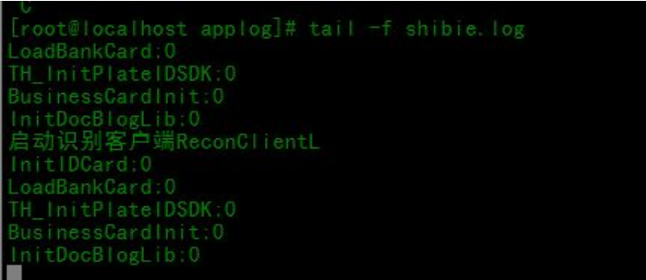


```shell
其中:
InitIDCard:0 代表证件识别初始化成功
LoadBankCard:0 代表银行卡识别初始化成功
TH_InitPlateIDSDK:0 代表车牌识别初始化成功
BusinuessCardInit:0 代表名片识别初始化成功
InitDocBlogLib:0 代表文档识别初始化成功
共显示 2 组，代表启动了 2 个进程，均成功
```

若：启动未返回初始化信息则需要删除根目录/dev/shm 下的 sem.wintoneSem 文件检查依赖库文件(libcrypto.so.6 和 libssl.so.6)的环境配置是否生效并重启服务

## 7.4 检查 tomcat 是否正常启动完毕

当正常结束，并日志中没有报异常等，则证明 Web 项目部署成功，如下图: 

```shell
[root@redhat6 applog]# pwd
/home/zhongan/applog
[root@redhat6 applog]# tailf catalina.2017-05-23.log
```

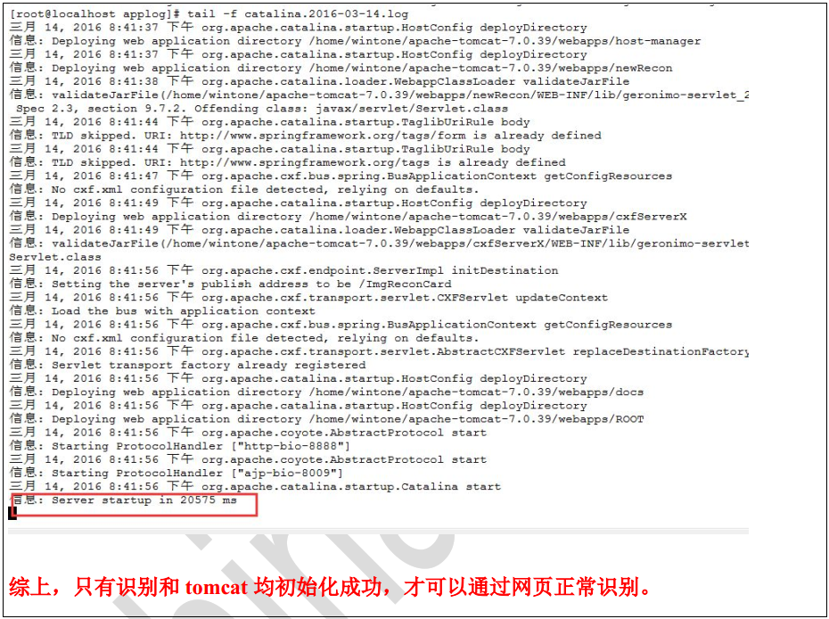


# 8. 系统的关闭

```shell
#cd / home /zhongan/ShiBie-L
#sh ShutdownReconSys.sh
```


# 9. 验证是否部署成功

登录 http://ip:port/newRecon 进行识别 ，可以从下面的配置文件中获得，

即为http://192.168.30.126:8888/newRecon

http://172.20.10.15:8888/newRecon/

```xml
[root@redhat6 Shibie-Linux]# cat beans.xml
<?xml version="1.0" encoding="UTF-8"?>
<beans xmlns="http://www.springframework.org/schema/beans"
	xmlns:xsi="http://www.w3.org/2001/XMLSchema-instance" xmlns:jaxws="http://cxf.apache.org/jaxws"
	xsi:schemaLocation="
		http://www.springframework.org/schema/beans 
		http://www.springframework.org/schema/beans/spring-beans-3.0.xsd
		http://cxf.apache.org/jaxws 
		http://cxf.apache.org/schemas/jaxws.xsd">


	<jaxws:client id="cardImgreconClient"
		address="http://192.168.30.126:8888/cxfServerX/ImgReconCard"
		serviceClass="com.zhongan.webservice.CardImgrecon" />

</beans>
```


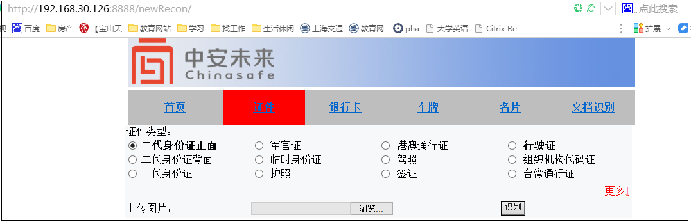


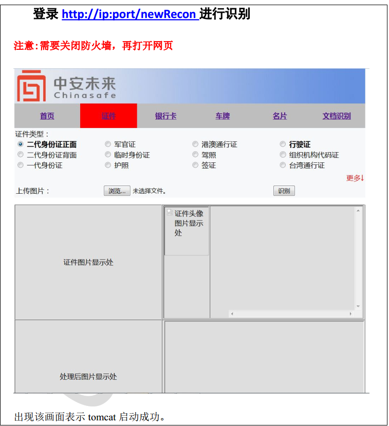


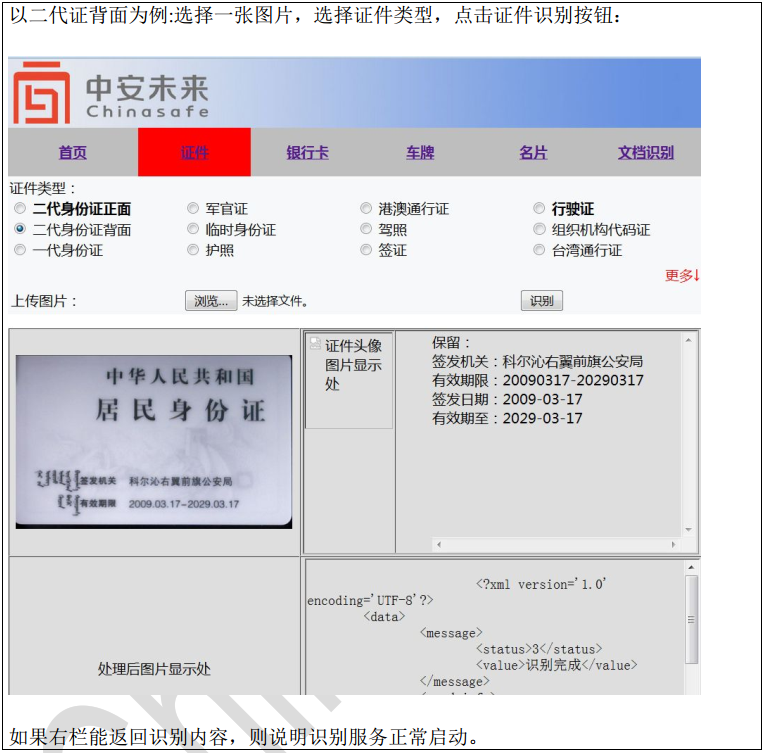


# 10日志、图片 

- 服务日志

tomcat 的工作日志和错误日志输出位置为/applog/目录下，
工作日志为 catalina.log，错误日志为 tomcaterr.log，可以定期清理。

- 图片暂存位置

/data/website/upimage 目录中会存放识别图片，需要定期清理。

- 目录清理问题：我们有配置文件可以识别后就清理上传的图像 不用保留，但是用我们网页测试上传的图像无法删除 需手动删除，但是正式环境应该是调用接口的形式去删除图像所以应该无需手动删除，其在2.4.3.3，和2.4.4的配置文件中有配置。