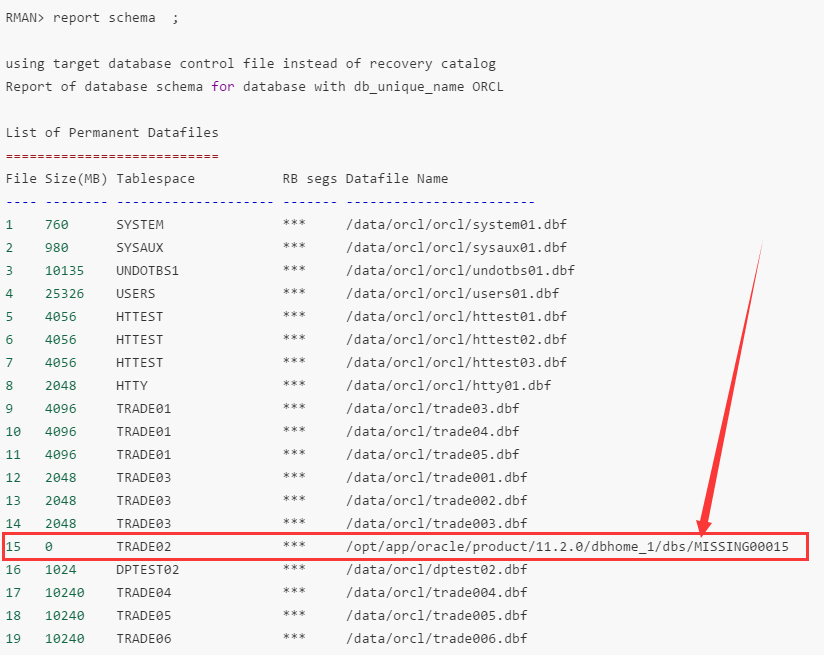
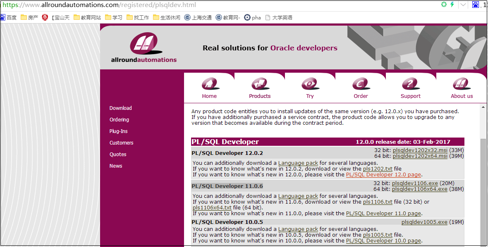

# Oracle和PL/SQL的使用

# 一、 Oracle的使用

## 1. Oracle用户管理

```shell

像 sys   system   都是系统用户，平时建立的用户都是普通用户，像表格中的运维用户，就属于普通用户

  select * from all_users;  所有用户的表
查看用户对象权限：
select * from dba_tab_privs;   
select * from all_tab_privs;   
select * from user_tab_privs;

DBA就是属于管理员，就是管理用户

你们应该有员工表，再查针对哪些员工拥有哪些那个用户，再找对应的权限

错了，DBA是权限角色，不能说是用户，管理员权限的岗位一般是DBA才有

就像sys，再或者你创建一个普通用户，也可以授予DBA 角色权限

-- 确定角色的权限
select * from role_tab_privs ;              包含了授予角色的对象权限
select * from role_role_privs ;             包含了授予另一角色的角色
select * from role_sys_privs ;              包含了授予角色的系统权限

-- 确定用户帐户所授予的权限
select * from DBA_tab_privs ;   直接授予用户帐户的对象权限
select * from DBA_role_privs ; 授予用户帐户的角色
select * from DBA_sys_privs ;   授予用户帐户的系统权限

--查看用户对应的表空间，
[oracle@db ~]$ rman target  /
RMAN> report  schema ;  
[oracle@db ~]$ sqlplus / as sysdba
select tablespace_name,file_id,file_name from dba_data_files order by 1,2;
select tablespace_name,file_id,bytes/1024/1024,file_name from dba_data_files order by file_id;
select username,default_tablespace from dba_users ;
```


## 2. 查询Oracle的版本号和实例名

倒数第二行就是Oracle的版本号为11.2.0.1.0，

```shell
[root@db oracle]# su - oracle
[oracle@db ~]$ sqlplus

SQL*Plus: Release 11.2.0.1.0 Production on Mon Jun 5 09:58:26 2017

Copyright (c) 1982, 2009, Oracle.  All rights reserved.

Enter user-name: trade02
Enter password: 

Connected to:
Oracle Database 11g Enterprise Edition Release 11.2.0.1.0 - 64bit Production
With the Partitioning, OLAP, Data Mining and Real Application Testing options
```

orcl 便是实例名，

```sql
[oracle@db ~]$ sqlplus

SQL*Plus: Release 11.2.0.1.0 Production on Thu Jun 8 18:34:10 2017

Copyright (c) 1982, 2009, Oracle.  All rights reserved.

Enter user-name: trade02
Enter password: 

Connected to:
Oracle Database 11g Enterprise Edition Release 11.2.0.1.0 - 64bit Production
With the Partitioning, OLAP, Data Mining and Real Application Testing options

SQL> select instance_name from v$instance;

INSTANCE_NAME
----------------
orcl
```

## 3. 数据库的导入和导出

Oracle从ORCALE10G开始提供了新的导入导出工具，数据泵。Oracle官方对此的形容是：OracleDataPump technology enables Very High-Speed movement of data and metadata from one database to another.其中Very High-Speed是亮点。

\1. 什么是Directory对象
Directory对象是Oracle10g版本提供的一个新功能。他是一个 指向，指向了操作系统中的一个路径。每个Directory都包含 Read,Write两个权限，可以通过Grant命令授权给指定的用户或角色。拥有读写权限的用户就可以读写该Directory对象指定的操作系统路 径下的文件。

\2. 无论在什么地方使用expdp，生成的文件最终页是在服务器上(Directory指定的位置)

在导出/导入的时候，我们常常有这样的需求，只想导出/导入表结构，或者只想导出/导入数据。幸运的是数据泵也提供了该功能。使用 Content参数。该参数有三个属性
1) ALL : 导出/导入对象定义和数据，该参数的默认值就是ALL
2) DATA_ONLY : 只导出/导入数据。
3) METADATA_ONLY : 只导出/导入对象定义。

Warning: 有一点值得注意的时，在执行导出的时候，如果使用了高级过滤，如只导出了数据，那么导入时，需要确保数据定义已经存在。否则数据都变成没有主子了。如果数 据定义已经存在，导入时最好指定data_only，否则会触发ORA-39151错误，因为对象已经存在了。

1) 对于导出的parallel
对于导出来说，由于dump文件只能由一个线程进行操作（包 括I/O处理），因此如果输出的DUMP文件只有一个，即使你指定再多的并行，实际工作仍然是 一个，而且还会触发ORA-39095错误。因此，建议设置该参数小于或等于生成的DUMP文件数量。那么，如何控制生成的DUMP文件数量呢？
EXPDP 命令提供了一个FILESIZE参数，用来指定单个DUMP文件的最大容量，要有效的利用parallel参数，filesize参数必不可少。
举 例：某用户对象占用了4G左右的空间，实际导出后的DUMP文件约为3G，我们尝试在导出该用户时指定并行度为4，设置单个文件不超过500M，则语法如 下：
$ expdp user/pwd directory=dump_file dumpfile=expdp_20100820_%U.dmp logfile=expdp_20100820.log filesize=500M parallel=4

2) 对于导入的parallel
对于导入来说，使用parallel参数则要简单的多，我认为导入更能体现parallel参数的优势。 参数设置为几，则认为同时将几张表的内容导入到库中。
举例：某dmp文件中包含了200张表，我们尝试在导入该DMP文件时指定并行度为10，则 语法如下：
$ impdp user/pwd directory=dump_file dumpfile=expdp_20100820.dmp logfile=impdp_20100820.log parallel=10

操作模式

\1. 全库模式
导入或者导出整个数据库，对应impdp/expdp命令中的full参数，只有拥有dba或者 exp_full_database和imp_full_database权限的用户才能执行。

\2. Schema模式
导出或导入Schema下的自有对象，对应impdp/expdp命令中的Schema参数，这是默认的操作模式。 如果拥有dba或者 exp_full_database和imp_full_database权限的用户执行的话，就可以导出或导入多个Schema中的对象。

\3. 表模式
导出指定的表或者表分区（如果有分区的话）以及依赖该表的对象（如该表的索引，约束等，不过前提是这些对象在同一个 Schema中，或者执行的用户有相应的权限）。对应impdp/expdp命令中的Table参数。

\4. 表空间模式
导出指定的表空间中的内容。对应impdp/expdp中的Tablespaces参数，这种模式类似于表模式和 Schema模式的补充。

\5. 传输表空间模式
对应impdp/expdp中的Transport_tablespaces参数。这种模式与前面几种模式最显著的区 别是生成的Dump文件中并不包含具 体的逻辑数据，而只导出相关对象的元数据(即对象的定义，可以理解成表的创建语句)，逻辑数据仍然在表空间的数据文件中，导出时需要将元数据和数据文件同 时复制到目标端服务器。
这种导出方式效率很高，时间开销主要是花在复制数据文件产生的I/O上。expdp执行传输表空间模式的导出，用户必须 拥有 exp_full_database角色或者DBA角色。而通过传输表空间模式导入时，用户必须拥有imp_full_database角色或者DBA角 色。

### 3.1 脚本导入导出

#### 3.1.1 脚本导出

##### 3.1.1.1  expdp 脚本方式导出

   expdp_db_oracle.sh

前提：

```shell
mkdir -p /data/
sqlplus / as sysdba
select * from dba_directories;
create directory dpdata as '/data/dpdata';
grant read,write on directory dpdata to trade;
```

脚本不排除表：

```shell
#!/bin/bash

# Fixed variable
date=`date +%F`
user=trade
passwd=HTCH2014htch
dir="DPDATA"

# expdp input files
expdp $user/$passwd schemas=$user directory=$dir dumpfile=${user}_$date\.dmp
```

脚本排除表：

```shell
#!/bin/bash

# Fixed variable
date=`date +%F`
user=trade05
passwd=trade02
dir="dpdata"
ex_tables="('T_T_HOLD_H','T_F_FUND_FLOW_H','T_T_TRADE_H','T_NOTICE_H')"

# expdp input files
expdp $user/$passwd schemas=$user exclude=TABLE:\" IN ${ex_tables}\" directory=$dir dumpfile=${user}_01_$date\.dmp
expdp $user/$passwd tables=${ex_tables} CONTENT=METADATA_ONLY directory=$dir dumpfile=${user}_02_${date}.dmp
```


##### 3.1.1.1  exp 脚本方式导出

前提：

```shell
sqlplus / as sysdba
select * from dba_directories;
create directory dpdata as '/data/dpdata';
grant read,write on directory dpdata to trade05;
```

实际脚本：

这个是SPOOL方法导出数据时是否显示字段的属性，set heading on 是显示字段，off是不显示；

```shell
#!/bin/bash

# Fixed variable
date=`date +%F`
user=trade05
passwd=trade02
dir="dpdata"
ex_tables="('T_T_HOLD_H','T_F_FUND_FLOW_H','T_T_TRADE_H','T_NOTICE_H')"

# Query all table names that need to be exported
sqlplus ${user}/${passwd} <<EOF
set heading off
spool /tmp/par.file
select owner||'.'||table_name||','||chr(10) from dba_tables where owner in ("${user}") and table_name not in ${ex_tables} order by owner;
select ')' from dual;
spool off
exit;
EOF

# table names processing
sed -ri '/SQL|\)|rows/d' /tmp/par.file
t=`cat /tmp/par.file`
n=`echo $t | sed 's/ //g'`

# expdp output files
expdp $user/$passwd schemas=$user exclude=TABLE:\" IN ${ex_tables}\" directory=$dir dumpfile=${user}_01_$date\.dmp
expdp $user/$passwd tables=${ex_tables} CONTENT=METADATA_ONLY directory=$dir dumpfile=${user}_02_${date}.dmp
```


```shell
#!/bin/bash

# Fixed variable
date=`date +%F`
user=trade02
passwd=trade02
dir="DUMP_DIR"
ex_tables="('T_T_HOLD_H','T_F_FUND_FLOW_H','T_T_TRADE_H','T_NOTICE_H')"

# Query all table names that need to be exported
sqlplus ${user}/${passwd} <<EOF
set heading off
spool /tmp/par.file
select owner||'.'||table_name||','||chr(10) from dba_tables where owner in ("${user}") and table_name not in ${ex_tables} order by owner;
select ')' from dual;
spool off
exit;
EOF

# table names processing
sed -ri '/SQL|\)|rows/d' /tmp/par.file
t=`cat /tmp/par.file`
n=`echo $t | sed 's/ //g'`

# exp ouput files
exp $user/$passwd file="${user}_01_${date}.dmp" tables="$n"
exp $user/$passwd file="${user}_02_${date}.dmp" tables=${ex_tables} rows=n

imp username/password@ip/sid file="{备份文件}"
##先导2，再导1#

# expdp output files
expdp $user/$passwd schemas=$user exclude=TABLE:\" IN ${ex_tables}\" directory=$dir dumpfile=${user}_01_$date\.dmp
expdp $user/$passwd tables=${ex_tables} CONTENT=METADATA_ONLY directory=$dir dumpfile=${user}_02_${date}.dmp
##先导2，再导1#

impdp strade/oracle@orcl DIRECTORY=dump_dir DUMPFILE=expdp20170503.dmp remap_schema=trade:strade remap_tablespace=users:strade01 TABLE_EXISTS_ACTION=REPLACE transform=oid:n<可选，OID重复的时候需要添加>
```


#### 3.1.2 脚本导入 

##### 3.1.2.1  expdp 脚本方式导入

前提准备：

```SHELL
su - root
cd /data/dpdata
chown oracle:oinstall *

sqlplus / as sysdba
select * from dba_directories;
create directory dpdata as '/data/dpdata';
grant read,write on directory dpdata to trade05;
```

测试成功脚本：

impdp_db_oracle.sh

user：要导入的Oracle数据库的其中某个用户，

passwd：是user的相应密码，

不排除表导入：

```shell
#!/bin/bash

user=trade
passwd=HTCH2014htch
temp_space=$user\_temp
space=trade
dir="DPDATA"

sqlplus / as sysdba <<EOF
CREATE TEMPORARY TABLESPACE $temp_space TEMPFILE '+DATA/orcl/datafile/$temp_space\.dbf' SIZE 10G AUTOEXTEND ON NEXT 500M MAXSIZE unlimited EXTENT MANAGEMENT LOCAL;
CREATE TABLESPACE  $space LOGGING  DATAFILE   '+DATA/orcl/datafile/$user\.dbf' SIZE 2G autoextend on next 500M maxsize unlimited extent management local segment space management auto;
CREATE USER $user IDENTIFIED BY $passwd DEFAULT TABLESPACE $user  TEMPORARY TABLESPACE $temp_space;
grant connect,resource,dba to $user;
grant read,write on directory dpdata to $user;
exit;
EOF

impdp $user/$passwd@orcl DIRECTORY=$dir DUMPFILE=trade\_`date +%F`.dmp remap_schema=trade:$user remap_tablespace=users:$user TABLE_EXISTS_ACTION=REPLACE  transform=oid:n
```

排除表导入：

```shell
#!/bin/bash

user=trade
passwd=HTCH2014htch
temp_space=$user\_temp
space=trade
dir="DPDATA"

sqlplus / as sysdba <<EOF
CREATE TEMPORARY TABLESPACE $temp_space TEMPFILE '+DATA/orcl/datafile/$temp_space\.dbf' SIZE 10G AUTOEXTEND ON NEXT 500M MAXSIZE unlimited EXTENT MANAGEMENT LOCAL;
CREATE TABLESPACE  $space LOGGING  DATAFILE   '+DATA/orcl/datafile/$user\.dbf' SIZE 2G autoextend on next 500M maxsize unlimited extent management local segment space management auto;
CREATE USER $user IDENTIFIED BY $passwd DEFAULT TABLESPACE $user  TEMPORARY TABLESPACE $temp_space;
grant connect,resource,dba to $user;
grant read,write on directory dpdata to $user;
exit;
EOF

impdp $user/$passwd@orcl DIRECTORY=$dir DUMPFILE=trade05\_02\_`date +%F`.dmp remap_schema=trade:$user remap_tablespace=users:$user TABLE_EXISTS_ACTION=REPLACE  transform=oid:n
impdp $user/$passwd@orcl DIRECTORY=$dir DUMPFILE=trade05\_01\_`date +%F`.dmp remap_schema=trade:$user remap_tablespace=users:$user TABLE_EXISTS_ACTION=REPLACE  transform=oid:n
```


```shell
#!/bin/bash

dir="/home/oracle/expdp"
if [ ! -d "$dir" ];
then
      echo "目录不存在"
     `mkdir -p /data/oracle/dpdata`
else
      echo "目录存在"
fi

user=trade05
passwd=oracle
temp_space=$user\_temp
space=trade05
dir=dpdata

sqlplus / as sysdba <<EOF
CREATE TEMPORARY TABLESPACE $temp_space TEMPFILE '/data/oradata/orcl/$temp_space\.dbf' SIZE 10G AUTOEXTEND ON NEXT 500M MAXSIZE unlimited EXTENT MANAGEMENT LOCAL;
CREATE TABLESPACE  $space LOGGING  DATAFILE   '/data/oradata/orcl/$user\.dbf' SIZE 10G autoextend on next 500M maxsize unlimited extent management local segment space management auto;
CREATE USER $user IDENTIFIED BY $passwd DEFAULT TABLESPACE $user  TEMPORARY TABLESPACE $temp_space;
grant connect,resource,dba to $user;
grant read,write on directory dpdata to $user;
exit;
EOF

impdp $user/$passwd@orcl DIRECTORY=$dir DUMPFILE=$user\_02\_`date +%F`.dmp remap_schema=trade:$user remap_tablespace=users:$user TABLE_EXISTS_ACTION=REPLACE  transform=oid:n
impdp $user/$passwd@orcl DIRECTORY=$dir DUMPFILE=$user\_01\_`date +%F`.dmp remap_schema=trade:$user remap_tablespace=users:$user TABLE_EXISTS_ACTION=REPLACE  transform=oid:n
```

##### 3.1.2.2  exp 脚本方式导入


### 3.2 手动导入导出

**强调强调再强调：impdp导入和expdp导出 命令是在Linux的命令行执行的，不是在oracle的sql下执行的。**

#### 3.2.1 手动导出

impdp-expdp数据泵的导入导出V1.0
第一：环境准备：
创建目录：

```shell
[oracle@db ~]$ sqlplus / as sysdba
```

查询oracle数据库目录：

```sql
SQL> select * from dba_directories;
```

从中任意选择一个目录，如果没有可以自己创建：语句如下：

```sql
‘/data/dpdata' 是oralce数据库目录的系统路径，这个 路径必须真实存在， 并且属组是 oracle：oinstall .
```

备注：dpdata01 就是oracle数据库的目录名称
‘/data/dpdata' 是oralce数据库目录的系统路径，这个 路径必须真实存在， 并且属组是 oracle：oinstall .

第二：数据泵expdp导出数据：
以oracle数据库目录：DPDATA为例子，假设需要把trade用户下的所有数据导出： 

```sql
SQL> grant read,write on directory dpdata to trade;
```

备注：给trade用户对目录的dpdata的读写权限，trade用户是oracle数据库的一个用户。

expdp trade/XXX@orcl schemas=trade dumpfile=expdp.dmp DIRECTORY=dpdata;

```shell
[oracle@db ~]$ expdp trade02/trade02@orcl schemas=trade02 dumpfile=expdp2017060902.dmp DIRECTORY=exdpdata

Master table "TRADE02"."SYS_EXPORT_SCHEMA_01" successfully loaded/unloaded
******************************************************************************
Dump file set for TRADE02.SYS_EXPORT_SCHEMA_01 is:
  /data/exdpdata/expdp20170609.dmp
Job "TRADE02"."SYS_EXPORT_SCHEMA_01" successfully completed at 10:40:39
```

XXX部分为trade用户密码，schamas代表所有对象的集合，填写trade即可。 
Dpdata就是我们所创建的数据库目录，导出的文件名expdp.dmp，会放在
/data/dpdata目录下，到处的数据文件名称：expdp.dmp， 生成相应的日志， 默认日志名称：export.log

10G的数据库用expdp导出的时间：1~2分钟左右即可完成。

```shell
[oracle@db ~]$ mkdir /data/exdpdata
[oracle@db ~]$ ll /data/exdpdata
total 0
[oracle@db ~]$ ll -d /data/exdpdata
drwxr-xr-x 2 oracle oinstall 4096 Jun  9 10:27 /data/exdpdata
[oracle@db ~]$ ls
1123.dmp  1208.dmp                20161124-1.log  abc.txt                        backup_full_real_20170419.log  exp20170308a2.log  exp20
1123.log  20161123-02fullbak.dmp  20170308a2.dmp  backup                         backup.sh                      exp20170308.log    exp20
1128.dmp  20161123fullbak-02.log  20170308.dmp    backup_db.sh                   check_recover_db_linux.sql     exp20170328.log    exp20
1202.dmp  20161124-1.dmp          20170328.dmp    backup_full_real_20170419.dmp  db.txt                         exp20170329_2.dmp  expdp
[oracle@db ~]$ cd /data/exdpdata
[oracle@db exdpdata]$ ls
[oracle@db exdpdata]$ ls
expdp20170609.dmp  export.log
```

查看所在用户的已经对应的表空间：

```sql
[oracle@db ~]$ rman target  /
RMAN> report  schema ;  .
select tablespace_name,file_id,file_name from dba_data_files order by 1,2;
select tablespace_name,file_id,bytes/1024/1024,file_name from dba_data_files order by file_id;
select username,default_tablespace from dba_users ;
```


查看当前用户的表空间：

```sql
[oracle@db ~]$ sqlplus

SQL*Plus: Release 11.2.0.1.0 Production on Fri Jun 9 14:17:47 2017

Copyright (c) 1982, 2009, Oracle.  All rights reserved.

Enter user-name: trade02
Enter password: 

Connected to:
Oracle Database 11g Enterprise Edition Release 11.2.0.1.0 - 64bit Production
With the Partitioning, OLAP, Data Mining and Real Application Testing options

SQL> select username,default_tablespace from user_users;

USERNAME		       DEFAULT_TABLESPACE
------------------------------ ------------------------------
TRADE02 		       USERS
```


#### 3.2.2 手动导入

第三：数据泵impdp导入数据库：


```shell
通过scp命令把两个文件传到另外一台机器上的/data/dpdata目录，并赋予oracle:oinstall用户和组，
[root@db dpdata]# pwd
/data/dpdata
[root@db dpdata]# ll
total 744392
-rw-r----- 1 root root 762236928 Jun  9 11:11 expdp20170609.dmp
-rw-r--r-- 1 root root     16193 Jun  9 11:12 export.log
[root@db dpdata]# chown oracle:oinstall *
[root@db dpdata]# ll
total 744392
-rw-r----- 1 oracle oinstall 762236928 Jun  9 11:11 expdp20170609.dmp
-rw-r--r-- 1 oracle oinstall     16193 Jun  9 11:12 export.log
```


1,创建一个新的用户如trade01为例，为trade01用户分配表空间trade01， 临时表空间：trade01_temp

这里trade06指的是oracle数据库的一个用户。


语句如下 ：
1.创建表空间： 

[oracle@db dpdata]$ sqlplus / as sysdba

create tablespace trade01 logging datafile '/data/oradata/orcl/trade01.dbf' size 2048M autoextend on next 500M maxsize unlimited extent management local segment space management auto;

```sql
[oracle@db dpdata]$ sqlplus / as sysdba
SQL> create tablespace trade06 logging datafile '/data/orcl/trade06.dbf' size 2048M autoextend on next 500M maxsize unlimited extent management local segment space management auto;

Tablespace created.

```

备注：创建 表空间trade01，表空间dbf文件路径：/data/oradata/orcl/trade01.dbf ，初始大小 2048M， 自增长，每次增长500M，dbf文件大小 无限制。 


2.创建临时表空间：
CREATE TEMPORARY TABLESPACE trade01_temp TEMPFILE '/data/oradata/orcl/trade01_temp.dbf' SIZE 10240M AUTOEXTEND ON NEXT 500M MAXSIZE unlimited EXTENT MANAGEMENT LOCAL ;
备注：创建临时表空间trade01_temp，表空间dbf文件路径：'/data/oradata/orcl/trade01_temp.dbf ，初始大小 10240M， 自增长，每次增长500M，dbf文件大小 无限制。 

```sql
SQL> CREATE TEMPORARY TABLESPACE trade06_temp TEMPFILE '/data/orcl/trade06_temp.dbf' SIZE 10240M AUTOEXTEND ON NEXT 500M MAXSIZE unlimited EXTENT MANAGEMENT LOCAL ;

Tablespace created.
```


3.创建用户：

CREATE USER trade01 IDENTIFIED BY oracle DEFAULT TABLESPACE trade01 TEMPORARY TABLESPACE trade01_temp;
备注 ：
创建用户trade01 ，密码： oracle 密码可自定义，使用表空间trade01 临时表空间trade01_temp。

```sql
SQL> CREATE USER trade06 IDENTIFIED BY oracle DEFAULT TABLESPACE trade06 TEMPORARY TABLESPACE trade06_temp;

User created.

```

```sql
[oracle@db dpdata]$ sqlplus / as sysdba
SQL>  create tablespace trade07 logging datafile '/data/orcl/trade07.dbf' size 2048M autoextend on next 500M maxsize unlimited extent management local segment space management auto;
SQL> CREATE TEMPORARY TABLESPACE trade07_temp TEMPFILE '/data/orcl/trade07_temp.dbf' SIZE 10240M AUTOEXTEND ON NEXT 500M MAXSIZE unlimited EXTENT MANAGEMENT LOCAL ;
SQL> CREATE USER trade07 IDENTIFIED BY oracle DEFAULT TABLESPACE trade07 TEMPORARY TABLESPACE trade07_temp;
SQL> grant connect,resource,dba to trade06;
SQL> grant read,write on directory dpdata to trade07;

[oracle@db dpdata]$ sqlplus / as sysdba
SQL> select * from dba_directories;				#看一下dpdata 的实际目录是/data/dpdata目录
OWNER			       DIRECTORY_NAME
------------------------------ ------------------------------
DIRECTORY_PATH
--------------------------------------------------------------------------------
SYS			       DATA_PUMP_DIR
/opt/app/oracle/admin/orcl/dpdump/

SYS			       DPDATA
/data/dpdata
```


4.参照一：创建相应的数据库目录，并且把expdp导出的文件拷贝到目录dpdata下面： 


把目录拷贝到相应的的dpdata对应的系统目录下：

5.执行impdp命令

impdp trade01/oracle DIRECTORY=dpdata DUMPFILE=expdp20170531.dmp REMAP_SCHEMA=trade:trade01 REMAP_TABLESPACE=users:trade01 TABLE_EXISTS_ACTION=REPLACE transform=oid:n ;

备注：REMAP_SCHEMA作用从一个用户导入到另一个用户，这里是从trade用户导入到trade01用户， 
REMAP_TABLESPACE=用户修改用户所在的表空间， 
PS：查询trade用户的默认表空间
Sqlplus/as sysdba:
select username,default_tablespace from dba_users where username = 'TRADE';
备注：查询trade用户的默认表空间， 用户名TRADE必须大写。

impdp trade01/oracle DIRECTORY=dpdata DUMPFILE=expdp20170531.dmp REMAP_SCHEMA=trade:trade01 REMAP_TABLESPACE=users:trade01 TABLE_EXISTS_ACTION=REPLACE transform=oid:n ;

```shell
impdp trade07/oracle@orcl DIRECTORY=dpdata DUMPFILE=expdp2017060905.dmp remap_schema=trade02:strade07 remap_tablespace=users:trade07 TABLE_EXISTS_ACTION=REPLACE transform=oid:n;

impdp trade07/oracle DIRECTORY=dpdata DUMPFILE=expdp2017060905.dmp REMAP_SCHEMA=trade02:trade07 REMAP_TABLESPACE=users:trade07 TABLE_EXISTS_ACTION=REPLACE transform=oid:n;


```

如下是实盘导入：

DUMPFILE的对应目录trade_2017-06-13.dmp要更；

```shell
CREATE TEMPORARY TABLESPACE trade_temp TEMPFILE '+DATA/orcl/datafile/trade_temp.dbf' SIZE 10G AUTOEXTEND ON NEXT 500M MAXSIZE unlimited EXTENT MANAGEMENT LOCAL;


CREATE TABLESPACE  trade LOGGING  DATAFILE   '+DATA/orcl/datafile/trade.dbf' SIZE 2G autoextend on next 500M maxsize unlimited extent management local segment space management auto;

CREATE USER trade IDENTIFIED BY HTCH2014htch DEFAULT TABLESPACE trade  TEMPORARY TABLESPACE trade_temp;

grant connect,resource,dba to trade;
grant read,write on directory dpdata to trade;

impdp trade/HTCH2014htch@orcl DIRECTORY=DPDATA DUMPFILE=trade_2017-06-13.dmp remap_schema=trade:trade remap_tablespace=users:trade TABLE_EXISTS_ACTION=REPLACE  transform=oid:n
```


备注：REMAP_SCHEMA作用从一个用户导入到另一个用户，这里是从trade用户导入到trade01用户， 
REMAP_TABLESPACE=用户修改用户所在的表空间， 
PS：查询trade用户的默认表空间
Sqlplus/as sysdba:
select username,default_tablespace from dba_users where username = 'TRADE';
备注：查询trade用户的默认表空间， 用户名TRADE必须大写。

导出成功之后：会有如下提示：

```shell
Connected to: Oracle Database 11g Enterprise Edition Release 11.2.0.1.0 - 64bit Production
With the Partitioning, OLAP, Data Mining and Real Application Testing options
Master table "TRADE08"."SYS_IMPORT_FULL_01" successfully loaded/unloaded
Starting "TRADE08"."SYS_IMPORT_FULL_01":  trade08/********@orcl DIRECTORY=DPDATA DUMPFILE=trade05_01_2017-06-11.dmp remap_schema=trade05:trade08 remap_tablespace=trade06:trade08 TABLE_EXISTS_ACTION=REPLACE transform=oid:n 
Processing object type SCHEMA_EXPORT/USER
ORA-31684: Object type USER:"TRADE08" already exists
................................省略.........................................

Processing object type SCHEMA_EXPORT/TABLE/STATISTICS/TABLE_STATISTICS
Job "TRADE08"."SYS_IMPORT_FULL_01" completed with 1 error(s) at 16:48:13
```


有一个错误是正常的，如果结尾出现这样的提示，那就证明导入是成功的！
10G数据 impdp数据泵 导入时间大概在10分钟左右！

### 3.3 手动操作未整理版本

```shell
Oracle备份操作
Updated 8 Day(s) Ago所有用户
操作
#导出设置：
#创建导入 用户使用表空间trade 临时表空间dptest01_temp
CREATE USER trade05 IDENTIFIED BY oracle DEFAULT TABLESPACE trade06 TEMPORARY TABLESPACE trade06_temp;
grant connect,resource,dba to trade05; 导入需要dba权限

创建一个目录dpdata，路径为本地服务器的/data/dpdata（如果目录已经存在，可以跳过此步骤）
create directory dpdata as '/data/dpdata'

创建好了，查询一下
select * from dba_directories;

对trade用户进行授权
grant read,write on directory dpdata to trade;

查询授权是否成功
select * from USER_tab_PRIVS;

使用数据泵对数据导出，执行当前命令的用户必须对/data/dbdata目录有读写的权限
expdp trade/trade@orcl schemas=trade dumpfile=expdp.dmp DIRECTORY=dpdata;

导入的设置：
如果我们导入的对象不存在，那么需要新建用户
查看表空间文件路径（确定表空间存放路径）
select tablespace_name,file_id,bytes/1024/1024,file_name from dba_data_files order by file_id;

创建临时表空间
CREATE TEMPORARY TABLESPACE dptest01_temp TEMPFILE '/data/orcl/trade006_temp.dbf' SIZE 2G AUTOEXTEND ON NEXT 500M MAXSIZE unlimited EXTENT MANAGEMENT LOCAL;

创建表空间
CREATE TABLESPACE trade LOGGING DATAFILE '/data/orcl/trade006.dbf' SIZE 10G EXTENT MANAGEMENT LOCAL SEGMENT SPACE MANAGEMENT AUTO;

对数据进行导入，导入的用户为dptest01
CREATE USER strade02 IDENTIFIED BY oracle DEFAULT TABLESPACE trade TEMPORARY TABLESPACE dptest01_temp ;

grant connect,resource,dba to strade2;

导出的用户必须对目录有读写权限，创建方法参考导出设置
grant read,write on directory dpdata to strade2;

全备
impdp strade/oracle@orcl DIRECTORY=dump_dir DUMPFILE=expdp20170503.dmp remap_schema=trade:strade remap_tablespace=users:strade01 TABLE_EXISTS_ACTION=REPLACE transform=oid:n<可选，OID重复的时候需要添加>

排除备份
expdp $user/$ps schemas=$user exclude=TABLE:\" IN \(\'TEST01\'\,\'TEST02\'\,\'TEST03\'\,\'TEST04\'\,\'TEST05\'\)\" directory=$dir dumpfile=$ps_$date\.dmp

**EXP/IMP备份操作
导出：**
tables 指定导出的表 rows 为N的时候，只导出表结构
exp $user/$ps file="${user}_01_${date}.dmp" tables="$n"
exp $user/$ps file="${user}_02_${date}.dmp" tables=${ex_tables} rows=n

导入：
imp username/password@ip/sid file="{备份文件}"

扩展：
删除操作
drop user XXX cascade ;
DROP TABLESPACE TRADE04 INCLUDING CONTENTS AND DATAFILES;

DROP TABLESPACE TRADE04_TEMP INCLUDING CONTENTS AND DATAFILES;

DROP TABLESPACE STRADE01 INCLUDING CONTENTS AND DATAFILES;

增加表空间
alter tablespace users add datafile '/data/oradata/orcl/users02.dbf' size 10g;

备份脚本（脚本使用前，修改常规变量）：
backup_db.sh947 B
下载
#!/bin/bash
Fixed variable
date=date +%F
user=trade02
ps=trade02
dir="DUMP_DIR"
ex_tables="('T_T_HOLD_H','T_F_FUND_FLOW_H','T_T_TRADE_H','T_NOTICE_H')"

Query all table names that need to be exported
sqlplus ${user}/${ps} <<EOF
set heading off
spool /tmp/par.file
select owner||'.'||table_name||','||chr(10) from dba_tables where owner in ("${user}") and table_name not in ${ex_tables} order by owner;
select ')' from dual;
spool off
exit
EOF

table names processing
sed -ri '/SQL|\)|rows/d' /tmp/par.file
t=cat /tmp/par.file
n=echo $t | sed 's/ //g'

exp input files
exp $user/$ps file="${user}_01_${date}.dmp" tables="$n"
exp $user/$ps file="${user}_02_${date}.dmp" tables=${ex_tables} rows=n

expdp input files
expdp $user/$ps schemas=$user exclude=TABLE:\" IN ${ex_tables}\" directory=$dir dumpfile=${user}_01_$date\.dmp
expdp $user/$ps tables=${ex_tables} CONTENT=METADATA_ONLY directory=$dir dumpfile=${user}_02_${date}.dmp
```


### 3.4  报错处理

#### 3.4.1 删除用户以及表空间

```sql
如果导入的数据有问题，我们需要删除
drop user trade01 cascade ;
备注：删除用户。
DROP TABLESPACE trade01 INCLUDING CONTENTS AND DATAFILES;
备注：彻底删除trade01对应的表空间trade01
DROP TABLESPACE trade01_temp INCLUDING CONTENTS AND DATAFILES;
备注：彻底删除trade01 对应的临时表空间： trade01_temp

[oracle@db dpdata]$ sqlplus / as sysdba
SQL*Plus: Release 11.2.0.1.0 Production on Fri Jun 9 16:22:38 2017
Copyright (c) 1982, 2009, Oracle.  All rights reserved.
Connected to:
Oracle Database 11g Enterprise Edition Release 11.2.0.1.0 - 64bit Production
With the Partitioning, OLAP, Data Mining and Real Application Testing options
SQL> drop user trade11 cascade ;
User dropped.

SQL> DROP TABLESPACE trade11 INCLUDING CONTENTS AND DATAFILES;
Tablespace dropped.
SQL> DROP TABLESPACE trade11_temp INCLUDING CONTENTS AND DATAFILES;
Tablespace dropped.
```


#### 3.4.2 Missing

有报错：  http://m.blog.itpub.net/29047826/viewspace-1243775/



```shell
Processing object type SCHEMA_EXPORT/TABLE/INDEX/INDEX
Processing object type SCHEMA_EXPORT/TABLE/CONSTRAINT/CONSTRAINT
Processing object type SCHEMA_EXPORT/TABLE/INDEX/STATISTICS/INDEX_STATISTICS
ORA-39083: Object type INDEX_STATISTICS failed to create with error:
ORA-01403: no data found
ORA-01403: no data found
Failing sql is:
DECLARE I_N VARCHAR2(60);   I_O VARCHAR2(60);   c DBMS_METADATA.T_VAR_COLL;   df varchar2(21) := 'YYYY-MM-DD:HH24:MI:SS'; BEGIN  DELETE FROM "SYS"."IMPDP_STATS";   c(1) :=   DBMS_METADATA.GET_STAT_COLNAME('STRADE07','T_R_HOLD_PAYABLE','0 ',NULL,0);  c(2) :=   DBMS_METADATA.GET_STAT_COLNAME('STRADE07','T_R_HOLD_PAYABLE','0 ',NULL,0);  DBMS_METADATA.GET_STAT_INDNAME('STRADE0
ORA-39083: Object type INDEX_STATISTICS failed to create with error:
ORA-01403: no data found
ORA-01403: no data found
Failing sql is:
DECLARE I_N VARCHAR2(60);   I_O VARCHAR2(60);   c DBMS_METADATA.T_VAR_COLL;   df varchar2(21) := 'YYYY-MM-DD:HH24:MI:SS'; BEGIN  DELETE FROM "SYS"."IMPDP_STATS";   c(1) := 'F_TRADE_DATE';  c(2) :=   DBMS_METADATA.GET_STAT_COLNAME('STRADE07','T_R_HOLD_PAYABLE_H','0 ',NULL,0);  c(3) :=   DBMS_METADATA.GET_STAT_COLNAME('STRADE07','T_R_HOLD_PAYABLE_H','0 ',NULL,0);  DBMS_METAD
ORA-39083: Object type INDEX_STATISTICS failed to create with error:
ORA-01403: no data found
ORA-01403: no data found


检查日志文件没有问题
[oracle@db dpdata]$ ls
expdp2017060905.dmp  export.log  import.log

[oracle@db dbs]$ sqlplus / as sysdba

SQL*Plus: Release 11.2.0.1.0 Production on Fri Jun 9 15:48:43 2017
Copyright (c) 1982, 2009, Oracle.  All rights reserved.
Connected to:
Oracle Database 11g Enterprise Edition Release 11.2.0.1.0 - 64bit Production
With the Partitioning, OLAP, Data Mining and Real Application Testing options

SQL> select file_id,tablespace_name,file_name,online_status from dba_data_files;

   FILE_ID TABLESPACE_NAME		  FILE_NAME																				     ONLINE_
---------- ------------------------------ ----------------------------------------------------------------------------------------------------------------------------------------------------------------------
	 4 USERS			  /data/orcl/orcl/users01.dbf			  ONLINE

	13 TRADE03			  /data/orcl/trade002.dbf			     ONLINE
	14 TRADE03			  /data/orcl/trade003.dbf				ONLINE
	15 TRADE02			  /opt/app/oracle/product/11.2.0/dbhome_1/dbs/MISSING00015	    RECOVER
	16 DPTEST02			  /data/orcl/dptest02.dbf			     ONLINE
	17 TRADE04			  /data/orcl/trade004.dbf				 ONLINE
	18 TRADE05			  /data/orcl/trade005.dbf			     ONLINE
	19 TRADE06			  /data/orcl/trade006.dbf		    	 ONLINE

19 rows selected.

[oracle@db exdpdata]$ rman target  /
Recovery Manager: Release 11.2.0.1.0 - Production on Fri Jun 9 15:43:42 2017
Copyright (c) 1982, 2009, Oracle and/or its affiliates.  All rights reserved.
reconnected to target database: ORCL (DBID=1438793195)

RMAN> report schema 

RMAN-00571: ===========================================================
RMAN-00569: =============== ERROR MESSAGE STACK FOLLOWS ===============
RMAN-00571: ===========================================================
RMAN-00558: error encountered while parsing input commands
RMAN-01009: syntax error: found "identifier": expecting one of: "advise, allocate, alter, backup, @, catalog, change, configure, connect, convert, copy, create, crosscheck, delete, drop, duplicate, exit, flashback, grant, host, import, list, mount, open, print, quit, recover, register, release, repair, replace, report, reset, restore, resync, revoke, run, send, set, show, shutdown, spool, sql, startup, switch, transport, unregister, upgrade, validate, {, "
RMAN-01008: the bad identifier was: rereport
RMAN-01007: at line 1 column 1 file: standard input

RMAN> report schema  ;

using target database control file instead of recovery catalog
Report of database schema for database with db_unique_name ORCL

List of Permanent Datafiles
===========================
File Size(MB) Tablespace           RB segs Datafile Name
---- -------- -------------------- ------- ------------------------
1    760      SYSTEM               ***     /data/orcl/orcl/system01.dbf
12   2048     TRADE03              ***     /data/orcl/trade001.dbf
13   2048     TRADE03              ***     /data/orcl/trade002.dbf
14   2048     TRADE03              ***     /data/orcl/trade003.dbf
15   0        TRADE02              ***     /opt/app/oracle/product/11.2.0/dbhome_1/dbs/MISSING00015
16   1024     DPTEST02             ***     /data/orcl/dptest02.dbf
17   10240    TRADE04              ***     /data/orcl/trade004.dbf
18   10240    TRADE05              ***     /data/orcl/trade005.dbf
19   10240    TRADE06              ***     /data/orcl/trade006.dbf

List of Temporary Files
=======================
File Size(MB) Tablespace           Maxsize(MB) Tempfile Name
---- -------- -------------------- ----------- --------------------
1    502      TEMP                 32767       /data/orcl/orcl/temp01.dbf
2    32       TEST_TEMP            2048        /data/orcl/orcl/test_temp01.dbf
9    2048     TRADE05_TEMP         32767       /data/orcl/trade005_temp.dbf
10   2048     TRADE06_TEMP         32767       /data/orcl/trade006_temp.dbf
11   32       DPTEST_TEMP          2048        /data/orcl/dptest_temp.dbf


ORA-01110: data file 7: '/u01/app/oracle/product/11.2.0/db_1/dbs/MISSING00007'
4950阅读　0评论2014-08-01　snowdba
分类：Oracle

本次试验分为以下步骤
1 删除表空间
2 检查恢复
3 还原数据文件
4 不完全恢复数据库
5 以重制日志选项打开数据库
6 确认数据库恢复


step1 删除表空间

插入时间戳数据作为参考
insert into snow.date_log values(sysdate,'snow1'); commit;

select * from snow.date_log order by create_time;

CREATE_TIME         NAME
------------------- ------------------------------
2014-08-01 10:26:35 --
2014-08-01 10:27:35 --
2014-08-01 10:28:16 snow1  <==数据插入的时间

切换3次以上日志，强制产生归档
alter system switch logfile;
alter system switch logfile;
alter system switch logfile;
alter system switch logfile;

drop tablespace indx including contents and datafilee;
出错信息为表空间中有主键约束，无法删除
ERROR at line 1: ORA-00604: error occurred at recursive SQL level 1ORA-02429: cannot drop index used for enforcement of unique/primary key

执行SQL语句产生一条删除约束的命令
select 'alter table ' ||owner||'.'||table_name|| ' drop constraint ' ||constraint_name||' ;'
  from dba_constraints
 where constraint_type in ('U' , 'P')
   and (index_owner, index_name) in
       ( select owner, segment_name
          from dba_segments
         where tablespace_name = 'INDX' ); 

alter table SNOW.DATE_LOG drop constraint CREATE_DATE_PK ;  

drop tablespace indx including contents and datafilee;  

此时alert日志会记录删除表空间的信息
Fri Aug 01 10:29:06 2014
Archived Log entry 24 added for thread 1 sequence 4 ID 0xb581bdfe dest 1:
Fri Aug 01 10:29:18 2014
Thread 1 advanced to log sequence 6 (LGWR switch)
  Current log# 3 seq# 6 mem# 0: /oradata/PRACTICE/redo03.log
Fri Aug 01 10:29:18 2014   <==删除表空间前最后一次日志切换时间，不完全恢复时将要引用该时间
Archived Log entry 25 added for thread 1 sequence 5 ID 0xb581bdfe dest 1: <==最后一次切换日志序列号


step2 检查恢复
alter system switch logfile;

找出在重做日志序列号为3的第一个变动序号，需要使用v$log_history
select sequence#,first_change# from v$log_history where sequence#=5;

 SEQUENCE# FIRST_CHANGE#
---------- -------------
         5       1077795
         5       1299130


step3 还原数据文件

还原所有的数据文件，但是保留现在正使用的控制文件，本实验的关键点在此

shutdown immediate;
cp /backup/closed_backup/*.dbf /oradata/PRACTICE/

step4 不完全恢复数据库
startup mount;

基于时间的恢复，时间点引用 “Fri Aug 01 10:29:18 2014”
alter database recover automatic until time '2014-08-01 10:29:18';  

基于SCN的恢复
RECOVER DATABASE UNTIL CHANGE 1300637;

基于取消的恢复
alter database recover until cancel using backup controlfile;

step5 以重制日志选项打开数据库
alter database open resetlogs;

step6 确认数据库恢复

查看INDX表空间是否被恢复
select tablespace_name,status from dba_tablespaces;

TABLESPACE_NAME                                                                            STATUS
------------------------------------------------------------------------------------------ ----------
SYSTEM                                                                                     ONLINE
SYSAUX                                                                                     ONLINE
UNDOTBS1                                                                                   ONLINE
TEMP                                                                                       ONLINE
USERS                                                                                      ONLINE
EXAMPLE                                                                                    ONLINE
TOOLS                                                                                      ONLINE
INDX                                                                                       ONLINE

查看日志文件是否有报错
Fri Aug 01 10:42:35 2014
Errors in file /u01/app/oracle/diag/rdbms/practice/PRACTICE/trace/PRACTICE_j001_8206.trc:
ORA-12012: error on auto execute of job 24
ORA-00376: file 7 cannot be read at this time
ORA-01111: name for data file 7 is unknown - rename to correct file
ORA-01110: data file 7: '/u01/app/oracle/product/11.2.0/db_1/dbs/MISSING00007’ <==7号数据文件 有错
ORA-06512: at "SNOW.CREATE_DATE_LOG_ROW", line 4
ORA-06512: at line 1

col tablespace_name for a10
col file_name for a60

查看数据库文件数据字典
select file_id,tablespace_name,file_name,online_status from dba_data_files;

   FILE_ID TABLESPACE FILE_NAME                                                    ONLINE_STATUS
---------- ---------- ------------------------------------------------------------ ---------------------
         4 USERS      /oradata/PRACTICE/users01.dbf                                ONLINE
         3 UNDOTBS1   /oradata/PRACTICE/undotbs01.dbf                              ONLINE
         2 SYSAUX     /oradata/PRACTICE/sysaux01.dbf                               ONLINE
         1 SYSTEM     /oradata/PRACTICE/system01.dbf                               SYSTEM
         5 EXAMPLE    /oradata/PRACTICE/example01.dbf                              ONLINE
         6 TOOLS      /oradata/PRACTICE/tools01.dbf                                ONLINE
         7 INDX       /u01/app/oracle/product/11.2.0/db_1/dbs/MISSING00007         RECOVER
         8 USERS      /oradata/PRACTICE/users02.dbf                                ONLINE

由于我们使用的是当前的控制文件，已经“不认识”被删除的表空间INDX和所包含的数据文件datafile7。 从冷备复制回来的数据文件datafile7在恢复过程中无法识别，就被创建到默认的/u01/app/oracle/product/11.2.0/db_1/dbs/MISSING00007，为了可以正常启动数据库。

手工重置数据文件的路径，让控制文件重新识别
ALTER TABLESPACE indx RENAME DATAFILE '/u01/app/oracle/product/11.2.0/db_1/dbs/MISSING00007' to '/oradata/PRACTICE/indx.dbf';

恢复数据文件
recover datafile 7;
ORA-00279: change 1298436 generated at 08/01/2014 10:21:00 needed for thread 1
ORA-00289: suggestion : /archive/1_1_854446453.arc
ORA-00280: change 1298436 for thread 1 is in sequence #1

Specify log: {=suggested | filename | AUTO | CANCEL}

ORA-00279: change 1299046 generated at 08/01/2014 10:26:58 needed for thread 1
ORA-00289: suggestion : /archive/1_2_854446453.arc
ORA-00280: change 1299046 for thread 1 is in sequence #2

Specify log: {=suggested | filename | AUTO | CANCEL}

ORA-00279: change 1299121 generated at 08/01/2014 10:28:54 needed for thread 1
ORA-00289: suggestion : /archive/1_3_854446453.arc
ORA-00280: change 1299121 for thread 1 is in sequence #3

Specify log: {=suggested | filename | AUTO | CANCEL}

ORA-00279: change 1299127 generated at 08/01/2014 10:29:03 needed for thread 1
ORA-00289: suggestion : /archive/1_4_854446453.arc
ORA-00280: change 1299127 for thread 1 is in sequence #4

Specify log: {=suggested | filename | AUTO | CANCEL}

ORA-00279: change 1299130 generated at 08/01/2014 10:29:06 needed for thread 1
ORA-00289: suggestion : /archive/1_5_854446453.arc
ORA-00280: change 1299130 for thread 1 is in sequence #5

Specify log: {=suggested | filename | AUTO | CANCEL}

Log applied.
Media recovery complete.


恢复后将数据文件置为online状态

alter database datafile 7 online;

select file_id,tablespace_name,file_name,online_status from dba_data_files;

   FILE_ID TABLESPACE FILE_NAME                                                    ONLINE_STATUS
---------- ---------- ------------------------------------------------------------ ---------------------
         4 USERS      /oradata/PRACTICE/users01.dbf                                ONLINE
         3 UNDOTBS1   /oradata/PRACTICE/undotbs01.dbf                              ONLINE
         2 SYSAUX     /oradata/PRACTICE/sysaux01.dbf                               ONLINE
         1 SYSTEM     /oradata/PRACTICE/system01.dbf                               SYSTEM
         5 EXAMPLE    /oradata/PRACTICE/example01.dbf                              ONLINE
         6 TOOLS      /oradata/PRACTICE/tools01.dbf                                ONLINE
         7 INDX       /oradata/PRACTICE/indx.dbf                                   ONLINE
         8 USERS      /oradata/PRACTICE/users02.dbf                                ONLINE


查看数据恢复是否成功
select * from snow.date_log order by create_time;

CREATE_TIME         NAME
------------------- --------------------
2014-08-01 10:20:20 --
2014-08-01 10:21:35 --
2014-08-01 10:22:35 --
2014-08-01 10:23:35 --
2014-08-01 10:24:35 --
2014-08-01 10:25:35 --
2014-08-01 10:26:35 --
2014-08-01 10:27:35 --
2014-08-01 10:28:16 snow1

查看被删除的约束是否恢复成功
col INDEX_NAME for a20
col TABLE_NAME for a20
elect index_name,table_name from user_indexes;

INDEX_NAME           TABLE_NAME
-------------------- --------------------
CREATE_DATE_PK       DATE_LOG
上一篇：Oracle备份与恢复系列 （二）停机一致性备份
下一篇：Oracle备份与恢复系列（三）alter tablspace begin backup
ITPUB论坛 | chinaunix博客 | chinaunix论坛
北京皓辰网域网络信息技术有限公司. 版权所有
```

### 4. 正常终止expdp/impdp进程运行


```sql
Oracle 终止expdp/impdp进程运行的方法
正常终止expdp作业：
先查到job_name:
select * from dba_datapump_jobs;
OWNER_NAME   JOB_NAME  OPERATION  JOB_MODE   STATE                              DEGREE ATTACHED_SESSIONS DATAPUMP_SESSIONS
------------------------------------------------------------ ------------------------------ ---------- 
SYSTEM       SYS_EXPORT_FULL_01    EXPORT   FULL  EXECUTING                               1                 1                 3
attach该任务：
expdp system/sys attach=SYS_EXPORT_FULL_01
如果是impdp，则使用impdp替换expdp.
Export> stop_job
是否确实要停止此作业 ([Y]/N): YES
Export> KILL_JOB
是否确实要停止此作业 ([Y]/N): YES
在执行的时候CTL+C就可以进入交互模式，windows和LINUX下都是一样的。
重新进入EXPDP/IMPDP，就可以执行下面的交互命令：
$expdp username/password,
 
交互模式常用命令：
CONTINUE_CLIENT返回到记录模式。假如处于空闲状态, 将重新启动作业。
START_JOB 启动恢复当前作业。
STATUS在默认值 (0) 将显示可用时的新状态的情况下,要监视的频率 (以秒计) 作业状态。
STATUS=[interval]
STOP_JOB顺序关闭执行的作业并退出客户机。
STOP_JOB=IMMEDIATE 将立即关闭数据泵作业。
还有其他命令：
ADD_FILE向转储文件集中添加转储文件。
ADD_FILE=dirobjdumpfile-name
CONTINUE_CLIENT 返回到记录模式。假如处于空闲状态, 将重新启动作业。
EXIT_CLIENT 退出客户机会话并使作业处于运行状态。
HELP总结交互命令。
KILL_JOB分离和删除作业。
PARALLEL更改当前作业的活动 worker 的数目。
PARALLEL=worker 的数目。
START_JOB 启动恢复当前作业。
STATUS在默认值 (0) 将显示可用时的新状态的情况下,
要监视的频率 (以秒计)作业状态。
STATUS=[interval]
STOP_JOB顺序关闭执行的作业并退出客户机。
STOP_JOB=IMMEDIATE 将立即关闭
```

### 5. 实战：实盘导入导出

导出：

8G的导出时间经测大概需要1分钟左右，

前提：

```shell
[trade@rdata02 ~]$ su - root
Password: 
[root@rdata02 ~]# su - oracle
[oracle@rdata02 ~]$ sqlplus / as sysdba
mkdir -p /data/

sqlplus / as sysdba
select * from dba_directories;
create directory dpdata as '/data/dpdata';
grant read,write on directory dpdata to trade;

```


```shell

#!/bin/bash

# Fixed variable
date=`date +%F`
user=trade
passwd=HTCH2014htch
dir="DPDATA"

# expdp input files
expdp $user/$passwd schemas=$user directory=$dir dumpfile=${user}_$date\.dmp
```

导入：

scp的时间大概需要15分钟，

[oracle@rdata02 dpdata]$ scp /data/dpdata/trade_2017-06-13.dmp root@172.20.30.10:/home/oracle/dpdata/

密码：HT@2017

这里采用手动导入，因为发现+DATA/orcl/datafile/trade_temp.dbf 在共享存储上面，+在脚本执行有问题，

DUMPFILE=trade_2017-06-13.dmp  要改成实际的文件名称，

8G导入时间经实际测试需要37分钟(约40分钟)，

[root@rac01 dpdata]# chown oracle.oinstall  trade_2017-06-16.dmp

[root@rac01 dpdata]# su - oracle


```shell
[oracle@rac01 ~]$ sqlplus / as sysdba
drop user trade cascade ;
DROP TABLESPACE trade INCLUDING CONTENTS AND DATAFILES;
DROP TABLESPACE trade_temp INCLUDING CONTENTS AND DATAFILES;

CREATE TEMPORARY TABLESPACE trade_temp TEMPFILE '+DATA/orcl/datafile/trade_temp.dbf' SIZE 10G AUTOEXTEND ON NEXT 500M MAXSIZE unlimited EXTENT MANAGEMENT LOCAL;

CREATE TABLESPACE  trade LOGGING  DATAFILE   '+DATA/orcl/datafile/trade.dbf' SIZE 2G autoextend on next 500M maxsize unlimited extent management local segment space management auto;

CREATE USER trade IDENTIFIED BY HTCH2014htch DEFAULT TABLESPACE trade  TEMPORARY TABLESPACE trade_temp;

select * from dba_directories;
create directory dpdata as '/home/oracle/dmp';
grant read,write on directory dmp to trade;
grant connect,resource,dba to trade01;
exit;

！！！注意注意注意！！！！如下要退出SQL，！！！要在Linux命令行执行！！！
impdp trade/HTCH2014htch@orcl DIRECTORY=DMP DUMPFILE=trade20170617.dmp remap_schema=trade:trade remap_tablespace=users:trade TABLE_EXISTS_ACTION=REPLACE  transform=oid:n
```

#### 5.1 导入报错

把rac2 节点停止，或者把rac2上面要有相同的DUMPFILE目录和要导入的文件 如上面的/home/oracle/dpdata/及trade20170616.dmp，

```shell
Data Mining and Real Application Testing options
ORA-39002: invalid operation
ORA-39070: Unable to open the log file.
ORA-29283: invalid file operation
ORA-06512: at "SYS.UTL_FILE", line 536
ORA-29283: invalid file operation

[oracle@rac02 dump]$ mkdir -p /home/oracle/dmp

[oracle@rac01 ~]$ scp /home/oracle/dmp/trade20170616.dmp root@172.20.30.11:/home/oracle/dmp
[root@rac02 dmp]# pwd
/home/oracle/dmp
[root@rac02 dmp]# chown oracle.oinstall trade20170616.dmp
[root@rac02 dmp]# su - oracle
[oracle@rac02 ~]$ ll /home/oracle/dmp/

```

## 4. rman backup

```sql
RMAN开启归档以及备份

开启归档以及备份
1,开启数据库的归档模式：
检查归档是否开启：sql > archive log list ;

如未开启，则使用如下命令开启归档：
Ps：开启归档时，数据库必须处于mount状态，所以需要先关闭正在运行的数据库。
sql>shutdown immediate;（启动归档前先要停止数据库）
sql>startup mount;（数据库以mount方式启动）
sql>alter database archivelog;（启动数据库归档）
sql>alter system set log_archive_dest_1=" location=/data/orcl/archivelog" ;（改变归档日志路径，windows系统使用盘符）
sql>alter database open;（打开数据库）
sql>archive log list;（查看归档是否已经打开）

ps：数据库重新启动，归档模式会自动开启。
ps：关闭归档
alter database noarchivelog;

2， 相关参数的设置：
rman优化配置：
rman target /
rman > show all ；可以查看rman的相关参数配置：

CONFIGURE DEVICE TYPE DISK PARALLELISM 4 BACKUP TYPE TO BACKUPSET; 通过parallelism参数来指定同时"自动"创建多少个通道 ，来提高rman的速度。
rman通道数的设置不是越多,默认情况下，自动分配通道的并行度为1.通道个数的设置根据cpu，内存以及I/O的性能等实际情况来决定， 可以设置通道个数为cpu核心数，这里我们设置为4.

CONFIGURE RETENTION POLICY TO RECOVERY WINDOW OF 30 DAYS ; 设置保留30天的备份。
备份管理器RMAN提供了CONFIGURE RETENTION POLICY命令设置备份保存策略，即设置备份文件保留多长时间。RMAN会将超出时间的备份文件标识为废弃（obsolete）。命令REPORT OBSOLETE和DELETE OBSOLETE分别用来查看废弃的文件和删除废弃的文件。RMAN跟踪备份的数据文件、控制文件、归档日志文件，并确定哪些需要保存，哪些需要标记为废弃。但RMAN不自动删除废弃的备份文件。
CONFIGURE CONTROLFILE AUTOBACKUP ON; 设置自动备份控制文件。

3， 归档模式下使用rman备份数据库：

oracle11G中rman增量备份只分为0级和1级备份，0级是全备份，1级是增量备份。并且1级备份必须基于0级备份。

level 0全备份：

backup incremental level 0 database ;

备份归档日志：

backup incremental level 0 database plus archivelog ;

备份归档日志，并定义格式：

backup incremental level 0 database format '/home/oracle/rman_bak/hot_bak/%d_%s_%p_%I_hot_0_full.bak' plus archivelog format '/home/oracle/rman_bak/hot_bak/%d_%s_%p_%I_hot_0_arc.bak' ;
%d database name,
%s backup set ID,
%p backup piece ID,
%I DBID

backup incremental level 0 database format '/data/rman_bak/hot_bak/%d_%s_%p_%I_hot_0_full.bak'
plus archivelog

level 1 增量备份：

backup incremental level 1 database ;

备份归档日志：

backup incremental level 1 database plus archivelog ;

备份归档日志，并定义格式：

backup incremental level 1 database format '/home/oracle/rman_bak/hot_bak/full_%d_%s_%p_%I_hot_1_incre.bak' plus archivelog format '/home/oracle/rman_bak/hot_bak/%d_%s_%p_%I_hot_1_arc.bak' ;

%d database name,
%s backup set ID,
%p backup piece ID,
%I DBID

PS： 也可以通过如下命令设置备份通道，以及备份命令
rman多通道备份脚本：

run{
sql 'alter system switch logfile';
allocate channel d1 type disk;
allocate channel d2 type disk;
allocate channel d3 type disk;
allocate channel d4 type disk;
backup incremental level 1 database plus archivelog format '/home/oracle/rman_bak/hot_bak/%d_%s_%p_hot_0.bak';
release channel d1;
release channel d2;
release channel d3;
release channel d4;
}

4 设置rman的备份策略以及自动备份：

常用RMAN脚本以及命令 ：

作用凌晨5：00执行备份，并且在备份集以及控制文件中删除之31天前过期的归档日志 。
周日执行全备份，周一到周六执行增量备份。

RMAN自动备份脚本：

start_rman.sh:

. /home/oracle/.bash_profile
SH_HOME=/home/oracle/rmanscripts
export SH_HOME
DATE=date +%Y%m%d%H week=date +"%w"

confirm whether the oracle is running
ps -ef|grep dbw0_$ORACLE_SID |grep -v grep >>/dev/null

begin to backup
if [ $? -eq 0 ];
then
if [ $week = "0" ];
then
rman target / @$SH_HOME/fullback.sql log=$SH_HOME/logs/rmanfullback_`date +%Y%m%d_%H`.log
else
rman target / @$SH_HOME/incrback.sql log=$SH_HOME/logs/rmanincrback_`date +%Y%m%d_%H`.log
fi
fi

fullback.sql

run{
sql 'alter system switch logfile';
backup incremental level 0 database format '/home/oracle/rman_bak/hot_bak/%d_%s_%p_%I_hot_0_full.bak' plus archivelog format '/home/oracle/rman_bak/hot_bak/%d_%s_%p_%I_hot_0_arc.bak' ;
DELETE ARCHIVELOG ALL COMPLETED BEFORE 'SYSDATE-31';
delete noprompt obsolete; }
该脚本会自动删除31天前的归档日志，以及RETENTION POLICY 设置的策略中废弃 的备份文件，物理文件也会被删除。

incrback.sql

run { sql 'alter system switch logfile';
backup incremental level 1 database format '/home/oracle/rman_bak/hot_bak/full_%d_%s_%p_%I_hot_1_incre.bak' plus archivelog format '/home/oracle/rman_bak/hot_bak/%d_%s_%p_%I_hot_1_arc.bak' ;
DELETE ARCHIVELOG ALL COMPLETED BEFORE 'SYSDATE-31';
delete noprompt obsolete;
}

PS：delete expired删除的是那些本来RMAN以为存在但是实际上在磁盘或者磁带上已经被删除了的信息，删除的只是RMAN资料库中的记录；
delete obsolete则删除旧于备份保留策略定义的备份数据同时也更新RMAN资料库以及控制文件。
实际上并没有删除任何的物理文件。

然后再在root下设置crontab -e

0 5 * * * su - oracle -c /home/oracle/rmanscripts/start_rman.sh

5， rman的热备份必须要开归档所以每天会产生很多的归档日志，归档日志如果不及时清除，导致空间占满，会对数据库造成严重影响，所以必须
管理好归档日志
第一：做好监控：
通过zabbix 监控好 归档日志所在的磁盘的空间使用情况 ，该例子中归档日志目录在：
/data/orcl/archivelog中
可以监控：／ｄａｔａ目录。
第二：DELETE ARCHIVELOG ALL COMPLETED BEFORE 'SYSDATE-31'; 通过该语句可以设置，删除归档的物理文件

第三：辅助手段： 定期压缩归档日志，并且删除已经压缩的归档日志：
mkdir -p /data/orcl/archivelog/backup
在如下目录中建立脚本文件：/home/oracle/rmanscripts
archivelog_zip_remove.sh

. /home/oracle/.bash_profile
SH_HOME=/home/oracle/rmanscripts
export SH_HOME
find /data/orcl/archivelog -mtime +31 -name "*.dbf" -exec zip /data/orcl/archivelog/backup/bak_arc-20`date "+%y%m%d"`.zip {} \; -exec rm -rf {} \; > /dev/null
rman target / @$SH_HOME/crosscheck_expired_arc.sql log=$SH_HOME/logs/crosscheck_expired_arc_`date +%Y%m%d_%H`.log

crosscheck_expired_arc.sql

内容如下：
run{
crosscheck archivelog all ;
delete expired archivelog all ;
}

PS:如果归档日志被物理删除，需要在rman中执行如下命令：
RMAN>
crosscheck archivelog all ; 可以看到有8个日志文件已被物理删除。

delete expired archivelog all ;在rman删除归档日志记录

6,备份文件的管理：
第一：监控备份空间：
/home/oracle/rman_bak/hot_bak
和/opt/app/oracle/flash_recovery_area/TEST1/autobackup所在的磁盘空间大小。

RMAN的备份文件：
通过参数设置：
CONFIGURE RETENTION POLICY TO RECOVERY WINDOW OF 30 DAYS ; 设置保留30天的备份。
通过在备份脚本中执行：delete noprompt obsolete;物理删除RETENTION POLICY 内废弃的备份文件。

report obsolete ; 查看废弃的备份。 文件将会被物理删除。

第二部分：rman备份的数据恢复。
1， rman控制文件，spfile文件以及全库数据文件丢失的恢复
rman控制文件，spfile文件以及全库数据文件丢失的恢复
注意：一定要开启rman的自动备份控制文件功能。
否则就只能从别处的控制文件拷贝过来（oracle一般会有两到三份完全相同的控制文件在不同的位置）

ps： 查看数据文件位置：
select name from v$datafile;
查看控制文件位置：
select name from v$controlfile;

oracle的rman控制文件，spfile文件以及全库数据文件丢失的恢复的恢复：

SQL> startup
ORA-01078: failure in processing system parameters
LRM-00109: could not open parameter file '/db/app/oracle/product/11.2.0/dbhome_1/dbs/initorcl.ora'
SQL>此处可见已经找不到启动参数文件

首先恢复spfile文件：
RMAN> connect target /
connected to target database (not started)

RMAN> set dbid 1455072901 #dbid号可通过查看备份文件得到或者select dbid from v$database
executing command: SET DBID
ps：如果设置了自动备份，dbid这一步可以省略、

RMAN> startup nomount;#RMAN可从默认的Oracle配置参数中启动到nomount状态
startup failed: ORA-01078: failure in processing system parameters
LRM-00109: could not open parameter file '/db/app/oracle/product/11.2.0/dbhome_1/dbs/initorcl.ora'

starting Oracle instance without parameter file for retrieval of spfile
Oracle instance started
Total System Global Area 159019008 bytes
Fixed Size 1335192 bytes
Variable Size 75497576 bytes
Database Buffers 79691776 bytes
Redo Buffers 2494464 bytes

RMAN> restore spfile from '/opt/app/oracle/flash_recovery_area/ORCL/autobackup/2016_11_09/o1_mf_s_927473920_d25nn0pk_.bkp';

#控制文件备份地址
Starting restore at 06-MAY-11
using channel ORA_DISK_1

channel ORA_DISK_1: restoring spfile from AUTOBACKUP /db/bak/ctf/ORCL_ctf_bak_c-1274918132-20110506-02
channel ORA_DISK_1: SPFILE restore from AUTOBACKUP complete
Finished restore at 06-MAY-11
恢复参数文件成功！！！！
关闭数据库实例，重新从刚才已恢复的参数文件启动数据库实例。
RMAN> shutdown immediate;
Oracle instance shut down

RMAN> startup nomount;

connected to target database (not started)
Oracle instance started

Total System Global Area 422670336 bytes
Fixed Size 1336960 bytes
Variable Size 322963840 bytes
Database Buffers 92274688 bytes
Redo Buffers 6094848 bytes
以上参数可见原先SGA的配置和默认RMAN启动调用的参数是不同滴。。。。

接下来恢复控制文件
RMAN> restore controlfile from '/opt/app/oracle/flash_recovery_area/ORCL/autobackup/2016_11_09/o1_mf_s_927473920_d25nn0pk_.bkp';#备份控制文件路径

Starting restore at 06-MAY-11
using channel ORA_DISK_1

channel ORA_DISK_1: restoring control file
channel ORA_DISK_1: restore complete, elapsed time: 00:00:01
output file name=/db/app/oracle/oradata/orcl/control01.ctl
output file name=/db/app/oracle/flash_recovery_area/orcl/control02.ctl
Finished restore at 06-MAY-11
控制文件恢复成功～！！！！

此时就可以启动数据库到mount状态
RMAN> alter database mount;

继续恢复数据~
RMAN> restore database;
RMAN> recover database;
RMAN>alter database open resetlogs;
以上三步无报错，提示成功~

PS： restore database 与recover database 区别:
restore 只是用备份来还原,recover是用archivelog或者online log进行恢复。

2， RMAN丢失联机redolog的恢复
RMAN丢失联机redolog的恢复
第一：丢失非当前的联机redolog
（1）查看哪些redolog是非当前文件
SQL> select GROUP#, ARCHIVED,STATUS, FIRST_TIME from V$log;

GROUP#  ARC STATUS           FIRST_TIME
1   YES INACTIVE         18-7月 -12
2   NO  CURRENT          19-7月 -12
3   YES UNUSED
SQL> select group#,member from V$logfile;

GROUP#                              MEMBER
3                      D:\APP\ADMINISTRATOR\ORADATA\ORCL\REDO03.LOG
2                      D:\APP\ADMINISTRATOR\ORADATA\ORCL\REDO02.LOG
1                      D:\APP\ADMINISTRATOR\ORADATA\ORCL\REDO01.LOG
SQL>
可以看出来一个文件是当前联机redolog，一个是非当前，一个还没有使用，我们删除这个INACTIVE状态的，也就是D:\APP\ADMINISTRATOR\ORADATA\ORCL\REDO01.LOG
（2）删除非联机的redolog
SQL> shutdown immediate;
数据库已经关闭。
已经卸载数据库。
Oracle 例程已经关闭。
SQL> host del D:\APP\ADMINISTRATOR\ORADATA\ORCL\REDO01.LOG
SQL> startup mount;
ORACLE 例程已经启动。

Total System Global Area 535662592 bytes
Fixed Size 1334380 bytes
Variable Size 209716116 bytes
Database Buffers 318767104 bytes
Redo Buffers 5844992 bytes
数据库装载完毕。
SQL> alter database open;
alter database open

第 1 行出现错误:
ORA-00313: 无法打开日志组 1 (用于线程 1) 的成员
ORA-00312: 联机日志 1 线程 1: 'D:\APP\ADMINISTRATOR\ORADATA\ORCL\REDO01.LOG'
SQL>
（3）恢复redolog
SQL> alter database clear logfile group 1;
数据库已更改。
SQL> alter database open;
数据库已更改。
SQL>
由于丢失的并不是当前的联机redolog，不会造成数据丢失，只需要重建改组redolog就可以了。
————————————————————————————————————————————————————————————————————————————

第二：丢失当前的联机redolog
这种情况一般会丢失数据，即使有备份，恢复的时候也是只能不完全恢复。有时候运气好，这段时间没有数据改变，估计不会丢失数据
（1）查找当前的联机redolog
SQL> select GROUP#, ARCHIVED,STATUS, FIRST_TIME from V$log;

GROUP# ARC STATUS           FIRST_TIME
1 YES UNUSED           18-7月 -12
2 NO  CURRENT          19-7月 -12
3 YES UNUSED
SQL> select group#,member from V$logfile;

GROUP#           MEMBER
3             D:\APP\ADMINISTRATOR\ORADATA\ORCL\REDO03.LOG
2             D:\APP\ADMINISTRATOR\ORADATA\ORCL\REDO02.LOG
1             D:\APP\ADMINISTRATOR\ORADATA\ORCL\REDO01.LOG
SQL>
（2）删除当前联机redolog
SQL> shutdown immediate;
数据库已经关闭。
已经卸载数据库。
ORACLE 例程已经关闭。
SQL> host del D:\APP\ADMINISTRATOR\ORADATA\ORCL\REDO02.LOG
SQL> startup mount;
ORACLE 例程已经启动。
Total System Global Area 535662592 bytes
Fixed Size 1334380 bytes
Variable Size 209716116 bytes
Database Buffers 318767104 bytes
Redo Buffers 5844992 bytes
数据库装载完毕。
SQL> alter database open;
alter database open

第 1 行出现错误:
ORA-00313: 无法打开日志组 2 (用于线程 1) 的成员
ORA-00312: 联机日志 2 线程 1: 'D:\APP\ADMINISTRATOR\ORADATA\ORCL\REDO02.LOG'
SQL>
（3）尝试修复联机重做日志
SQL> alter database clear logfile group 2;
alter database clear logfile group 2

第 1 行出现错误:
ORA-00350: 日志 2 (实例 orcl 的日志, 线程 1) 需要归档
ORA-00312: 联机日志 2 线程 1: 'D:\APP\ADMINISTRATOR\ORADATA\ORCL\REDO02.LOG'
SQL>
看来用恢复非当前联机redolog那一招不管用

（4）执行不完全恢复
如果有备份并且是归档模式，可以尝试用过备份进行不完全恢复
RMAN> restore database;
启动 restore 于 19-7月 -12
分配的通道: ORA_DISK_1
通道 ORA_DISK_1: SID=148 设备类型=DISK

通道 ORA_DISK_1: 正在开始还原数据文件备份集
通道 ORA_DISK_1: 正在指定从备份集还原的数据文件
通道 ORA_DISK_1: 将数据文件 00001 还原到 D:\APP\ADMINISTRATOR\ORADATA\ORCL\SYSTE
M01.DBF
通道 ORA_DISK_1: 将数据文件 00002 还原到 D:\APP\ADMINISTRATOR\ORADATA\ORCL\SYSAU
X01.DBF
通道 ORA_DISK_1: 将数据文件 00003 还原到 D:\APP\ADMINISTRATOR\ORADATA\ORCL\UNDOT
BS01.DBF
通道 ORA_DISK_1: 将数据文件 00004 还原到 D:\APP\ADMINISTRATOR\ORADATA\ORCL\USERS
01.DBF
通道 ORA_DISK_1: 将数据文件 00005 还原到 D:\APP\ADMINISTRATOR\ORADATA\ORCL\PRODU
CT.DBF
通道 ORA_DISK_1: 正在读取备份片段 D:\APP\ADMINISTRATOR\FLASH_RECOVERY_AREA\ORCL\
BACKUPSET\2012_07_19\O1_MF_NNNDF_TAG20120719T155846_80HHKQDP_.BKP
通道 ORA_DISK_1: 段句柄 = D:\APP\ADMINISTRATOR\FLASH_RECOVERY_AREA\ORCL\BACKUPSE
T\2012_07_19\O1_MF_NNNDF_TAG20120719T155846_80HHKQDP_.BKP 标记 = TAG20120719T155
846
通道 ORA_DISK_1: 已还原备份片段 1
通道 ORA_DISK_1: 还原完成, 用时: 00:00:45
完成 restore 于 19-7月 -12

RMAN> recover database;
启动 recover 于 19-7月 -12
使用通道 ORA_DISK_1

正在开始介质的恢复
无法恢复介质
DBGANY: Mismatched message length! [16:29:15.562] (krmiduem)
DBGANY: Mismatched message length! [16:29:15.562] (krmiduem)
RMAN-00569: =============== ERROR MESSAGE STACK FOLLOWS ===============
RMAN-00571: ===========================================================
RMAN-00600: internal error, arguments [3045] [] [] [] []
RMAN-00571: ===========================================================
RMAN-00569: =============== ERROR MESSAGE STACK FOLLOWS ===============
RMAN-00571: ===========================================================
RMAN-03002: recover 命令 (在 07/19/2012 16:29:15 上) 失败
ORA-00283: recovery session canceled due to errors
RMAN-11003: 在分析/执行 SQL 语句期间失败: alter database recover if needed
start
ORA-00283: 恢复会话因错误而取消
ORA-00313: 无法打开日志组 2 (用于线程 1) 的成员
ORA-00312: 联机日志 2 线程 1: 'D:\APP\ADMINISTRATOR\ORADATA\ORCL\REDO02.LOG'
ORA-27041: 无法打开文件
OSD-04002: 无法打开文件
O/S-Error: (OS 2) 系统找不到指定的文件。
修复失败了，只能强制恢复了。
SQL> alter system set "_allow_resetlogs_corruption"=true scope=spfile;
系统已更改。
SQL>
《这个隐藏的初始化参数是oracle在open的时候会跳过一些一致性检查》
SQL> recover database until cancel;
ORA-00279: 更改 1475265 (在 07/19/2012 15:58:47 生成) 对于线程 1 是必需的
ORA-00289: 建议:
D:\APP\ADMINISTRATOR\FLASH_RECOVERY_AREA\ORCL\ARCHIVELOG\2012_07_19\O1_MF_1_2_%U_.ARC
ORA-00280: 更改 1475265 (用于线程 1) 在序列 #2 中
指定日志: {<RET>=suggested | filename | AUTO | CANCEL}
cancel
介质恢复已取消。
SQL> alter database open resetlogs;
数据库已更改。
由于执行了强制恢复，导致可能有些数据丢失，需要手动录入一些数据
3， RMAN备份与恢复之基于时间点的不完全恢复
RMAN备份与恢复之基于时间点的不完全恢复
一 不完全恢复讲解
RMAN恢复分为完全恢复和不完全恢复。完全恢复，顾名思义，就是基于全备的基础上对数据进行恢复。但是真实环境中这样的恢复用得很少。相反，不完全恢复使用较多。不完全恢复，也就是通过备份文件，恢复某一个误操作或者是某一段时间丢失的数据。不完全恢复可以基于时间，基于SCN，基于日志序列号、基于备份控制文件。本文讲解基于时间点的不完全恢复。

二 基于时间点的不完全恢复讲解

既然要做恢复，我们首先要有备份文件，我们使用RMAN工具对数据库进行备份。备份完全后，我们切换到SQL Plus中，打开显示完整时间的选项，因为基于时间点的恢复需要一个时间点，打开这个选项后，一是可以使我们更方便的查看到操作过程中经历的时间，二是保证时间点选取的精确性。
每一次RESETLOGS就会使INCARNATION+1，如果想要恢复到之前INCARNATION的scn（或者时间点），就需要先跳转到之前的INCARNATION。跳转到之前的INCARNATION，我们可以使用如下命令：
RESET DATABASE TO INCARNATION <INCARNATION号>。恢复完成后，我们需要使用RESETLOGS方式打开数据库，此时我们登录到SQL Plus中，查看表只中的数据，如果能够成功查询到，证明恢复成功。如果不能查询到，第一考虑时间点是否选择正确，第二确认INCARNATION号是否正确，第三数据是否保持了一致性。因为我们重置了日志，所以需要重新备份数据库。至此，完整的恢复操作完成。

三 基于时间点的恢复模拟

Step 1，SQL Plus中确保数据库在归档模式，RMAN中备份数据库
SQL> ARCHIVE LOG LIST;
Database log mode Archive Mode
Automatic archival Enabled
Archive destination USE_DB_RECOVERY_FILE_DEST
Oldest online log sequence 68
Next log sequence to archive 70
Current log sequence 70
[oracle@orcl ~]$ rman target /

RMAN> BACKUP DATABASE;
Step 2，SQL Plus中打开显示完整时间
SQL> CONN SCOTT/tiger;
Connected.
SQL> SET TIME ON;
09:53:34 SQL>

Step 3，SQL Plus创建测试表
09:53:34 SQL> CREATE TABLE test(id NUMBER(2),name VARCHAR(20));

Table created.

09:53:59 SQL>

Step 4，SQL Plus插入数据，并提交，为了保持数据一致性，最好使用sys用户手动切换日志（ALTER SYSTEM SWITCHLOGFILE）和触发CKPT（ALTERSYSTEM CHECKPOINT）
09:53:59 SQL> INSERT INTO test VALUES(1,'justdb');

1 row created.

09:54:16 SQL> COMMIT;

Commit complete.

09:54:25 SQL> SELECT * FROM test;

ID NAME
1 justdb
09:54:33 SQL>

Step 5，SQL Plus中删除测试表
09:54:33 SQL> DROP TABLE test PURGE;

Table dropped.

Step 6，SQL Plus中一致性关闭数据库
10:00:09 SQL> SHUTDOWN IMMEDIATE;
Database closed.
Database dismounted.
ORACLE instance shut down.
10:01:57 SQL>

Step 7，编辑基于时间点恢复的脚本，注意时间点的选取，此处选取为删除表的时间点（09:54:33），注意时间点尤其重要
[oracle@orcl ~]$ vim /home/oracle/recover_data_by_time.sql
[oracle@orcl ~]$ cat !$
cat /home/oracle/recover_data_by_time.sql
RUN {

SET UNTIL TIME "to_date('2014-01-17 09:54:33','yyyy-mm-dd hh24:mi:ss')";
RESTORE DATABASE;
RECOVER DATABASE;
}

Step 8，登录到RMAN，启动数据库到MOUNT状态
[oracle@orcl ~]$ uniread rman target /
[uniread] Loaded history (6 lines)

Recovery Manager: Release 11.2.0.3.0 - Production on Fri Jan 17 10:02:22 2014

Copyright (c) 1982, 2011, Oracle and/or its affiliates. All rights reserved.

connected to target database (not started)

RMAN> STARTUP MOUNT;

Oracle instance started
database mounted

Total System Global Area 839282688 bytes

Fixed Size 2233000 bytes
Variable Size 494931288 bytes
Database Buffers 339738624 bytes
Redo Buffers 2379776 bytes

Step 9，RMAN中查看当前INCARNATION号，注意：如果有其他的操作，以后恢复时应该选取当前查看到的INCARNATION号，使用RESET DATABASE TO INCARNATION <INCARNATION号>命令
RMAN> LIST INCARNATION;

using target database control file instead of recovery catalog

List of Database Incarnations
DB Key Inc Key DB Name DB ID STATUS Reset SCN Reset Time

1 1 LARRRDB 3428598070 CURRENT 1 23-NOV-13
Step 10，RMAN中执行基于时间点的恢复脚本
RMAN> @ /home/oracle/recover_data_by_time.sql
@ /home/oracle/recover_data_by_time.sql

RMAN> RUN {

SET UNTIL TIME "to_date('2016-11-09 09:54:33','yyyy-mm-dd hh24:mi:ss')";
 RESTORE DATABASE;
RECOVER DATABASE;
}
executing command: SET until clause

Starting restore at 17-JAN-14
allocated channel: ORA_DISK_1
channel ORA_DISK_1: SID=21 device type=DISK

channel ORA_DISK_1: starting datafile backup set restore
channel ORA_DISK_1: specifying datafile(s) to restore from backup set
channel ORA_DISK_1: restoring datafile 00001 to /u01/oracle/oradata/larrrdb/system01.dbf
channel ORA_DISK_1: restoring datafile 00002 to /u01/oracle/oradata/larrrdb/sysaux01.dbf
channel ORA_DISK_1: restoring datafile 00003 to /u01/oracle/oradata/larrrdb/undotbs01.dbf
channel ORA_DISK_1: restoring datafile 00004 to /u01/oracle/oradata/larrrdb/users01.dbf
channel ORA_DISK_1: reading from backup piece /u01/oracle/fast_recovery_area/LARRRDB/backupset/2014_01_17/o1_mf_nnndf_TAG20140117T094447_9fk2rhv7_.bkp
channel ORA_DISK_1: piece handle=/u01/oracle/fast_recovery_area/LARRRDB/backupset/2014_01_17/o1_mf_nnndf_TAG20140117T094447_9fk2rhv7_.bkp tag=TAG20140117T094447
channel ORA_DISK_1: restored backup piece 1
channel ORA_DISK_1: restore complete, elapsed time: 00:04:16
Finished restore at 17-JAN-14

Starting recover at 17-JAN-14
using channel ORA_DISK_1

starting media recovery
media recovery complete, elapsed time: 00:00:01

Finished recover at 17-JAN-14

RMAN> end-of-file

Step 11，RMAN中使用RESETLOGS打开数据库
RMAN> ALTER DATABASE OPEN RESETLOGS;

database opened

Step 12，SQL Plus中查看数据，如果能够正确地查看到，证明恢复成功
[oracle@orcl ~]$ sqlplus
[uniread] Loaded history (66 lines)

SQL*Plus: Release 11.2.0.3.0 Production on Fri Jan 17 10:10:53 2014

Copyright (c) 1982, 2011, Oracle. All rights reserved.

Connected to:
Oracle Database 11g Enterprise Edition Release 11.2.0.3.0 - 64bit Production
With the Partitioning, Oracle Label Security, OLAP, Data Mining,
Oracle Database Vault and Real Application Testing options

SQL> SELECT open_mode FROM v$database;

OPEN_MODE
READ WRITE

#这正是被删除掉的表中的数据
SQL> SELECT * FROM scott.test;

ID NAME
1 justdb
Step 13，因为重置了日志，我们需要重新在RMAN中备份

RMAN> BACKUP DATABASE;

4， ORACLE RMAN 还原归档日志
ORACLE RMAN 还原归档日志
一.备份所有归档日志文件

RMAN> backup archivelog all delete input;
二: restore archivelog 的各种选项

1.恢复全部归档日志文件
  RMAN> restore archivelog all;
2.只恢复5到8这四个归档日志文件
  RMAN> restore archivelog from logseq 5 until logseq 8;
3.恢复从第5个归档日志起
  RMAN> restore archivelog from logseq 5;
4.恢复7天内的归档日志
  RMAN> restore archivelog from time 'sysdate-7';
5. sequence between 写法
  RMAN> restore archivelog sequence between 1 and 3;
6.恢复到哪个日志文件为止
  RMAN> restore archivelog until logseq 3;
7.从第五个日志开始
  RMAN> restore archivelog low logseq 5;
8.到第5个日志为止
  RMAN> restore archivelog high logseq 5;

  restore archivelog low logseq 1417 ;
三:如果想改变恢复到另外路径下 则可用下面语句

set archivelog destination to 'd:\backup';

RMAN> run
2> {allocate channel ci type disk;
3> set archivelog destination to 'd:\backup';
4> restore archivelog all;
5> release channel ci;
6> }
四: rac环境下只恢复5到8这四个归档日志文件
RMAN> restore archivelog from logseq 5 until logseq 8 thread 1;

RMAN> restore archivelog from time 'sysdate-0.2';

启动 restore 于 04-3月 -14
正在启动全部恢复目录的 resync
完成全部 resync
使用通道 ORA_DISK_1

5， RMAN异机恢复：
Rman备份异机恢复指南
源服务器和目的服务器的操作系统,oracle版本均一致
源服务器:192.168.230.94
目的服务器:192.168.230.116 只要安装oracle软件即可,不需要建库操作

一:在源服务器上使用rman备份数据库,包括数据文件,归档日志文件和控制文件,参数文件的备份

1,找出备份文件的位置: 找出最新，最近的一次：

rman target /
list backup of spfile;

位置：/opt/app/oracle/flash_recovery_area/TEST1/autobackup/2016_11_18
list backup of controlfile;

位置：/opt/app/oracle/flash_recovery_area/TEST1/autobackup/2016_11_18
list backup of database;

位置：/home/oracle/rman_bak/hot_bak/

list backup of archivelog all;

位置：/home/oracle/rman_bak/hot_bak/

2,并且在目标服务器上建立相同的目录,把文件拷贝到对应的目录。

拷贝spfile和控制文件的备份：

cd /opt/app/oracle/flash_recovery_area/TEST1/autobackup/2016_11_18/

scp *.bkp oracle@192.168.30.116:/opt/app/oracle/flash_recovery_area/TEST1/autobackup/2016_11_18/

拷贝归档文件：

cd /home/oracle/rman_bak/hot_bak/

scp *.bak oracle@192.168.30.116:/home/oracle/rman_bak/hot_bak/

拷贝口令文件：
cd $ORACLE_HOME/dbs
scp orapworcl oracle@192.168.30.116:/opt/app/oracle/product/11.2.0/db_1/dbs/

二:在目的服务器上复制备份数据,并准备好相关的目录

[oracle@orcl ~]$ mkdir -p /opt/app/oracle/admin/orcl/{adump,bdump,cdump,dpdump,udump,pfile}

[oracle@orcl ~]$ mkdir -p /data/orcl

[oracle@orcl ~]$ mkdir -p /opt/app/oracle/flash_recovery_area/TEST1

三:在目的服务器上进行恢复

目标服务器上为空数据库软件，没有实例，

对于重复使用的实验环境，确保删除如下文件：

cd /opt/app/oracle/product/11.2.0/db_1/dbs

rm -rf initorcl.ora spfileorcl.ora

[oracle@orcl ~]$ echo 'db_name=orcl' > $ORACLE_HOME/dbs/initorcl.ora
[oracle@orcl ~]$ export ORACLE_SID=orcl

[oracle@orcl ~]$ rman target /

RMAN> set dbid 1445489815 ; //指定DBID,需要和源服务器的DBID一致 ,DBID通过源服务器的 select DBID from v$database 查询。

RMAN> startup nomount; //启动数据库到nomount状态,这里需要前面创建initorcl.ora文件,否则将报错

RMAN> restore spfile from '/opt/app/oracle/flash_recovery_area/TEST1/autobackup/2016_11_21/o1_mf_s_928532514_d35yf40w_.bkp'; //恢复参数文件

RMAN> startup nomount force; //重启实例到nomout状态

RMAN> restore controlfile from '/opt/app/oracle/flash_recovery_area/TEST1/autobackup/2016_11_21/o1_mf_s_928532514_d35yf40w_.bkp'; //恢复控制文件

确保目标数据库，相应的控制文件存在：

ps： 源数据库执行如下语句，查看控制文件位置：
select name from v$controlfile;
/data/orcl/control01.ctl /opt/app/oracle/flash_recovery_area/orcl/control02.ctl

确认目标数据库控制文件，恢复完全。

alter database mount ;
将数据库启动到mount状态:
恢复数据库的归档日志：

restore archivelog all ;恢复全部的归档日志

关于restore和recovery：

某生产环境的数据库，每天凌晨一点会作一次备份。某天下午两点时数据库文件损害，同时数据库宕机。

接着DBA开始恢复数据库。

1.首先,使用最近一次的备份文件还原数据库到当天凌晨一点的状态。但是凌晨一点到下午两点的数据丢失了。

2.接着,使用redo日志和归档日志，把当天凌晨一点开始的数据库操作重做一遍，直到下午两点数据库宕机前。

这样数据库就一点都不差的被恢复起来了。

所以，把Restore翻译为还原。Recovery翻译为恢复比较好。

RMAN> restore database; //还原数据库文件

restore archivelog all ;

RMAN> recover database; //恢复数据库文件,这里将报错

RMAN-03002: failure of recover command at 09/06/2011 17:03:51

RMAN-06054: media recovery requesting unknown log: thread 1 seq 15 lowscn 547974

RMAN> exit

[oracle@orcl ~]
SQL> recover database using backup controlfile until cancel;

ORA-00279: change 547974 generated at 09/06/2011 16:49:11 needed for thread 1

ORA-00289: suggestion :

/u01/app/oracle/flash_recovery_area/ORCL/archivelog/2011_09_06/o1_mf_1_15_%u_.arc

ORA-00280: change 547974 for thread 1 is in sequence #15

Specify log: {<RET>=suggested | filename | AUTO | CANCEL}

cancel

Media recovery cancelled.

SQL> alter database open resetlogs;

六:RMAN异机增量恢复备份的恢复：

oracle增量恢复备份的恢复：
目标主机：
list backup 查看备份情况。
源主机：
rman target /
list backup of spfile;
位置：/opt/app/oracle/flash_recovery_area/TEST1/autobackup/2016_11_18
list backup of controlfile;
位置：/opt/app/oracle/flash_recovery_area/TEST1/autobackup/2016_11_18
list backup of database;
位置：/home/oracle/rman_bak/hot_bak/
list backup of archivelog all;
拷贝spfile和控制文件的备份，

cd /opt/app/oracle/flash_recovery_area/TEST1/autobackup/2016_11_18/
scp *.bkp oracle@192.168.30.116:/opt/app/oracle/flash_recovery_area/TEST1/autobackup/2016_11_18/

对比目标主机和源主机，拷贝源主机中新增的的文件，从源主机上拷贝相应的文件到，BS Key（除了自动备份的spfile和control文件备份集外） 一定要保障连续，
把相应的增量备份，拷贝到目标主机。

cd /home/oracle/rman_bak/hot_bak/
scp xxxx.bpk xxxx.bkp oracle@192.168.30.116:/home/oracle/rman_bak/hot_bak/
位置：/home/oracle/rman_bak/hot_bak/

目标主机数据库启动到nomount状态：
恢复最新的控制文件：

restore controlfile from '/opt/app/oracle/flash_recovery_area/TEST1/autobackup/2016_11_18/o1_mf_s_928242824_d2x3j9s4_.bkp';

然后启动到mount状态：alter database mount ;
执行如下rman命令：
run{
set until scn=13075991;
restore database;
recover database;
}
----最大的scn号
ps： scn 在list backup中查看。 为当前备份中，最大的scn号，即是NEXT SCN -1 。 所得到的数字。

alter database open resetlogs ;

7 ,常见问题的处理;:
第一：UNTIL CHANGE is before RESETLOGS change
RMAN-20208: UNTIL CHANGE is before RESETLOGS change 问题小计

RMAN-20208: UNTIL CHANGE is before RESETLOGS change 问题小计
RMAN> restore database until scn 1045382;
Starting restore at 2013-07-27 04:15:37
using channel ORA_DISK_1
RMAN-00571: ===========================================================
RMAN-00569: =============== ERROR MESSAGE STACK FOLLOWS ===============
RMAN-00571: ===========================================================
RMAN-03002: failure of restore command at 07/27/2013 04:15:38
RMAN-20208: UNTIL CHANGE is before RESETLOGS change
RMAN> list incarnation;
List of Database Incarnations
DB Key Inc Key DB Name DB ID STATUS Reset SCN Reset Time

1 1 RACDB 819075368 PARENT 1037818 2013-07-26 23:36:49
2 2 RACDB 819075368 PARENT 1041997 2013-07-27 00:39:28
3 3 RACDB 819075368 CURRENT 1045383 2013-07-27 01:30:52
根据我们想恢复到SCN，明确我们应该使用incarnation 2
RMAN> reset database to incarnation 2;
RMAN> restore database until scn 1937286;
RMAN> recover database until scn 1937286;
SQL> alter database open resetlogs;
到此问题解决！！

第二 ：
解决归档日志已满的问题 http://blog.chinaunix.net/uid-17240229-id-306718.html

DELETE ARCHIVELOG ALL COMPLETED BEFORE 'SYSDATE-7';
DELETE ARCHIVELOG ALL COMPLETED BEFORE 'SYSDATE';

crosscheck archivelog all;
delete expired archivelog all;

第三：备份文件空间占满的问题解决：
crosscheck backup ;
delete expired backup ;
list backup ;

ps：
report obsolete ;列出废弃备份。
delete obsolete ; 删除废弃备份。
```


# 二、 PL/SQL的使用

## 1. 下载地址, 版本及注册 

PL/SQL的版本和Oracle的版本相对应，如果你装的是Oracle 11g，则下载PL/SQL 11.0.6，

```shell
#  https://www.allroundautomations.com/registered/plsqldev.html
```



```shell
下载一个注册机或者随便百度一个就可以，8.0以上所有版本通用
password：xs374ca
product key：lhsw85g33x4p7leqk63hy8q28ffxzzvbxl
serial No：193085
```

# 三、 Oracle的安装

今天的学习内容是oracle产品的三种安装方式，还有使用dbca静默建库

oracle产品的三种安装方式分别为：

```shell
1.图形化（Java向导）安装引导

2.使用应答文件静默安装

3.直接将装好的oracle复制一份放到另一台服务器安装

注意：

#方法2和方法3的安装前提是：配置好oracle安装所需要的前提：
```

## 3.1 前提

修改shell限制
vi /etc/security/limits.conf
\-------------------------------------
oracle soft nofile 65536
oracle hard nofile 65536
oracle soft nproc 16384
oracle hard nproc 16384

上面的

oracle 为自定义的，随便定义

nofile为文件句柄数

nproc为进程数

 

修改内核参数
vi /etc/sysctl.conf
\---------------------------------------------
kernel.shmmax = 4046471168
kernel.shmmni = 4096
kernel.shmall = 2097152
kernel.sem = 250 32000 100 128
fs.file-max = 6815744
net.ipv4.ip_local_port_range = 9000 65500
net.core.rmem_default = 262144
net.core.rmem_max = 4194304
net.core.wmem_default = 262144
net.core.wmem_max = 1048576
fs.aio-max-nr = 1048576
\---------------------------------------------

使内核参数生效
sysctl -p

创建相关的组:
oinstall --> 产品所有者
dba --> 数据库的安全审核

groupadd oinstall 
groupadd dba

创建用户
useradd -g oinstall -G dba -m oracle

设置oracle用户的口令:
passwd oracle

创建安装数据库软件的目录:
mkdir -p /u01/app/oracle 
chown -R oracle.oinstall /u01/app
修改oracle用户的系统环境变量
su - oracle

vi .bashrc
\---------------------------------------------------------
export ORACLE_BASE=/u01/app/oracle
export ORACLE_HOME=$ORACLE_BASE/product/11.2.0/db_1
export PATH=$ORACLE_HOME/bin:$PATH
export LD_LIBRARY_PATH=$ORACLE_HOME/lib:$LD_LIBRARY_PATH
export ORACLE_SID=orcl
export ORACLE_OWNER=oracle
export ORACLE_TERM=vt100
export THREADS_FLAG=native
export LANG=en_US
\---------------------------------------------------------

使环境变量生效:
source .bashrc

 

还有我们在安装oracle的时候需要提前装一下包。不然后面再装oracle的时候回报错

yum -y install binutils compat-db compat-libstdc++-296 compat-libstdc++-33 
control-center gcc gcc-c++ glibc glibc-common libstdc++ libstdc++-devel make 
pdksh sysstat xscreensaver setarch libaio libaio-devel libXp elfutils-libelf-devel

上面的包都可以通过yum安装，还有一个就是pdksh 包了，我们从网上下载一下

wget http://mirror.centos.org/centos/5/os/x86_64/CentOS/pdksh-5.2.14-37.el5_8.1.x86_64.rpm
rpm -ivh pdksh-5.2.14-37.el5_8.1.x86_64.rpm

 

接下来就是解压软件了。

解压完成以后会有database的目录

修改软件包目录的权限:
chown -R oracle.oinstall database

 

在root用户下打开普通用户调用Xserver的权利
ssh root@172.25.0.11 -X（root用户下图形连接到虚拟机）

xhost +  （打开普通用户调用java画图形）
exit

ssh oracle@172.25.0.11 -X

这样我们就可以在终端使用oracle用户调用图形化了

## 3.2 图形化安装

调用安装程序:
cd ~/database
./runInstaller

接下来就是图形化安装了：

http://www.cnblogs.com/smail-bao/p/oracle.html

在生产上我我们就只安装oracle 的产品，不建库。所以我们install  database  software only

后面我们在使用dbca的方式建库

我们装到最后的时候会检查一下安装环境，回提示你需要装一些什么，回提示我们少一些c包等，还有pdksh

都给他装上，还有一个提示就是swap的警告，老师说这个不用管它，就是给swap设置成0也是没有问题的

还有撞到最后的时候

save Response File

保存的就是应答文件，这个我们可以使用这个文件使用静默方式来安装

 

## 3.3 静默的安装

现在我们来说以下静默的安装方式：

我们把之前安装的oracle给卸载掉

卸载oracle软件:
1.停止oem，我在生产一般都不装这个
emctl stop dbconsole db

2.停止监听
lsnrctl stop

3.停止数据库
sqlplus / as sysdba
shut immediate

删除相关文件
rm -fr /u01/app/*
rm -fr /etc/ora*
rm -f /usr/local/bin/corae
rm -f /usr/local/bin/dbhome
rm -f /usr/local/bin/oraenv

这个/usr/local/bin下的文件就是我们在装oracle的时候，我们执行到最后的时候，会让我们用root用户执行两个脚本，就会生成这些文件

cd /database

./runinstaller -silent -ignoreSysPrereqs -respanseFile  /home/oracle/db.rsp

名词解释：

silent  --->静默方式安装

ignoreSysPrereqs --》忽略系统预校验

-respanseFile  --->指定你的应答文件的路径

.rsp ---》就是那个应答文件（这个应答文件不要有数据库，也就是只要oracle产品）

所以这里我们可以第一次装oracle的时候我们只装oracle的产品，然后保存一下应答文件，以后到

别的服务器上安装就快了。就不需要图形化了（不要Java引擎了）

 

以后在生产上只要修改一下这个应答文件就行了。根据生产需求修改

1.修改OUI安装向导保存的应答文件,指定数据库的初始口令

vim db.rsp
oracle.install.db.config.starterdb.password.ALL=Oracle11g

2.启动安装
cd ~/database
./runInstaller -silent -ignoreSysPrereqs -responseFile /home/oracle/db.rsp

这个时候我们可以top看一下有一个Java进程起来了，占用着大量的CPU

执行到最后的时候也要执行两个脚本，在root下执行后再在这个界面回车


 

## 3.4 拷贝安装

还有最后一种安装方式就是拷贝安装了，我们直切拷贝本机的oracle目录和oraInventory两个目录到别的机器上，或者我们这个把这两个目录保存在一个地方，为了以后可以直接使用（干净的oracle产品，也就是刚刚安装好的oracle）

**最后的安装oracle产品的两种方法要注意了，我要配好所有的环境和相关依赖包的安装，这些工作都得提前做好**

**在生产上提议使用静默安装和图形化安装**

 

## 3.5 建库

接下来要说的就是建库了：

这里我们使用dbca来建库，也有两种方式，一种是图形化，一种是静默方式来安装，图形化网上有很多的教程可以参考，这里我记录一下我是怎么学习静默方式建库的

dbca -silent -createDatabase -templateName /u01/app/oracle/product/11.2.0/db_1/assistants/dbca/templates/General_Purpose.dbc -gdbName orcl -sid orcl -sysPassword oracle -systemPassword oracle -datafileDestination /u01/app/oracle/oradata -characterSet zhs16gbk -nationalCharacterSet al16utf16 -responseFile NO_VALUE

名词解释：

-silent

-createDatabase    ---》 建库

-templateName /u01/app/oracle/product/11.2.0/db_1/assistants/dbca/templates/General_Purpose.dbc   --->建库的模板（通用的）

-gdbName orcl   ---》 库名是什么

-sid orcl    ----->  实例名

 -sysPassword oracle    ---》sys口令

 -systemPassword oracle   ---》 system口令

 -datafileDestination /u01/app/oracle/oradata   ----》数据文件的存放位置

-characterSet zhs16gbk       -----》数据库字符集的设定，（中文支持）

-nationalCharacterSet al16utf16     -------》国家语言字符集

-responseFile NO_VALUE                ---------》应答文件为空

 

 

现在库也建好了，那接下来就是看下oracle的一些简单命令和一些设置了

su - oracle

我们通过sqlplus / as sysdba的方式连接数据库

还有一种方式就是

sqlplus / nolog  这个是启动工具，但是不登录

要使用

connect  /  as  sysdba  的方式连接到sysdba超级用户，connect可以缩写成conn

show  user；  查看当前是哪个用户登录

sysdba  数据的最高权限拥有者

alter  user scott account unlock

给scott的用户解锁

conn scott/tiger

连接到scott,使用tiger密码登录

这个时候会提示密码到期了，oracle默认的密码是180天过期，但是只是给你一个警告，让你换密码，但是即使你不换使用以前的密码也是可以的

这里我们会发现我们登录之后，回退键等按键无法使用，这个时候我们就要装一个rlwrap的东西了

select * from tab;

返回当前用户有哪些表,视图等;

我们使用 sqlplus / as sysdba;登录

然后使用alter  user   scott  account unlock;给scott用户解锁


 

还有一种情况就是我们在查看表的时候有几种情况看着比较不舒服

一个就是当一行字符比较多的时候就乱行了

还有一种就是一个页面有多行的时候会分页，所以这里我们就要做一些操作

cd /home/oracle

vim login.sql（文件名必须为login.sql）

set linesize 100   设定一行最多可以显示100个字符
set pagesize 100   设置一页做多可以显示一百行
set long 50000    
set timing on   在执行完sql之后末尾加上执行时间是多少，做一个时间统计

这个文件我们是保存在/home/oracle目录下的，所以这个美化的功能只可以在/home/oracle目录下连接oracle才能生效，在别的目录下是不生效的，所以我们要给它定义到配置文件中

我们可以查看一下show linesize;

我们也可以在终端设置这个参数，但是退出oracle终端的时候下次登录就没用了，所以我们加一个环境变量

cd /home/oracle

vim .bashrc

添加一行

export SQL_PATH=/home/oracle

source .bashrc 

添加这个环境变量的意义就在以后每次不管在任何目录下启动sqlplus,都到/home/oracle下读取login.sql 文件

 

 还有就是我们在使用sqlplus的时候，我们发现回退键以及上下键都不能使用，我们需要装一下rlwrap

装完之后，我们设置一下别名

cd /home/oracle

vim .bash_profile

alias sqlplus=‘rlwrap sqlplus‘
alias rman=‘rlwrap rman‘

再次登录就可以使用了

```shell
一:安装readline
OS的安装光盘里提供了readline包.
[root@oracle11g ~]# rpm -Uvh readline*
error: Failed dependencies: libtermcap-devel is needed by readline-devel-5.1-1.1.i386.rpm
[root@oracle11g ~]# rpm -Uvh libtermcap-devel-2.0.8-46.1.i386.rpm
[root@oracle11g ~]# rpm -Uvh readline*
package readline-5.1-1.1 is already installed
[root@oracle11g ~]# rpm -Uvh readline-devel-5.1-1.1.i386.rpm
二:安装rlwrap
[root@oracle11g ~]# tar -zxvf rlwrap-0.30.tar.gz
[root@oracle11g ~]# cd rlwrap-0.30
[root@oracle11g rlwrap-0.30]# ./configure
[root@oracle11g rlwrap-0.30]# make
[root@oracle11g rlwrap-0.30]# make install
三:方便使用rlwrap
[root@oracle11g rlwrap-0.30]# vi /home/oracle/.bash_profile
添加
alias sqlplus='rlwrap sqlplus'
alias rman='rlwrap rman'
```


# 四、 docker启动一个oracle 11g

用docker启动一个oracle 11g服务器Updated Today[所有用户](http://pha.huatongsilver-inc.com/policy/explain/PHID-WIKI-yjvuem3yhn75i4wulidc/view/)[操作](http://pha.huatongsilver-inc.com/w/%E7%94%A8docker%E5%90%AF%E5%8A%A8%E4%B8%80%E4%B8%AAoracle_11g%E6%9C%8D%E5%8A%A1%E5%99%A8/#)

安装Oracle 11g是一件有一定难度的问题。如果我们能够把Oracle给容器化，那么，部署一台Oracle数据库将变得非常简单。接下来，本文将为大家讲述如何将Oracle容器化。

本文建议使用Ubuntu 16.04 LTS作为host操作系统，这是因为Docker对Ubuntu的支持最好，且docker.com的安装文档也以Ubuntu为操作系统进行描述。

因此，在进行接下来的步骤之前，本文建议读者您先准备好一台安装好了最新的docker和docker-compose的Ubuntu 16.04 LTS服务器。本文就不具体描述如何安装docker了，请您参考docker.com上的[文档](https://docs.docker.com/engine/installation/linux/ubuntu/)。

接下来，您需要根据[https://github.com/ufoscout/docker-oracle-11g](https://github.com/ufoscout/docker-oracle-11g) 去手动build一个oracle 11g的镜像（docker image），由于Oracle是商业软件，所以，您需要手动下载安装包以后，才能根据该文档生成镜像。

一个好消息是，本文作者已经为大家生成了一个Oracle 11g的镜像，并且将该镜像导出为oracle11g_ent.tgz，您只需要将该tgz文件复制到服务器上，然后执行

```
docker load < oracle11g_ent.tgz
```

就可以得到Oracle 11g的镜像了。

```
root@sdata03:~# docker images
REPOSITORY            TAG                 IMAGE ID            CREATED             SIZE
ufoscout/oracle-11g   latest              2099eeed1c5b        3 months ago        12.2 GB
root@sdata03:~#
```

启动Oracle数据库也非常简单。只需要在您的Ubuntu上执行

```
docker run --network=host  -p 1521:1521 -p 1158:1158 --name oracle  -d ufoscout/oracle-11g
```

您就启动了一个名为oracle的docker container。

不过，此时，由于我们还没有启用docker volumes，所以，如果容器被销毁，数据库的数据就消失了。为了保证数据在容器被销毁和重建的时候不消失，我们应该进行如下操作

```
mkdir -p /srv/docker/oracle/u01
docker cp oracle:/u01 /srv/docker/oracle/u01
docker stop oracle && docker rm oracle
docker run --network=host -v /srv/docker/oracle/u01:/u01  -p 1521:1521 -p 1158:1158 --name oracle  -d ufoscout/oracle-11g
```

这样，我们就将ubuntu上的/srv/docker/oracle/u01映射到了oracel容器中的/u01目录，数据库的数据就不会因为容器的销毁和丢失了。

此时，我们还应该编辑一下ubuntu下的/srv/docker/oracle/u01/app/oracle/product/11.2/db_1/dbs/initORCL.ora文件。
例如，如果我们的服务器是64GB内存，那么，该文件可以修改成如下内容

```
db_name='ORCL'
# memory_target=1G
processes = 8000
SHARED_POOL_SIZE=48G
# db_block_size=8192
# db_domain=''
db_create_file_dest='/u01/app/oracle/oradata'
db_recovery_file_dest='/u01/app/oracle/fast_recovery_area'
db_recovery_file_dest_size=2G
diagnostic_dest='/u01/app/oracle'
dispatchers='(PROTOCOL=TCP) (SERVICE=ORCLXDB)'
control_files='/u01/app/oracle/oradata/ORCL/controlfile/o1_mf_dbzl5nsk_.ctl','/u01/app/oracle/fast_recovery_area/ORCL/controlfile/o1_mf_dbzl5nvy_.ctl'
open_cursors=300
remote_login_passwordfile='EXCLUSIVE'
undo_tablespace='UNDOTBS1'
# You may want to ensure that control files are created on separate physical
# devices
# control_files = (ora_control1, ora_control2)
compatible ='11.2.0.0.0'
```

接下来，我们可以通过sqlplus启动oracle服务器了。

进入sqlplus

```
docker exec -ti oracle sudo -u oracle -i bash -c "export NLS_LANG='SIMPLIFIED CHINESE_CHINA.AL32UTF8' && sqlplus / as sysdba"
```

在sqlplus中执行

```
startup pfile='/u01/app/oracle/product/11.2/db_1/dbs/initORCL.ora'
```

最后，我还建议大家讲oracle的字符集修改为AL32UTF8。具体的步骤是，在sqlplus中执行以下命令

```
shutdown immediate;     //关闭数据库服务器
startup mount pfile='/u01/app/oracle/product/11.2/db_1/dbs/initORCL.ora';
alter session set sql_trace=true;
alter system enable restricted session;
alter system set job_queue_processes=0;
alter system set aq_tm_processes=0;
alter database open;
alter database character set internal_use utf8;
alter session set sql_trace=false;
shutdown immediate;
startup pfile='/u01/app/oracle/product/11.2/db_1/dbs/initORCL.ora';
```

补充一点，如果您还需要Oracle的WMSYS用户的话，那么，您还需要在sqlplus中执行以下命令

```
@/u01/app/oracle/product/11.2/db_1/rdbms/admin/owmctab.plb;
@/u01/app/oracle/product/11.2/db_1/rdbms/admin/owmaggrs.plb;
@/u01/app/oracle/product/11.2/db_1/rdbms/admin/owmaggrb.plb;
```

现在，Oracle服务器已经可用了。您可以通过imp导入数据，也可以通过sqlplus创建新的用户，表空间和表，等等。


# 五、系统日常问题

## 1. 常用SQL语句

```shell
select *  from  t_f_bank_thirdpay    where  f_dealer_id=''   --第三方银行签约信息表

select *  from  t_f_bank_thirdpay    where  f_dealer_id='' 第三方银行签约信息表

select * from t_t_thirdpay_order where f_order_no =''  --查询出入金失败订单sql语句
初始状态f_status: 1
成功状态：2
失败的f_status： 3
查询中的状态f_status： 5 

select  *  from t_t_market_status
查看结算状态
未结算：8
结算：10

select * from T_T_THIRDPAY_ORDER_H t   --查看网易流水


查询网易当天的出入金记录 如下：
select * from t_t_thirdpay_order_h where f_create_time > to_date('2017-04-24 15:45:00','YYYY-MM-DD HH24:MI:SS')
select * from t_t_thirdpay_order_h where f_create_time > to_date('2017-04-12 15:45:00','YYYY-MM-DD HH24:MI:SS')
#这里只需要改2017-04-12即可。
网易支付的出入金使用这个sql语句
日期： 选择选择当前交易日开始的时间， 
查询时间在：当前交易日结束之后 ，15：30 以后。 
一个交易日：上一个自然日的 15：30 - 当天的 15：30


select * from t_f_b_sign_flow_h where f_sign_account ='' --历史签约信息
t_type 1签约2解约

如何查看交易系统同时在线人数   SELECT count(*) FROM t_s_session where f_online_status=1


select * from t_org_dealer where f_code='0690160';
select * from T_ORG_OPERATE_LOG 
select * from T_OPERATE_LOG 

select * from t_db_log where f_err_msg like '%069000000001%' order by f_id desc;

select * from t_org_dealer where f_trade_account in ('069000000011','069000000001') or f_code='0690160';
select distinct f_org_id, f_trade_date from(
select  tp.* from t_org_profit tp, t_org_dealer td where tp.f_org_id = td.f_id and td.f_id in (414,592) and
         tp.f_transfer_status = 1 and td.f_org_level = 1 and f_trade_date >= to_date('2016-12-23 00:00:00','YYYY-MM-DD HH24:MI:SS') 
         and  f_trade_date <= to_date('2017-01-31 23:59:59','YYYY-MM-DD HH24:MI:SS') order by f_trade_date desc
         )a;


查询特定日期的持仓是否平的，统计一下5月25日到如今（不含当前交易日）的历史持仓平不平。
select f_trade_date,f_bs_flag,f_contract_id, sum(f_qty) from trade.t_t_hold_h where f_trade_date>=to_date('2017-05-25','yyyy-MM-dd') group by f_trade_date,f_bs_flag, f_contract_id; 
select f_bs_flag,f_contract_id, sum(f_qty) from trade.t_t_hold group by f_bs_flag, f_contract_id;


select *   from  T_F_B_DEALER_BANK_RELATION  where  f_sign_account=''  


查询10157这个会员的签约状态，以及银行：
        select * from t_dealer where f_code='001000003620';
	select * from t_dealer where f_code='10157'
	f_status=5 开户状态为正常。
	select * from t_f_b_dealer_bank_relation where f_dealer_id='2244657'
	2244657 为 10157 对应的dealer_id

select *     from  t_dealer     where  f_name　like '%海南天纹鑫%'   查看是否属于我们的机构

050000001837


-- update t_f_b_banks set f_extension='{"signDate":"20170428"}' where f_bank_code='CCB';
select  *   from  t_f_b_banks ;
select * from v_customer_org_query where f_code in ('068000006193','068000006195');
select * from t_f_b_dealer_bank_relation where f_dealer_id=2201025;


create or replace package PKG_ENUM_CONSTANTS is

M_SIGN_ACCOUNT_POSTFIX  constant VARCHAR2(16)   := '8888';--银行席位号后缀
M_SIMULATE_BANK_CODE  constant VARCHAR2(16)   := 'SEB';
-- K线类型
C_Q_K_LINE_TYPE_MINUTE constant t_q_k_line.f_k_line_type%type := 'M'; -- 分钟线
C_Q_K_LINE_TYPE_QUARTER constant t_q_k_line.f_k_line_type%type := 'Q'; -- 15分钟线
C_Q_K_LINE_TYPE_HOUR   constant t_q_k_line.f_k_line_type%type := 'H'; -- 小时线
C_Q_K_LINE_TYPE_DAY    constant t_q_k_line.f_k_line_type%type := 'd'; -- 日线
C_Q_K_LINE_TYPE_MONTH  constant t_q_k_line.f_k_line_type%type := 'm'; -- 月线
C_Q_K_LINE_TYPE_YEAR   constant t_q_k_line.f_k_line_type%type := 'y'; -- 年线


-- 交易商类型ID
C_M_CATEGORY_TYPE_E constant  t_dealer.f_dealer_cate_id%type := 1; -- 交易所
C_M_CATEGORY_TYPE_RM constant t_dealer.f_dealer_cate_id%type := 2; -- 结算会员
C_M_CATEGORY_TYPE_TM constant t_dealer.f_dealer_cate_id%type := 3; -- 交易会员
C_M_CATEGORY_TYPE_BM constant t_dealer.f_dealer_cate_id%type := 4; -- 经纪会员
C_M_CATEGORY_TYPE_TD constant t_dealer.f_dealer_cate_id%type := 5; -- 客户


-- 交易商状态
C_M_DEALER_STATUS_U constant t_dealer.f_status%type := 1; -- 已签约
C_M_DEALER_STATUS_D constant t_dealer.f_status%type := 2; -- 已销户
C_M_DEALER_STATUS_F constant t_dealer.f_status%type := 3; -- 已冻结
C_M_DEALER_STATUS_C constant t_dealer.f_status%type := 4; -- 已开户
C_M_DEALER_STATUS_N constant t_dealer.f_status%type := 5; -- 正常

功能状态 C_M_FUNCTION_STATUS_E constant t_admin.f_status%type := 1; -- 启用 C_M_FUNCTION_STATUS_D constant t_admin.f_status%type := 2; -- 禁用
管理员类型 C_M_ADMIN_TYPE_A constant t_admin.f_type%type := 1; -- 超级管理员 C_M_ADMIN_TYPE_N constant t_admin.f_type%type := 2; -- 普通管理员
角色类型 C_M_ROLE_TYPE_S constant t_role.f_type%type := 1; -- 系统内置角色 C_M_ROLE_TYPE_U constant t_role.f_type%type := 2; -- 用户创建角色
分组类型 C_M_GROUP_TYPE_S constant t_dealer_param_group.f_type%type := 1; -- 系统内置分组 C_M_GROUP_TYPE_U constant t_dealer_param_group.f_type%type := 2; -- 用户创建分组
公告状态 C_M_NOTICE_STATUS_U constant t_notice.f_status%type := 1; -- 待审核 C_M_NOTICE_STATUS_N constant t_notice.f_status%type := 2; -- 审核通过 C_M_NOTICE_STATUS_F constant t_notice.f_status%type := 3; -- 审核未通过 C_M_NOTICE_STATUS_C constant t_notice.f_status%type := 4; -- 撤回
操作类型 C_T_OPERATE_TYPE_U constant t_t_order.f_operate_type%type := 1; -- 用户下单 C_T_OPERATE_TYPE_A constant t_typeorder.f_operate_type%type := 2; -- 代客下单 C_T_OPERATE_TYPE_S constant t_t_order.f_operate_type%type := 3; -- 系统下单
委托类型 C_T_ORDER_TYPE_M constant t_t_order.f_order_type%type := 1; -- 市价委托 C_T_ORDER_TYPE_L constant t_t_order.f_order_type%type := 2; -- 限价委托
委托状态 C_T_ORDER_STATUS_O constant t_t_order.f_order_status%type := 1; -- 已委托 C_T_ORDER_STATUS_T constant t_t_order.f_order_status%type := 2; -- 全部成交 C_T_ORDER_STATUS_C constant t_t_order.f_order_status%type := 3; -- 已撤单 C_T_ORDER_STATUS_PT constant t_t_order.f_order_status%type := 4; -- 部分成交 C_T_ORDER_STATUS_PT_PC constant t_t_order.f_order_status%type := 5; -- 部成部撤
建平仓标志 C_T_OC_FLAG_O constant t_t_order.f_oc_flag%type := 1; -- 建仓 C_T_OC_FLAG_C constant t_t_order.f_oc_flag%type := 2; -- 平仓
买卖单标志 C_T_BS_FLAG_B constant t_t_order.f_bs_flag%type := 1; -- 买单 C_T_BS_FLAG_S constant t_t_order.f_bs_flag%type := 2; -- 卖单
平仓方式 C_T_CLOSE_MODE_B constant t_t_order.f_close_mode%type := 1; -- 按单据平仓 C_T_CLOSE_MODE_Q constant t_t_order.f_close_mode%type := 2; -- 按手数平仓
撤单类型 C_T_CANCEL_TYPE_M constant t_t_order.f_cancel_type%type := 1; -- 手动撤单 C_T_CANCEL_TYPE_A constant t_t_order.f_cancel_type%type := 2; -- 自动撤单 C_T_CANCEL_TYPE_R constant t_t_order.f_cancel_type%type := 3; -- 闭市自动撤单 C_T_CANCEL_TYPE_C constant t_t_order.f_cancel_type%type := 4; -- 持仓已平
成交类型 C_T_TRADE_TYPE_U constant t_t_trade.f_operate_type%type := 1; -- 用户下单 C_T_TRADE_TYPE_A constant t_t_trade.f_operate_type%type := 2; -- 代客下单 C_T_TRADE_TYPE_S constant t_t_trade.f_operate_type%type := 3; -- 系统下单 C_T_TRADE_TYPE_M constant t_t_trade.f_operate_type%type := 4; -- 撮合成交 C_T_TRADE_TYPE_SC constant t_t_trade.f_operate_type%type := 5; -- 系统强平 C_T_TRADE_TYPE_MC constant t_t_trade.f_operate_type%type := 6; -- 手工强平
出入金标志 C_F_IO_FLAG_I constant t_f_fund_io.f_io_flag%type := 1; -- 入金 C_F_IO_FLAG_O constant t_f_fund_io.f_io_flag%type := 2; -- 出金
计算类型 C_T_C_CALC_TYPE_F constant t_c_margin_schema.f_type%type := 1; -- 固定 C_T_C_CALC_TYPE_P constant t_c_margin_schema.f_type%type := 2; -- 比例
保证金收取类型 C_T_M_COLL_TYPE_F constant t_c_margin_schema.f_margin_collect_type%type := 1; -- 双边全额收取 C_T_M_COLL_TYPE_H constant t_c_margin_schema.f_margin_collect_type%type := 2; -- 单边最大收取
合约交易状态 C_T_C_TRADE_STATUS_P constant t_c_contract.f_trade_status%type := 1; -- 暂停 C_T_C_TRADE_STATUS_N constant t_c_contract.f_trade_status%type := 2; -- 正常 C_T_C_TRADE_STATUS_F constant t_c_contract.f_trade_status%type := 3; -- 熔断 C_T_C_TRADE_STATUS_C constant t_c_contract.f_trade_status%type := 4; -- 闭市 C_T_C_TRADE_STATUS_AI constant t_c_contract.f_trade_status%type := 5; -- 集合竞价中 C_T_C_TRADE_STATUS_AF constant t_c_contract.f_trade_status%type := 6; -- 集合竞价完成
合约状态 C_T_C_STATUS_U constant t_c_contract.f_status%type := 1; -- 未上市 C_T_C_STATUS_N constant t_c_contract.f_status%type := 2; -- 已上市 C_T_C_STATUS_D constant t_c_contract.f_status%type := 3; -- 已退市 C_T_C_STATUS_LI constant t_c_contract.f_status%type := 4; -- 上市中 C_T_C_STATUS_UI constant t_c_contract.f_status%type := 5; -- 退市中
划转类型 C_T_TRANS_TYPE_C constant t_f_b_bank_fund_transfer.f_type%type := 1; -- 手续费划转 C_T_TRANS_TYPE_O constant t_f_b_bank_fund_transfer.f_type%type := 2; -- 轧差划转
市场状态 C_T_MARKET_STATUS_OI constant t_t_market_status.f_status%type := 1; -- 开市准备中 C_T_MARKET_STATUS_OF constant t_t_market_status.f_status%type := 2; -- 开市准备完成 C_T_MARKET_STATUS_AI constant t_t_market_status.f_status%type := 3; -- 集合竞价中 C_T_MARKET_STATUS_AF constant t_t_market_status.f_status%type := 4; -- 集合竞价完成 C_T_MARKET_STATUS_T constant t_t_market_status.f_status%type := 5; -- 交易中 C_T_MARKET_STATUS_B constant t_t_market_status.f_status%type := 6; -- 节间休息 C_T_MARKET_STATUS_P constant t_t_market_status.f_status%type := 7; -- 暂停交易 C_T_MARKET_STATUS_C constant t_t_market_status.f_status%type := 8; -- 闭市中 C_T_MARKET_STATUS_RI constant t_t_market_status.f_status%type := 9; -- 结算中 C_T_MARKET_STATUS_RF constant t_t_market_status.f_status%type := 10; -- 结算完成
流水类型 C_T_FLOW_TYPE_I constant t_f_fund_flow.f_flow_type%type := 1; -- 入金 C_T_FLOW_TYPE_IA constant t_f_fund_flow.f_flow_type%type := 2; -- 入金调整 C_T_FLOW_TYPE_O constant t_f_fund_flow.f_flow_type%type := 3; -- 出金 C_T_FLOW_TYPE_OA constant t_f_fund_flow.f_flow_type%type := 4; -- 出金调整 C_T_FLOW_TYPE_C constant t_f_fund_flow.f_flow_type%type := 5; -- 手续费 C_T_FLOW_TYPE_CPL constant t_f_fund_flow.f_flow_type%type := 6; -- 调期盈亏 C_T_FLOW_TYPE_HPL constant t_f_fund_flow.f_flow_type%type := 7; -- 结算盈亏 C_T_FLOW_TYPE_D constant t_f_fund_flow.f_flow_type%type := 8; -- 调期费 C_T_FLOW_TYPE_CMC constant t_f_fund_flow.f_flow_type%type := 9; -- 收取客户手续费 C_T_FLOW_TYPE_RNC constant t_f_fund_flow.f_flow_type%type := 10; -- 返经纪会员手续费 C_T_FLOW_TYPE_CMD constant t_f_fund_flow.f_flow_type%type := 11; -- 收取客户调期费 C_T_FLOW_TYPE_RND constant t_f_fund_flow.f_flow_type%type := 12; -- 返经纪会员调期费 C_T_FLOW_TYPE_IFLUSH constant t_f_fund_flow.f_flow_type%type := 13; -- 入金冲正 C_T_FLOW_TYPE_OFLUSH constant t_f_fund_flow.f_flow_type%type := 14; -- 出金冲正 C_T_FLOW_TYPE_INTEREST constant t_f_fund_flow.f_flow_type%type := 15; -- 利息 C_T_FLOW_TYPE_STAX constant t_f_fund_flow.f_flow_type%type := 16; -- 印花税 C_T_FLOW_TYPE_TH_FIX constant t_f_fund_flow.f_flow_type%type := 17; -- 穿正冲正 C_T_FLOW_TYPE_CREDIT constant t_f_fund_flow.f_flow_type%type := 18; -- 授信金调整 C_T_FLOW_TYPE_W_IN constant t_f_fund_flow.f_flow_type%type := 19; -- 入库费 C_T_FLOW_TYPE_W_OUT constant t_f_fund_flow.f_flow_type%type := 20; -- 出库费 C_T_FLOW_TYPE_ORG_C constant t_f_fund_flow.f_flow_type%type := 31; -- 返机构手续费 C_T_FLOW_TYPE_ORG_D constant t_f_fund_flow.f_flow_type%type := 32; -- 返机构调期费
审核状态 C_T_AUDI_STATUS_U constant t_c_param_change_audit.f_status%type := 1; -- 待审核 C_T_AUDI_STATUS_N constant t_c_param_change_audit.f_status%type := 2; -- 审核通过 C_T_AUDI_STATUS_F constant t_c_param_change_audit.f_status%type := 3; -- 审核未通过 C_T_AUDI_STATUS_WC constant t_c_param_change_audit.f_status%type := 3; -- 审核完结
方案默认名称，在初始化会员的时候新增的 C_T_SCHEMA_CHG_NM constant t_c_charge_schema.f_name%type := '默认手续费方案'; -- 默认手续费方案 C_T_SCHEMA_DFR_NM constant t_c_deferred_schema.f_name%type := '默认调期费方案'; -- 默认调期费方案 C_T_SCHEMA_QTY_NM constant t_c_hold_qty_schema.f_name%type := '默认持仓数量方案'; -- 默认持仓数量方案 C_T_SCHEMA_MGN_NM constant t_c_margin_schema.f_name%type := '默认履约金方案'; -- 默认保证金方案 C_T_SCHEMA_TDW_NM constant t_c_trade_rights_schema.f_name%type := '默认交易权限方案'; -- 默认交易权限方案
最小入金参数配置 C_T_PARAM_MIN_IN_TRD constant t_g_market_param.f_id%type := 1; -- 客户最小入金ID C_T_PARAM_MIN_IN_ORG constant t_g_market_param.f_id%type := 2; -- 结算会员最小入金ID C_T_PARAM_MIN_IN_CMEM constant t_g_market_param.f_id%type := 3; -- 交易会员最小入金ID C_T_PARAM_MIN_IN_SMEM constant t_g_market_param.f_id%type := 4; -- 经纪会员最小入金ID
出入金设置 C_T_PARAM_ALLOWED_AMOUNT_IN constant t_g_market_param.f_id%type := 17; -- 是否允许入金 C_T_PARAM_ALLOWED_AMOUNT_OUT constant t_g_market_param.f_id%type := 18; -- 是否允许出金
开市模式 C_T_PARAM_OPEN_MODE constant t_g_market_param.f_id%type := 20; -- 开市模式
结算模式 C_T_PARAM_RECKON_MODE constant t_g_market_param.f_id%type := 21; -- 结算模式
结算延迟秒数 C_T_PARAM_RECKON_DELAY_SECONDS constant t_g_market_param.f_id%type := 22; -- 结算延迟秒数
开市准备提前秒数 C_T_PARAM_PRE_OPEN_PRE_SECONDS constant t_g_market_param.f_id%type := 23; -- 开市准备提前秒数
结算延迟秒数 C_T_PARAM_AA_PRE_SECONDS constant t_g_market_param.f_id%type := 24; -- 集合竞价提前秒数
开市准备提前秒数 C_T_PARAM_AA_SPAN_SECONDS constant t_g_market_param.f_id%type := 25; -- 集合竞价持续秒数
结算方式 无负债/有负债 C_T_PARAM_RECKON_TYPE constant t_g_market_param.f_id%type := 26;-- 结算方式的配置节ID
最大出金参数配置 C_T_PARAM_MIN_OUT_IS_OUT constant t_g_market_param.f_id%type := 27; -- 有持仓时是否允许出金ID 

C_T_PARAM_FORCE_CHANGE_PWD constant t_g_market_param.f_id%type := 28; -- 新开客户是否强制修改密码 C_T_PARAM_ERROR_LOCK_CNT constant t_g_market_param.f_id%type := 29; -- 连续密码错误次数锁定帐号 C_T_PARAM_PERMIT_REGISTER constant t_g_market_param.f_id%type := 30; -- 是否允许注册 

C_T_PARAM_MARGIN_PRICE_TYPE constant t_g_market_param.f_id%type := 31; -- 保证金基准价类型的配置节ID
风险阈值参数配置 C_T_PARAM_RSK_WARN_TD1 constant t_g_market_param.f_id%type := 32; -- 客户预警风险覆盖率一 C_T_PARAM_RSK_WARN_TD2 constant t_g_market_param.f_id%type := 33; -- 客户预警风险覆盖率二 C_T_PARAM_RSK_WARN_TD3 constant t_g_market_param.f_id%type := 34; -- 客户预警风险覆盖率三 

C_T_PARAM_RSK_WARN_TM1 constant t_g_market_param.f_id%type := 35; -- 交易会员预警风险覆盖率一 C_T_PARAM_RSK_WARN_TM2 constant t_g_market_param.f_id%type := 36; -- 交易会员预警风险覆盖率二 C_T_PARAM_RSK_WARN_TM3 constant t_g_market_param.f_id%type := 37; -- 交易会员预警风险覆盖率三 

C_T_PARAM_RSK_WARN_RM1 constant t_g_market_param.f_id%type := 38;-- 结算会员预警风险覆盖率一 C_T_PARAM_RSK_WARN_RM2 constant t_g_market_param.f_id%type := 39;-- 结算会员预警风险覆盖率一 C_T_PARAM_RSK_WARN_RM3 constant t_g_market_param.f_id%type := 40;-- 结算会员预警风险覆盖率一 

C_T_OPEN_ACC_NUM_PER_CODE constant t_g_market_param.f_id%type := 44; -- 一码多户 C_T_PARAM_ENV_TYPE constant t_g_market_param.f_id%type := 46; -- 系统环境 C_T_PARAM_AUTO_ACTIVE_TYPE constant t_g_market_param.f_id%type := 47; -- 模拟环境是否入金激活 

C_C_SCHEMA_CTYPE_S constant t_c_trade_rights_schema.f_c_type%type := 1; -- 系统创建的schema方案 C_C_SCHEMA_CTYPE_U constant t_c_trade_rights_schema.f_c_type%type := 2; -- 手动创建的schema方案
系统操作员id C_M_SYSTEM_OPERATOR constant t_admin.f_id%type := -1; -- 系统操作员 C_M_SYSTEM_OPERATOR_ACC constant t_admin.f_account%type := 'system'; -- 系统操作员帐号 C_M_SYSTEM_OPERATOR_NAME constant t_admin.f_name%type := 'system'; -- 系统操作员名字
默认风险率 C_T_DEFAULT_RISK_RATE constant t_fund.f_risk_rate%type := 10; -- 默认1000%
交易日状态设置 C_TRADE_PLAN_STATUS_E constant t_c_trade_plan.f_status%type := 1; -- 启用 C_TRADE_PLAN_STATUS_D constant t_c_trade_plan.f_status%type := 2; -- 禁用
状态设置 F_B_SIGN_STATUS_U constant t_f_b_dealer_bank_relation.f_sign_status%type := 1; --未签约 F_B_SIGN_STATUS_H constant t_f_b_dealer_bank_relation.f_sign_status%type := 2; --已签约 F_B_SIGN_STATUS_C constant t_f_b_dealer_bank_relation.f_sign_status%type := 3; --已解约
强制修改密码标志 C_T_FORCE_CHANGE_PWD_Y constant t_trader.f_force_change_pwd%type := 1;-- 强制修改 C_T_FORCE_CHANGE_PWD_N constant t_trader.f_force_change_pwd%type := 2;-- 不强制修改
锁定状态 C_T_LOCK_STATUS_N constant t_trader.f_lock_status%type := 1;-- 未锁定 C_T_LOCK_STATUS_Y constant t_trader.f_lock_status%type := 2;-- 已锁定 

---角色类型 C_M_ROLE_TYPE_S constant t_role.f_type%type := 1;-- 系统内置角色
保证金基准价 C_T_MARGIN_BASE_PRICE_OPEN constant t_g_market_param.f_value%type := 1;-- 保证金基准价类型 开仓价 C_T_MARGIN_BASE_PRICE_HOLD constant t_g_market_param.f_value%type := 2;-- 保证金基准价类型 持仓价 C_T_MARGIN_BASE_PRICE_RECKON constant t_g_market_param.f_value%type := 3;-- 保证金基准价类型 结算价
结算方式 C_T_RECKON_TYPE_CLEAR constant t_g_market_param.f_value%type := 1;-- 结算方式 无负债结算 C_T_RECKON_TYPE_UNCLEAR constant t_g_market_param.f_value%type := 2;-- 结算方式 有负债结算 

C_KEY_SYS_VER_ENV constant t_func.f_show_version%type := 1; ---当前系统环境 C_KEY_TRADE_MODE_CFG constant t_func.f_show_version%type := 2; ---当前交易方式 

C_SYS_VER_ENV_SIMULATE constant t_g_market_param.f_value%type := 1; ---模拟盘 C_SYS_VER_ENV_REAL constant t_g_market_param.f_value%type := 2; ---实盘
资金操作类型 C_F_PAY_TYPE_FREEZE constant t_g_market_param.f_id%type := 1; --冻结 C_F_PAY_TYPE_UNFREEZE constant t_g_market_param.f_id%type := 2; --解冻 C_F_PAY_TYPE_PAY constant t_g_market_param.f_id%type := 3; --扣费
网上开户申请状态 WEB_OPEN_ACCOUNT_STATUS_APPLY constant t_trader_pool.f_status%type := 6; --申请中 WEB_OPEN_ACCOUNT_STATUS_PASS constant t_trader_pool.f_status%type := 4; --通过 WEB_OPEN_ACCOUNT_STATUS_UNPASS constant t_trader_pool.f_status%type := 7; --废弃
商品类别 C_T_C_CATEGORY_PQ constant t_c_contract.f_category%type := 1; -- 现货挂牌排期 C_T_C_CATEGORY_JC constant t_c_contract.f_category%type := 2; -- 基差 C_T_C_CATEGORY_STS constant t_c_contract.f_category%type := 3; -- 升贴水 C_T_C_CATEGORY_JQ constant t_c_contract.f_category%type := 4; -- 现货挂牌即期
交收方式 C_T_C_DELIVERY_MODE_SW constant t_c_contract.f_delivery_mode%type := 1; -- 现货挂牌排期 C_T_C_DELIVERY_MODE_XJ constant t_c_contract.f_delivery_mode%type := 2; -- 基差
end;
```


## 2. 系统日常问题

### 2.1 签约问题

1-- 报错信息：[017039] 卡号与账户身份信息不匹配：持卡人不是本人或者说这个不是她的银行卡。

查 select * from t_dealer where f_code='002103200028';

查epayweb


