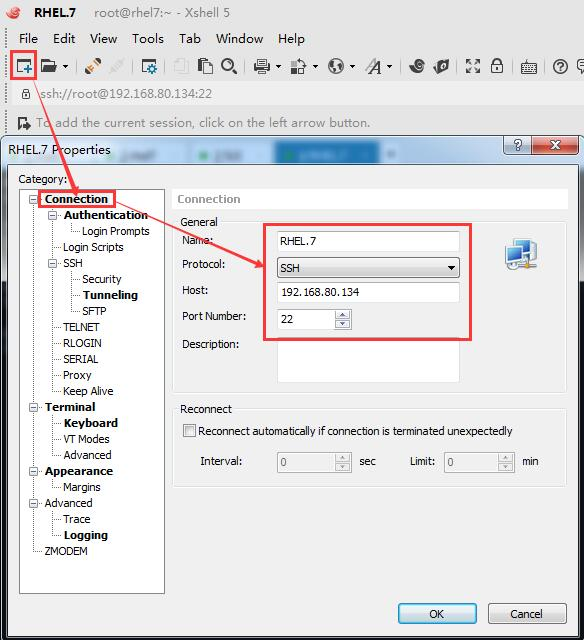

# SSH远程登录安全管理规范

目的：为了保证服务器的远程登录安全，制定如下操作规范。

适用：本规范适用于CentOS Linux 7.X系列，RHEL 7.X系列服务器。


## 1. 备份SSH配置文件

```shell
[root@centos7 ~]# cp /etc/ssh/sshd_config /etc/ssh/sshd_config.bak
```

## 2. 采用Protocol 2安全协议

Protocol 2安全性要高于Protocol 1，现打开Protocol 2安全协议，禁止Protocol 1，修改方法如下 ：

```shell
[root@centos7 ~]# grep -i protocol /etc/ssh/sshd_config
# The default requires explicit activation of protocol 1
#Protocol 2
# HostKey for protocol version 1
# HostKeys for protocol version 2
# similar for protocol version 2
[root@centos7 ~]# sed -i 's/\#Protocol 2/Protocol 2/g' /etc/ssh/sshd_config
[root@centos7 ~]# grep -i protocol /etc/ssh/sshd_config
# The default requires explicit activation of protocol 1
Protocol 2
# HostKey for protocol version 1
# HostKeys for protocol version 2
# similar for protocol version 2
```

## 3. 默认端口设定为52022

 Linux下SSH默认监听连接端口是22，攻击者使用端口扫描软件就可以看到主机是否运行有SSH服务，将SSH端口修改为大于1024的端口是一个明智的选择，因为大多数端口扫描软件（包括nmap）默认情况都不扫描高位端口。

为了安全考虑，更改默认的22端口为5位以上陌生端口，一般设置大于40000，现修改为52022，修改方法如下 ：

 

第1步：把22端口和52022端口都打开，

```shell
[root@centos7 ~]# grep -i port /etc/ssh/sshd_config
# If you want to change the port on a SELinux system, you have to tell
# semanage port -a -t ssh_port_t -p tcp #PORTNUMBER
#Port 22
# WARNING: 'UsePAM no' is not supported in Red Hat Enterprise Linux and may cause several
#GatewayPorts no
[root@centos7 ~]# sed -i '/\#Port 22/a\Port 22' /etc/ssh/sshd_config
[root@centos7 ~]# sed -i '/\#Port 22/a\Port 52022' /etc/ssh/sshd_config
[root@centos7 ~]# grep -i port /etc/ssh/sshd_config
# If you want to change the port on a SELinux system, you have to tell
# semanage port -a -t ssh_port_t -p tcp #PORTNUMBER
#Port 22
Port 52022
Port 22
# WARNING: 'UsePAM no' is not supported in Red Hat Enterprise Linux and may cause several
#GatewayPorts no
[root@centos7 ~]# systemctl restart sshd
[root@centos7 ~]# systemctl reload sshd
```

​       

第2步：加入防火墙规则，

```shell
[root@centos7 ~]# firewall-cmd --state
running
[root@centos7 ~]# firewall-cmd --permanent --list-port
[root@centos7 ~]# firewall-cmd --permanent --zone=public --add-port=52022/tcp
success
[root@centos7 ~]# firewall-cmd --reload		#或systemctl restart firewalld 或 systemctl reload firewalld
success
[root@centos7 ~]# firewall-cmd --state
running
[root@centos7 ~]# firewall-cmd --permanent --list-port
52022/tcp
```

第3步：阿里云端-->安全组策略-->入方向--允许52022端口；

```shell
允许	自定义 TCP	52022/52022	地址段访问	0.0.0.0/0	-   1   
```

第4步：通过Xshell连接工具连一下52022，确认可以连接成功，然后再把22端口关掉，

```shell
[root@centos7 ~]# sed -i 's/Port 22/\#Port 22/g' /etc/ssh/sshd_config
[root@centos7 ~]# grep -i port /etc/ssh/sshd_config
[root@centos7 ~]# systemctl restart sshd
[root@centos7 ~]# systemctl reload sshd
[root@centos7 ~]# firewall-cmd --reload

#注：Ubuntu的稍有不同，sudo su, apt-get update, apt-get install openssh-server -y, vim /etc/ssh/sshd_config, service ssh reload, service ssh restart，是ssh不是sshd。
sudo apt-get update

sudo apt-get install openssh-server -y

sudo vim /etc/ssh/sshd_config

在配置文任意同

service ssh reload
```

第5步：阿里云端-->安全组策略-->入方向--拒绝22端口；

```shell
拒绝	自定义 TCP	22/22	地址段访问	0.0.0.0/0	-   1   
```

apt-get install openssh-client

## 4. 采用密钥登录，禁止密码登录

我们一般使用Xshell等SSH 客户端用密码来远程管理Linux 服务器。但是，一般的密码方式登录，容易有密码被暴力破解的问题。有一个更好的办法来保证安全，让你可以放心地用账户从远程登录——那就是通过密钥方式登录。

密钥形式登录的原理是：利用密钥生成器制作一对密钥：一只公钥和一只私钥。将公钥添加到服务器的某个账户上，然后在客户端利用私钥即可完成认证并登录。

### 4.1 配置密钥登录

第1步：在服务器上制作密钥对：

SSH用密码登录到你打算使用密钥登录的账户，然后执行以下命令生成公钥和私钥，

此时在/root/.ssh/目录下生成了2个文件，id_rsa为私钥，id_rsa.pub为公钥。
私钥自己下载到本地电脑妥善保存（丢了服务器可就没法再登陆了），为安全，建议删除服务器端的私钥，公钥则可公开：

注意：

密钥保存在家目录的.ssh目录，root的在/root/.ssh，一般用户比如用户student的密钥在/home/student/.ssh目录里面。

每个用户要用自己的密钥，无法使用其他用户的密钥。

```shell
[root@centos7 ~]# ssh-keygen -t rsa
Generating public/private rsa key pair.
Enter file in which to save the key (/root/.ssh/id_rsa): 
/root/.ssh/id_rsa already exists.
Overwrite (y/n)? y
Enter passphrase (empty for no passphrase): 
Enter same passphrase again: 
Your identification has been saved in /root/.ssh/id_rsa.
Your public key has been saved in /root/.ssh/id_rsa.pub.
The key fingerprint is:
8e:29:bc:85:af:e9:72:02:43:08:2f:4b:f2:8d:2a:d6 root@centos7
The key's randomart image is:
+--[ RSA 2048]----+
|                 |
|.                |
|o.               |
|+o.              |
|++ o    S        |
|+ o... +         |
| +. + + .        |
|o.oE.*           |
|o  ==..          |
+-----------------+
[root@centos7 ~]# ls /root/.ssh 		
id_rsa  id_rsa.pub  known_hosts
```

​       

第2步：保存公钥和私钥

公钥：

将生成的公钥id_rsa.pub追加到服务器本身的authorized_keys中，为了确保连接成功，请保证以下文件权限正确：

```shell
[root@centos7 .ssh]# pwd
/root/.ssh
[root@centos7 ~]# ls
id_rsa  id_rsa.pub  known_hosts
[root@centos7 .ssh]# cat id_rsa.pub >> authorized_keys
[root@centos7 .ssh]# ls
authorized_keys  id_rsa  id_rsa.pub  known_hosts
```

为了确保连接成功，请保证以下文件权限正确：

```shell
[root@centos7 .ssh]# ls -l
total 16
-rw-r--r-- 1 root root  394 Apr  1 11:02 authorized_keys
-rw------- 1 root root 1679 Apr  1 10:51 id_rsa
-rw-r--r-- 1 root root  394 Apr  1 10:51 id_rsa.pub
-rw-r--r-- 1 root root  708 Mar 31 17:30 known_hosts
[root@centos7 .ssh]# chmod 600 authorized_keys
[root@centos7 .ssh]# ls -l
total 16
-rw------- 1 root root  394 Apr  1 11:02 authorized_keys
-rw------- 1 root root 1679 Apr  1 10:51 id_rsa
-rw-r--r-- 1 root root  394 Apr  1 10:51 id_rsa.pub
-rw-r--r-- 1 root root  708 Mar 31 17:30 known_hosts
[root@centos7 .ssh]# chmod 700 ~/.ssh
[root@centos7 .ssh]# ls -ld ~/.ssh
drwx------ 2 root root 80 Apr  1 11:02 /root/.ssh
```

私钥：

将生成的私钥id_rsa通过Xshell下载到windows的C:\Users\用户名\\.ssh文件夹中，

为了防止私钥因为自己的windows电脑意外故障等原因可能 引起的私钥丢失，可把私钥改名后放到邮箱中保存。


​        

第3步：设置 SSH，打开密钥登录功能

查看 /etc/ssh/sshd_config 文件，确保符合以下3点：

AuthorizedKeysFile	.ssh/authorized_keys

RSAAuthentication yes
PubkeyAuthentication yes

```shell
[root@centos7 ~]# grep -i AuthorizedKeysFile /etc/ssh/sshd_config
AuthorizedKeysFile	.ssh/authorized_keys
[root@centos7 ~]# grep -i RSAAuthentication /etc/ssh/sshd_config
#RSAAuthentication yes
#RhostsRSAAuthentication no
# RhostsRSAAuthentication and HostbasedAuthentication
[root@centos7 ~]# sed -i 's/\#RSAAuthentication/RSAAuthentication/g' /etc/ssh/sshd_config
[root@centos7 ~]# grep -i RSAAuthentication /etc/ssh/sshd_config
RSAAuthentication yes
#RhostsRSAAuthentication no
# RhostsRSAAuthentication and HostbasedAuthentication
[root@centos7 ~]# grep -i PubkeyAuthentication /etc/ssh/sshd_config
#PubkeyAuthentication yes
[root@centos7 ~]# sed -i 's/\#PubkeyAuthentication/PubkeyAuthentication/g' /etc/ssh/sshd_config
[root@centos7 ~]# grep -i PubkeyAuthentication /etc/ssh/sshd_config
PubkeyAuthentication yes
[root@centos7 ~]# systemctl restart sshd
[root@centos7 ~]# systemctl reload sshd
```

​    

第4步：SSH客户端导入私钥，并进行加密，


​      

第5步：SSH客户端用密钥安全登录

打开Xshell，点击“New”按钮，弹出“New Session Properties”对话框，在“Connection”栏目中，输入刚刚配置好公钥(Public Key)的IP地址和端口，如下图所示：




   

### 4.2 禁止密码登录

在你使用SSH Key密钥登录验证成功后，还是为了安全，建议你关闭用户使用密码登陆，关闭的方法如下：
PasswordAuthentication yes
修改为：
PasswordAuthentication no
保存后重启SSH服务。

```shell
[root@centos7 ~]# grep -i PasswordAuthentication /etc/ssh/sshd_config
PasswordAuthentication yes
[root@centos7 ~]# sed -i 's/PasswordAuthentication yes/PasswordAuthentication no/' /etc/ssh/sshd_config
[root@centos7 ~]# grep -i PasswordAuthentication /etc/ssh/sshd_config
PasswordAuthentication no
[root@centos7 ~]# systemctl restart sshd
[root@centos7 ~]# systemctl reload sshd
```

​        

## 5. 生产环境不允许root用户远程登录

为保证安全，生产机器禁止root用户远程SSH登录，

```shell
[root@centos7 ~]# grep -i PermitRootLogin /etc/ssh/sshd_config
PermitRootLogin yes
[root@centos7 ~]# sed -i 's/PermitRootLogin yes/PermitRootLogin no/' /etc/ssh/sshd_config
[root@centos7 ~]# grep -i PermitRootLogin /etc/ssh/sshd_config
PermitRootLogin no
[root@centos7 ~]# systemctl restart sshd
[root@centos7 ~]# systemctl reload sshd
```

​       

好了，至此只要你保存好你的私钥（为安全，建议删除服务器端的私钥），你的服务器相比原来使用密码登陆来说已经安全多了。

## 6. Ubuntu 的SSH和IP配置

```shell
# 对于Ubuntu 16来说，
Ubuntu系统进行网络配置涉及到几个配置文件
1./etc/network/interfaces 
2./etc/resolv.conf
3.安装openssh-server
操纵步骤：
1.打开ubuntu的/etc/network/interfaces文件默认的内容如下：
auto 
iface lo inet loopback
动态获取的配置方法：
auto ens160	#不同于rhel的eth0,ubuntu的是ens160，
如hsj@ubuntu:~$ ls /proc/sys/net/ipv4/conf
all  default  ens160  lo
iface ens160 inet dhcp
静态分配的配置方法：
auto ens160
iface ens160 inet static
address 192.168.30.137
netmask  255.255.255.0
gateway  192.168.30.1（根据你的网络设置）
根据配置要求（是动态分配还是自动获取）修改该配置文件保存。

2.添加域名服务器：在/etc/resolv.conf文件中追加
nameserver 8.8.8.8（可以改成离你最近的域名服务器）
重启下网络
$systemctl restart networking(这条命令是重启网卡)

查看网络配置的参数是不是正确（每进行一次操作都可以查看一下是不是修改了网络配置）
$ifconfig

看看是不是能够ping通
ping不通网关说明网络配置有问题 ping不通域名说明dns有问题
3. 如果要远程桌面连接，则需要安装openssh，
sudo apt-get update
sudo apt-get install openssh-server -y
sudo netstat -luntpa | grep sshd
```


## 7. Linux下ssh高级使用–免密登录

### **1.Linux下生成密钥**

ssh-keygen的命令手册，可通过”man ssh-keygen“命令：

```shell
[trade@web02 ~]$ man ssh-keygen
```

通过命令”ssh-keygen -t rsa“			#这里的-t 是type的意思，-t rsa加不加都行，不加自动默认

```shell
[trade@web02 ~]$ ssh-keygen -t rsa
或者
[trade@web02 ~]$ ssh-keygen
```


生成之后会在用户的根目录生成一个 “.ssh”的目录

```shell
[trade@web02 ~]$ ll -d .ssh
drwx------ 2 trade trade 4096 Jun  3 00:08 .ssh
[trade@web02 ~]$ ll .ssh
total 12
-rw------- 1 trade trade 1675 Jun  3 00:08 id_rsa
-rw-r--r-- 1 trade trade  393 Jun  3 00:08 id_rsa.pub
-rw-r--r-- 1 trade trade 2356 May 24 23:27 known_hosts
[trade@web02 ~]$ pwd
/home/trade
```


进入“.ssh”目录，新建一个文件authorized_keys，

```shell
[trade@web02 .ssh]$ ll
total 12
-rw------- 1 trade trade 1675 Jun  3 00:08 id_rsa
-rw-r--r-- 1 trade trade  393 Jun  3 00:08 id_rsa.pub
-rw-r--r-- 1 trade trade 2356 May 24 23:27 known_hosts
[trade@web02 .ssh]$ touch authorized_keys
[trade@web02 .ssh]$ ll
total 12
-rw-rw-r-- 1 trade trade    0 Jun  3 00:32 authorized_keys
-rw------- 1 trade trade 1675 Jun  3 00:08 id_rsa
-rw-r--r-- 1 trade trade  393 Jun  3 00:08 id_rsa.pub
-rw-r--r-- 1 trade trade 2356 May 24 23:27 known_hosts
[trade@web02 .ssh]$ chmod 600 authorized_keys 
[trade@web02 .ssh]$ ll
total 12
-rw------- 1 trade trade    0 Jun  3 00:32 authorized_keys	#authorized_keys权限600
-rw------- 1 trade trade 1675 Jun  3 00:08 id_rsa
-rw-r--r-- 1 trade trade  393 Jun  3 00:08 id_rsa.pub
-rw-r--r-- 1 trade trade 2356 May 24 23:27 known_hosts
[trade@web02 .ssh]$ pwd
/home/trade/.ssh
[trade@web02 .ssh]$ ll -d ../.ssh
drwx------ 2 trade trade 4096 Jun  3 00:32 ../.ssh		#.ssh目录权限700
```


```
authorized_keys:存放远程免密登录的公钥,主要通过这个文件记录多台机器的公钥

id_rsa : 生成的私钥文件

id_rsa.pub ： 生成的公钥文件

know_hosts : 已知的主机公钥清单

如果希望ssh公钥生效需满足至少下面两个条件：
```

> 1) .ssh目录的权限必须是700             2) .ssh/authorized_keys文件权限必须是600

### **2.远程免密登录**

原理图：


远程免密登录 相当于 把你的公钥 给对方，私钥在你这里， 则你就可以免密钥登录到对方，

常用以下几种方法：

**2.1 通过ssh-copy-id的方式**

> 命令： ssh-copy-id -i ~/.ssh/id_rsa.pub			#-i 即identity_file ，这里加不加都行

举例：

```shell
[trade@web02 .ssh]$ pwd
/home/trade/.ssh
[trade@web02 .ssh]$ ls
authorized_keys  id_rsa  id_rsa.pub  known_hosts
[trade@web02 .ssh]$ ssh-copy-id -i id_rsa.pub trade@192.168.30.4
trade@192.168.30.4's password: 
Now try logging into the machine, with "ssh 'trade@192.168.30.4'", and check in:

  .ssh/authorized_keys

to make sure we haven't added extra keys that you weren't expecting.

[trade@web02 .ssh]$ ssh trade@192.168.30.4			#不用输入密码，直接登录到对方
Last login: Fri Jun  2 23:59:07 2017 from 192.168.40.3
```


```
[root@test .ssh]# ssh-copy-id -i ~/.ssh/id_rsa.pub 192.168.91.135
```

常见错误：

```
[root@test ~]# ssh-copy-id -i ~/.ssh/id_rsa.pub 192.168.91.135
-bash: ssh-copy-id: command not found //提示命令不存在
```

解决办法：yum -y install openssh-clients

**2.2　通过scp将内容写到对方的文件中**

> 命令：scp -p ~/.ssh/id_rsa.pub root@:/root/.ssh/authorized_keys

举例：

```
[root@test .ssh]# scp -p ~/.ssh/id_rsa.pub root@192.168.91.135:/root/.ssh/authorized_keys
 root@192.168.91.135's password:  
id_rsa.pub 100% 408 0.4KB/s 00:00
  
[root@test .ssh]#   
[root@test .ssh]# ssh root@192.168.91.135
Last login: Mon Oct 10 01:27:02 2016 from 192.168.91.133 
[root@localhost ~]# 

```

**2.3 通过Ansible实现批量免密**

2.3.1 将需要做免密操作的机器hosts添加到/etc/ansible/hosts下：

```
[Avoid close]
192.168.91.132
192.168.91.133
192.168.91.134
```

2.3.2 执行命令进行免密操作

> ansible -m authorized_key -a "user=root key='{{ lookup('file','/root/.ssh/id_rsa.pub') }}'" -k

示例：

```
[root@test sshpass-1.05]# ansible test -m authorized_key -a "user=root key='{{ lookup('file','/root/.ssh/id_rsa.pub') }}'" -k 　　
SSH password: ----->输入密码 　　192.168.91.135 | success >>{ 　　
"changed": true,  　　
"key": "ssh-rsa AAAAB3NzaC1yc2EAAAABIwAAAQEArZI4kxlYuw7j1nt5ueIpTPWfGBJoZ8Mb02OJHR8yGW7A3izwT3/uhkK7RkaGavBbAlprp5bxp3i0TyNxa/apBQG5NiqhYO8YCuiGYGsQAGwZCBlNLF3gq1/18B6FV5moE/8yTbFA4dBQahdtVP PejLlSAbb5ZoGK8AtLlcRq49IENoXB99tnFVn3gMM0aX24ido1ZF9RfRWzfYF7bVsLsrIiMPmVNe5KaGL9kZ0svzoZ708yjWQQCEYWp0m+sODbtGPC34HMGAHjFlsC/SJffLuT/ug/hhCJUYeExHIkJF8OyvfC6DeF7ArI6zdKER7D8M0SM　　WQmpKUltj2nltuv3w== root@localhost.localdomain",  
"key_options": null,  　　
"keyfile": "/root/.ssh/authorized_keys",  　　
"manage_dir": true,  　　
"path": null,  　　
"state": "present",  　　
"unique": false,  　　
"user": "root"　　
} 　　
[root@test sshpass-1.05]# 
```

**2.4 手工复制粘贴的方式**

将本地id_rsa.pub文件的内容拷贝至远程服务器的~/.ssh/authorized_keys文件中