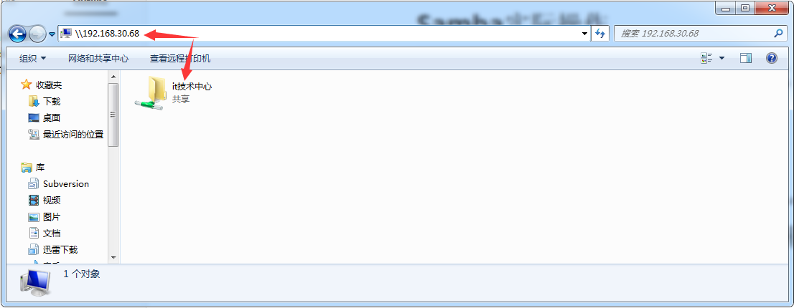

 # Samba实际操作

# 1. windows 登录 samba的方式

```shell
a、win+r 快捷键打开运行窗口，输入 \\ip\目录（其中目录可不写）
\\192.168.126.128

或者 在win+e键 打开 我的电脑，在上面的地址栏中输入 \\192.168.126.128 也是一样的，

但千万不能在浏览器中输入，

b、弹出共享目录，双击它，输入配置的用户名密码，即可操作samba共享的文件。

```




# 2. win7下无法访问smb服务器解决方法

版权声明：本文为博主原创文章，未经博主允许不得转载。

      

  在[Linux](http://lib.csdn.net/base/linux)下将smb服务器设置好之后，在windows下无法访问smb服务器的共享文件夹，如下所示


      默认情况下，windows7无法正常访问NAS或smb服务器上的共享文件夹。原因在于从vista开始，微软默认只采用NTLMv2协议的认证回应消息，而目前的NAS系统和smb还只支持LM和NTLM。

**解决方法：修改本地安全策略**

**     ** 单击“开始”→"运行"，输入secpol.msc后回车打开“本地安全策略”，在"本地安全策略"中依次打开"本地策略"→"安全选项"，然后从右侧列表中找到"网络安全：LAN管理器身份验证级别"，把这个选项的值改为”发送LM和NTLM-如果以协商，则使用NTLMv2会话安全“，最后确定。如下所示：


按上述设置就能解决在windows7上面无法访问smb服务器的问题了。

注：win7家庭版不支持本地安全策略功能，需要升级为旗舰版。


# 3. 添加samba用户

```shell
首先samba用户是系统用户
useradd htdev -s /sbin/nologin
smbpasswd -a htdev
groupadd sysadmin
chown -R htdev.sysadmin /home/xxx
chmod 775 -R /home/xxx
这个的关键是权限。

vim  /etc/samba/smb.conf
[global]
	workgroup = WORKGROUP
	server string = Samba Server Version %v
	config file=/etc/samba/smb.conf.%U
        socket options = TCP_NODELAY SO_RCVBUF=8192 SO_SNDBUF=8192	
;	netbios name = MYSERVER
;	interfaces = lo eth0 192.168.12.2/24 192.168.13.2/24
;	hosts allow = 127. 192.168.12. 192.168.13.
	log file = /var/log/samba/log.%m
	max log size = 20M
	security = user
	username map=/etc/samba/smbusers
	passdb backend = tdbsam

[files]
comment= Master Shared Directory
path=/data/samba/files
public=yes
writable=yes
valid users=sysadmin
browseable=yes

#如下这里是配置两个用户，htdev和sysadmin，注意中间不要加逗号
[htdev]
comment = Shared Folder withusername and password
path = /home/xxx
public = yes
writable = yes
valid users = htdev sysadmin
create mask = 0777
directory mask = 0777
force user = htdev
available = yes
browseable = yes

[root@ELK ~]# cat /etc/samba/smbusers	#把sysadmin写进这个文件中。
sysadmin=system admin
htdev

[root@ELK ~]# service nmb restart
service smb restart
/usr/sbin/smbd restart
/etc/rc.d/init.d/nmb restart
/etc/rc.d/init.d/smb restart


```

