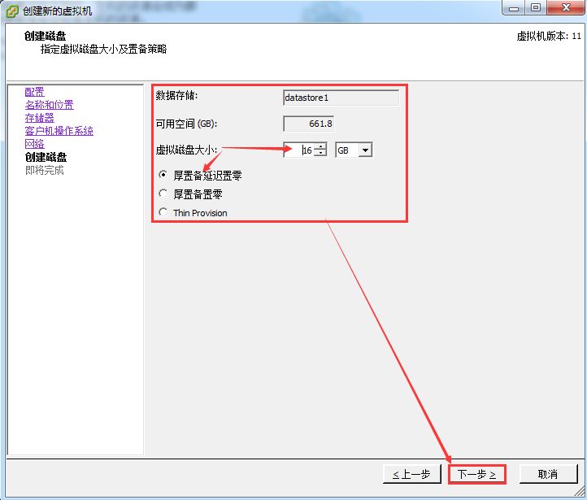
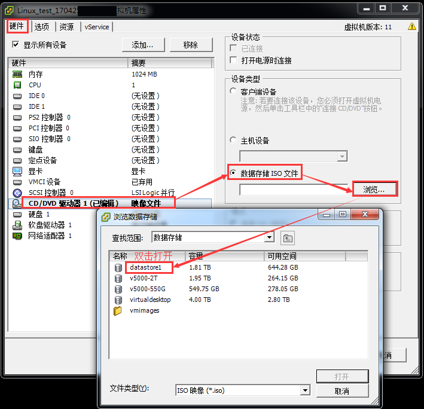

# VMware vSphere Client创建虚拟机

# 1. VMware vSphere简介

```shell
VMware vSphere 是业界领先且最可靠的虚拟化平台。vSphere将应用程序和操作系统从底层硬件分离出来，从而简化了 IT操作。您现有的应用程序可以看到专有资源，而您的服务器则可以作为资源池进行管理。因此，您的业务将在简化但恢复能力极强的 IT 环境中运行。
VMware vSphere 的核心部件ESXi与Citrix 的XenServer 相似，它是一款可以独立安装和运行在祼机上的系统，因此与其他我们以往见过的VMware Workstation 软件不同的是它不再依存于宿主操作系统之上。在ESXi安装好以后，我们可以通过vSphere Client 远程连接控制，在ESXi 服务器上创建多个VM（虚拟机），在为这些虚拟机安装好Linux /Windows Server 系统使之成为能提供各种网络应用服务的虚拟服务器，ESXi 也是从内核级支持硬件虚拟化，运行于其中的虚拟服务器在性能与稳定性上不亚于普通的硬件服务器，而且更易于管理维护。
```

# 2. 安装和连接

- 双击VMware vSphere安装客户软件进行安装，


- 安装好后双击客户端图标打开，


- 输入IP，用户名和密码登录进去，

  


- 点击主机和群集--》可以看到所有的主机和虚拟机--》前2个是真实的物理机--》点击其中一个物理机--》可以物理机的配置和使用情况，

  


# 3. 新建虚拟机

- 右键HT或菜单中的 文件--》新建--》虚拟机，

  

  ​


- 典型，

  

- 输入虚拟机的名称，自定义，如Linux_test_170425，

  

- 集群，

  

- 选择相应的主机，下面列表中有2个主机是真实的物理机，

  

- 选择相应的系统及版本，

  

- 网卡数量及型号选择，

  

- 配置相应的磁盘及容量，

  ```shell
  VMware ESXi 虚拟硬盘格式:厚置备延迟置零、厚置备置零、精简置备
  创建磁盘时，会进行两个操作：分配空间、置零
  #1、厚置备延迟置零：
  默认的创建格式，创建磁盘时，直接从磁盘分配空间，但对磁盘保留数据不置零。所以当有I/O操作时，只需要做置零的操作。
  磁盘性能较好，时间短，适合于做池模式的虚拟桌面
  #2、厚置备置零（thick）：
  创建群集功能的磁盘。创建磁盘时，直接从磁盘分配空间，并对磁盘保留数据置零。所以当有I/O操作时，不需要等待直接执行。
  磁盘性能最好，时间长，适合于做跑运行繁重应用业务的虚拟机
  #3、精简置备（thin）：
  创建磁盘时，占用磁盘的空间大小根据实际使用量计算，即用多少分多少，提前不分配空间，对磁盘保留数据不置零，且最大不超过划分磁盘的大小。
  所以当有I/O操作时，需要先分配空间，在将空间置零，才能执行I/O操作。当有频繁I/O操作时，磁盘性能会有所下降
  I/O不频繁时，磁盘性能较好；I/O频繁时，磁盘性能较差。时间短，适合于对磁盘I/O不频繁的业务应用虚拟机
  ```

  

  - 对虚拟机进行配置，

  

- 对内存 ，CPU，硬盘的大小进行设置，

  

  

- 左下角可以看到虚拟机创建完成，

  

- 选择新建的虚拟机--》右键--》编辑设置，

  

- 对虚拟机的名称重新设定一下，

  

- 添加系统的镜像文件，并根据需要对内存/CPU/硬盘大小等进行调整，注：前提条件是虚拟机处于关机，




- 开启虚拟机电源，首次安装时--》可以右键打开控制台--》断开原有ISO连接后--》也可以从本地电脑加载系统镜像，

  


# 4. 安装系统

- 打开控制台--》打开电源--》Install or upgrade an existing system，即可进行系统的安装，具体的安装这里不作具体介绍。


- 如果是Minimal 最小化安装，则需要配置一下相应的网络，

  ​

  ```shell
  # 对于CentOS 6.5，

  [root@localhost ~]# cd /etc/sysconfig/network-scripts
  [root@localhost network-scripts]# ls
  ifcfg-eth0  ifdown-bnep  ifdown-ipv6  ifdown-ppp     ifdown-tunnel  ifup-bnep  ifup-ipv6  ifup-plusb  ifup-routes  ifup-wireless     network-functions
  ifcfg-lo    ifdown-eth   ifdown-isdn  ifdown-routes  ifup           ifup-eth   ifup-isdn  ifup-post   ifup-sit     init.ipv6-global  network-functions-ipv6
  ifdown      ifdown-ippp  ifdown-post  ifdown-sit     ifup-aliases   ifup-ippp  ifup-plip  ifup-ppp    ifup-tunnel  net.hotplug

  [root@localhost network-scripts]# cat ifcfg-eth0 
  DEVICE=eth0
  HWADDR=00:50:56:93:7F:97
  TYPE=Ethernet
  UUID=c8f7cb9c-8d44-47f5-8808-d2d8a7229e3a
  ONBOOT=yes
  NM_CONTROLLED=no
  BOOTPROTO=static
  IPADDR=192.168.30.210
  GATEWAY=192.168.30.1
  NETMASK=255.255.255.0
  DNS1=8.8.8.8

  [root@localhost ~]# cat /etc/resolv.conf 
  #nameserver 210.22.70.3
  #nameserver 114.114.114.114
  nameserver 8.8.8.8

  [root@localhost ~]# service network start

  [root@localhost ~]# ifconfig 
  eth0      Link encap:Ethernet  HWaddr 00:50:56:93:7F:97  
            inet addr:192.168.30.210  Bcast:192.168.30.255  Mask:255.255.255.0
            inet6 addr: fe80::250:56ff:fe93:7f97/64 Scope:Link
            UP BROADCAST RUNNING MULTICAST  MTU:1500  Metric:1
            RX packets:776 errors:0 dropped:0 overruns:0 frame:0
            TX packets:319 errors:0 dropped:0 overruns:0 carrier:0
            collisions:0 txqueuelen:1000 
            RX bytes:66888 (65.3 KiB)  TX bytes:50271 (49.0 KiB)

  lo        Link encap:Local Loopback  
            inet addr:127.0.0.1  Mask:255.0.0.0
            inet6 addr: ::1/128 Scope:Host
            UP LOOPBACK RUNNING  MTU:16436  Metric:1
            RX packets:12 errors:0 dropped:0 overruns:0 frame:0
            TX packets:12 errors:0 dropped:0 overruns:0 carrier:0
            collisions:0 txqueuelen:0 
            RX bytes:980 (980.0 b)  TX bytes:980 (980.0 b)
  ```

  ​

  ```shell
  # 对于Ubuntu 16来说，
  Ubuntu系统进行网络配置涉及到几个配置文件
  1./etc/network/interfaces 
  2./etc/resolv.conf
  3.安装openssh-server
  操纵步骤：
  1.打开ubuntu的/etc/network/interfaces文件默认的内容如下：
  auto 
  iface lo inet loopback
  动态获取的配置方法：
  auto ens160	#不同于rhel的eth0,ubuntu的是ens160，
  如hsj@ubuntu:~$ ls /proc/sys/net/ipv4/conf
  all  default  ens160  lo
  iface ens160 inet dhcp
  静态分配的配置方法：
  auto ens160
  iface ens160 inet static
  address 192.168.30.137
  netmask  255.255.255.0
  gateway  192.168.30.1（根据你的网络设置）
  根据配置要求（是动态分配还是自动获取）修改该配置文件保存。

  2.添加域名服务器：在/etc/resolv.conf文件中追加
  nameserver 8.8.8.8（可以改成离你最近的域名服务器）
  重启下网络
  $systemctl restart networking(这条命令是重启网卡)

  查看网络配置的参数是不是正确（每进行一次操作都可以查看一下是不是修改了网络配置）
  $ifconfig

  看看是不是能够ping通
  ping不通网关说明网络配置有问题 ping不通域名说明dns有问题
  3. 如果要远程桌面连接，则需要安装openssh，
  sudo apt-get update
  sudo apt-get install openssh-server -y
  sudo ntstat -luntpa | grep sshd
  ```

  ​

# 5. 快照管理

- 选择要做快照的虚拟机--》右键--》打开控制台--》对该虚拟机执行快照，


- 打开快照管理器，可以对快照进行管理，


# 6.  存储管理

- 主页--》清单--》数据存储和数据存储群集，可以对存储上的文件进行上传和下载，


