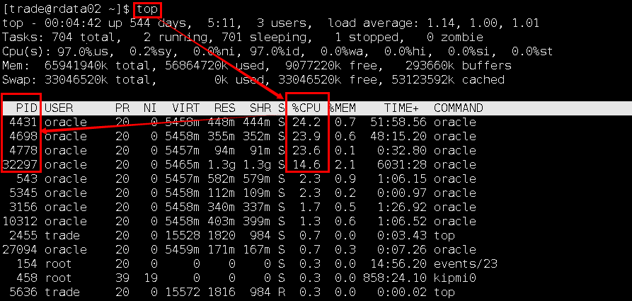
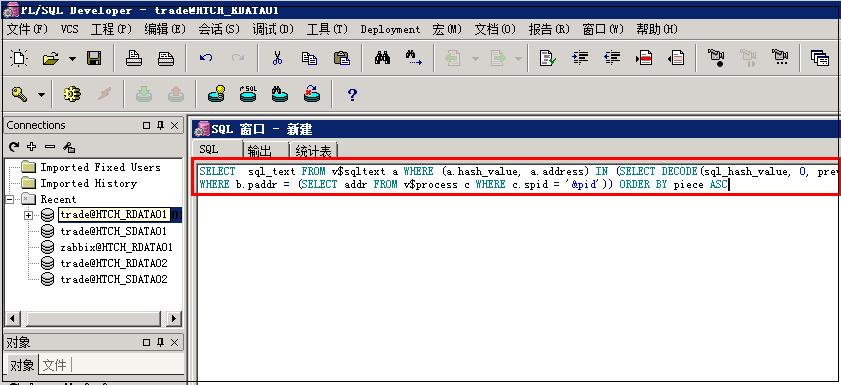
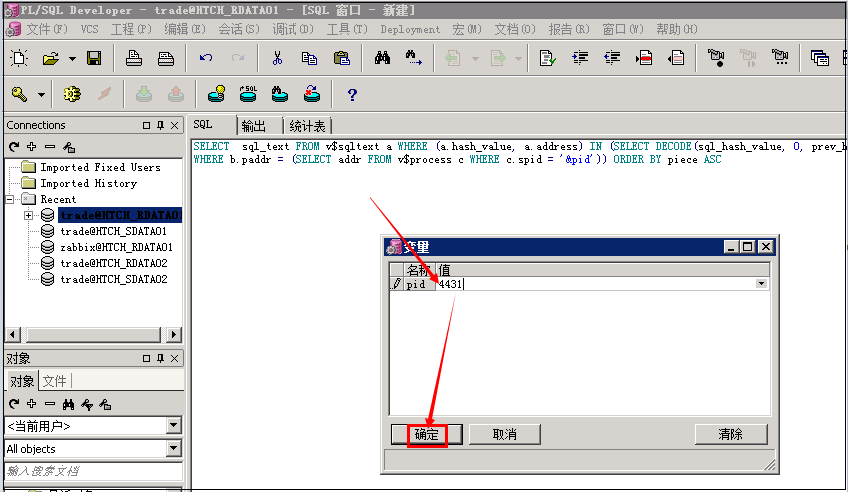
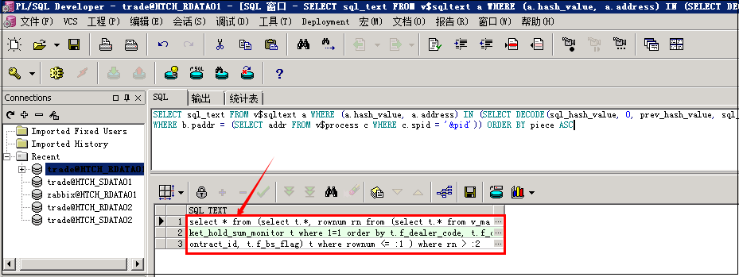
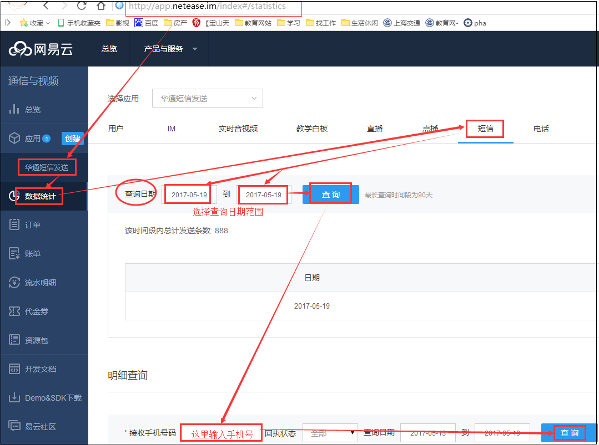
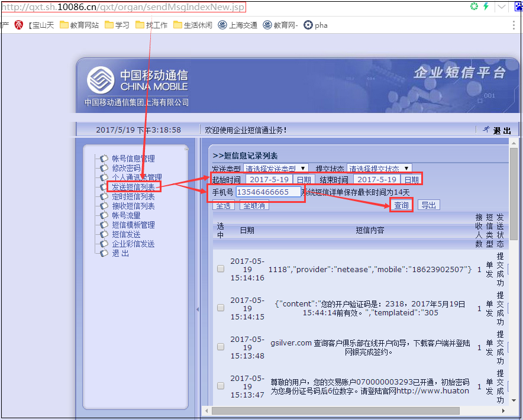

# Zabbix 监控问题处理

# 1. rdata01 CPU高于90%

- 问题描述，

```shell
告警主机:htch_rdata01 主机IP： 192.168.30.166 问题详情:5 min cpu使用率:76.131659 当前状态:OK:76.131659 告警恢复时间:2017.05.02 20:25:23
```

## 1.1 前置rweb03 停orgweb

- 停止机构后台进程 tomcat_orgweb 

```shell
[trade@rweb03 tomcat_orgweb]$ pwd
/data/trade/www/tomcat_orgweb
[trade@rweb03 tomcat_orgweb]$ ps -ef | grep tomcat_orgweb
[trade@rweb03 tomcat_orgweb]$ kill -9 16165
```

- 23：00启动 tomcat_orgweb，

```shell
[trade@rweb03 bin]$ pwd
/data/trade/www/tomcat_orgweb/bin
[trade@rweb03 bin]$ ./startup.sh 
```

## 1.2 核心rtrade01 停启orgmanageserver

- 先停止orgmanageserver，然后再启动orgmanageserver，

```shell
[trade@rtrade01 orgmanageserver]$ pwd
/data/trade/app/orgmanageserver
[trade@rtrade01 orgmanageserver]$ ps -ef | grep orgmanageserver
[trade@rtrade01 orgmanageserver]$ kill -9 21905
[trade@rtrade01 orgmanageserver]$ ps -ef | grep orgmanageserver
[trade@rtrade01 orgmanageserver]$ sh start.sh
```

## 1.3 数据库rdata01 杀掉含select进程

- **杀掉几个含select语句的进程：**


- rdata01服务器--》top--》大P--》查看cpu最高的几个进程如4431，



- PL/SQL登录rdata01的Oracle数据库--》执行以下语句

```plsql
SELECT sql_text FROM v$sqltext a WHERE (a.hash_value, a.address) IN (SELECT DECODE(sql_hash_value, 0, prev_hash_value, sql_hash_value), DECODE(sql_hash_value, 0, prev_sql_addr, sql_address) FROM v$session b
WHERE b.paddr = (SELECT addr FROM v$process c WHERE c.spid = '&pid')) ORDER BY piece ASC
```



- --》输入PID：4431--》得到查询结果：进程4431是select进程在占用





- 将此4431进程kill掉--》top--》大P以及Zabbix再次查看CPU使用率，
- 这里一般要多查询和kill掉几个含select的进程。

```shell
[trade@rdata02 ~]$ kill -9 4431
[trade@rdata02 ~]$ top
```


# 2. rweb02之/data内存不足10%

- 问题描述：

```shell
告警主机:htch_rweb02 主机IP： 192.168.10.166 问题详情:Free disk space on /data (percentage):40.57 % 当前状态:OK:40.57 % 告警恢复时间:2017.05.02 19:50:43
```

- 查看/data的使用率已经达到90%，

```shell
[trade@rweb02 ~]$ df -h
Filesystem            Size  Used Avail Use% Mounted on
/dev/mapper/VolGroup-lv_root
                       50G  4.7G   43G  10% /
tmpfs                 7.8G     0  7.8G   0% /dev/shm
/dev/sda1             485M   32M  428M   7% /boot
/dev/mapper/VolGroup-lv_home
                      218G  196G  22G  90% /data
```

- 删除几个大的旧的日志文件，

```shell
[trade@rweb02 logs]$ pwd
/data/trade/www/tomcat7_trade/logs
[trade@rweb02 logs]$ du -sh *
[trade@rweb02 logs]$ rm -rf tradeweb.2017-04-21.log
[trade@rweb02 logs]$ rm -rf tradeweb.2017-04-22.log
[trade@rweb02 logs]$ rm -rf tradeweb.2017-04-23.log
[trade@rweb02 logs]$ rm -rf tradeweb.2017-04-24.log
[trade@rweb02 logs]$ rm -rf tradeweb.2017-04-25.log
```

- 再次df -h查看/data的使用率，

```shell
[trade@rweb02 ~]$ df -h
```

# 3. 网站流量持续过大

- 问题描述：流量过大持续3，5分钟没什么，

```shell
告警主机:hillstone02 主机IP： 172.20.100.21 告警等级:Average 告警信息: 入站流量超过专线总带宽的100% 问题详情:入站流量 ethernet0/1:63.54 Mbps 当前状态:PROBLEM:63.54 Mbps 告警时间:2017.05.08 16:01:23
```

若持续时间长，则需要**关闭模拟盘的前置的sweb01，sweb02的tradeweb**，然后在闭市以后比如凌晨2：40再开启。

## 3.1 关模拟盘前置sweb的tradeweb

```shell
cd /data/trade/www/tomcat7_trade/webapps
ps -ef | grep tomcat7_trade
[trade@sweb01 webapps]$ kill -9 24962
```

## 3.2 开模拟盘前置sweb的tradeweb

```shell
[trade@sweb02 bin]$ pwd
/data/trade/www/tomcat_trade/bin
[trade@sweb02 bin]$ ./startup.sh 
[trade@sweb02 logs]$ pwd
/data/trade/www/tomcat_trade/logs
[trade@sweb02 logs]$ ps -ef | grep tomcat7_trade
[trade@sweb02 logs]$ tailf catalina.out 
# 看一下是否有启动成功的标志 startup.
```

## 3.3 关闭模拟盘与实盘的行情同步

sweb01,sweb02通过tradeweb的app配置文件中的synorder.enable=0或1来打开或关闭同步实盘的行情


# 4. 手机端出入金空白

查询数据库--》查询bankprocessor的日志--》查询tradeserver的日志--》查询tradeweb的页面是否可以访问

# 5. 收不到验证码

--》对于开户查smsserver日志是否有手机号和是否发送成功，

```shell
[trade@rtrade01 logs]$ pwd
/data/trade/app/smsserver/logs
```

--》如果发送成功，则登录网易和移动端查看，

```shell
短信平台
网易 app.netease.im/login	13636458912 wydx2017
移动 qxt.sh.10086.cn/qxt/index.jsp	10657109031430007	admin_007sp  sp@ht2017
```





