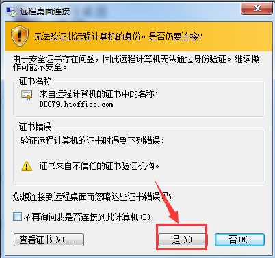

# 1. 工具集合

## 1.1 查看设备ID

```shell
[root@localhost ~]# blkid
```

## 1.2 查看md5值

```shell
[root@stu25 ~]# md5sum deepin-15.3-amd64.iso   #查看md5值。
```

## 1.3 文件查看工具

```shell
Notepad++，Editplus
```


```shell

http://linuxtools-rst.readthedocs.io/zh_CN/latest/index.html
```

## 1.4 cut, find, xargs, scp, lvm

cut

```shell
[student@centos7bak ~]$ cut -d " " -f 2- test     #第2列到最后一列，-表示到最后
```

find

```shell
#特别注意：一定要带-print，因为-print代表的是true，不然下面的find结果虽然排除的/home，但依然会把/home的大小查找并打印出来。
[root@localhost /]# find / -size +100M -type f | xargs du -sh
[root@localhost /]# find / -path /home -prune -o -type f -size +100M -print  #排除/home目录，方法是要在排除的目录前面加-path，后面加-prune和-o，其中-prune代表排除，-o 是-or的意思也必须加，可以加引号“/home”但/home不能写成/home/否则不起作用。
[root@localhost /]# find / \( -path /home -o -path /root \) -prune -o -type f -size +100M -print	#\是转义，
[root@localhost /]# find / \( -path “/home” -o -path “/root” \) -prune -o -type f -size +100M -print	#\是转义，\( -path 中间有空格，

find . -name appConfig.properties | xargs sed -i 's/strade01:61616/strade02:61616/g'
find . -name appConfig.properties | xargs sed -i 's/^env.idcard/\#env.idcard/g'
find . -name appConfig.properties | xargs grep ^env.idcard
Linux下find命令详解

[日期：2011-08-14]	来源：Linux社区  作者：Linux	[字体：大 中 小]
Linux中find常见用法示例·
find    path    -option    [    -print ]    [ -exec    -ok    command ]    {} \;

#-print 将查找到的文件输出到标准输出
#-exec    command    {} \;       -----将查到的文件执行command操作,{} 和 \;之间有空格
#-ok 和-exec相同，只不过在操作前要询用户
-name    filename               #查找名为filename的文件
-perm                         #按执行权限来查找
-user     username              #按文件属主来查找
-group groupname              #按组来查找
-mtime    -n +n                 #按文件更改时间来查找文件，-n指n天以内，+n指n天以前
-atime     -n +n                #按文件访问时间来查GIN: 0px">-perm                          #按执行权限来查找
-user     username              #按文件属主来查找
-group groupname              #按组来查找
-mtime    -n +n                 #按文件更改时间来查找文件，-n指n天以内，+n指n天以前
-atime     -n +n                #按文件访问时间来查找文件，-n指n天以内，+n指n天以前 
-ctime     -n +n                #按文件创建时间来查找文件，-n指n天以内，+n指n天以前 
-nogroup                      #查无有效属组的文件，即文件的属组在/etc/groups中不存在
-nouser                       #查无有效属主的文件，即文件的属主在/etc/passwd中不存
-newer    f1 !f2                找文件，-n指n天以内，+n指n天以前 
-ctime     -n +n                #按文件创建时间来查找文件，-n指n天以内，+n指n天以前 
-nogroup                      #查无有效属组的文件，即文件的属组在/etc/groups中不存在
-nouser                       #查无有效属主的文件，即文件的属主在/etc/passwd中不存
-newer    f1 !f2                #查更改时间比f1新但比f2旧的文件
-type      b/d/c/p/l/f          #查是块设备、目录、字符设备、管道、符号链接、普通文件
-size       n[c]                #查长度为n块[或n字节]的文件
-depth                        #使查找在进入子目录前先行查找完本目录
-fstype                       #查更改时间比f1新但比f2旧的文件
-mount                        #查文件时不跨越文件系统mount点
-follow                       #如果遇到符号链接文件，就跟踪链接所指的文件
-cpio                         #对匹配的文件使用cpio命令，将他们备份到磁带设备中
-prune                        #忽略某个目录

《Linux下find命令实例》见 http://www.linuxidc.com/Linux/2011-08/40670.htm。

1)在/tmp中查找所有的*.h，并在这些文件中查找“SYSCALL_VECTOR"，最后打印出所有包含"SYSCALL_VECTOR"的文件名
A) find    /tmp    -name    "*.h"    | xargs    -n50    grep SYSCALL_VECTOR
B) grep    SYSCALL_VECTOR    /tmp/*.h | cut     -d':'    -f1| uniq > filename
C) find    /tmp    -name "*.h"    -exec grep "SYSCALL_VECTOR"    {}    \; -print

2)find / -name filename -exec rm -rf {} \;
     find / -name filename -ok rm -rf {} \;

3)比如要查找磁盘中大于3M的文件：
find . -size +3000k -exec ls -ld {} ;

4)将find出来的东西拷到另一个地方
find *.c -exec cp '{}' /tmp ';'
如果有特殊文件，可以用cpio，也可以用这样的语法：
find dir -name filename -print | cpio -pdv newdir

6)查找2004-11-30 16:36:37时更改过的文件
# A=`find ./ -name "*php"` |    ls -l --full-time $A 2>/dev/null | grep "2004-11-30 16:36:37
二、linux下find命令的用法1. 基本用法：
      find / -name 文件名
     find ver1.d ver2.d -name '*.c' -print    查找ver1.d,ver2.d *.c文件并打印
     find . -type d -print 从当前目录查找，仅查找目录，找到后，打印路径名。可用于打印目录结构。
2. 无错误查找：
      find / -name access_log 2 >/dev/null
3. 按尺寸查找：
      find / -size 1500c （查找1,500字节大小的文件，c表示字节）
      find / -size +1500c （查找大于1,500字节大小的文件，+表示大于）    
      find / -size +1500c （查找小于1,500字节大小的文件，-表示小于）    
4. 按时间：
      find / -amin n 最后n分钟 
      find / -atime n 最后n天
      find / -cmin n 最后n分钟改变状态
      find / -ctime n 最后n天改变状态
5. 其它：
      find / -empty 空白文件、空白文件夹、没有子目录的文件夹
      find / -false 查找系统中总是错误的文件
      find / -fstype type 找存在于指定文件系统的文件，如type为ext2
      find / -gid n 组id为n的文件
      find / -group gname 组名为gname的文件
      find / -depth n 在某层指定目录中优先查找文件内容
      find / -maxdepth levels 在某个层次目录中按递减方式查找
6. 逻辑
      -and 条件与 -or 条件或
7. 查找字符串
      find . -name '*.html' -exec grep 'mailto:'{}
```

scp

```shell
[root@redhat6 ~]# scp -r -P 15252 /home/zhongan trade@192.168.30.4:/home    #从本地复制到远程，P大写端口
```

LVM

```shell
1、创建pv：
pvcreate /dev/xvdb1 /dev/xvdc1 /dev/xvdd1
pvdislplay
2、创建vg：
vgcreate VG_0 /dev/xvdb1 /dev/xvdc1 /dev/xvdd1
注：名称VG_0 
3、创建lv：
lvcreate -L 5.8T -n LV_0 VG_0
注：-n lv逻辑卷名称 LV_0
扩展vg：vgextend vg_zabbix /dev/sdb 
扩展lv： lvextend -L +100G /dev/vg_zabbix/lv_root 
4、格式化LV_0逻辑卷：
mkfs.ext4 /dev/VG_0/LV_0 
5、创建挂载点：
mkdir /data
mount /dev/VG_0/LV_0 /data

01.LVM减小和扩大
fuser -m /home

一：lvm离线减小
1.卸载我们挂载的目录（注意:如果磁盘繁忙，使用fuser -m /home命令查看占用进行的pid，kill掉即可）
umount /home

2.检查我们的lvm卷是否有坏块（如果不知道我们的逻辑卷的名字，使用lvdisplay命令查看）
e2fsck -f /dev/VolGroup/lv_home

3.重新定义lvm卷的大小，大小为50G
resize2fs /dev/VolGroup/lv_home 50G

4.减小LVM卷的大小到50G
lvreduce -L 50G /dev/VolGroup/lv_home

5.重新挂载目录
mount -a

二：LVM在线扩容
1.扩大我们的lvm卷的大小400G（注意：上面是减小后的大小）
lvextend -L +400G /dev/VolGroup/lv_root

2.重新定义我们lvm卷的大小
resize2fs /dev/VolGroup/lv_root
```


## 1.5 设置主机名颜色

```shell
export PS1="\033[0;34;1m[\033[0;1;1m\u@\H \w\033[0;34;1m]\n\033[1;33;1m# \[\e[0m\]"

cat >> ~/.bashrc << end
> export PS1="\[\033]2;\H:\u \w\007\033[32;1m\]\u@\033[33;1m\H \033[35;1m$ip\033[0m \[\033[36;1m\]\w\[\033[0m\] \n\[\e[33;1m\]# \[\e[0m\]"
> end

cat >> ~/.bashrc << end
> export PS1="\033[1;32;1m[\033[0;32;1m\u@\033[1;33;1m\H \033[1;36;1m\w\033[1;32;1m]\n\033[1;33;1m# \033[1;35;1m\[\e[0m\]"
> end

export PS1="\033[0;34;1m[\033[0;1;1m\u@\H \w\033[0;34;1m]\n\033[1;33;1m# \[\e[0m\]"

export PS1="\033[0;32;1m\u@\033[1;33;1m\H \033[1;36;1m\w\n\033[1;33;1m# \033[1;35;1m\[\e[0m\]"

export PS1="\033[0;32;1m\u@\033[1;33;1m\H \033[1;36;1m\w\n\033[1;33;1m#"

对于普通用户将最后的#改为$就可以啦。

颜色=\[\033[代码;前景;背景m 这个实际是固定格式，
--》如：\033[1;32;1m[   具体是指以\033[开头且\033[没有意义，以m结尾且m没有意义，1代表高亮显示以分号;隔开，32是前景颜色为绿色，1代表背景颜色为透明色，最后一个[代表的是针对符号[生效即指[的颜色是高亮绿色背景透明色，
--》如\033[0;32;1m\u@ 具体是指以\033[开头且\033[没有意义，以m结尾且m没有意义，0代表不高亮显示以分号;隔开，32是前景颜色为绿色，1代表背景颜色为透明色，最后一个\u@代表的是针对当前用户名和@生效即指用户名和@的颜色是不高亮绿色背景透明色，
--》如：\033[1;32;40m表示高亮显示字体为绿色，背景色为黑色


Linux下终端字体颜色设置方法，其实就是如何设置PS1变量的问题；

首先我们要知道如下几张表：


 前景            背景             颜色
  ---------------------------------------
  30               40              黑色
  31               41              紅色
  32               42              綠色
  33               43              黃色
  34               44              藍色
  35               45              紫紅色
  36               46              青藍色
  37               47              白色
           1         透明色
 
  代码             意义
  -------------------------
  0                OFF
  1                高亮显示
  4                underline
  5                闪烁
  7                反白显示
  8                不可见
 

序列说明
\a ASCII响铃字符（也可以键入 \007）
\d "Wed Sep 06"格式的日期
\e ASCII转义字符（也可以键入 \033）
\h主机名的第一部分（如 "mybox"）
\H主机的全称（如 "mybox.mydomain.com"）
\j在此 shell中通过按 ^Z挂起的进程数
\l此 shell的终端设备名（如 "ttyp4"）
\n换行符
\r回车符
\s shell的名称（如 "bash"）
\t 24小时制时间（如 "23:01:01"）
\T 12小时制时间（如 "11:01:01"）
\@带有 am/pm的 12小时制时间
\u用户名
\v bash的版本（如 2.04）
\V Bash版本（包括补丁级别） ?/td>;
\w当前工作目录（如 "/home/drobbins"）
\W当前工作目录的“基名 (basename)”（如 "drobbins"）
\!当前命令在历史缓冲区中的位置
\#命令编号（只要您键入内容，它就会在每次提示时累加）
\$如果您不是超级用户 (root)，则插入一个 "$"；如果您是超级用户，则显示一个 "#"
\xxx插入一个用三位数 xxx（用零代替未使用的数字，如 "/007"）表示的 ASCII字符
\\反斜杠
\[这个序列应该出现在不移动光标的字符序列（如颜色转义序列）之前。它使 bash能够正确计算自动换行。
\] 这个序列应该出现在非打印字符序列之后。
 
首先我们不考虑添加颜色的问题，首先在 ~/.bashrc文件添加，
export PS1="\u@\h:\w\$"
 
然后新开一个终端，你看不到和以前有什么区别，因为我们一般系统默认的设置就是这样的，关于\u,\h,\w和\$的含义参见上表，
你可以尝试修改为
export PS1="\u"
export PS1="\h"
export PS1="hello@\u"
其实修改字体颜色的公式很简单为：

PS1=颜色+字符或序列+颜色+字符或序列......
关于颜色的设置它也有一个公式
颜色=\033[代码;前景;背景m
如：\033[1;32;40m表示高亮显示字体为绿色，背景色为黑色
注意：
要将全部非打印字符用专用的 bash 转义序列 "\["和 "\]"括起来。这两个序列通知 bash，被括起来的字符不占用行上的任何空间，这样就使自动换行能够继续正常工作。
这点很关键要不然等你设好了颜色，你的终端换行会乱七八糟
所以我们的颜色需要这样(网上很多文章都漏过了这一步)

颜色=\[\033[代码;前景;背景m\]
做个试验吧
在~/.bashrc中添加
PS1="\[\033[1;32;40m\]\u" 新开终端或者使用命令source ~/.bashrc更新一下变量，效果如下（可能你的背景还为白色，那不要紧后面我会告诉你在哪里设置
你应该看到你的字体是绿色）
设置效果
我的设置如下：

[cpp] view plain copy
PS1="\033[1;32;1m[\033[0;32;1m\u:\033[1;35;1m\w\033[1;32;1m]\033[1;31;1m\$\033[1;37;1m"  


在设置PS1变量时，我开始只在/root/.bashrc添加了PS1定义，但是发现只有root用户
终端颜色改变，于是我又在~/.bashrc中添加了PS1变量，这样root用户和一般用户的终端字体才都改过来了，
我在etc/.profile中添加了PS1变量也是不行，很奇怪。所以你最好在/root/.bashrc和~/.bashrc中都添加PS1变量的定义
```


# 2. 配置IP地址的3种模式

## 2.1 Vmware 的配置IP地址的3种模式：

1. bridage桥接：虚拟机与真机有相同的网络配置，相同的局域网，直接与内网通信；

2. NAT(网络地址转换)模式：
   真机做为虚拟机的路由器，真机(如192.168.0.10)与虚拟机(如192.168.20.10)在不同的网段即不同的局域网，虚拟机可与真机网络中的其他机器通信(反之不行)，
   虚拟机用vmnet8网卡，vmnet8处于192.168.xx.0网段而xx任意如192.168.20.0，192.168.80.0等，虚拟机的网关与vmnet8相同，虚拟机任意在同网段即可如192.168.20.10，192.168.80.201等等，
   点击 Vmware的editor编辑--》virtual network editor虚拟网络编辑器--》NAT模式--》DHCP--》设置subIP如为192.168.200.0,NETMASK:255.255.255.0--》NAT设置--》设置网关如192.168.200.2--》点击虚拟机--》设置--》网络适配器--》选择NAT模式即可--》开启虚拟机后ifcofnig查看以下ip即可完成，此时可以ping一下真机的IP：ping 192.168.0.10可ping通--》如果要设成静态IP则需要修改虚拟机/etc/sysconfig/network-script/ifcfg-ehto的配置文件。

   ```shell
   1. [root@stu25 ~]# cat /etc/sysconfig/network-scripts/ifcfg-eno16777736 
      NAME=eno16777736
      TYPE=Ethernet
      BOOTPROTO=dhcp
      DEFROUTE=yes
      PEERDNS=yes
      PEERROUTES=yes
      IPV4_FAILURE_FATAL=no
      IPV6INIT=yes
      IPV6_AUTOCONF=yes
      IPV6_DEFROUTE=yes
      IPV6_PEERDNS=yes
      IPV6_PEERROUTES=yes
      IPV6_FAILURE_FATAL=no
      UUID=17e4d425-e448-4de3-8851-3ee0a5fcff88
      DEVICE=eno16777736
      ONBOOT=yes

   IPADDR=192.168.80.251

   NETMASK=255.255.255.0

   GATEWAY=192.168.80.2

   [root@rhel6 network-scripts]# cat ifcfg-eth0

   NAME=eht0

   DEVICE=eth0

   HWADDR=00:0C:29:38:DA:41

   TYPE=Ethernet

   UUID=f91bb5c4-868c-457d-bdfa-93aeadc24023

   ONBOOT=yes

   NM_CONTROLLED=yes

   BOOTPROTO=DHCP

   IPADDR=192.168.80.210

   NETMASK=255.255.255.0

   GETWAY=192.168.80.2
   ```

   ​


3. Host-only(主机模式)：虚拟机不能与公网通信，只与真机通信.

## 2.2 真机和虚拟机都是Redhat 

```shell
[root@foundation0 ~]# systemctl stop NetworkManager 
[root@foundation0 ~]# virt-manager 
#注意：virbr0等网络是redhat/centos本身就带的，是为其本身内的虚拟机使用的。
1.   在真机上定义虚拟机的网卡为NAT模式；
2. 虚拟机网关=virthbr0桥接的IP；
3. 真机开启ip-forward=1  
[root@foundation0 ~]# cat  /proc/sys/net/ipv4/ip_forward
1
4. 虚拟机SNAT  iptabbles -L -t nat， ifconfig eth0
```


# 3. 系统变量


```shell
系统变量{
            $0   #  脚本启动名(包括路径)
            $n   #  第n个参数,n=1,2,…9
            $*   #  所有参数列表(不包括脚本本身)
            $@   #  所有参数列表(独立字符串)
            $#   #  参数个数(不包括脚本本身)
            $$   #  当前程式的PID
            $!   #  执行上一个指令的PID
            $?   #  执行上一个指令的返回值
        }
```


# 4. caculator计算器：

```python
1.命令行直接输入python进入python来算； 
2.命令行直接输入bc进入bc来算，
或者非命令行直接输入[root@centos7 ~]# echo "scale=2;(53.8+22.5+15.1)" |bc
这里的scale=2表示保留2位小数，如结果为25.33

3.命令行直接输入echo $(())如：echo $((2*5))
122.88 

[root@lvs1-f20 ~]# bc 

bc 1.06.95 

Copyright 1991-1994, 1997, 1998, 2000, 2004, 2006 Free Software Foundation, Inc. 

This is free software with ABSOLUTELY NO WARRANTY. 

For details type `warranty'. 

3624/(560) 

122 

2^5 

32 

[root@lvs1-f20 ~]# python 

Python 2.6.6 (r266:84292, Sep  4 2013, 07:46:00) 

[GCC 4.4.7 20120313 (Red Hat 4.4.7-3)] on linux2 

Type "help", "copyright", "credits" or "license" for more information. 

361024/(560) 

122 

exit() 

dd if=/dev/urandom of=/etc/cluster/fence_xvm.key bs=512 count=1
[kiosk@foundation20 ~]$ dd if=/dev/zero of=/dev/null bs=1M 
^C55289+1 records in 

55289+0 records out 

57974718464 bytes (58 GB) copied, 6.03807 s, 9.6 GB/s 

[kiosk@foundation20 ~] dd if=/dev/zero of=/dev/null& pid=! 

[1] 3396 

[kiosk@foundation20 ~] kill -USR1 pid; sleep 1; kill $pid 

14317430+0 records in 

14317429+0 records out 

7330523648 bytes (7.3 GB) copied, 7.66982 s, 956 MB/s 

[1]+  Terminated              dd if=/dev/zero of=/dev/null
```


	Linux 一切皆文件
	Linux中0代表正确


```shell
Linux的Kernel自系统启动，一直运行在内存的，跑在内存上面的，放在内存，不能被踢出。

操作系统OS在主机的硬件设备之上，所有的硬件如硬盘/内存/CPU等全部有唯一的OS的内核kernel来管理来操作硬件，

df - report file system disk space usage查看一级目录的大小/挂入点，显示所有文件系统的可用空间和使用情况，如df -h,  df -ht xfs, df -ht ext4

    du - estimate file space usage 查看文件和目录的大小，du -sh 文件/目录内容量的总大小，du -ch 目录中所有包含的目录和文件的大小+容量总大小，du -sh /etc 查看etc目录内的容量总大小，du -h –max-depth=1.
    交换机器以mac地址作转发绑定，1个端口可以绑定多个mac地址；

top;1

systemctl mask firewalld	#note：打个标记，防止误操作在把firewalld启动

ifconfig没有，则yum install net-tools -y

sed -i "s%^DocumentRoot.*%DocumentRoot /var/www.abc%" /etc/httpd/conf/httpd.conf   

note:正常///是没有问题的，但写在脚本里面可能出问题，因为目标文件中的DocumentRoot子段行含有//故最好用%%%。

route -n #note:查看网关路由信息

```


```shell
ip addr  or ifconfig  #查看ip
ip add show	#note:查看网卡绑定信息
halt -p   #note: poweroff the computer
sync	#note:关机前内存数据写入硬盘保存一下;
l.	#note: only show the hidition file，L的小写不是数字1；
ls -a	#note: 显示所有的文件包括隐藏文件；
ls	#note: 仅仅显示非隐藏文件； 
ls -l=ll  #note: ll只能查看文件或目录的大小，无法查看整个目录的大小而要用du
ls -s	#note:以m,g等在最前面显示文件大小
cd	#note: 到家目录
cd ~	#note: 到家目录
cd -	#note: 到上次目录
cd ..	#note:到上级目录
cd .	#note:到当前目录，没有什么意义
du 	#note:查看文件夹大小
free -m #以兆的形式显示内存的大小及使用情况
fdisk -l
fdisk -l /dev/sd*     #note: disk volume
du -ch /etc/   #note: check the directory's volun
tar -cf - anaconda-ks.cfg | tar -xf - -C /mnt         #note: - 传递
uname -a #note:查看内核版本
cat /etc/system-release #note:查看系统版本
mount -l #note:查看所有的挂载
mount -a #note:是所有的挂载立即生效
blkid	#note:blockid查看硬盘的UUID通用唯一标示符号universally unique identifier
ln existfile newfile   #note:创建硬链接，通过ls -il 查看inode一样； 
ln -s exsisfile newfile #note:创建软链接，
rm newfile	#note:软硬链接都可以通过rm删除； 
~/.bash_history  #note:history record.
–-----------------------------------------------
for i in $(cat ip1.txt);do rht-vmctl start node$i;done   
[kiosk@foundation20 Desktop]$ cat ip1.txt 
1 2 3 
rht-vmctl start all    rht-vmctl start servera    rht-vmctl reset all    rht-vmctl poweroff all
rht-vmctl fullreset all
rht-vmctl:  redhat training virtual machine control 
–-----------------------------------------------
Markdown的编辑器：
Windows下面比较好的的是Typora:
@
​```shell      开始
​```shell      结束
[doc]
view tar
Linux下面比较好的的是Atom:
yum localinstall -y atom.x86_64.rpm
-------------------------------------------------
[root@foundation20 ~]# cat > /etc/hosts << endf    #note: 追加会把源文件覆盖
hello world
endf
[root@foundation20 ~]# cat >> /etc/hosts << endf #note: 追加不会把源文件覆盖
hello world
endf
-------------------------------------------------------
Github [gith/\b]
Linux 
Puppet [P]
debian 	英 ['dɛbɪən] 美 ['dɛbɪrn]
        -------------------------------------------------------
timedatectl
timedatectl set-timezone=Asia/Shanghai
-------------------------------------------------------
F11 界面最大化/最小化；
ssh root@172.25.20.9 -X #note:图形化fixfox
yum install -y elinks,  elinks 172.25.20.10  #note: 非图形化浏览器
ctrl+shift+T      #note: create new terminal with in the same window.
ctrl+D # quit the terminal
鼠标左键盘来选中内容，然后鼠标滚轮键按一下即可进行复制。
ctrl+s 在浏览器保存文件
grep -C 10 #note:前后10行，C=context
grep -A 10 #note:后10行，A=after
grep -B 10 #note:前10行，B=before
ln -s /home/tomcat/apache-tomcat/ /home/tomcat/tomcat  
#note: 把/home/tomcat/apache-tomcat/目录创建成软链接目录home/tomcat/tomcat .
for i in `seq 11 14`;do ssh-copy-id root@172.25.20.$i;done
for i in {a..e};do echo "y" | rht-vmctl start server$i;done
for i in {1..5};do echo "y" | rht-vmctl fullreset server$i;done
systemctl status httpd -l         #note: check  and list the service's status. 
tail -f /var/log/messages         #note: automatically check the system's logs.
-------------------------------------------------------
录屏gsettings set org.gnome.settings-daemon.plugins.media-keys max-screencast-length "uint32 0"
Ctrl+shift+alt+R 开始 再次按关闭
截图：
Shift+PrtSc     抓取局部截图，
Alt+ PrtSc      抓取当前活动窗口图像
PrtSc 		抓取整个屏幕的图像
-------------------------------------------------------
该屏名称PROMPT_COMMAND='echo -ne "\033]0;set-title\007"'   
#note: mutil-window setup for linux,change the 'set-title'.
-------------------------------------------------------
Tomcat 8.0,
Nginx 1.8.0
Apache(httpd) 2.4   yum list |grep httpd
-------------------------------------------------------
rhel6的主机名在/etc/sysconfig/network;
rhel7的主机名在/etc/hostname;
vim /etc/hostname  #note: motify the static host.
hostnamectl status  #note: check the host status
uname -a  #note: check the kernel version
-------------------------------------------------------
安装netstat:
yum install -y netstat-tools
-------------------------------------------------------
安装vim：
yum search vim or yum list|grep vim
yum install -y vim-enhanced
-------------------------------------------------------
vim wget netstat-tools 一起安装
yum install -y vim wget netstat-tools
-------------------------------------------------------
vim test: 
:.,$/#//   #note:从头到尾行的 每一行第1个#替换为空；
:3,$/^/a/  #note:从第3行到尾行 每一行第1个改为a；
:106,116s/##//g     #note:从第106行到116行所有的##删除, 但1个#不被删除；
:106,116s/#//g     #note:从第106行到116行所有的#删除；
:106,116s/##//     #note:从第106行到116行最前的##删除，但1个#不被删除；
:set nu   or set number    #note:显示行数
:set nonu  		     #note:取消行数
:nohl  #note: cancel high light
:.!ls /etc/ansible/test.yml   #note: tab自动补全+添加路径/etc/ansible/test.yml到现有文件。
:.!ls -d /etc/ansible/ #note: #note: tab自动补全+添加目录路径/etc/ansible/到现有文件。
	:.,%s/#//  #note: all # to empty.
	G   #note:跳到文件末尾
-------------------------------------------------------
[root@workstation ~]# systemctl restart firewalld
[root@workstation ~]# !sys
systemctl restart firewalld
-------------------------------------------------------
Mariadb(3306) or MySQL(3306),
Apache(80)、Nginx(80)、Tomcat(8080) 这三个都是web服务器,PHP是解释性语言和应用程序,

Apache: httpd+php+index.html,httpd+php+index.php----->>> LAMP=Linux+Apache+MySQL+PHP

Nginx: httpd+php+index.html,httpd+php+index.php ----->>> LNMP=Linux+Nginx+MySQL+PHP
Nginx can be a proxy between customer and servermachine,
MyCAT can be a proxy between customer and Database like MySQL.

Apache是web服务器但解释不了jsp，Apache可以与PHP语言配合解释动态网页;
Tomcat是web服务器,用于解释jsp(用Java语言编写)动态网页，Tomcat是用java语言编写的,首先要安装JDK的java 虚拟环境，然后才能安装Tomcat.
Mycat是中间件, 前端web服务器和后端数据库MySQL之间的联系+负载均衡+高可用,
架构：Nginx前端做反向代理+Tomcat做中间件+MySQL做后端数据库+NFS做共享代理。

-------------------------------------------------------
```


```shell
在原有界面打开新shell窗口CTRL+SHIFT+T；

3.Q:ls -l /var/|wc -l? 这样统计文件和目录是不对的，会把total这一行统计进去。

4.bash中?表示1位字符，？？表示2位如q1,q2, ???表示3位如q12.

5.scp root@172.25.20.11:/root/num.sh /home/Desktop/stu20

源地址root@172.25.20.11:/root/num.sh，目的地：/home/Desktop/stu20
```

# 5. 异常问题处理思路

--》服务不可用：
异常断电

--》应用无法启动：

防火墙和SELinux

配置文件

UGO权限

# 20. 教学环境

	rht-clearcourse 0 #note:清除本地环境
	rht-usb f0list #note:查看所有本地环境
	rht-setcourse up200 #note:把up200环境推倒本机
	for i in {1..50};do rht-clearcourse $i;done		#note:清除1到50号机的环境
	for i in {1..50};do push-clearcourse $i;done		#note:推环境到1～50号机.
```shell
[root@foundation20 Desktop]# pwd
/home/kiosk/Desktop
[root@foundation20 Desktop]# ll -ah
total 3.3M
drwxrwxr-x.  4 kiosk kiosk 4.0K Jan 19 15:37 .
drwx------. 20 kiosk kiosk 4.0K Jan 19 15:32 ..
drwx------.  5 kiosk kiosk 4.0K Jan 19 13:23 Job
-rw-r--r--.  1 kiosk kiosk  20K Jan 19 15:37 linuxnote 2017.1.17.md
-rw-r--r--.  1 kiosk kiosk 3.3M Jan 13 13:37 linuxnote 2017.1.17.odt
-rwxrwxr-x.  1 kiosk kiosk  287 Jan 19 14:46 rht-view-servera.desktop
-rwxrwxr-x.  1 kiosk kiosk  287 Jan 19 14:46 rht-view-serverb.desktop
-rwxr-xr-x.  1 kiosk kiosk  280 Nov 18  2014 rht-vmctl.desktop
drwxr-xr-x. 26 kiosk root  4.0K Jan  5 12:03 uplooking

[kiosk@foundation20 Desktop]$ ls -a
.    linuxnote 2017.1.17.md    rht-view-serverb.desktop
..   linuxnote 2017.1.17.odt   rht-vmctl.desktop
Job  rht-view-servera.desktop  uplooking
[kiosk@foundation20 Desktop]$ vim rht-vmctl.desktop
[kiosk@foundation20 Desktop]$ pwd
/home/kiosk/Desktop
[kiosk@foundation20 Desktop]$ ls -a
.    linuxnote 2017.1.17.md    rht-view-serverb.desktop
..   linuxnote 2017.1.17.odt   rht-vmctl.desktop
Job  rht-view-servera.desktop  uplooking
[kiosk@foundation20 Desktop]$ cat rht-vmctl.desktop
#!/usr/bin/env xdg-open
[Desktop Entry]
Name=Manage VMs
GenericName=Manage VMs
X-GNOME-FullName=Manage VMs
Exec=/usr/local/lib/rht-vmctl.zenity
Terminal=false
Icon=virt-manager
Type=Application
StartupNotify=true
Categories=GTK;GNOME;Utility;Accessibility;
Name[en_US]=Manage VMs
[root@foundation20 Desktop]# ls /usr/local/lib/rht-vmctl.zenity
/usr/local/lib/rht-vmctl.zenity
[root@foundation20 Desktop]# ll -h /usr/local/lib/rht-vmctl.zenity
-rwxr-xr-x. 1 root root 2.3K Dec 20  2014 /usr/local/lib/rht-vmctl.zenity
[root@foundation20 Desktop]# cat /usr/local/lib/rht-vmctl.zenity
#!/bin/bash
#
# Copyright 2014 Red Hat, Inc.
#
# NAME
#     rht-vmctl.zenity - graphical front-end to rht-vmctl utility
#
# SYNOPSIS
#     rht-vmctl.zenity
#
# DESCRIPTION
#     This script acts as a graphical front-end to the rht-vmctl
#     utility. Note that it strips ANSI color coding out because
#     zenity doesn't handle special characters well.
#
# CHANGELOG
#   * Fri Dec 19 2014 Robert Locke <rlocke@redhat.com>
#   - remove all as a VM
#   * Tue Dec  9 2014 George Hacker <ghacker@redhat.com>
#   - remove the save and fullreset commands as choices
#   * Fri Nov 14 2014 George Hacker <ghacker@redhat.com>
#   - original code

PATH=/usr/local/bin:/usr/bin:/bin:/usr/local/sbin:/usr/sbin:/sbin

rpm -q --quiet zenity && zenity=true

. /etc/rht

######################### MAIN PROGRAM #########################

# Present the user with a list of actions
action=$(
    zenity --list --radiolist --title='Select an action to perform' --text='' \
	   --width=500 --height=350 \
           --column='' --column='Action' --column='Description' --hide-header \
	   TRUE  'status'    'Display the current state of a VM' \
	   FALSE 'view'      'Connect to the graphical console of a VM' \
	   FALSE 'start'     'Start a VM' \
	   FALSE 'reset'     'Reset a VM to its last saved state' \
	   FALSE 'stop'      'Gracefully stop a VM' \
	   FALSE 'poweroff'  'Forcefully shutdown a VM'
#	   FALSE 'fullreset' 'Reset a VM to its original state' \
#	   FALSE 'save'      'Save the state of a VM'
)
retval=$?
case ${retval} in
  0)
    host=$(
	# Determine the list of hosts
	# for host in ${RHT_VMS} ${RHT_VM0} all
	for host in ${RHT_VMS} ${RHT_VM0}
	do
	  host_radio_list="${host_radio_list} FALSE ${host}"
	done
	# Present the selection
	zenity --list --radiolist --title='Select a virtual machine' \
	       --text='' --width=200 --height=350 \
	       --column='' --column='Host' --hide-header \
	       ${host_radio_list}
    )
    retval=$?
    case ${retval} in
      0)
	( rht-vmctl --quiet "${action}" "${host}" ;
          echo -n -e '\nClick [OK] to continue.' ) |
	  sed -r 's:\x1B\[[0-9;]*[mK]::g' |
	  zenity --text-info --title='Status' 
	;;
      1)
	# echo 'Cancel pressed.'
	;;
    esac
    ;;
  1)
    # echo 'Cancel pressed.'
    ;;
esac

[kiosk@foundation20 Desktop]$ cat rht-view-servera.desktop
#!/usr/bin/env xdg-open
[Desktop Entry]
Name=View servera
GenericName=View servera
X-GNOME-FullName=servera VM
Exec=rht-vmctl --gui viewstart servera
Terminal=false
Icon=virt-viewer
Type=Application
StartupNotify=true
Categories=GTK;GNOME;Utility;Accessibility;
Name[en_US]=View servera
[kiosk@foundation20 Desktop]$ cat rht-view-serverb.desktop
#!/usr/bin/env xdg-open
[Desktop Entry]
Name=View serverb
GenericName=View serverb
X-GNOME-FullName=serverb VM
Exec=rht-vmctl --gui viewstart serverb
Terminal=false
Icon=virt-viewer
Type=Application
StartupNotify=true
Categories=GTK;GNOME;Utility;Accessibility;
Name[en_US]=View serverb
[kiosk@foundation20 Desktop]$ su 
Password: 
su: Authentication failure
[kiosk@foundation20 Desktop]$ su
Password: 
ABRT has detected 1 problem(s). For more info run: abrt-cli list --since 1484728276
[root@foundation20 Desktop]# cd /etc/libvirt/
nwfilter/ qemu/     
[root@foundation20 Desktop]# cd /etc/libvirt/qemu/
[root@foundation20 qemu]# ls
networks  servera.xml  serverb.xml
[root@foundation20 qemu]# ll -a
total 12
drwx------. 3 root root   57 Jan 19 14:48 .
drwx------. 4 root root 4096 Jan 11 12:42 ..
drwx------. 3 root root   76 Jan 11 13:04 networks
-rw-------. 1 root root 3615 Jan 19 14:47 servera.xml
-rw-------. 1 root root 2775 Jan 19 14:48 serverb.xml
[root@foundation20 qemu]# cd /var/lib/libvirt/
boot/        filesystems/ lxc/         qemu/        
dnsmasq/     images/      network/     
[root@foundation20 qemu]# cd /var/lib/libvirt/images/
[root@foundation20 images]# ll -ah
total 878M
drwx--x--x. 2 root root 4.0K Jan 19 14:48 .
drwxr-xr-x. 9 root root   97 Jan 11 12:42 ..
-rw-r--r--. 1 root root 193K Jan 19 14:47 up600-servera-vda.ovl
-rw-r--r--. 1 root root 437M Jan 19 14:47 up600-servera-vda.qcow2
-rw-r--r--. 1 root root 193K Jan 19 14:47 up600-servera-vdb.ovl
-rw-r--r--. 1 root root 321K Jan 19 14:47 up600-servera-vdb.qcow2
-rw-r--r--. 1 root root 193K Jan 19 14:47 up600-servera-vdc.ovl
-rw-r--r--. 1 root root 576K Jan 19 14:47 up600-servera-vdc.qcow2
-rw-r--r--. 1 root root 193K Jan 19 14:47 up600-servera-vdd.ovl
-rw-r--r--. 1 root root 576K Jan 19 14:47 up600-servera-vdd.qcow2
-rw-r--r--. 1 root root 193K Jan 19 14:47 up600-servera-vde.ovl
-rw-r--r--. 1 root root 322K Jan 19 14:47 up600-servera-vde.qcow2
-rw-r--r--. 1 root root 2.3K Jan 19 14:46 up600-servera.xml
-rw-r--r--. 1 root root 193K Jan 19 14:48 up600-serverb-vda.ovl
-rw-r--r--. 1 root root 437M Jan 19 14:48 up600-serverb-vda.qcow2
-rw-r--r--. 1 root root 193K Jan 19 14:48 up600-serverb-vdb.ovl
-rw-r--r--. 1 root root 321K Jan 19 14:48 up600-serverb-vdb.qcow2
-rw-r--r--. 1 root root 1.5K Jan 19 14:47 up600-serverb.xml
[root@foundation20 images]# ls
up600-servera-vda.ovl    up600-servera-vdd.ovl    up600-serverb-vda.qcow2
up600-servera-vda.qcow2  up600-servera-vdd.qcow2  up600-serverb-vdb.ovl
up600-servera-vdb.ovl    up600-servera-vde.ovl    up600-serverb-vdb.qcow2
up600-servera-vdb.qcow2  up600-servera-vde.qcow2  up600-serverb.xml
up600-servera-vdc.ovl    up600-servera.xml
up600-servera-vdc.qcow2  up600-serverb-vda.ovl
[root@foundation20 images]# cat up600-servera-vda.ovl
QFI�/�hh�W�dirty bitcorrupt bitlazy refcounts/var/lib/libvirt/images/up600-servera-vda.qcow2[root@foundation20 images]# ^C
[root@foundation20 images]# pwd
/var/lib/libvirt/images
```
7.  重新推送python后，无法进入rhel7，则rm /home/kiosk/.ssh/known_hosts或>/home/kiosk/.ssh/known_hosts.

    8.如何安装ipython:

    下载ipython-0.13.1.tar.gz，

    解压tar -xf ipython-0.13.1.tar.gz或tar -jxf ipython-0.13.1.tar.gz,

    进入cd tar -xf ipython-0.13.1/

    安装python setup.py install

    进入ipython.

    import subprocess 加载subprocess模块

    9.变量：字母,大小写,下划线三部分组成，不能以字母开头，大小写敏感。

    10.安装LibreOffice_4.1.6_Linux_x86-64_rpm.tar.gz：

    	浏览器右键-Copy Link Location

    	下载 wget http://classroom.example.com/content/uplooking/software/Office/LibreOffice_4.1.6_Linux_x86-64_rpm.tar.gz，
    	tar -xf LibreOffice_4.1.6_Linux_x86-64_rpm.tar.gz
    	cd LibreOffice_4.1.6.2_Linux_x86-64_rpm/
    	ls
    	cd R* 或 cd R
    	PMS/
    	rpm -ivh *.rpm
    ​


```shell
11.    ll=ls -l, 打印ll命令后第1行会出现total xx统计的是第5段列 比如total 80的80意思是80Kb，
比如第2行第5列为4096即为4096bit，4096bit等于4Kb因为1Kb=1024bit.
注释：此处不能用ls -l会在第一行统计字节total, wc -l是统计多少行数则会多出一行那么会把total这一行也统计进去，故应该用ls或ls -h.
命令ll后字段的解释: 用ls -l命令查看某一个目录会得到一个9个字段的列表.
 [root@rhel7 ~]# ll
total 4055
-rw-------. 1 root root 1695 Jan 23 00:22 anaconda-ks.cfg

第1行：Total 4055 表示该目录下所有文件及目录列表第5个字段的和(以k为单位),也就是该目录的大小；
	第1字段:
-rw-------. 1 root root 1695 Jan 23 00:22 anaconda-ks.cfg
文件属性字段
文件属性字段总共有10个字母组成,第一个字母表示文件类型,如果这个字母是一个减号"-",则说明该文件是一个普通文件.字母"d"表示该文件是一个目录,字母"d",是dirtectory(目录)的缩写.请注意,一个目录或者说一个文件夹是一个特殊文件,这个特殊文件存放的是其他文件和文件夹的相关信息.
如果该字母是"l",表示该文件是一个符号链接.符号链接的概念类似于windows里的快捷方式.字母"l"是link(链接)的缩写.在UNIX类系统中,一个文件可以有多个文件名,一个文件的多个文件名之间互称为硬链接(hard link).这些文件头可以指向同一个文件,删除其中一个文件名并不能删除该文件,只有把指向该文件的所有硬链接都删除,这个文件所占用的空间才真正被释放,该文件才真正被删除.这和windows是有很大区别的,windows中不允许一个文件有两个以上文件名,如果存在这中情况,则被认为是文件系统错误.如果你以前在windows下玩过DEBUG就知道,可以用DEBUG修改一张软盘上的根目录,使一个文件同时具有两个文件名.但是修改好后用 scandisk监测的时候会被认为是交叉链接错误.
开头为b的表示块设备文件(block),,设备文件是普通文件和程序访问硬件设备的入口,是很特殊的文件.它的没有文件大小,只有一个主设备号和一个辅设备号.上面的hda1就是一个设备文件,具有主设备号3和辅设备号1.表示第一个硬盘第一个分区.
另外,如果第一个字母为c表示该文件是一个字符设备文件(character),一次传输一个字节的设备被称为字符设备,比如键盘,字符终端等,传输数据的最小单位为一个字节.一次传输数据为一整块的被称为块设备,比如硬盘,光盘等.最小数据传输单位为一个数据块(通常一个数据块的大小是512字节).
第一字段的后面9个字母表示文件的权限.
r表是读 (Read) w表示写 (Write) x表示执行 (eXecute)
其中前三个表示文件属主的权限,中间三个表示组用户权限,最后三个表示其他用户权限.
比如:
-rw-r--r-- 1 root root 1581 11月 24 18:14 anaconda-ks.cfg
表示文件的拥有者root对文件有读写权限,其他人(同组用户和其他用户只有读的权限)
另外,权限组还有一些特殊的表示法.比如/usr/X11R6/bin/XFree86具有如下权限:
[root@gucuiwen root]# ll /usr/X11R6/bin/XFree86
-rws--x--x 1 root root 1960262 2003-02-28 /usr/X11R6/bin/XFree86
其中的s表示这个是网络接口程序"s"是socket的缩写.该程序在运行过程中会打开一个网络接口.
其他UNIX类系统如FreeBSD中还有t权限,表示一个临时(temporary)文件
在freeBSD中用ls -l /tmp 可以看到这样的权限:
drwxrwxrwt
它的最后一位是字母"t"

第2字段
文件硬链接数或目录子目录数
如果一个文件不是目录那么这一字段表示,这个文件所具有的硬链接数,即这个文件总共有多少个文件名.查看第一个文件:
-rw-r--r-- 1 root root 1581 11月 24 18:14 anaconda-ks.cfg
第2字段的值为1,说明这个文件只有anaconda-ks.cfg这一个文件名.即只有一个指向该链接的硬链接.
如果我用ln,做一个指向该文件的硬链接再查看该文件,该文件的第2字段就会变成2:
[root@gucuiwen root]# ln anaconda-ks.cfg anaconda-ks.cfg.hardlink
[root@gucuiwen root]# ls -l
总用量 4071
-rw-r--r-- 2 root root 1581 11月 24 18:14 anaconda-ks.cfg
-rw-r--r-- 2 root root 1581 11月 24 18:14 anaconda-ks.cfg.hardlink
此时,anaconda-ks.cfg 和anaconda-ks.cfg.hardlink 称为互为硬链接.他们指向同一个文件,无论是修改哪一个文件,另一个里也做相应的变化,因为实际上他们指向同一个文件.
用ls -i anaconda-ks.cfg可以查看它的文件节点(inode)
互为硬链接的文件具有相同的文件节点. 以下是验证实验:
[root@gucuiwen root]# ls -i anaconda-ks.cfg
18102 anaconda-ks.cfg
[root@gucuiwen root]# ls -i anaconda-ks.cfg.hardlink
18102 anaconda-ks.cfg.hardlink
可以看到,这两个文件具有相同的文件节点号:18102
如果你知道一个文件有多个文件名,如何查找他的其他文件名分布在什么地方呢?
可以先用ls -i 获得它的节点号,然后用find查找,如/etc/sysconfig/networking/devices/ifcfg-eth0就具有多个文件名,我要查找与它互为硬链接的文件:
[root@gucuiwen devices]# ls -i /etc/sysconfig/networking/devices/ifcfg-eth0
147181 /etc/sysconfig/networking/devices/ifcfg-eth0
得到它的节点号为 147181
再用find查找:
[root@gucuiwen devices]# find /etc -inum 147181
/etc/sysconfig/networking/devices/ifcfg-eth0
/etc/sysconfig/networking/profiles/default/ifcfg-eth0
这样就得到了同一个文件的不同文件名的位置.
如果是一个目录,第2字段的含义:
如果是一个目录,则第2字段表示该目录所含子目录的个数.
新建一个空目录,这个目录的第二字段就是2,表示该目录下有两个子目录.为什么新建的目录下面会有两个子目录呢?
因为每一个目录都有一个指向它本身的子目录"." 和指向它上级目录的子目录"..",这两个默认子目录是隐藏的.用ls -a可以看到.
每次在目录下新建一个子目录,该目录第2字段的值就增1,但是新建一个普通文件该字段值不增加.
第3字段:
文件拥有者
该字段表示这个文件是属于哪个用户的.UNIX类系统都是多用户系统,每个文件都有它的拥有者.只有文件的拥有者才具有改动文件属性的权利.当然, root用户具有改动任何文件属性的权利.对于一个目录来说,只有拥有该目录的用户,或者具有写权限的用户才有在目录下创建文件的权利.
如果某一个用户因为某种原因,被删除,而该用户的文件还存在,那么用ls -l 查看该文件将显示一个代表用户存在前ID号的数字.

第4字段:
文件拥有者所在的组

组的概念可以想像成是一个共同完成一个项目的团队.通过组的概念,可以控制文件让特定的用户查看,修改或运行.而不是一棍子打死,要么全不让看,要么全让看.
一个用户可以加入很多个组,但是其中有一个是主组,就是显示在第4字段的明称.
可以在adduser的时候用-g指定该用户所在的主组,用-G指定其他组.

第5字段:
文件文件大小(以字节为单位)
第5字段表示文件大小,如果是一个文件夹,则表示该文件夹的大小.请注意是文件夹本身的大小,而不是文件夹以及它下面的文件的总大小!
很多人不能理解文件夹是一个特殊的文件的含义,这样的话理解文件夹大小的含义就比较困难了.
第6字段:
文件创建月份
这个不必多说了.
第7字段:
文件创建日期
第8字段:
文件创建时间
文件创建的时间可以通过touch命令来修改.如:
#touch testfile
可以把testfile的创建时间修改为当前时间.
touch的详细用法请看链接文档.
#man touch
另外,一个文件还有最后访问时间,最后修改时间等属性.
这些属性可以用ls 的其它参数显示出来.
第9字段:
文件名/目录名
如果是一个符号链接,那么会有一个 "->" 箭头符号,后面根一个它指向的文件名.
```

```shell
依次向/var/目录下的每个文件问好“hello $file” ,统计一共有多少个文件
echo /var目录中一共有`ls /var |wc -l`个文件  注释：此处不能用ls -l会在第一行统计字节total wc -l是统计多少行数则会多出一行，应该用ls或ls -h.

#!/bin/bash
for i in ls /var
do
     echo hello $i
done
:wq

bash ...
```

# 49 vsftpd

```shell
[root@web02 vsftpd]# yum install vsftpd -y

[root@web02 vsftpd]# vim /etc/vsftpd/vsftpd.conf 
# Example config file /etc/vsftpd/vsftpd.conf
#
# The default compiled in settings are fairly paranoid. This sample file
# loosens things up a bit, to make the ftp daemon more usable.
# Please see vsftpd.conf.5 for all compiled in defaults.
#
# READ THIS: This example file is NOT an exhaustive list of vsftpd options.
# Please read the vsftpd.conf.5 manual page to get a full idea of vsftpd's
# capabilities.
#
# Allow anonymous FTP? (Beware - allowed by default if you comment this out).
anonymous_enable=NO
#
# Uncomment this to allow local users to log in.
local_enable=YES
#
# Uncomment this to enable any form of FTP write command.
write_enable=YES
#
# Default umask for local users is 077. You may wish to change this to 022,
# if your users expect that (022 is used by most other ftpd's)
local_umask=022
#
# Uncomment this to allow the anonymous FTP user to upload files. This only
# has an effect if the above global write enable is activated. Also, you will
# obviously need to create a directory writable by the FTP user.
#anon_upload_enable=YES
#
# Uncomment this if you want the anonymous FTP user to be able to create
# new directories.
#anon_mkdir_write_enable=YES
#
# Activate directory messages - messages given to remote users when they
# go into a certain directory.
dirmessage_enable=YES
#
# The target log file can be vsftpd_log_file or xferlog_file.
# This depends on setting xferlog_std_format parameter
xferlog_enable=YES
#
# Make sure PORT transfer connections originate from port 20 (ftp-data).
connect_from_port_20=YES

# Switches between logging into vsftpd_log_file and xferlog_file files.
# NO writes to vsftpd_log_file, YES to xferlog_file
xferlog_std_format=YES

#banned_email_file=/etc/vsftpd/banned_emails
#
# You may specify an explicit list of local users to chroot() to their home
# directory. If chroot_local_user is YES, then this list becomes a list of
# users to NOT chroot().
chroot_local_user=YES
chroot_list_enable=YES
# (default follows)
chroot_list_file=/etc/vsftpd/chroot_list
#
# You may activate the "-R" option to the builtin ls. This is disabled by
# default to avoid remote users being able to cause excessive I/O on large
# sites. However, some broken FTP clients such as "ncftp" and "mirror" assume
# the presence of the "-R" option, so there is a strong case for enabling it.
#ls_recurse_enable=YES
#
# When "listen" directive is enabled, vsftpd runs in standalone mode and
# listens on IPv4 sockets. This directive cannot be used in conjunction
# with the listen_ipv6 directive.
listen=YES
#
# This directive enables listening on IPv6 sockets. To listen on IPv4 and IPv6
# sockets, you must run two copies of vsftpd with two configuration files.
# Make sure, that one of the listen options is commented !!
#listen_ipv6=YES

pam_service_name=vsftpd
userlist_enable=YES
tcp_wrappers=YES
#vsftpd set pasv mode
pasv_enable=YES
pasv_min_port=40000
pasv_max_port=40020
pasv_promiscuous=YES

1 增加组 groupadd  ftpgroup
2 修改/etc/vsftpd/vsftpd.conf 
    将底下三行  
    #chroot_list_enable=YES 
    # (default follows) 
    #chroot_list_file=/etc/vsftpd.chroot_list 
    改为 
    chroot_list_enable=YES 
    # (default follows) 
    chroot_list_file=/etc/vsftpd/chroot_list 
3 增加用户 useradd -g ftpgroup -d /dir/to -M ftpuser	# -M 意思是不自动创建家目录/home/ftpuser.
4 设置用户口令 passwd ftpuser
5 编辑文件: /etc/vsftpd/chroot_list 
   内容为ftp用户名,每个用户占一行,如： 
peter 
john 
6 重新启动vsftpd 
[root@home vsftpd]# /sbin/service vsftpd restart

usermod -d /var/ftp/data/trade  ht01

[root@web02 vsftpd]# mkdir -p /data/
[root@web02 vsftpd]# chkconfig --level 35 vsftpd on
[root@db vsftpd]# chown dev.dev /data/ftp
[root@db vsftpd]# ll -d /data/ftp
drwxr-xr-x 2 dev dev 4096 Jun 14 16:28 /data/ftp
[root@db vsftpd]# passwd dev
[root@db vsftpd]# cat /etc/vsftpd/chroot_list  #把dev用户加到这个清单里面即可。
dev
[root@db vsftpd]# service vsftpd restart

然后，客户端就可以通过ftp软件进行登录了/data/ftp目录了。
```


# 50. SSH 安全连接

## 50.1 Xshell 免密码登录

## 50.1.1 Xshell本身生成密钥的方式

```shell
使用密钥登录分为3步：
1、生成密钥（公钥与私钥）；
2、放置公钥(Public Key)到Linux服务器~/.ssh/authorized_key文件中；
3、配置ssh客户端使用密钥登录。
```

生成密钥公钥（Public key）与私钥(Private Key)

打开Xshell，在菜单栏点击“tools”，在弹出的菜单中选择“User Key Generation Wizard...”(密钥生成向导)，如下图：


弹出“User Key Generation Wizard”对话框，在“Key Type”项选择“RSA”公钥加密算法，“Key Length”选择为“2048”位密钥长度，如下图：


点击“Next”，等待密钥生成：


继续下一步，在“Key Name”中输入Key的文件名称(名称任意)，我这里为“h_id_rsa_2048”；在“Passphrase”处输入一个密码用于加密私钥，并再次输入密码确认，如下图：


点击“Next”，密钥生成完毕（Public key Format选择SSH2-OpenSSH格式），这里显示的是公钥，我们可以复制公钥然后再保存，可保存公钥到文件点击“Save as file...”按钮，将公钥(Public key)保存到磁盘，文件名比如为“key.pub”以备用。私钥这里不显示，可以在“User Key Mangager...”导出到文件：


上传公钥(Public Key)到服务器：

使用到Xshell登录到服务器，进入到“/root/.ssh/”目录，运行rz命令(如果没有rz命令，运行yum install lrzsz安装)，将key.pub发送到服务器，然后运行如下命令，将公钥(Public Key)导入到“authorized_keys”文件，权限改为600：

```shell
[root@rhel7 .ssh]# pwd
/root/.ssh
[root@rhel7 .ssh]# ls
[root@rhel7 .ssh]# cat >> authorized_keys << END
> ssh-rsa AAAAB3NzaC1yc2EAAAABIwAAAQEAwymFC8f7gdzd0cNlFJoAvUIaxQniRiywFak8qHfdRobjO7/t+P8xhjNbGkAOB9px4K+9Of+oGUfUMx0XfSUMbgysoookA25RwKX1Xgcx6JjqvdcfmoWqVZVMCYKpuszvvAxu5RwxwYwSlEtwKQkLeavBTNEBN+TRTGFgxb8jwuZmEGv+4B9w0wk37xBsllQ8/Y57
> END
[root@rhel7 .ssh]# ll
total 4
-rw-r--r--. 1 root root 381 Mar 10 23:15 authorized_keys
[root@rhel7 .ssh]# chmod 600 authorized_keys 
[root@rhel7 .ssh]# ll
total 4
-rw-------. 1 root root 381 Mar 10 23:15 authorized_keys
```

配置Xshell使用密钥认证方式登录到服务器

打开Xshell，点击“New”按钮，弹出“New Session Properties”对话框，在“Connection”栏目中，输入刚刚配置好公钥(Public Key)的IP地址和端口，如下图所示：


## 50.1.2 Linux服务器生成的方式

```shell
1. Linux服务器生成公钥和私钥，
[root@rhel7 ~]# ssh-keygen -t rsa
[root@rhel7 ~]# ls /root/.ssh
authorized_keys  id_rsa  id_rsa.pub
此时在/root/.ssh/目录下生成了2个文件，id_rsa为私钥，id_rsa.pub为公钥。私钥自己下载到本地电脑妥善保存（丢了服务器可就没法再登陆了），为安全，建议删除服务器端的私钥。公钥则可以任意公开。

2. 保存公钥和私钥
将生成的私钥id_rsa通过Xshell的Xftp复制到windows文件夹中，
将生成的公钥id_rsa.pub追加到服务器本身的authorized_keys中：
[root@rhel7 .ssh]# cat id_rsa.pub >> authorized_keys
[root@rhel7 .ssh]# chmod 600 authorized_keys 
3.修改SSH的配置文件/etc/ssh/sshd_config :
#RSAAuthentication yes
#PubkeyAuthentication yes
#AuthorizedKeysFile .ssh/authorized_keys
保存后重启SSH服务。
service sshd restart
4. Xshell导入私钥 
打开Xshell，点击“New”按钮，弹出“New Session Properties”对话框，在“User key”栏点击“Browse”找到id_rsa即可。
5. 禁上密码登录
在你使用SSH Key登录验证成功后，还是为了安全，建议你关闭root用户使用密码登陆，关闭的方法如下：
PasswordAuthentication yes
修改为：
PasswordAuthentication no
保存后重启SSH服务。
service sshd restart
好了，至此只要你保存好你的私钥（为安全，建议删除服务器端的私钥），你的服务器相比原来使用root用户加密码登陆来说已经安全多了。
```

## 50.2 SSH 配置文件

## 50.2.1 修改22端口

```shell
1、防火墙开放端口
在这里我们是要将默认的ssh端口22修改为2121，所以要将2121端口在防火墙打开
# /sbin/iptables -I INPUT -p tcp --dport 2121 -j ACCEPT
# /etc/rc.d/init.d/iptables save
# sed -i "/A INPUT -m state --state NEW -m tcp -p tcp --dport 22 -j ACCEPT/d" /etc/sysconfig/iptables
# service iptables restart
2、修改sshd_config文件
# sed -i 's/#Port 22/Port 2121/' /etc/ssh/sshd_config
3、重启SSH服务
#  service sshd restart
这个时候就无法使用22端口进行ssh远程连接，必须使用2121端口。

[root@rhel6 .ssh]# /sbin/iptables -I INPUT -p tcp --dport 2121 -j ACCEPT
[root@rhel6 .ssh]# service iptables save
iptables: Saving firewall rules to /etc/sysconfig/iptables:[  OK  ]
[root@rhel6 .ssh]# sed -i "/A INPUT -m state --state NEW -m tcp -p tcp --dport 22 -j ACCEPT/d" /etc/sysconfig/iptables
[root@rhel6 .ssh]# sed -i 's/#Port   22/Port 2121/' /etc/ssh/sshd_config 
#或者echo "Port 2121" >> /etc/ssh/sshd_config
[root@rhel6 ~]# grep ^Port /etc/ssh/sshd_config
Port 2121
[root@rhel6 ~]# service iptables reload
iptables: Trying to reload firewall rules:                 [  OK  ]
[root@rhel6 ~]# service sshd reload
Reloading sshd:                                            [  OK  ]
#用Xshell再次进行连接，22端口已连不上，2121端口可以连上，
[c:\~]$ 
Connecting to 192.168.80.128:22...
Could not connect to '192.168.80.128' (port 22): Connection failed.

[c:\~]$ 
Connecting to 192.168.80.128:2121...
Connection established.
To escape to local shell, press 'Ctrl+Alt+]'.
Last login: Fri Mar 10 22:16:34 2017 from 192.168.80.1
[root@rhel6 ~]# 
```

## 50.2.2 修改Protocol为2

```shell
[root@rhel7 ~]# grep Protocol /etc/ssh/ssh_config
#   Protocol 2,1
[root@rhel7 ~]# sed -i 's/#   Protocol 2,1/Protocol 2/' /etc/ssh/ssh_config
#或者echo "Protocol 2" >> /etc/ssh/sshd_config
[root@rhel7 ~]# grep Protocol /etc/ssh/ssh_config
Protocol 2
```

# 51. 防火墙firewalld

## 50.1 防火墙规则 

```shell
iptables -A OUTPUT -p tcp -j LOG --log-prefix "seci-iptables " --log-level 4    这个后面的--log-prefix "seci-iptables " --log-level 4  代表什么，
--log-level 日志级别 4为waring级别 记录警告日志信息
--log-prefix 日志输出前缀 就是所有output防火墙日志级别为4的日志记录每行的开头加上 swci-iptables前缀 可以理解就是给相应级别的日志加上区分前缀信息，方便日志筛选 
```


## 50.2 CentOS7中使用iptables

```shell
1、关闭firewall：
systemctl stop firewalld.service #停止firewall
systemctl disable firewalld.service #禁止firewall开机启动

2、安装iptables防火墙

#安装
yum install iptables-services 

编辑防火墙配置文件
vi /etc/sysconfig/iptables
# sample configuration for iptables service
# you can edit this manually or use system-config-firewall
# please do not ask us to add additional ports/services to this default configuration
*filter
:INPUT ACCEPT [0:0]
:FORWARD ACCEPT [0:0]
:OUTPUT ACCEPT [0:0]
-A INPUT -m state --state RELATED,ESTABLISHED -j ACCEPT
-A INPUT -p icmp -j ACCEPT
-A INPUT -i lo -j ACCEPT

-A INPUT -p tcp -m state --state NEW -m tcp --dport 22 -j ACCEPT
-A INPUT -p tcp -m state --state NEW -m tcp --dport 21 -j ACCEPT
-A INPUT -p tcp -m state --state NEW -m tcp --dport 20 -j ACCEPT
-A INPUT -m state --state NEW -m tcp -p tcp --dport 80  -j ACCEPT
-A INPUT -m state --state NEW -m tcp -p tcp --dport 3306 -j ACCEPT
-A INPUT -j REJECT --reject-with icmp-host-prohibited
-A FORWARD -j REJECT --reject-with icmp-host-prohibited
COMMIT       

:wq! #保存退出

systemctl restart iptables.service #最后重启防火墙使配置生效
systemctl enable iptables.service #设置防火墙开机启动

3、关闭SELINUX
vi /etc/selinux/config
#SELINUX=enforcing #注释掉
#SELINUXTYPE=targeted #注释掉
SELINUX=disabled #增加
:wq! #保存退出 

#setenforce 0 #使配置立即生效
```

# 52.  Linux 下正确关机方法

http://blog.csdn.net/on_1y/article/details/8577913

1 关机前准备
1.1 观察系统使用状态

    谁在线:who  or  W
    联网状态:netstat -a
    后台执行的程序:ps -aux

1.2 通知在线使用者关机时间

    shutdown +2 "The machine will shutdown" # 2min 后关机，并通知在线者

2 关机命令
2.1 sync

    将内存中未写入硬盘的数据写入硬盘

2.2 shutdown

    shutdown now # 立即关机
    shutdown +2 # 2 min 后关机
    shutdown 10:01 # 10:01关机
    shutdown +2 "The machine will shutdown" # 2min 后关机，并通知在线者
    
    shutdown –h 10 ‘This server will shutdown after 10 mins’ 这个命令告诉大家，计算机将在10分钟后关机，并且会显示在登陆用户的当前屏幕中。
    
    Shutdown –h now 立马关机
    Shutdown –h 20:25 系统会在今天20:25关机
    Shutdown –h +10 十分钟后关机
    Shutdown –r now 系统立马重启
    Shutdown –r +10 系统十分钟后重启

2.3 reboot

    重新启动,加参数后可以实现halt,poweroff
    reboot 就是重启，等同于 shutdown –r now

2.4 halt
      指向reboot的链接，相当于shutdown -h
      halt 关闭系统，等同于shutdown –h now 和 poweroff

2.5 poweroff
       指向reboot的链接, 相当于halt

3 执行等级

3.1 等级划分

    run level 0: 关机
    run level 3: 纯文本模式
    run level 5: 含图形接口模式
    run level 6: 重新启动

3.2 等级切换

    init 0 # 切换到等级０，即关机

附：shutdown,halt,poweroff区别

shutdown :使系统关闭,参考一下现有的解释：“命令安全地将系统关机。 有些用户会使用直接断掉电源的方式来关闭linux，这是十分危险的。因为linux与windows不同，其后台运行着许多进程，所以强制关机可能会导致进程的数据丢失﹐使系统处于不稳定的状态﹐甚至在有的系统中会损坏硬件设备。 而在系统关机前使用shutdown命令﹐系统管理员会通知所有登录的用户系统将要关闭。并且login指令会被冻结﹐即新的用户不能再登录。直接关机或者延迟一定的时间才关机都是可能的﹐还可能重 启。这是由所有进程〔process〕都会收到系统所送达的信号〔signal〕决定的。这让像vi之类的程序有时间储存目前正在编辑的文档﹐而像处理邮件〔mail〕和新闻〔news〕的程序则可以正常地离开等等”
而且shutdown会去执行 /etc/rc0.d/ 下面的脚本，也就是说会去执行runlevel 0 的脚本。 halt则不会。
poweroff: 切断系统电源
poweroff就是halt的软链接而已。执行的还是halt命令。关于halt 命令，可以这样理解：halt就是调用shutdown -h。halt执行时﹐杀死应用进程﹐执行sync系统调用﹐文件系统写操作完成后就会停止内核。

最后总结一下，不管是重启系统还是关闭系统，首先要运行sync命令，把内存中的数据写到磁盘中。关机的命令有 shutdown –h now halt poweroff 和 init 0 , 重启系统的命令有 shutdown –r now reboot init 6.

# 53. 压缩，解压命令全解

```shell
Linux下最常用的打包程序就是tar了，使用tar程序打出来的包我们常称为tar包，tar包文件的命令通常都是以.tar结尾的。生成tar包后，就可以用其它的程序来进
行压缩了，所以首先就来讲讲tar命令的基本用法：
　　tar命令的选项有很多(用man tar可以查看到)，但常用的就那么几个选项，下面
来举例说明一下：
　　# tar -cf all.tar *.jpg
　　这条命令是将所有.jpg的文件打成一个名为all.tar的包。-c是表示产生新的包
，-f指定包的文件名。
　　# tar -rf all.tar *.gif
　　这条命令是将所有.gif的文件增加到all.tar的包里面去。-r是表示增加文件的
意思。
# tar -uf all.tar logo.gif
　　这条命令是更新原来tar包all.tar中logo.gif文件，-u是表示更新文件的意思。

　　# tar -tf all.tar
　　这条命令是列出all.tar包中所有文件，-t是列出文件的意思
　　# tar -xf all.tar
　　这条命令是解出all.tar包中所有文件，-x是解开的意思
　　以上就是tar的最基本的用法。为了方便用户在打包解包的同时可以压缩或解压
文件，tar提供了一种特殊的功能。这就是tar可以在打包或解包的同时调用其它的压
缩程序，比如调用gzip、bzip2等。
　　1) tar调用gzip
　　gzip是GNU组织开发的一个压缩程序，.gz结尾的文件就是gzip压缩的结果。与gzip
相对的解压程序是gunzip。tar中使用-z这个参数来调用gzip。下面来举例说明一下
：
　　# tar -czf all.tar.gz *.jpg
　　这条命令是将所有.jpg的文件打成一个tar包，并且将其用gzip压缩，生成一个
gzip压缩过的包，包名为all.tar.gz
　　# tar -xzf all.tar.gz
　　这条命令是将上面产生的包解开。
　　2) tar调用bzip2
　　bzip2是一个压缩能力更强的压缩程序，.bz2结尾的文件就是bzip2压缩的结果。
与bzip2相对的解压程序是bunzip2。tar中使用-j这个参数来调用gzip。下面来举例
说明一下：
　　# tar -cjf all.tar.bz2 *.jpg
　　这条命令是将所有.jpg的文件打成一个tar包，并且将其用bzip2压缩，生成一个
bzip2压缩过的包，包名为all.tar.bz2
　　# tar -xjf all.tar.bz2
　　这条命令是将上面产生的包解开。
3)tar调用compress
　　compress也是一个压缩程序，但是好象使用compress的人不如gzip和bzip2的人
多。.Z结尾的文件就是bzip2压缩的结果。与 compress相对的解压程序是uncompress
。tar中使用-Z这个参数来调用compress。下面来举例说明一下：
　　# tar -cZf all.tar.Z *.jpg
　　这条命令是将所有.jpg的文件打成一个tar包，并且将其用compress压缩，生成
一个uncompress压缩过的包，包名为all.tar.Z
　　# tar -xZf all.tar.Z
　　这条命令是将上面产生的包解开

　　有了上面的知识，你应该可以解开多种压缩文件了，下面对于tar系列的压缩文
件作一个小结：
　　1)对于.tar结尾的文件
　　tar -xf all.tar
　　2)对于.gz结尾的文件
　　gzip -d all.gz
　　gunzip all.gz
　　3)对于.tgz或.tar.gz结尾的文件
　　tar -xzf all.tar.gz
　　tar -xzf all.tgz
　　4)对于.bz2结尾的文件
　　bzip2 -d all.bz2
　　bunzip2 all.bz2
　　5)对于tar.bz2结尾的文件
　　tar -xjf all.tar.bz2
　　6)对于.Z结尾的文件
　　uncompress all.Z
　　7)对于.tar.Z结尾的文件
　　tar -xZf all.tar.z

　　另外对于Window下的常见压缩文件.zip和.rar，Linux也有相应的方法来解压它
们：
　　1)对于.zip
　　linux下提供了zip和unzip程序，zip是压缩程序，unzip是解压程序。它们的参
数选项很多，这里只做简单介绍，依旧举例说明一下其用法：
　　# zip all.zip *.jpg
　　这条命令是将所有.jpg的文件压缩成一个zip包
# unzip all.zip
　　这条命令是将all.zip中的所有文件解压出来
　　2)对于.rar
　　要在linux下处理.rar文件，需要安装RAR for Linux，可以从网上下载，但要记住，RAR for Linux 不是免费的；可从http://www.rarsoft.com/download.htm下载RARfor Linux 3.2.
0，然后安装：
　　# tar -xzpvf rarlinux-3.2.0.tar.gz
　　# cd rar
　　# make
　　这样就安装好了，安装后就有了rar和unrar这两个程序，rar是压缩程序，unrar 是解压程序。它们的参数选项很多，这里只做简单介绍，依旧举例说明一下其用法：

　　# rar a all *.jpg
　　这条命令是将所有.jpg的文件压缩成一个rar包，名为all.rar，该程序会将.rar
扩展名将自动附加到包名后。
　　# unrar e all.rar
　　这条命令是将all.rar中的所有文件解压出来
　　到此为至，我们已经介绍过linux下的tar、gzip、gunzip、bzip2、bunzip2、compress 、 uncompress、 zip、unzip、rar、unrar等程式，你应该已经能够使用它们对.tar 、.gz、.tar.gz、.tgz、.bz2、.tar.bz2、. Z、.tar.Z、.zip、.rar这10种压缩文
件进行解压了，以后应该不需要为下载了一个软件而不知道如何在Linux下解开而烦恼了。而且以上方法对于Unix也基本有效。
　　本文介绍了linux下的压缩程式tar、gzip、gunzip、bzip2、bunzip2、compress 、uncompress、 zip、 unzip、rar、unrar等程式，以及如何使用它们对.tar、.gz 、.tar.gz、.tgz、.bz2、.tar.bz2、.Z、. tar.Z、.zip、.rar这10种压缩文件进行
操作。

以下补充

tar

-c: 建立压缩档案
-x：解压
-t：查看内容
-r：向压缩归档文件末尾追加文件
-u：更新原压缩包中的文件

这五个是独立的命令，压缩解压都要用到其中一个，可以和别的命令连用但只能用其中一个。下面的参数是根据需要在压缩或解压档案时可选的。

-z：有gzip属性的
-j：有bz2属性的
-Z：有compress属性的
-v：显示所有过程
-O：将文件解开到标准输出

下面的参数-f是必须的
-f: 使用档案名字，切记，这个参数是最后一个参数，后面只能接档案名。
# tar -cf all.tar *.jpg这条命令是将所有.jpg的文件打成一个名为all.tar的包。-c是表示产生新的包，-f指定包的文件名。
# tar -rf all.tar *.gif
这条命令是将所有.gif的文件增加到all.tar的包里面去。-r是表示增加文件的意思。
# tar -uf all.tar logo.gif
这条命令是更新原来tar包all.tar中logo.gif文件，-u是表示更新文件的意思。
# tar -tf all.tar
这条命令是列出all.tar包中所有文件，-t是列出文件的意思
# tar -xf all.tar
这条命令是解出all.tar包中所有文件，-x是解开的意思
压缩
tar –cvf jpg.tar *.jpg //将目录里所有jpg文件打包成tar.jpg
tar –czf jpg.tar.gz *.jpg //将目录里所有jpg文件打包成jpg.tar后，并且将其用gzip压缩，生成一个gzip压缩过的包，命名为jpg.tar.gz
tar –cjf jpg.tar.bz2 *.jpg //将目录里所有jpg文件打包成jpg.tar后，并且将其用bzip2压缩，生成一个bzip2压缩过的包，命名为jpg.tar.bz2
tar –cZf jpg.tar.Z *.jpg //将目录里所有jpg文件打包成jpg.tar后，并且将其用compress压缩，生成一个umcompress压缩过的包，命名为jpg.tar.Z
rar a jpg.rar *.jpg //rar格式的压缩，需要先下载rar for linux
zip jpg.zip *.jpg //zip格式的压缩，需要先下载zip for linux

解压
tar –xvf file.tar //解压 tar包
tar -xzvf file.tar.gz //解压tar.gz
tar -xjvf file.tar.bz2 //解压 tar.bz2
tar –xZvf file.tar.Z //解压tar.Z
unrar e file.rar //解压rar
unzip file.zip //解压zip

总结
1、*.tar 用 tar –xvf 解压
2、*.gz 用 gzip -d或者gunzip 解压
3、*.tar.gz和*.tgz 用 tar –xzf 解压
4、*.bz2 用 bzip2 -d或者用bunzip2 解压
5、*.tar.bz2用tar –xjf 解压
6、*.Z 用 uncompress 解压
7、*.tar.Z 用tar –xZf 解压
8、*.rar 用 unrar e解压
9、*.zip 用 unzip 解压
```

# 54.  常见的性能分析

## 54.1 监测命令

2012-04-14 22:51:36
http://bian5399.blog.51cto.com/3848702/834715

性能调优的主要目的是使系统能够有效的利用各种资源，最大的发挥应用程序和系统之间的性能融合，使应用高效、稳定的运行。但是，衡量系统资源利用率好坏的标准没有一个严格的定义，针对不同的系统和应用也没有一个统一的说法，因此，这里提供的标准其实是一个经验值，表15.1给出了判定系统资源利用状况的一般准则：
 表1给出了判定系统资源利用状况的一般准则：

表1


其中：

      %user：表示CPU处在用户模式下的时间百分比。
      %sys：表示CPU处在系统模式下的时间百分比。
      %iowait：表示CPU等待输入输出完成时间的百分比。
      swap in：即si，表示虚拟内存的页导入，即从SWAP DISK交换到RAM。
      swap out：即so，表示虚拟内存的页导出，即从RAM交换到SWAP DISK。
      linux下性能分析工具还有很多，例如uptime可以检查CPU的平均负载，free可以查看系统内存的使用状况，ps、top可以配合监控系统的进程运行状态，netstat可以监测网络流量状况
         例如，linux系统下的一个网站系统，用户反映，网站访问速度很慢，有时无法访问。
           针对这个问题，第一步要做的是检测网络，可以通过ping命令检查网站的域名解析是否正常，同时，ping服务器地址的延时是否过大等等，通过这种方式，首先排除网络可能出现的问题；如果网络没有问题，接着进入第二步，对linux系统的内存使用状况进行检查，因为网站响应速度慢，一般跟内存关联比较大，通过free、vmstat等命令判断内存资源是否紧缺，如果内存资源不存在问题，进入第三步，检查系统CPU的负载状况，可以通过sar、vmstat、top等命令的输出综合判断CPU是否存在过载问题，如果CPU没有问题，继续进入第四步，检查系统的磁盘I/O是否存在瓶颈，可以通过iostat、vmstat等命令检查磁盘的读写性能，如果磁盘读写也没有问题，linux系统自身的性能问题基本排除，最后要做的是检查程序本身是否存在问题。通过这样的思路，层层检测，步步排查，性能问题就“无处藏身”，查找出现性能问题的环节也就变得非常简单。

## 54.2 vmstat

```shell
      vmstat是Virtual Meomory Statistics（虚拟内存统计）的缩写，很多linux发行版本都默认安装了此命令工具，利用vmstat命令可以对操作系统的内存信息、进程状态、CPU活动等进行监视，不足之处是无法对某个进程进行深入分析。
vmstat使用语法如下：
　vmstat [-V] [-n] [delay [count]]
各个选项及参数含义如下：
  l -V：表示打印出版本信息，是可选参数。
  l -n：表示在周期性循环输出时，输出的头部信息仅显示一次。
  l delay：表示两次输出之间的间隔时间。
  l count：表示按照“delay”指定的时间间隔统计的次数。默认为1。
例如：
vmstat 3
      表示每3秒钟更新一次输出信息，循环输出，按ctrl+c停止输出。
vmstat 3 5
表示每3秒更新一次输出信息，统计5次后停止输出。

下面是vmstat命令在某个系统的输出结果：
[root@node1 ~]# vmstat 2 3
procs -----------memory----------  ---swap--  -----io---- --system--  -----cpu------
 r  b   swpd   free   buff  cache   si   so    bi    bo    in    cs    us sy  id  wa st
 0  0    0    162240   8304  67032   0    0    13    21   1007   23     0  1  98  0  0
 0  0    0    162240   8304  67032   0    0     1     0   1010   20     0  1  100 0  0
 0  0    0    162240   8304  67032   0    0     1     1   1009   18     0  1  99  0  0
对上面每项的输出解释如下：
 procs
 r列表示运行和等待cpu时间片的进程数，这个值如果长期大于系统CPU的个数，说明CPU不足，需要增加CPU。
 b列表示在等待资源的进程数，比如正在等待I/O、或者内存交换等。
 memory
 swpd列表示切换到内存交换区的内存数量（以k为单位）。如果swpd的值不为0，或者比较大，只要si、so的值长期为0，这种情况下一般不用担心，不会影响系统性能。
 free列表示当前空闲的物理内存数量（以k为单位）
 buff列表示buffers cache的内存数量，一般对块设备的读写才需要缓冲。
 cache列表示page cached的内存数量，一般作为文件系统cached，频繁访问的文件都会被cached，如果cache值较大，说明cached的文件数较多，如果此时IO中bi比较小，说明文件系统效率比较好。
 swap
 si列表示由磁盘调入内存，也就是内存进入内存交换区的数量。
 so列表示由内存调入磁盘，也就是内存交换区进入内存的数量。
一般情况下，si、so的值都为0，如果si、so的值长期不为0，则表示系统内存不足。需要增加系统内存。
 IO项显示磁盘读写状况
 Bi列表示从块设备读入数据的总量（即读磁盘）（每秒kb）。
 Bo列表示写入到块设备的数据总量（即写磁盘）（每秒kb）
这里我们设置的bi+bo参考值为1000，如果超过1000，而且wa值较大，则表示系统磁盘IO有问题，应该考虑提高磁盘的读写性能。
 system 显示采集间隔内发生的中断数
 in列表示在某一时间间隔中观测到的每秒设备中断数。
 cs列表示每秒产生的上下文切换次数。
上面这2个值越大，会看到由内核消耗的CPU时间会越多。
 CPU项显示了CPU的使用状态，此列是我们关注的重点。
 us列显示了用户进程消耗的CPU 时间百分比。us的值比较高时，说明用户进程消耗的cpu时间多，但是如果长期大于50%，就需要考虑优化程序或算法。
 sy列显示了内核进程消耗的CPU时间百分比。Sy的值较高时，说明内核消耗的CPU资源很多。
根据经验，us+sy的参考值为80%，如果us+sy大于 80%说明可能存在CPU资源不足。
 id 列显示了CPU处在空闲状态的时间百分比。
 wa列显示了IO等待所占用的CPU时间百分比。wa值越高，说明IO等待越严重，根据经验，wa的参考值为20%，如果wa超过20%，说明IO等待严重，引起IO等待的原因可能是磁盘大量随机读写造成的，也可能是磁盘或者磁盘控制器的带宽瓶颈造成的（主要是块操作）。
综上所述，在对CPU的评估中，需要重点注意的是procs项r列的值和CPU项中us、sy和id列的值。
```

## 54.3 sar命令 

```shell
   sar命令很强大，是分析系统性能的重要工具之一，通过sar指令，可以全面的获取系统的CPU、运行队列、磁盘I/O、分页（交换区）、内存、CPU中断、网络等性能数据。
sar使用格式为：
sar [options] [g1]  [-o filename] [interval [count] ]
各个选项及参数含义如下：
l options 为命令行选项，sar命令的选项很多，下面只列出常用选项:
Ø -A：显示系统所有资源设备（CPU、内存、磁盘）的运行状况。
Ø -u：显示系统所有CPU在采样时间内的负载状态。
Ø -P：显示当前系统中指定CPU的使用情况。
Ø -d：显示系统所有硬盘设备在采样时间内的使用状况。
Ø -r：显示系统内存在采样时间内的使用状况。
Ø -b：显示缓冲区在采样时间内的使用情况。
Ø -v：显示进程、文件、I节点和锁表状态。
Ø -n：显示网络运行状态。参数后面可跟DEV、EDEV、SOCK和FULL。DEV显示网络接口信息，EDEV显示网络错误的统计数据，SOCK显示套接字信息，FULL显示三个所有的信息。它们可以单独或者一起使用。
Ø -q：显示了运行队列的大小，它与系统当时的平均负载相同。
Ø -R：显示进程在采样时间内的活动情况。
Ø -y：显示终端设备在采样时间内的活动情况。
Ø -w：显示系统交换活动在采样时间内的状态。
l -o filename：表示将命令结果以二进制格式存放在文件中，filename是文件名。
l interval：表示采样间隔时间，是必须有的参数。
l count：表示采样次数，是可选参数，默认值是1。
例如：
      要查看系统CPU的整体负载状况，每3秒统计一次，统计5次，可以使用以下组合：
      sar –u 3 5
      系统的CPU计数是从0开始的，如果要查看第二颗CPU的运行负载，使用下面组合：
sar –P 1 3 5
要查看系统磁盘的读写性能，使用以下组合：
      sar -d 3 5
      同理，查看系统内存使用情况、网络运行状态，可以分别使用下面命令：
      sar -r 5 2
      sar -n DEV 5 3

下面是sar命令对某个系统的CPU统计输出：
[root@webserver ~]# sar -u 3 5
Linux 2.6.9-42.ELsmp (webserver)        11/28/2008      _i686_  (8 CPU)

11:41:24 AM     CPU     %user     %nice   %system   %iowait    %steal     %idle
11:41:27 AM     all      0.88      0.00      0.29      0.00      0.00     98.83
11:41:30 AM     all      0.13      0.00      0.17      0.21      0.00     99.50
11:41:33 AM     all      0.04      0.00      0.04      0.00      0.00     99.92
11:41:36 AM     all      0.29      0.00      0.13      0.00      0.00     99.58
11:41:39 AM     all      0.38      0.00      0.17      0.04      0.00     99.41
Average:        all      0.34      0.00      0.16      0.05      0.00     99.45
 对上面每项的输出解释如下：
 %user列显示了用户进程消耗的CPU 时间百分比。
 %nice列显示了运行正常进程所消耗的CPU 时间百分比。
 %system列显示了系统进程消耗的CPU时间百分比。
 %iowait列显示了IO等待所占用的CPU时间百分比
 %steal列显示了在内存相对紧张的环境下pagein强制对不同的页面进行的steal操作 。
 %idle列显示了CPU处在空闲状态的时间百分比。
 这个输出是对系统整体CPU使用状况的统计，每项的输出都非常直观，并且最后一行Average是个汇总行，是上面统计信息的一个平均值。
 需要注意的一点是：第一行的统计信息中包含了sar本身的统计消耗，所以%user列的值会偏高一点，不过，这不会对统计结果产生多大影响。
 在一个多CPU的系统中，如果程序使用了单线程，会出现这么一个现象，CPU的整体使用率不高，但是系统应用却响应缓慢，这可能是由于程序使用单线程的原因，单线程只使用一个CPU，导致这个CPU占用率为100%，无法处理其它请求，而其它的CPU却闲置，这就导致 了整体CPU使用率不高，而应用缓慢 现象的发生 。
 针对这个问题，可以对系统的每个CPU分开查询，统计每个CPU的使用情况：
[root@webserver ~]# sar -P 0 3 5
Linux 2.6.9-42.ELsmp (webserver)        11/29/2008      _i686_  (8 CPU)

06:29:33 PM     CPU     %user     %nice   %system   %iowait    %steal     %idle
06:29:36 PM       0      3.00      0.00      0.33      0.00      0.00     96.67
06:29:39 PM       0      0.67      0.00      0.33      0.00      0.00     99.00
06:29:42 PM       0      0.00      0.00      0.33      0.00      0.00     99.67
06:29:45 PM       0      0.67      0.00      0.33      0.00      0.00     99.00
06:29:48 PM       0      1.00      0.00      0.33      0.33      0.00     98.34
Average:          0      1.07      0.00      0.33      0.07      0.00     98.53
 这个输出是对系统的第一颗CPU的信息统计，需要注意的是，sar中对CPU的计数是从0开始的，因此，“sar -P 0 3 5”表示对系统的第一颗CPU进行信息统计，“sar -P 4 3 5”则表示对系统的第五颗CPU进行统计。依次类推。可以看出，上面的系统有八颗CPU。

通过sar –n组合显示系统的网络运行状态
 sar提供四种不同的选项来显示网络统计信息，通过“-n”选项可以指定4个不同类型的开关：DEV、EDEV、SOCK和FULL。DEV显示网络接口信息，EDEV显示关于网络错误的统计数据，SOCK显示套接字信息，FULL显示所有三个开关。请看下面的一个输出：
[root@webserver ~]# sar -n DEV 2 3
Linux 2.6.9-42.ELsmp (webserver)        12/01/2008      _i686_  (8 CPU)

02:22:31 PM     IFACE   rxpck/s   txpck/s    rxkB/s    txkB/s   rxcmp/s   txcmp/s  rxmcst/s
02:22:33 PM        lo     31.34     31.34     37.53     37.53      0.00      0.00      0.00
02:22:33 PM      eth0    199.50    279.60     17.29    344.12      0.00      0.00      0.00
02:22:33 PM      eth1      5.47      4.98      7.03      0.36      0.00      0.00      0.00
02:22:33 PM      sit0      0.00      0.00      0.00      0.00      0.00      0.00      0.00

02:22:33 PM     IFACE   rxpck/s   txpck/s    rxkB/s    txkB/s   rxcmp/s   txcmp/s  rxmcst/s
02:22:35 PM        lo     67.66     67.66     74.34     74.34      0.00      0.00      0.00
02:22:35 PM      eth0    159.70    222.39     19.74    217.16      0.00      0.00      0.00
02:22:35 PM      eth1      3.48      4.48      0.44      0.51      0.00      0.00      0.00
02:22:35 PM      sit0      0.00      0.00      0.00      0.00      0.00      0.00      0.00

02:22:35 PM     IFACE   rxpck/s   txpck/s    rxkB/s    txkB/s   rxcmp/s   txcmp/s  rxmcst/s
02:22:37 PM        lo      4.52      4.52      9.25      9.25      0.00      0.00      0.00
02:22:37 PM      eth0    102.51    133.67     20.67    116.14      0.00      0.00      0.00
02:22:37 PM      eth1     27.14     67.34      2.42     89.26      0.00      0.00      0.00
02:22:37 PM      sit0      0.00      0.00      0.00      0.00      0.00      0.00      0.00

Average:        IFACE   rxpck/s   txpck/s    rxkB/s    txkB/s   rxcmp/s   txcmp/s  rxmcst/s
Average:           lo     34.61     34.61     40.48     40.48      0.00      0.00      0.00
Average:         eth0    154.08    212.15     19.23    226.17      0.00      0.00      0.00
Average:         eth1     11.98     25.46      3.30     29.85      0.00      0.00      0.00
Average:         sit0      0.00      0.00      0.00      0.00      0.00      0.00      0.00
对上面每项的输出解释如下：
 IFACE表示网络接口设备。
 rxpck/s表示每秒钟接收的数据包大小。
 txpck/s表示每秒钟发送的数据包大小。
 rxkB/s表示每秒钟接收的字节数。
 txkB/s表示每秒钟发送的字节数。
 rxcmp/s表示每秒钟接收的压缩数据包。
 txcmp/s表示每秒钟发送的压缩数据包。
 rxmcst/s表示每秒钟接收的多播数据包。
通过“sar –n”的输出，可以清楚的显示网络接口发送、接收数据的统计信息。此外还可以通过“sar -n EDEV 2 3”来统计网络错误信息等
```


## 54.4 iostat命令


```shell
iostat是I/O statistics（输入/输出统计）的缩写，主要的功能是对系统的磁盘I/O操作进行监视。它的输出主要显示磁盘读写操作的统计信息，同时也会给出CPU使用情况。同vmstat一样，iostat也不能对某个进程进行深入分析，仅对系统的整体情况进行分析。
iostat一般都不随系统安装，要使用iostat工具，需要在系统上安装一个Sysstat的工具包，Sysstat是一个开源软件，官方地址为http://pagesperso-orange.fr/sebastien.godard
可以选择源代码包或rpm包的方式安装，这里不在讲述安装过程，安装完毕，系统会多出3个命令：iostat、sar和mpstat。然后就可以直接在系统下运行iostat命令了。
　　iostat使用语法如下：
iostat [ -c | -d ] [ -k ] [ -t ] [ -x [ device ] ] [ interval [ count ] ]
　　各个选项及参数含义如下：
      -c：显示CPU的使用情况。
      -d：显示磁盘的使用情况。
      -k：每秒以k bytes为单位显示数据。
      -t：打印出统计信息开始执行的时间。
      -x device：指定要统计的磁盘设备名称，默认为所有的磁盘设备。
      interval：指定两次统计间隔的时间；
      count：按照“interval”指定的时间间隔统计的次数。

 看下面的一个输出：
[root@webserver ~]# iostat  -c
Linux 2.6.9-42.ELsmp (webserver)        11/29/2008      _i686_  (8 CPU)

avg-cpu:  %user   %nice   %system  %iowait  %steal   %idle
           2.52    0.00    0.30     0.24     0.00    96.96
 在这里，我们使用了“-c”参数，只显示系统CPU的统计信息，输出中每项代表的含义与sar命令的输出项完全相同

通过“iostat –d”命令组合也可以查看系统磁盘的使用状况，请看如下输出：
 [root@webserver ~]#   iostat -d 2 3
Linux 2.6.9-42.ELsmp (webserver)        12/01/2008      _i686_  (8 CPU)

Device:            tps   Blk_read/s   Blk_wrtn/s   Blk_read   Blk_wrtn
sda               1.87         2.58       114.12    6479462  286537372

Device:            tps   Blk_read/s   Blk_wrtn/s   Blk_read   Blk_wrtn
sda               0.00         0.00         0.00          0          0

Device:            tps   Blk_read/s   Blk_wrtn/s   Blk_read   Blk_wrtn
sda               1.00         0.00        12.00          0         24
 对上面每项的输出解释如下：
 Blk_read/s表示每秒读取的数据块数。
 Blk_wrtn/s表示每秒写入的数据块数。
 Blk_read表示读取的所有块数
 Blk_wrtn表示写入的所有块数。
这里需要注意的一点是：上面输出的第一项是系统从启动以来到统计时的所有传输信息，从第二次输出的数据才代表在检测的时间段内系统的传输值。
可以通过Blk_read/s和Blk_wrtn/s的值对磁盘的读写性能有一个基本的了解，如果Blk_wrtn/s值很大，表示磁盘的写操作很频繁，可以考虑优化磁盘或者优化程序，如果Blk_read/s值很大，表示磁盘直接读取操作很多，可以将读取的数据放入内存中进行操作。对于这两个选项的值没有一个固定的大小，根据系统应用的不同，会有不同的值，但是有一个规则还是可以遵循的：长期的、超大的数据读写，肯定是不正常的，这种情况一定会影响系统性能。
“iostat –x”组合还提供了对每个磁盘的单独统计，如果不指定磁盘，默认是对所有磁盘进行统计，请看下面的一个输出：
[root@webserver ~]#   iostat -x /dev/sda  2 3
Linux 2.6.9-42.ELsmp (webserver)        12/01/2008      _i686_  (8 CPU)

avg-cpu:  %user   %nice %system %iowait  %steal   %idle
           2.45    0.00    0.30    0.24    0.00   97.03

Device: rrqm/s  wrqm/s  r/s  w/s  rsec/s  wsec/s avgrq-sz avgqu-sz   await  svctm  %util
sda   0.01     12.48    0.10  1.78  2.58   114.03    62.33   0.07    38.39   1.30   0.24

avg-cpu:  %user   %nice %system %iowait  %steal   %idle
           3.97    0.00    1.83    8.19    0.00   86.14

Device:rrqm/s wrqm/s   r/s  w/s   rsec/s  wsec/s avgrq-sz avgqu-sz   await  svctm  %util
sda    0.00   195.00  0.00 18.00  0.00  1704.00    94.67     0.04    2.50   0.11   0.20

avg-cpu:  %user   %nice %system %iowait  %steal   %idle
           4.04    0.00    1.83    8.01    0.00   86.18

Device: rrqm/s  wrqm/s  r/s  w/s   rsec/s   wsec/s avgrq-sz avgqu-sz     await  svctm  %util
sda    0.00     4.50    0.00   7.00   0.00    92.00    13.14     0.01    0.79   0.14   0.10
这个输出基本与“sar –d”相同，需要说明的几个选项的含义为：
 rrqm/s表示每秒进行merged的读操作数目。
 wrqm/s表示每秒进行 merge 的写操作数目。
 r/s表示每秒完成读I/O设备的次数。
 w/s表示每秒完成写I/O设备的次数。
 rsec/s表示每秒读取的扇区数。
 wsec/s表示每秒写入的扇区数。
```

## 54.5 uptime命令

```shell
   uptime是监控系统性能最常用的一个命令，主要用来统计系统当前的运行状况，输出的信息依次为：系统现在的时间、系统从上次开机到现在运行了多长时间、系统目前有多少登陆用户、系统在一分钟内、五分钟内、十五分钟内的平均负载。看下面的一个输出：
[root@webserver ~]# uptime
 18:52:11 up 27 days, 19:44,  2 users,  load average: 0.12, 0.08, 0.08
这里需要注意的是load average这个输出值，这三个值的大小一般不能大于系统CPU的个数，例如，本输出中系统有8个CPU,如果load average的三个值长期大于8时，说明CPU很繁忙，负载很高，可能会影响系统性能，但是偶尔大于8时，倒不用担心，一般不会影响系统性能。相反，如果load average的输出值小于CPU的个数，则表示CPU还有空闲的时间片，比如本例中的输出，CPU是非常空闲的。
```

## 54.6 netstat命令

```shell
通过netstat –i组合检测网络接口状况
netstat命令提供了网络接口的详细信息，请看下面的输出：
[root@webserver ~]# netstat -i
Kernel Interface table
Iface MTU  Met RX-OK     RX-ERR RX-DRP RX-OVR   TX-OK    TX-ERR TX-DRP TX-OVR       Flg
eth0  1500  0 1313129253  0      0       0     1320686497    0      0      0        BMRU
eth1  1500  0 494902025   0      0       0     292358810     0      0      0        BMRU
lo   16436  0 41901601    0      0       0     41901601      0      0      0        LRU
 对上面每项的输出解释如下：
 Iface表示网络设备的接口名称。
 MTU表示最大传输单元，单位字节。
 RX-OK/TX-OK表示已经准确无误的接收/发送了多少数据包。
 RX-ERR/TX-ERR表示接收/发送数据包时产生了多少错误。
 RX-DRP/TX-DRP表示接收/发送数据包时丢弃了多少数据包。
 RX-OVR/TX-OVR表示由于误差而遗失了多少数据包。
 Flg表示接口标记，其中：
 L：表示该接口是个回环设备。
 B：表示设置了广播地址。
 M：表示接收所有数据包。
 R：表示接口正在运行。
 U：表示接口处于活动状态。
 O：表示在该接口上禁用arp。
 P：表示一个点到点的连接。
正常情况下，RX-ERR/TX-ERR、RX-DRP/TX-DRP和RX-OVR/TX-OVR的值都应该为0，如果这几个选项的值不为0，并且很大，那么网络质量肯定有问题，网络传输性能也一定会下降。
当网络传输存在问题是，可以检测网卡设备是否存在故障，如果可能，可以升级为千兆网卡或者光纤网络，还可以检查网络部署环境是否合理。
4.3 通过netstat –r组合检测系统的路由表信息
 在网络不通，或者网络异常时，首先想到的就是检查系统的路由表信息，“netstat –r”的输出结果与route命令的输出完全相同，请看下面的一个实例：
[root@webserver ~]#  netstat -r
Kernel IP routing table
Destination     Gateway         Genmask         Flags   MSS Window  irtt Iface
10.10.1.0       *               255.255.255.0   U         0   0       0  eth0
192.168.200.0   *               255.255.255.0   U         0   0       0  eth1
169.254.0.0     *               255.255.0.0     U         0   0       0  eth1
default         10.10.1.254     0.0.0.0         UG        0   0       0  eth0
 关于输出中每项的具体含义，已经在前面章节进行过详细介绍，这里不再多讲，这里我们重点关注的是default行对应的值，default项表示系统的默认路由，对应的网络接口为eth0。
```


## 54.7 top命令 

```shell
    命令行输入top后回车--》按大写 P 代表CPU排序--》按大写 M 代表内存排序--》按小写 c 代表显示命令行和程序名--》按数字 1 代表显示CPU的个数。
    
    top是一个动态显示过程,即可以通过用户按键来不断刷新当前状态.如果在前台执行该命令,它将独占前台,直到用户终止该程序为止. 比较准确的说,top命令提供了实时的对系统处理器的状态监视.它将显示系统中CPU最“敏感”的任务列表.该命令可以按CPU使用.内存使用和执行时间对任务进行排序；而且该命令的很多特性都可以通过交互式命令或者在个人定制文件中进行设定

      说明：前五行都统计系统整体信息的 下面是进程信息区
第一行： 跟uptime 一样，分别是当前时间13:48 系统运行时间3 days 当前登录用户数1user 系统负载load average:，即任务队列的平均长度

2 第二、三行为进程和CPU的信息。当有多个CPU时，这些内容可能会超过两行
Tasks: 96 total 进程总数
1 running 正在运行的进程数
95 sleeping 睡眠的进程数
0 stopped 停止的进程数
0 zombie 僵尸进程数

Cpu(s): 0.0% us 用户空间占用CPU百分比 查看CPU使用率
1.0% sy 内核空间占用CPU百分比
0.0% ni 用户进程空间内改变过优先级的进程占用CPU百分比
100.0% id 空闲CPU百分比
0.0% wa 等待输入输出的CPU时间百分比
0.0% hi
0.0% si
0.0% st

3 最后两行为内存信息
Mem:506708k total 物理内存总量
477080k used 使用的物理内存总量
29628k free 空闲内存总量
113736k buffers 用作内核缓存的内存量
Swap: 1015800k total 交换区总量
112 used 使用的交换区总量
1015688k free 空闲交换区总量
169384k cached 缓冲的交换区总量
内存中的内容被换出到交换区，而后又被换入到内存，但使用过的交换区尚未被覆盖，
该数值即为这些内容已存在于内存中的交换区的大小。
相应的内存再次被换出时可不必再对交换区写入。

4 进程信息区
PID 进程ID PPID 父进程ID
PR 优先级
NI nice值 负值表示高优先级，正值表示低优先级
VIRT 进程使用的虚拟内存总量，单位kb。VIRT=SWAP+RES
RES 进程使用的、未被换出的物理内存大小，单位kb。RES=CODE+DATA
SHR 共享内存大小，单位kb
S 进程状态 D=不可中断的睡眠状态R=运行 S=睡眠 T=跟踪/停止 Z=僵尸进程
%CPU 上次更新到现在的CPU时间占用百分比
%MEM 进程使用的物理内存百分比
TIME+ 进程使用的CPU时间总计，单位1/100秒
COMMAND 命令名/命令行
二 以上只是默认情况下仅显示比较重要的 PID、USER、PR、NI、VIRT、RES、SHR、S、%CPU、%MEM、TIME+、COMMAND 列。可以通过下面的快捷键来更改显示内容。
1 通过f键可以选择显示的内容。按 f 键之后会显示列的列表，按 a-z 即可显示或隐藏对应的列，最后按回车键确定

2 按o键可以改变列的显示顺序。按小写的 a-z 可以将相应的列向右移动，而大写的 A-Z 可以将相应的列向左移动。最后按回车键确定。

3 按大写的F或O键，然后按 a-z 可以将进程按照相应的列进行排序。而大写的R键可以将当前的排序倒转。
4 使用参数:
d 指定每两次屏幕信息刷新之间的时间间隔。当然用户可以使用s交互命令来改变之。
p 通过指定监控进程ID来仅仅监控某个进程的状态。
q 该选项将使top没有任何延迟的进行刷新。如果调用程序有超级用户权限，那么top将以尽可能高的优先级运行。
S 指定累计模式
s 使top命令在安全模式中运行。这将去除交互命令所带来的潜在危险。
i 使top不显示任何闲置或者僵死进程。
c 显示整个命令行而不只是显示命令名

Ctrl+L擦除并且重写屏幕。
　h或者?显示帮助画面，给出一些简短的命令总结说明。
　　k 终止一个进程。系统将提示用户输入需要终止的进程PID，以及需要发送给该进程什么样的信号。一般的终止进程可以使用15信号；如果不能正常结束那就使用信号9强制结束该进程。默认值是信号15。在安全模式中此命令被屏蔽。
　　i忽略闲置和僵死进程。这是一个开关式命令。
　　q退出程序。
　　r重新安排一个进程的优先级别。系统提示用户输入需要改变的进程PID以及需要设置的进程优先级值。输入一个正值将使优先级降低，反之则可以使该进程拥有更高的优先权。默认值是10。
　　S切换到累计模式。
　　s改变两次刷新之间的延迟时间。系统将提示用户输入新的时间，单位为s。如果有小数，就换算成m s。输入0值则系统将不断刷新，默认值是5 s。需要注意的是如果设置太小的时间，很可能会引起不断刷新，从而根本来不及看清显示的情况，而且系统负载也会大大增加。
　　f或者F从当前显示中添加或者删除项目。
　　o或者O改变显示项目的顺序。
　　l切换显示平均负载和启动时间信息。
　　m切换显示内存信息。
　　t切换显示进程和CPU状态信息。
　　c切换显示命令名称和完整命令行。
　　M根据驻留内存大小进行排序。
　　P根据CPU使用百分比大小进行排序。
　　T根据时间/累计时间进行排序。
        W将当前设置写入~/.toprc文件中 。这是写top配置文件的推荐方法
```

## 54.8 free命令查内存 

linux的内存管理机制的思想包括（不敢说就是）内存利用率最大化。在linux中有这么一种思想，内存不用白不用，因此它尽可能的cache和buffer一些数据，以方便下次使用。但实际上这些内存也是可以立刻拿来使用的。

**内存最好不要超过90%，**

通常，交换分区（Swap）被频繁使用的情况，将被视作物理内存不足而造成的；只要不用swap的交换空间,就不用担心自己的内存太少.如果常常 swap用很多,可能你就要考虑加物理内存了.这也是linux看内存是否够用的标准哦；

**但也有特例，但也有特例因为有些程序会有些程序会默认先使用swap。**

```shell
free是监控linux内存使用状况最常用的指令，看下面的一个输出：
[root@webserver ~]# free -m
             total       used       free     shared    buffers     cached
Mem:          8111       7185        925          0        243       6299
-/+ buffers/cache:        643       7468
Swap:         8189          0       8189
  “free –m”表示以M为单位查看内存使用情况，在这个输出中，我们重点关注的应该是free列与cached列的输出值，由输出可知，此系统共8G内存，系统空闲内存还有925M，其中，Buffer Cache占用了243M，Page Cache占用了6299M，由此可知系统缓存了很多的文件和目录，而对于应用程序来说，可以使用的内存还有7468M，当然这个7468M包含了Buffer Cache和Page Cache的值。在swap项可以看出，交换分区还未使用。所以从应用的角度来说，此系统内存资源还非常充足。
  一般有这样一个经验公式：应用程序可用内存/系统物理内存>70%时，表示系统内存资源非常充足，不影响系统性能，应用程序可用内存/系统物理内存<20%时，表示系统内存资源紧缺，需要增加系统内存，20%<应用程序可用内存/系统物理内存<70%时，表示系统内存资源基本能满足应用需求，暂时不影响系统性能。
  free命令还可以适时的监控内存的使用状况，使用“-s”参数可以在指定的时间段内不间断的监控内存的使用情况：
[root@webserver ~]# free -b -s 5
             total       used       free     shared    buffers     cached
Mem:    8505901056 7528706048  977195008          0  260112384 6601158656
-/+ buffers/cache:  667435008 7838466048
Swap:   8587149312     163840 8586985472

             total       used       free     shared    buffers     cached
Mem:    8505901056 7526936576  978964480          0  260128768 6601142272
-/+ buffers/cache:  665665536 7840235520
Swap:   8587149312     163840 8586985472

             total       used       free     shared    buffers     cached
Mem:    8505901056 7523987456  981913600          0  260141056 6601129984
-/+ buffers/cache:  662716416 7843184640
Swap:   8587149312     163840 8586985472
  其中，“-b”表示以千字节(也就是1024字节为单位)来显示内存使用情况。
```


```shell
1.[root@localhost sysperf]# free -m
             total       used       free     shared    buffers     cached
Mem:         1002        769        232          0         62        421
-/+ buffers/cache:        286        715
Swap:         1153          0       1153

使用free命令可以看到

对操作系统来说，Buffers和Cached是已经被使用的(上图Mem:这一行)
MemFree=total-used
314952=24946552-24631600

对应用程序来说（上图对应-/+ buffers/cache那一行）
MemFree=buffers+cached+free
19536392=152116+19069324+314952

所以本着监控应用对物理内存使用情况的目的采取如下计算方法：
内存使用率(MEMUsedPerc)=100*(MemTotal-MemFree-Buffers-Cached)/MemTotal

第一部分Mem行:
total 内存总数: 1002M
used 已经使用的内存数: 769M
free 空闲的内存数: 232M
shared 当前已经废弃不用，总是0
buffers Buffer 缓存内存数: 62M
cached Page 缓存内存数:421M

第二部分(-/+ buffers/cache):
(-buffers/cache) used内存数：286M (指的第一部分Mem行中的used - buffers - cached)
(+buffers/cache) free内存数: 715M (指的第一部分Mem行中的free + buffers + cached)

2. [root@localhost sysperf]# free -m
              total        used        free      shared  buff/cache   available
Mem:          31896       29938         811          80        1147        1217
Swap:         16071        6655        9416
available=free + buff/cache
阿里云上面写的：Linux内存使用率计算公式为(used-cache-buffer)/total
内存占用率=(total-available)/total=(31896-1217)/31896=30679/31896=96.18%
内存空闲率=available/total=(1217)/31896=3.82%
```

## 54.9 系统性能备份脚本

```shell
[root@centos7 ~]# vim sys_performace_record.sh
#!/bin/bash
cd /var/log/
mkdir -p /home/backup/sysperf/"sys_performace_record_`date +%Y%m%d`"
sysperformace_bakdir=/home/backup/sysperf/"sys_performace_record_`date +%Y%m%d`"
sysperformace_file=$sysperformace_bakdir/"sys_performace_record_`date +%Y%m%d_%H`"

#Check the Linux version & Kernel version
echo "#1 Linux version & Kernel version" >> $sysperformace_file
uname -a >> $sysperformace_file
cat /etc/system-release >> $sysperformace_file

#Check the system run time and logon users quantity
echo -e "\n#2 System uptime and logon users quantity" >> $sysperformace_file
w >> $sysperformace_file

#Check all the users in process
echo -e "\n#3 All the users in process" >> $sysperformace_file
ps -ef | sed -n '2,$p' | awk '{print $1}' | sort -n | uniq -c | sort -nr >> $sysperformace_file 

#Check the top 5 pid in cpu% performace
echo -e "\n#4 The top 5 pid in cpu% performace" >> $sysperformace_file
TERM=linux top -b -n 1 | sed -n '8,$p' | sort -nr -k 9 | head -n 5 >> $sysperformace_file 

#Check the cup performace in five times with every seconds
echo -e "\n#5 CPU performace in five times with every seconds" >> $sysperformace_file 
sar -u 3 5 >> $sysperformace_file	

#Check the hard-disk usage status
echo -e "\n#6 Hard disk usage status" >> $sysperformace_file 
fdisk -h >> $sysperformace_file	

#Check the top 5 pid in mem% performace
echo -e "\n#7 The top 5 pid in mem% performace" >> $sysperformace_file
TERM=linux top -b -n 1 | sed -n '8,$p' | sort -nr -k 10 | head -n 5 >> $sysperformace_file 

#Check the total usage status of mem
echo -e "\n#8 Total usage status of mem" >> $sysperformace_file
free -h >> $sysperformace_file

#9 Backup the daily system logs
cat /var/log/messages > $sysperformace_bakdir/"sys_log_record_`date +%Y%m%d_%H`"
```

## 54.10 日常系统问题

### 54.10.1 流量过大

```shell
netstat -an|grep ESTABLISHED	#查看流量TCP连接数
你可以通过top 看那个进程 使用的资源高 然后找到pid  再通过cat /proc/$PID/net/dev 看流程 是不是很高；
cat /proc/$PID/io   查看哪个io比较大；
```

### 54.10.2 大文件搜索

对于web服务器如tomcat的/data/trade/www/tomcat7_trade/logs/catalina.out 这个catalina.out文件有40G，怎么对其中内容进行搜索，

```shell
tail -n100000 catlina.out | vim -		#然后在vim 里面 使用/ 查找相关字符串。如果没找大 就把-n 数字跳大。
tail -n100000 catlina.out | grep xxx	#grep xxx关键字
```


# 55. rm -rf 和tar 等打包和删除不能把隐藏文件删除

```shell
rm -rf 和tar 等打包命令和删除命令，不能把隐藏文件打包或删除
```

# 56. crontab周期性计划任务

```shell
任务计划
一次性的计划任务，周期性计划任务
服务名
atd 一次性的
crond 周期性的
软件包
at 一次性的
cronie 周期性的
service atd status 查看状态（一次性的）
service crond status 查看状态（周期性的）
一次性的计划任务
at HH:MM YYYY-MM-DD //创建一次性计划任务，时间格式，小时:分钟 年-月-日，如果只写小时:分钟代表当天
例：at 20:30 在今天的20:30分
at>poweroff 执行关机命令
at><EOT> ctrl+d //提交
at -l 查看现有的一次性计划任务
at -d 1 删除1号计划任务
at -c 7 查看7号计划任务的缓存文件
创建一次性计划任务后会出现一个缓存文件
/var/spool/at/ 缓存文件会存放在该目录下
默认所有人都可以使用此命令，at本身有一个黑名单，在此名单中记录的用户不可以使用at命令
vim /etc/at.deny 该文件中记录了不可以使用at的用户名，一行一个用户
---------------------------------------------------------------
周期性计划任务
vim /etc/crontab //周期性计划任务的说明文件
SHELL=/bin/bash //指令用什么解释器来运行
PATH=/sbin:/bin:/usr/sbin:/usr/bin //如果没有写绝对路径的命令会从这几个目录中去寻找
MAILTO=root //如果周期性计划任务出错，会发送邮件给root
HOME=/
* * * * * CMD
分 时 日 月 周 命令
相连的时间1-5，非相连的以逗号进行分割1，3，5
*/2如果写在小时的部位那么就代表每隔2小时
crontab
-e 编辑计划任务
-l 查看
-r 删除
-u 为另一个用户创建周期性计划任务
例： crontab -e 会进入同VIM编辑器一样操作
crontab -e -u student //为student用户创建计划任务
/var/spool/cron/ 该目录下存放周期性计划任务的文件，谁创建的会出现一个和用户名同名的文件
vim /etc/cron.deny //周期性计划任务的黑名单，和一次性的黑名单一样
```

```shell
30 21 * * * /usr/local/etc/rc.d/lighttpd restart #每晚的21:30重启apache。
0 6-12/2 * 11 * /usr/bin/httpd.sh  #在11月份内，每天的早上6点到12点中，每隔2小时执行一次/usr/bin/httpd.sh,
0 2 */14 * * /bin/bash /full_bak_script.sh  #每14天即每两周的凌晨2点执行备份脚本,
3,15 * * * * myCommand #每小时的第3和第15分钟执行
* * * * * myCommand	#每1分钟执行一次myCommand
3,15 8-11 * * * myCommand	#在上午8点到11点的第3和第15分钟执行
3,15 8-11 */2  *  * myCommand	#每隔两天的上午8点到11点的第3和第15分钟执行
3,15 8-11 * * 1 myCommand	#每周一上午8点到11点的第3和第15分钟执行
30 21 * * * /etc/init.d/smb restart	#每晚的21:30重启smb
45 4 1,10,22 * * /etc/init.d/smb restart	#每月1、10、22日的4 : 45重启smb
10 1 * * 6,0 /etc/init.d/smb restart	#每周六、周日的1 : 10重启smb
0,30 18-23 * * * /etc/init.d/smb restart	#每天18 : 00至23 : 00之间每隔30分钟重启smb
0 23 * * 6 /etc/init.d/smb restart	#每星期六的晚上11 : 00 pm重启smb
* */1 * * * /etc/init.d/smb restart	#每一小时重启smb
0 23-7 * * * /etc/init.d/smb restart	#晚上11点到早上7点之间，每隔一小时重启smb
*/1 * * * 1-5 /home/trade/start_orgweb.sh	#每周一到周五执行这个脚本
```

# 57. History 脚本

```shell
可是事实是会保存到~/.bash_history 文件中去,只是历史记录并不是实时保存，只有在当前(session1)回话结束之后(执行了exit命令后) bash才会把历史记录写入到.bash_history文件中。即使已经写入到了.bash_history中，假如某个回话(session2)在写入之前就已经开启了，那么这个回话(session2)中的历史记录并不会实时刷新，也就是说你执行一遍history 打印出来的命令并没有 (session1)中的历史命令。.bash_history不包含当前会话所执行的命令，执行过的命令在关机时才会写入文件，除非执行命令history -w。
History 保存在家目录内的 .bash_history 里！ 不过，需要留意的是，~/.bash_history 记录的是前一次登陆以前所运行过的命令，而至于这一次登陆所运行的命令都被缓存在内存中，当你成功的注销系统后，该命令记忆才会记录到 .bash_history 当中！

五、如何保证每次推出登录时清空history
在需要的用户主目录下,编辑~/.bash.logout添加一句history -c保存退出就可以了；或者手动执行history -c

Linux中history输出格式的定制
Linux运维同学们经常会用history命令来查看命令的历史记录，有时候是为了查找”犯罪证据“，但因为history命令输出默认只有ID和command，查找的同学还想知道命令对应的时间，有没有办法让时间也显示出来呢？办法是有的。本文主要讲讲相关的配置。
正文 

以root用户登录服务器，在/etc/profile.d/下新建一个文件history_command.sh
vim /etc/profile.d/history_command.sh
export HISTFILE=$HOME/.bash_history
export HISTSIZE=1200
export HISTFILESIZE=1200
export HISTCONTROL=ignoredups
export HISTTIMEFORMAT="`whoami` %F %T "
shopt -s histappend
typeset -r HISTTIMEFORMAT
source /etc/profile.d/history_command.sh ,使其生效，再敲history命令看看：
#history 5
1008  root 2015-09-11 08:54:20 vim /etc/profile
1009  root 2015-09-11 09:13:17 history | less
1010  root 2015-09-11 09:15:49 vim /etc/profile
1011  root 2015-09-11 09:43:20 cat /etc/profile.d/history_command
1012  root 2015-09-11 09:44:59 history 5
时间已经有了，/etc/profile和/etc/profile.d/下的文件会在用户interactive login的时候自动执行，所以用户登录机器后每敲一个命令都会被记录到HISTFILE指定的文件中，而且是以追加的方式写入的。
配置中最关键的地方是export HISTTIMEFORMAT="`whoami` %F %T " ， 这一行指定history的输出格式。

上述脚本有很大一个坑，
坑1. 网上说的是在/etc/profile.d/目录创建一个名为history_command的文件，经测试不对，被坑了，重启后会失效，注意一定要是以.sh结尾的文件；另外：/etc/profile.d是对所有用户生效的，可以追加到/etc/profile是全局变量生效和~/.bash_profile文件中；
坑2. source /etc/profile.d/history_command.sh 以后，显示的往日的历史记录日期和时间是当前SSH连接的日期和时间是TMD完全不对的，damn it, 被坑了。  注意：这个功能只能用在当 HISTTIMEFORMAT 这个环境变量被设置之后，之后的那些新执行的 bash 命令才会被打上正确的时间戳。在此之前的所有命令，都将会显示成设置 HISTTIMEFORMAT 变量的时间。

由于bash的history文件默认是覆盖，如果存在多个终端，最后退出的会覆盖以前历史记录，改为追加形式：
    shopt -s histappend
    实时写入，而不是退出shell才写入的方法：
    PROMPT_COMMAND="history -a; $PROMPT_COMMAND"

下面就来讲一下，如何让history命令显示最近所执行过的命令的具体执行时间.

步骤如下：
[root@centos7bak ~]# echo $HISTSIZE
1000				#查看history的默认保存条数只有1000条，
[root@centos7bak ~]# grep HISTSIZE /etc/profile
HISTSIZE=1000
export PATH USER LOGNAME MAIL HOSTNAME HISTSIZE HISTCONTROL

1、以ROOT用户编辑/etc/profile文件，在里面加入下面内容（我一般习惯在最末尾加）：

export HISTTIMEFORMAT="%Y-%m-%d %H:%M:%S  "

[root@centos7bak ~]# cat >> /etc/profile << end
> export HISTTIMEFORMAT="%Y-%m-%d %H:%M:%S  "
> end

# 记录所有用户的操作记录默认只有在用户退出之后才会统一记录，
   export readonly PROMPT_COMMAND="history -a"
  
   防止命令历史文件被不同的shell会话覆盖
   shopt -s histappend
   
注意：在末尾的“引号”与“S”之间，加入一位空格，将日期时间和历史命令用空格相隔开来。
#并把历史记录改为5000条：
[root@centos7bak ~]# sed -i 's/^HISTSIZE=1000/HISTSIZE=5000/' /etc/profile

2、退出系统重新登陆

这里不用source也不用重启系统，而仅仅是退出SSH再重新登录即可生效。当然也可以用source /etc/profile使其立即生效.

注意：在第2步以前所执行的历史命令，在重新登陆后，执行时间全部分显示为第二步执行时的时间，后面所执行的命令，才会显示正确的实际执行时间
```

# 58. more和less命令用法

```shell
一、more命令

more功能类似 cat ，cat命令是整个文件的内容从上到下显示在屏幕上。 more会以一页一页的显示方便使用者逐页阅读，而最基本的指令就是按空白键（space）就往下一页显示，按 b 键就会往回（back）一页显示，而且还有搜寻字串的功能 。more命令从前向后读取文件，因此在启动时就加载整个文件。

2．命令功能：
more命令和cat的功能一样都是查看文件里的内容，但有所不同的是more可以按页来查看文件的内容，还支持直接跳转行等功能。

3．命令参数：
+n      从笫n行开始显示
-n       定义屏幕大小为n行
+/pattern 在每个档案显示前搜寻该字串（pattern），然后从该字串前两行之后开始显示  
-c       从顶部清屏，然后显示
-d       提示“Press space to continue，’q’ to quit（按空格键继续，按q键退出）”，禁用响铃功能
-l        忽略Ctrl+l（换页）字符
-p       通过清除窗口而不是滚屏来对文件进行换页，与-c选项相似
-s       把连续的多个空行显示为一行
-u       把文件内容中的下画线去掉

4．常用操作命令：
Enter    向下n行，需要定义。默认为1行
Ctrl+F   向下滚动一屏
空格键  向下滚动一屏
Ctrl+B  返回上一屏
=       输出当前行的行号
：f     输出文件名和当前行的行号
V      调用vi编辑器
!命令   调用Shell，并执行命令 
q       退出more

5．命令实例：
实例1：显示文件中从第3行起的内容
aijian.shi@U-aijian-shi:~/ALM$ cat test.log                   #显示所有日志内容
aijian.shi@U-aijian-shi:~/ALM$ more +3 test.log               #从第三行开始显示日志内容

实例2.将日志内容设置为每屏显示4行
# more -4 test.log
实例3.从文件中查找第一个出现"liu"字符串的行，并从该处前两行开始显示输出
$ more +/liu test.log
实例4.当一个目录下的文件内容太多，可以用more来分页显示。这得和管道 | 结合起来
$ cat test.log | more -5   #“|”表示管道，作用是可以将前面命令的输出当做后面命令的输入
$ cat test.log | more -5

二、less指令

less 工具也是对文件或其它输出进行分页显示的工具，应该说是linux正统查看文件内容的工具，功能极其强大。less 的用法比起 more 更加的有弹性。 在 more 的时候，我们并没有办法向前面翻， 只能往后面看，但若使用了 less 时，就可以使用 pageup 等按 键的功能来往前往后翻看文件，更容易用来查看一个文件的内容！除此之外，在 less 里头可以拥有更多的搜索功能，不止可以向下搜，也可以向上搜。

1．命令格式：
less [参数]  文件 

2．命令功能：
less 与 more 类似，但使用 less 可以随意浏览文件，而 more 仅能向前移动，却不能向后移动，而且 less 在查看之前不会加载整个文件。

3．命令参数：
-b <缓冲区大小> 设置缓冲区的大小
-e  当文件显示结束后，自动离开
-f  强迫打开特殊文件，例如外围设备代号、目录和二进制文件
-g  只标志最后搜索的关键词
-i  忽略搜索时的大小写
-m  显示类似more命令的百分比
-N  显示每行的行号
-o <文件名> 将less 输出的内容在指定文件中保存起来
-Q  不使用警告音
-s  显示连续空行为一行
-S  行过长时间将超出部分舍弃
-x <数字> 将“tab”键显示为规定的数字空格
/字符串：向下搜索“字符串”的功能
?字符串：向上搜索“字符串”的功能
n：重复前一个搜索（与 / 或 ? 有关）
N：反向重复前一个搜索（与 / 或 ? 有关）
b  向后翻一页
d  向后翻半页
h  显示帮助界面
Q  退出less 命令
u  向前滚动半页
y  向前滚动一行
空格键 滚动一行
回车键 滚动一页
[pagedown]： 向下翻动一页

[pageup]：   向上翻动一页

4．使用实例：

实例1：ps查看进程信息并通过less分页显示同时显示行号
$ ps -ef|less -N
实例2.浏览多个文件
$ less test2.log test.log
说明：
输入 ：n后，切换到 test.log
输入 ：p 后，切换到test2.log
ps：当正在浏览一个文件时，也可以使用 :e命令 打开另一个文件。
命令：
less file1
:e file2

5．附加备注
1.全屏导航
ctrl + F - 向前移动一屏
ctrl + B - 向后移动一屏
ctrl + D - 向前移动半屏
ctrl + U - 向后移动半屏
2.单行导航
j - 向前移动一行
k - 向后移动一行
 
3.其它导航
G - 移动到最后一行
g - 移动到第一行
q / ZZ - 退出 less 命令

4.其它有用的命令
v - 使用配置的编辑器编辑当前文件
h - 显示 less 的帮助文档
&pattern - 仅显示匹配模式的行，而不是整个文件

5.标记导航

当使用 less 查看大文件时，可以在任何一个位置作标记，可以通过命令导航到标有特定标记的文本位置：
ma - 使用 a 标记文本的当前位置
'a - 导航到标记 a 处
6.查找
more, less 都具备查找功能，按/ 然后输入要找的字串，再按 Enter 即可，按 n(next) 会继续找，大写的 N 则是往回(上)找，按 q(quit)或者ZZ离开
```

# 59. screen恢复中断的session会话

## 59.1 功能

系统管理员经常需要SSH 或者telent 远程登录到Linux 服务器，经常运行一些需要很长时间才能完成的任务，比如系统备份、ftp 传输等等。通常情况下我们都是为每一个这样的任务开一个远程终端窗口，因为它们执行的时间太长了。必须等待它们执行完毕，在此期间不能关掉窗口或者断开连接，否则这个任务就会被杀掉，一切半途而废了。

因为当你关闭了一个SSH或一个窗口后，比如top进程是不是就消失了？因为通知了挂断信号，然而恰恰是挂断信号（SIGHUP）默认的动作是终止程序。那有个问题，如果我重要的操作，恢复[数据库](http://lib.csdn.net/base/mysql)的时候，突然putty，CRT，等一堆终端都断开了，你完蛋了，因为数据会终止操作，因为你没放到后台，只是一个session而已，。。。

**Linux的screen命令能避免这些问题。GNU Screen**是一款由GNU计划开发的用于命令行终端切换的自由软件。用户可以通过该软件同时连接多个本地或远程的命令行会话，并在其间自由切换。

- **会话恢复**

  只要Screen本身没有终止，即使shell或screen窗口关掉或此台电脑关掉，在其内部运行的会话都可以恢复。这一点对于远程登录的用户特别有用——即使网络连接中断，用户也不会失去对已经打开的命令行会话的控制。只要再次登录到主机上执行**screen -r**就可以恢复会话的运行。同样在暂时离开的时候，也可以执行分离命令**detach**，在保证里面的程序正常运行的情况下让Screen挂起（切换到后台）。这一点和图形界面下的VNC很相似。


- **多窗口**


- **会话共享**

  Screen可以让一个或多个用户从不同终端多次登录一个会话，并共享会话的所有特性（比如可以看到完全相同的输出）。它同时提供了窗口访问权限的机制，可以对窗口进行密码保护

## 59.2 安装screen

首先要配置好epel源安装screen，或者可以从GNU screen的官方网站下载后安装，

CentOS系统中执行：yum install screen 
Debian/Ubuntu系统执行：apt-get install screen

```shell
[root@centos7 ~]# yum install screen.x86_64 -y
```

## 59.3 常用命令

```shell
[root@centos7 ~]# screen		 #启动screen；
[root@centos7 ~]# screen -S test #创建一个名为test的会话；
[root@centos7 ~]# screen -ls	 #列出当前窗口所有会话；
There are screens on:
        24268.test      (Attached)	 #Attached表示会话处于激活状态
        24159.pts-0.centos7     (Attached)
        25799.test2     (Detached)	#Detached表示会话处于非激活状态
3 Sockets in /var/run/screen/S-root.
[root@centos7 ~]# screen -d 24159 #会话转后台(可以使用"Ctrl+A"再按“d”命令)，这样下次你可以连接此会话；
转到后台以后，则我们就可以在另外一个窗口或者另外一个电脑或地方SSH登录后输入screen -ls查看，然后通过screen -r PID进入激活这个会话；
[student@centos7 ~]$ ps -ef | grep screen    # 查看所有激活的会话；
root      27546  27510  0 18:32 pts/8    00:00:00 screen -S t1
root      27577  27548  0 18:32 pts/9    00:00:00 screen -S test2
student   29553  29520  0 19:28 pts/14   00:00:00 screen -S barry
root      29715  27665  0 19:30 pts/5    00:00:00 screen -r 27509
student   29735  29605  0 19:31 pts/0    00:00:00 grep --color=auto screen

[root@centos7 ~]# screen -r 24268 #重新连接会话，也应是激活会话，此时会话状态由Detached变为Attached；
[root@centos7 ~]# screen -D -r 24268 #如果连不上，-D -r 先踢掉前一用户，再登陆；
[root@centos7 ~]# exit			#或 "Ctrl+A"再按“K”结束会话；

Ctrl+a c ：在当前screen会话中创建窗口，注意这个是新建窗口，不是新建会话，一个窗口可以创建多个会话；
Ctrl+a w ：显示当前会话中的窗口列表，显示在标题栏中，窗口列表一般是这样子的：0$ bash  1-$ bash  2*$ bash  其中*号表示当前位于窗口2，
Ctrl+a n ：切换到下一个窗口
Ctrl+a p ：切换到上一个窗口
Ctrl+a 0-9 ：在第0个窗口和第9个窗口之间切换
```

# 60. swap分区

创建swap分区是为了弥补物理内存的不足，也就是虚拟内存的概念，把硬盘的一部分划分作为虚拟内存，但这个空间不是越大越好，硬盘的速度远低于内存，设置不当反而拖慢系统的速度。

## 60.1 启动swap分区

正常安装CentOS，系统会自动分配2G的交换分区，但不会被启用，

free -h或cat /proc/swaps 命令查看没有swap分区被启用，

```shell
[student@centos7 ~]$ sudo free -h
              total        used        free      shared  buff/cache   available
Mem:           1.8G        462M        860M         17M        501M        1.1G
Swap:            0B          0B          0B
[student@centos7 ~]$ cat /proc/swaps 
Filename				Type		Size	Used	Priority
```

blkid查看磁盘中是有交换分区的但没有被启用或没有被挂载，

```shell
[student@centos7 ~]$ sudo blkid | grep swap
/dev/mapper/cl-swap: UUID="dd53a0f9-4d6f-48ba-b7a1-4f1776d51595" TYPE="swap" 
```

fdisk -l查看swap分区的大小为2G

```shell
[student@centos7 ~]$ sudo fdisk -l | tail -4
Disk /dev/mapper/cl-swap: 2147 MB, 2147483648 bytes, 4194304 sectors
Units = sectors of 1 * 512 = 512 bytes
Sector size (logical/physical): 512 bytes / 512 bytes
I/O size (minimum/optimal): 512 bytes / 512 bytes
```

查看/etc/fstab永久挂载文件发现swap被错误挂载：挂载源不是/dev/mapper/centos-swap，而应是/dev/mapper/cl-swap或者UUID=dd53a0f9-4d6f-48ba-b7a1-4f1776d51595，

```shell
[student@centos7 ~]$ grep swap /etc/fstab
/dev/mapper/centos-swap     swap                    swap    defaults        0 0
```

查看所有临时或永久挂载，发现swap没有被挂载，

```shell
[student@centos7 ~]$ sudo mount -l | grep swap
[student@centos7 ~]$ 
```

通过上面的一番小查询可以得出结论，磁盘中存在2G的swap分区，但没有正确被挂载，更没有被启用，

用UUID正确挂载swap分区：

```shell
[student@centos7 ~]$ sudo cp /etc/fstab /etc/fstab.bak
[student@centos7 ~]$ sudo sed -i 's/\/dev\/mapper\/centos-swap/UUID=dd53a0f9-4d6f-48ba-b7a1-4f1776d51595/' /etc/fstab
[student@centos7 ~]$ sudo grep swap /etc/fstab
UUID=dd53a0f9-4d6f-48ba-b7a1-4f1776d51595     swap                    swap    defaults        0 0
```

mount -a 使挂载立即生效，但依然看不到swap分区，

```shell
[student@centos7 ~]$ sudo mount -a
[student@centos7 ~]$ sudo mount -l | grep swap
[student@centos7 ~]$ free -h
              total        used        free      shared  buff/cache   available
Mem:           1.8G        458M        863M         17M        501M        1.1G
Swap:            0B          0B          0B
```

启用swap分区，

```shell
[student@centos7 ~]$ sudo swapon /dev/mapper/cl-swap
[student@centos7 ~]$ free -h
              total        used        free      shared  buff/cache   available
Mem:           1.8G        462M        859M         17M        501M        1.1G
Swap:          2.0G          0B        2.0G
[student@centos7 ~]$ cat test | grep Swap
KiB Swap:  2097148 total,  2097148 free,        0 used.  1136556 avail Mem 
[student@centos7 ~]$ cat /proc/swaps 
Filename				Type		Size	Used	Priority
/dev/dm-1                               partition	2097148	0	-1
```

## 60.2 创建swap分区两种方法

增加SWAP空间的方法有两个：增加另外一个SWAP分区，或通过创建一个SWAP文件来实现。

增加SWAP空间要看应用：如果做数据库 一般swap = 2 x mem，其他应用 swap=mem，但是 swap 大小 一般不用大于20G。 

阿里云的主机默认没有swap分区，可以使用free命令查看，没有交换分区：

```shell
[root@iZuf ~]# free -h
              total        used        free      shared  buff/cache   available
Mem:           7.6G        7.3G        141M        404K        225M        168M
Swap:            0B          0B          0B
[root@iZuf ~]# blkid | grep swap
[root@iZuf ~]# blkid
/dev/vda1: UUID="80b9b662-0a1d-4e84-b07b-c1bf19e72d97" TYPE="ext4"
```

### 60.2.1 fdisk创建swap分区

```shell
增加一个SWAP分区：
　　1）创建一个SWAP分区： fdisk -l /dev/sda (m--n-p--t--82 (将分区格式转换成 82)--w)
　　1.创建分区
Command (m for help): n
Command action
   l   logical (5 or over)
   p   primary partition (1-4)
p
First cylinder (641-1566, default 641):
Using default value 641
Last cylinder or +size or +sizeM or +sizeK (641-890, default 890):
Using default value 890
Command (m for help): p
Disk /dev/sda: 12.8 GB, 12884901888 bytes
255 heads, 63 sectors/track, 1566 cylinders
Units = cylinders of 16065 * 512 = 8225280 bytes
   Device Boot      Start         End      Blocks   Id  System
/dev/sda1   *           1           6       48163+  83  Linux
/dev/sda2               7         515     4088542+  83  Linux
/dev/sda3             516        1566     8442157+   5  Extended
/dev/sda5             891        1015     1004031   83  Linux
 
2.指定分区类型为linux swap。这里的/dev/sda5就是我们要做swap的分区。
Command (m for help): t
Partition number (1-8): 5
Hex code (type L to list codes): 82
Command (m for help): p
Disk /dev/sda: 12.8 GB, 12884901888 bytes
255 heads, 63 sectors/track, 1566 cylinders
Units = cylinders of 16065 * 512 = 8225280 bytes
   Device Boot      Start         End      Blocks   Id  System
/dev/sda1   *           1           6       48163+  83  Linux
/dev/sda2               7         515     4088542+  83  Linux
/dev/sda3             516        1566     8442157+   5  Extended
/dev/sda5             516         640     1004031   82  Linux swap

　　2）格式化分区：mkswap -c v1 /dev/cciss/c0d06;
　　3）修改/etc/fstab文件，增加
　　/dev/cciss/c0d0p6 swap swap default 0 0
　　4）激活swap分区：swapon -a /dev/cciss/c0d0p6;
　　5） 查看swap 分区：swapon -s 或 free 或 cat /proc/swaps
```

### 60.2.2 阿里云增加一个SWAP文件

下面记录在阿里云CentOS 7上创建swap分区的步骤：

```shell
1）sudo dd if=/dev/zero of=/swapfile bs=1M count=8192;( 建立一个8G的文件,bs=blocksize，count是块的数量，bs*count=文件大小=8G=1M*8*1024=8192M）
2）mkswap /swapfile; (标识为SWAP文件）
3) sudo chmod 600 /swapfile
4）swapon /swapfile;（激活SWAP文件）
5）修改/etc/fstab文件，增加以下内容：
	vim /etc/fstab
　　/swapfile swap swap default 0 0
6）swapon -s 或free 或cat /proc/swaps 查看。
```

## 60.3 停用swap分区

```shell
装系统时分配的swap分区貌似删除不了；
如果是通过fdisk创建的swap分区，则还通过fdisk删除，比如swap分区为/dev/sda2，则用fdisk /dev/sda--d--;
如果是创建的swap文件形成分区则：
 swapoff /home/swap    修改/etc/fstab文件  然后 rm -rf /home/swap
```

# 61 压力测试

## 61.1 web服务器压力测试

```htm
http://www.jianshu.com/p/43d04d8baaf7
```


# 62 安全策略

## 62.1 禁止使用老密码

在改密码时禁止用户使用之前5次的老密码，但只对非root用户生效

```shell
# 对于CentOS RHEL来说，
在password    sufficient    pam_unix.so try_first_pass use_authtok nullok sha512 shadow 一行追加，
remember=5
[root@qz1 ~]# cat /etc/pam.d/system-auth
#%PAM-1.0
# This file is auto-generated.
# User changes will be destroyed the next time authconfig is run.
auth        required      pam_env.so
auth        sufficient    pam_unix.so try_first_pass nullok
auth        required      pam_deny.so

account     required      pam_unix.so

password    requisite     pam_cracklib.so try_first_pass retry=3 type=
password    sufficient    pam_unix.so try_first_pass use_authtok nullok sha512 shadow
remember=5
password    required      pam_deny.so

session     optional      pam_keyinit.so revoke
session     required      pam_limits.so
session     [success=1 default=ignore] pam_succeed_if.so service in crond quiet use_uid
session     required      pam_unix.so
```


# 63 各种升级问题

## 63.1 字符集报错

进程启动报错

因为开发在编译的时候一个是windows的dos编码，一个是unix编码，则在配置文件中非编辑模式中输入：

```shell
/:set ff=unix
```

## 63.2 迁移时或升级时删除日志文件

比如要删除 日志文件rm -rf /data/trade/presstestapp/app/tradeserver/logs/*，

比如要删除编译文件 rm -rf /data/trade/www/tomcat_accountweb/work/*

## 63.3 配置文件的主机名

比如一台机器为trade@web02，而zookeeper或MQ就在本机，那么相应的web层或应用层的配置文件appConfig.properties内的主机名要写成web02，web02:2181，tcp://web02:61616，而不能把web02写成127.0.0.1.

# 64 远程桌面

## 64.1 如何远程桌面连接域 计算机

键盘win键--》mstsc--》回车，


常规--》ip--》连接--》使用其他账户--》账号是 域名\用户名即 htoffice.com\administrator--》输入密码--》确定，





## 63.4 升级顺序

--》备份

--》停服务

kill 进程或用脚本stop服务

​	先停前置 web服务

​	再停核心 应用层服务

​	最后停后置DB数据库

--》拷贝更新的配置

--》启服务

​	先启后置DB数据库

​	再启核心 应用层服务

​	最后启前置 web服务

# 64 系统死机

1. 指示灯是否正常；

2. http://blog.csdn.net/yusiguyuan/article/details/18302439

   ```shell
    linux命令--使用fsck修复文件系统
    	使用fsck修复文件系统错误
    
   1、问题描述
   服务器maint_samba  
   由于服务器maint_samba (debian操作系统)没有正常关机，在重新启动过程中/dev/sdb1出现文件系统错误，需要手动使用fsck进行扫描和修复。出现如下情况：
   …...
   Checking file systems ...fsck 1.41.3(12-OCT-2008)
   /dev/sdb1 contains a file system with errors check forced
   /dev/sdb1: |==========                                          百分数%
   ……
   /dev/sdb1: UNEXPECTED INCONSISTENCY; RUN fsck MANUALLY (i.e.,without -a or -p options)
   fsck died with exit status4
   ……
   ……/var/log/fsck/fsck  ---fsck报错日志的存放位置
   ……
   Warning
   ……
   Press enter for maintenance
   (or type Control-D to continue): --- Ctrl+d继续启动服务器。
   2、手动fsck修复
   2.1 fsck简介
   fsck不仅可以对文件系统进行扫描，还能修正文件系统的一些问题。值得注意的是fsck 扫描文件系统时一定要在单用户模式、修复模式或把设备umount后进行。
   警告：如果扫描运行中的系统，会造成系统文件损坏。
   文件系统扫描工具有 fsck，fsck.ext2，fsck.jfs，fsck.msdos，fsck.vfat，fsck.ext3，fsck.reiserfs（reiserfsck）。其中fsck 默认支持文件系统ext2，如果想支持ext3文件系统的扫描，应该加-j 参数。最好是根据不同的文件系统来调用不同的扫描工具，比如ext3的文件系统使用fsck.ext3，ext2文件系统使用fsck.etx2等。
   /dev/sdb1是ext3的文件系统，只介绍fsck.ext3
   fsck.ext3
   [语法]
   fsck.ext3[必要参数][选择参数][设备代号]
   [功能]
   fsck.ext3 命令：
   针对ext3型文件系统进行检测
   [执行权限]
   超级用户普通用户
    [参数]
   必要参数
    -a 非互交模式，自动修复
    -c 检查是否存在有损坏的区块。
    -C<反叙述器> fsck.ext3命令会把全部的执行过程，都交由其逆向叙述，便于监控程序
    -d 详细显示命令执行过程
    -f 强制进行检查
    -F 检查文件系统之前，先清理该保存设备块区内的数据
    -l<损坏区块文件> 把文件中所列出的损坏区块，加入标记
    -L<损坏区块文件> 清除所有损坏标志，重新标记
    -n 非交互模式,把欲检查的文件系统设成只读
    -P<数字>  设置fsck.ext2命令所能处理的inode大小为多少
    -r 交互模式
    -R 忽略目录
    -s 顺序检查
    -S 效果和指定“-s”参数类似
    -t  显示fsck.ext2命令的时序信息。
    -v 显示详细的处理过程
    -y 关闭互动模式
   选择参数
    -b<分区第一个磁区地址>  指定分区的第一个磁区的起始地址/Super Block
    -B<区块大小>  设置该分区每个区块的大小
    -I设置欲检查的文件系统，其inode缓冲区的区块数目
    -V显示版本信息
    [参考范例]
   范例1： 检测磁盘
   [root@Linux test]# fsck.ext3 /dev/fd0
   范例2： 检测磁盘并显示时序信息
   [root@linux test]# fsck.ext3 -ft /dev/fd0
   2.2 服务器maint_samba使用fsck.ext3对文件系统进行修复过程
   2.2.1查看fsck报错的日志
   fileserver:~# ls -l /var/log/fsck/
   total 8
   -rw-r----- 1 root adm 190 2011-06-09 10:03 checkfs
   -rw-r----- 1 root adm 192 2011-06-09 10:03 checkroot
   这两个文件中会出现fsck的报错信息。
   fileserver:~# more /var/log/fsck/checkfs
   fileserver:~# more /var/log/fsck/checkroot
   2.2.2查看当前的运行级别：
   fsck.ext3扫描文件系统时一定要在单用户模式、修复模式或把设备umount后进行。如果扫描运行中的系统，会造成系统文件损坏。
   选择在单用户模式下运行
   # runlevel  ---查看运行级别
   fileserver:~# runlevel
   N 2
   #init 1  --单用户模式（1 S），在转换成单用户模式时可能会需要输入root密码。
   fileserver:~# init 1
   2.2.3使用fsck.ext3对文件系统进行扫描、修复
   fileserver:~# fsck.ext3  -y /dev/sdb1  ---开始进入扫描、修正文件系统
   注意红色方框，该位置需要输入yes

   fsck.ext3开始进入扫描、修正文件系统，这个过程时间比较长，中间有数次停顿的过程，只需等待即可，千万不要以为死机而重启服务器。
   fsck.ext3扫描、修正完文件系统后，根据提示可能需要重启系统。如果没有提示重启系统，也需要reboot来重启系统。
   fileserver:~# reboot  ---重启系统
   在重启系统的过程中，fsck会对文件系统进行扫描，如下：
   ```


   fsck扫描完以后，会启动到系统的登录界面，不需要进行任何干涉。
​    
   再次重新启动系统，系统可以正常启动。
​    
   至此服务器maint_samba使用fsck修复文件系统完成。
   ```

   ​
   ```