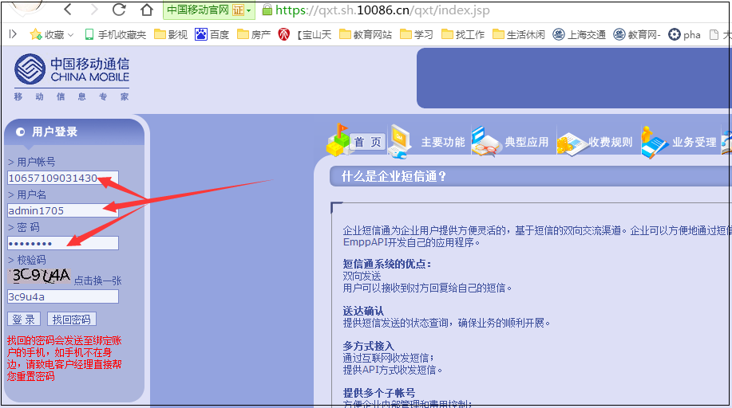
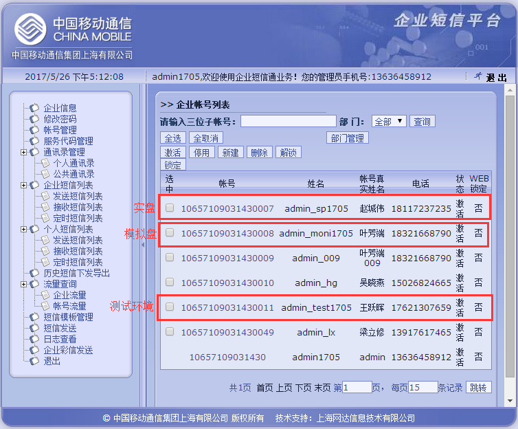
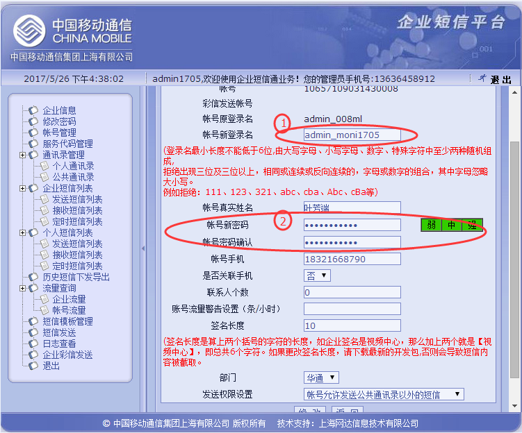
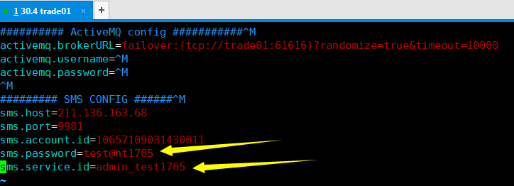

# 每月更新移动短信通知

```shell
每月短信通知更新一次
每隔3周更新一次，比如本周为第1周进行了更新，那么第5周就要进行再次更新
下次更新5月26日
```

# 1. 登录中国移动

```shell
https://qxt.sh.10086.cn/qxt/index.jsp
主帐号登录名：10657109031430
admin1705
7269Gtae
```




# 2. 更新账号新登录名和密码



```shell
移动
测试盘	主帐号登录名：10657109031430011	admin_test1706	test@ht1706
模拟盘	主帐号登录名：10657109031430008	admin_moni1706	moni@ht1706
实盘	主帐号登录名：10657109031430007	admin_sp1706	sp@ht1706
```

分别点击模拟盘，实盘，测试环境的账号进去--》新密码，

--》修改2个地方：

①更改： 账号新登录名   即用在smsserver配置文件中的sms.service.id=

②更改： 账号新密码    即用在smsserver配置文件中的sms.password=




# 3. 更新核心smsserver配置

进入/data/trade/app/smsserver更新配置文件中的sms.password=和sms.service.id=，注意别搞反了，上面是密码，下面是id。

```shell
vim /data/trade/app/smsserver/appConfig.properties
##########.....###########
sms.password=test@ht1705
sms.service.id=admin_test1705
```

