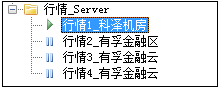
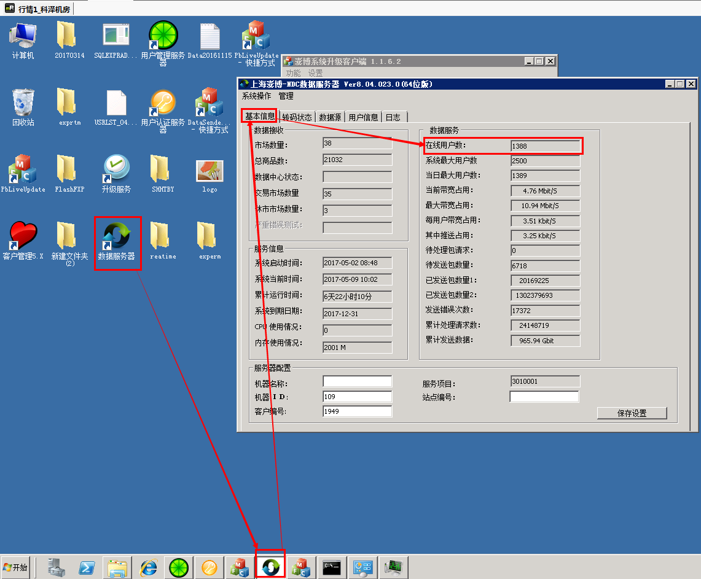
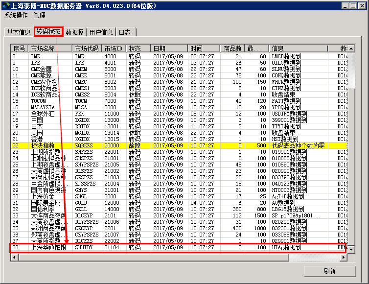
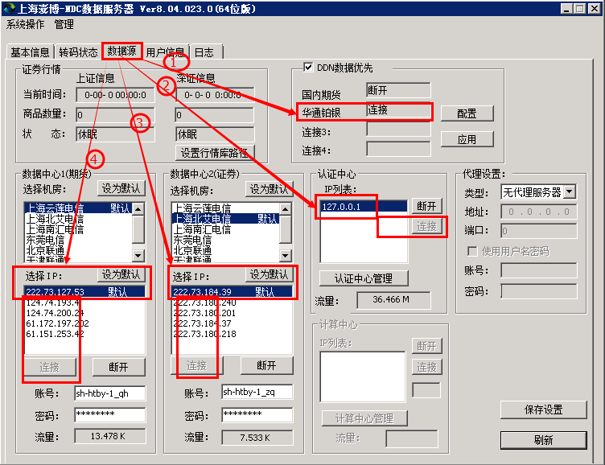
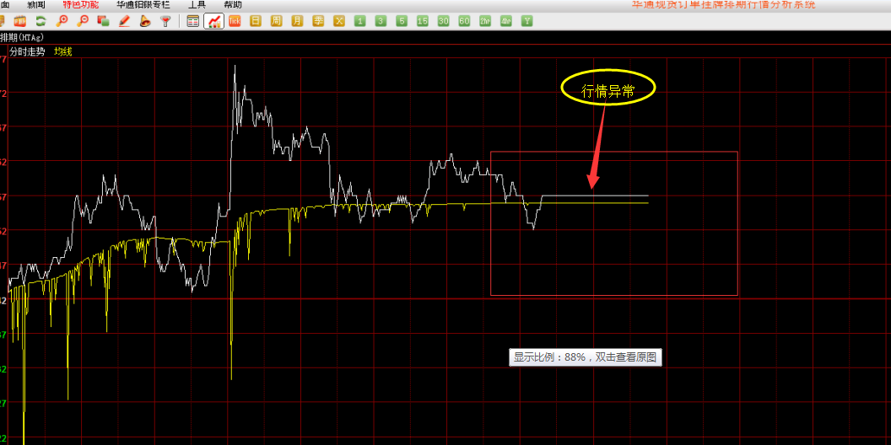
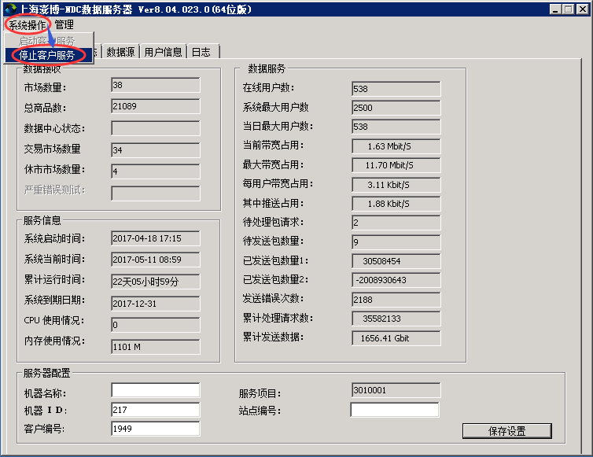
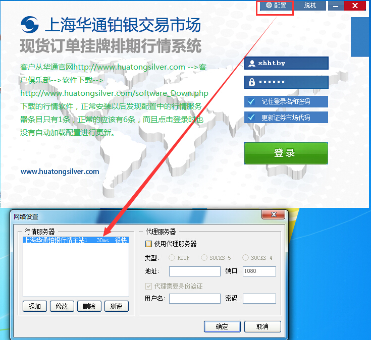
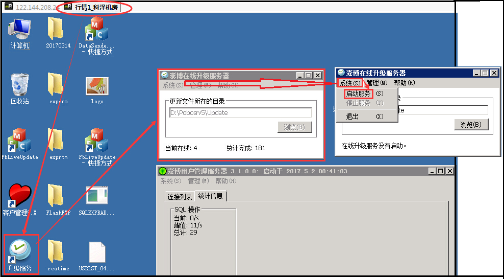
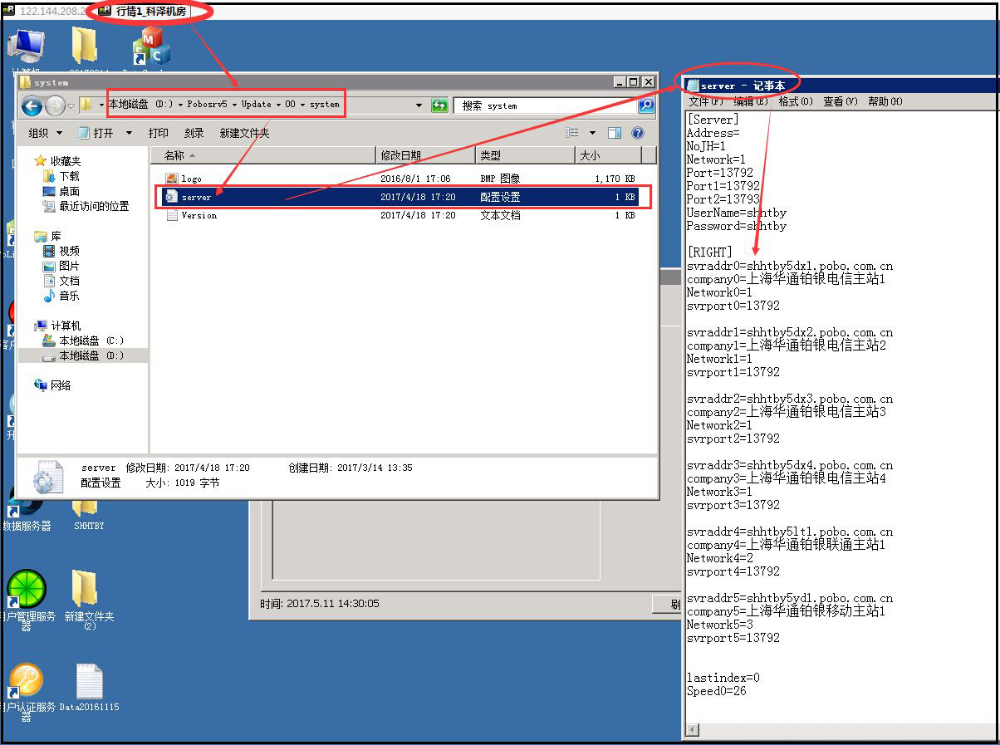

# 行情服务器日常监控

# 1. 监控周期

- 后台管理：4台行情服务器对应的后台是rweb01, rweb04, mweb01，最终的数据是一样的来自于后台DB。
- 监控周期：我们有4四行情服务器，需在8：30，13：30，17：30进行三次状态查看，




# 2. 监控指标

## 2.1 在线用户数

- 上海澎博-NDC数据服务器--》基本信息--》查看在线用户数是否正常，



## 2.2 转码状态

- 上海澎博-NDC数据服务器--》转码状态--》查看转码状态是否正常，



## 2.3 数据源

- 上海澎博-NDC数据服务器--》数据源--》查看4处数据源是否处于连接状态，



## 2.4 日志

- 如果有异常可以查看日志来查看问题。
- 注意：行情服务器上面的运行的程序和窗口都不要关闭，退出行情服务器时也不要点注销，点断开连接即可。

# 3. 停止行情服务

比如下面这台行情服务器异常，则可以先把这台行情服务器停止掉，然后查找原因，



- 停服务：

--》行情服务器上面的“上海澎博-NDC数据服务器”软件

--》系统操作

--》停止客户服务

--》数据补完之后　再点击启动　客户服务；(补数据联系博易大师张工那边帮忙给补数据)。



# 4. 行情软件没有自动更新配置

问题描述：

```shell
客户从华通官网http://www.huatongsilver.com
-->客户俱乐部-->软件下载-->http://www.huatongsilver.com/software_Down.php 下载的行情软件，
1. 正常安装以后发现配置中的行情服务器条目只有1条，正常的应该有6条，
2. 而且点击登录时也没有自动加载配置进行更新。
```



## 4.1 更新官网的行情软件

上述的原因之一：因为官网的行情软件没有更新导致客户下载是老版本的行情软件，

方案：通知博易大师的张工那边最新的PC端exe行情软件，发给信息技术部的开发王军，由王军进行上传和更新，凡是华通官网www.huatongsilver.com的软件更新都由开发王军那边负责。

## 4.2 检查更新源

原因之二：配置文件的更新源在我们的行情服务器1上面，目录在D:\Pobosrv5\Update\00\system\server已更新，但”升级服务“没有导致客户端软件没有自动同步--》现已打开，后续会加入巡查范围。

确保行情服务器上的3个都要打开：1. 升级服务，2. 用户管理服务器，3. 用户认证服务器；




